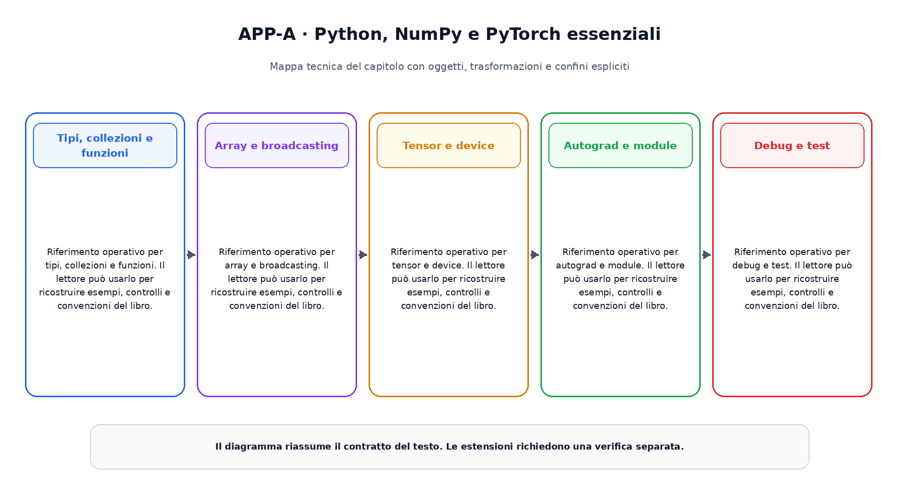

# Appendice A. Python, NumPy e PyTorch essenziali

Questa appendice raccoglie riferimenti operativi richiamati dai capitoli.

## Tipi, collezioni e funzioni

Riferimento operativo per tipi, collezioni e funzioni. Il lettore  può usarlo per ricostruire esempi, controlli e convenzioni del libro.

## Array e broadcasting

Riferimento operativo per array e broadcasting. Il lettore  può usarlo per ricostruire esempi, controlli e convenzioni del libro.

## Tensor e device

Riferimento operativo per tensor e device. Il lettore  può usarlo per ricostruire esempi, controlli e convenzioni del libro.

## Autograd e module

Riferimento operativo per autograd e module. Il lettore  può usarlo per ricostruire esempi, controlli e convenzioni del libro.

## Debug e test

Riferimento operativo per debug e test. Il lettore  può usarlo per ricostruire esempi, controlli e convenzioni del libro.

