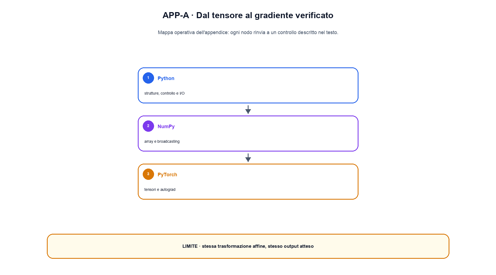

# Appendice A. Python, NumPy e PyTorch essenziali

Questa appendice è un ponte operativo, non un corso completo di programmazione. Raccoglie le convenzioni necessarie per leggere ed eseguire gli esempi del libro: funzioni piccole, shape esplicite, array NumPy, tensor PyTorch, gradienti e test. Quando un capitolo usa una libreria, il codice completo e l'ambiente restano comunque nella cartella della lezione.

## Python: rendere visibili input e output

Una funzione didattica dovrebbe ricevere gli input come argomenti e restituire un risultato, invece di dipendere da variabili globali o da file nascosti. Type hint e docstring non modificano il calcolo, ma chiariscono il contratto.

```python
def discounted_return(rewards: list[float], gamma: float) -> float:
    """Somma i reward dal futuro al presente."""
    if not 0.0 <= gamma <= 1.0:
        raise ValueError("gamma deve essere compreso tra 0 e 1")
    total = 0.0
    for reward in reversed(rewards):
        total = reward + gamma * total
    return total
```

Il controllo su `gamma` non è decorativo: trasforma una premessa matematica in una failure leggibile. Per gli esempi del libro, è preferibile una funzione di quindici righe che espone l'ipotesi a una scorciatoia compatta ma opaca.

## NumPy: shape, assi e broadcasting

Un array possiede una `shape`, un `dtype` e un ordine degli assi. In una matrice con shape `[batch, features]`, l'asse 0 enumera gli esempi e l'asse 1 le feature. Una moltiplicazione elemento per elemento usa `*`; il prodotto matriciale usa `@`.

```python
import numpy as np

x = np.array([[1.0, 2.0], [3.0, 4.0]])   # [batch=2, features=2]
w = np.array([[0.5], [-0.25]])            # [features=2, outputs=1]
b = np.array([0.1])                        # [outputs=1]
logits = x @ w + b                         # [batch=2, outputs=1]
```

`b` viene esteso virtualmente sul batch mediante broadcasting. Il broadcasting è valido quando, confrontando gli assi da destra, le dimensioni sono uguali oppure una delle due vale 1. Il fatto che NumPy accetti un'operazione non prova però che l'asse sia semanticamente corretto: sommare un bias `[batch]` a un tensor `[batch, features]` può fallire o produrre un risultato diverso da quello desiderato.

Le riduzioni devono nominare l'asse. `x.mean(axis=0)` calcola una media per feature; `x.mean(axis=1)` una media per esempio; `x.mean()` perde entrambe le strutture. Nei capitoli matematici ogni riduzione dovrebbe quindi essere accompagnata dalla shape prima e dopo.

## PyTorch: tensor, dtype e device

Un `torch.Tensor` aggiunge ad array e shape la gestione del device e del grafo dei gradienti. Il modello, gli input e i target devono trovarsi sullo stesso device; il dtype deve essere compatibile con l'operazione e con la loss.

```python
import torch

device = torch.device("mps" if torch.backends.mps.is_available() else "cpu")
x = torch.tensor([[1.0, 2.0]], dtype=torch.float32, device=device)
layer = torch.nn.Linear(2, 1).to(device)
logits = layer(x)
assert logits.shape == (1, 1)
```

Per indici di token e classi si usa normalmente `torch.long`; per attivazioni e pesi si usa un dtype floating point. Convertire indiscriminatamente ogni tensor in `float32` può rompere un'operazione di embedding, perché l'indice smette di essere intero.

## Autograd e `nn.Module`

Autograd registra le operazioni eseguite su tensor con `requires_grad=True`. Dopo `loss.backward()`, i gradienti si accumulano in `.grad`; per questo il training loop azzera i gradienti prima del backward successivo.

```python
optimizer.zero_grad(set_to_none=True)
logits = model(inputs)
loss = loss_fn(logits, targets)
loss.backward()
torch.nn.utils.clip_grad_norm_(model.parameters(), max_norm=1.0)
optimizer.step()
```

`model.train()` e `model.eval()` cambiano il comportamento di moduli come dropout e BatchNorm. `torch.no_grad()` disabilita la registrazione del grafo durante valutazione e generazione. Sono contratti differenti: `eval()` non disabilita da solo i gradienti, mentre `no_grad()` non cambia da solo il comportamento del dropout.

## Debug e test minimi

Un esempio ufficiale dovrebbe controllare almeno:

1. shape e dtype dell'input;
2. shape e valori finiti dell'output;
3. determinismo quando il seed fa parte del contratto;
4. un caso limite o invalido;
5. serializzazione dell'output che viene mostrato nel capitolo.

Durante il debug è utile stampare una piccola slice, non tensor interi. `torch.isfinite(tensor).all()` intercetta `NaN` e infiniti; `torch.testing.assert_close` confronta risultati numerici con tolleranze esplicite. Un test di shape non sostituisce un test del valore: due implementazioni possono produrre entrambe `[2, 4]` e differire per mask, asse o ordine.

Il file [`example.py`](example.py) esegue la stessa trasformazione affine con NumPy e PyTorch, verifica l'uguaglianza del forward e usa autograd per calcolare i gradienti. [`test_example.py`](test_example.py) controlla shape, valori, finitezza e determinismo. L'output esatto è in [`OUTPUT.txt`](OUTPUT.txt), mentre [`ENVIRONMENT.md`](ENVIRONMENT.md) registra le versioni realmente usate.


