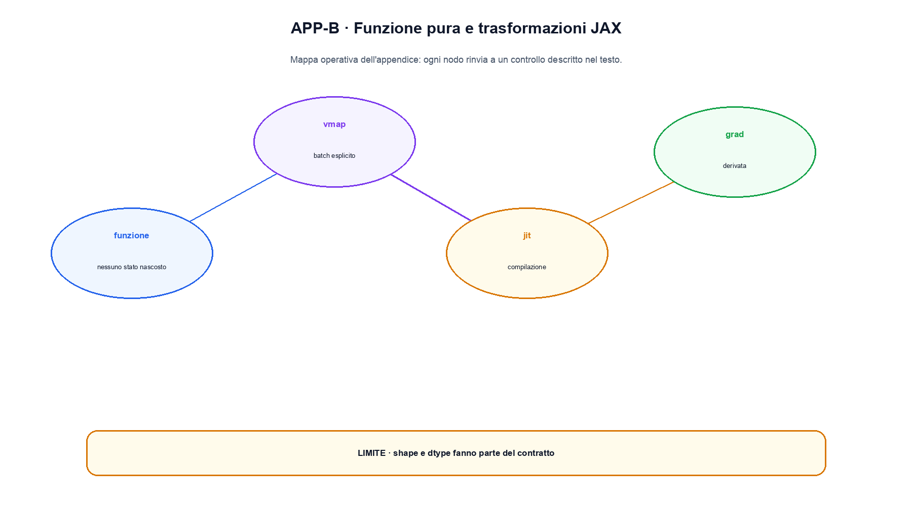

# Appendice B. JAX, compilazione e trasformazioni funzionali

JAX espone un'interfaccia simile a NumPy, ma il suo modello mentale è diverso: le funzioni vengono trasformate da `grad`, `jit`, `vmap` e dagli strumenti di parallelismo. Questa appendice serve a leggere esempi JAX senza trasferire automaticamente abitudini imperative di PyTorch.

## Funzioni pure e array immutabili

Una funzione è adatta alle trasformazioni JAX quando il risultato dipende dagli argomenti e non da side effect nascosti. Gli array JAX sono immutabili dal punto di vista dell'utente. Invece di `x[i] = value` si usa una nuova espressione, per esempio `x.at[i].set(value)`, che restituisce un array aggiornato.

```python
import jax.numpy as jnp

def mse(weights, x, target):
    prediction = x @ weights
    return jnp.mean((prediction - target) ** 2)
```

Questa forma rende `weights`, `x` e `target` espliciti. Leggere un file globale, modificare una lista Python o stampare dentro la funzione può interagire male con tracing e compilazione, perché Python viene eseguito quando JAX costruisce il programma e non necessariamente a ogni chiamata compilata.

## `jit`: specializzare una funzione

`jax.jit` traccia una funzione e compila una versione specializzata per struttura, shape, dtype e argomenti statici rilevanti. La prima chiamata include il costo di compilazione; le successive possono riusare l'eseguibile. Un benchmark deve quindi distinguere compile time e execution time.

```python
from jax import jit

compiled_mse = jit(mse)
value = compiled_mse(weights, x, target)
```

Cambiare shape può provocare una nuova compilazione. Un `if` Python che dipende dal valore di un array tracciato non è equivalente a un controllo ordinario; per controllo di flusso dinamico si usano primitive come `jax.lax.cond` o `jax.lax.scan`.

## `grad` e composizione delle trasformazioni

`jax.grad` produce una funzione che calcola il gradiente di un output scalare rispetto agli argomenti indicati. Il risultato non viene accumulato dentro gli oggetti come in `.grad` di PyTorch: è un valore restituito.

```python
from jax import grad

loss_and_gradient = jax.value_and_grad(mse)
loss, gradient = loss_and_gradient(weights, x, target)
new_weights = weights - learning_rate * gradient
```

La separazione rende visibile lo stato dell'optimizer. Librerie come Optax costruiscono trasformazioni di gradienti e mantengono uno stato esplicito, invece di modificare parametri in-place.

## `vmap`: aggiungere un asse batch

`vmap` vettorializza una funzione su uno o più assi. Non è un ciclo Python abbreviato: genera un calcolo batched secondo `in_axes` e `out_axes`.

```python
from jax import vmap

def dot_one(x, w):
    return jnp.dot(x, w)

batched_dot = vmap(dot_one, in_axes=(0, None))
predictions = batched_dot(batch, weights)
```

Il primo argomento varia lungo l'asse 0; `weights` resta condiviso. Specificare gli assi evita l'ambiguità di un broadcasting accidentale.

## Randomness esplicita

JAX non usa normalmente uno stato casuale globale implicito. Una chiave PRNG viene passata e divisa:

```python
key, sample_key = jax.random.split(key)
noise = jax.random.normal(sample_key, shape=(4,))
```

Riutilizzare la stessa chiave riproduce lo stesso campione, non una nuova estrazione. La chiave fa quindi parte dello stato del training e del checkpoint.

## Sharding e parallelismo

`pmap` è una trasformazione storica per eseguire una funzione su dispositivi replicati. Le API moderne di sharding permettono di descrivere una mesh di device e la disposizione degli assi degli array. Il contratto importante non è il nome dell'API, ma quali assi sono replicati, quali shardati e quali collettive vengono introdotte.

Su una macchina con un solo device si possono verificare shape, purezza e trasformazioni, ma non si può concludere nulla sullo scaling multi-device. Per questo questa appendice non presenta numeri di throughput.

## Confronto sintetico con PyTorch

| Domanda | PyTorch tipico | JAX tipico |
|---|---|---|
| Dove stanno i parametri? | dentro `nn.Module` | in un pytree esplicito |
| Come arrivano i gradienti? | `loss.backward()` e `.grad` | valore restituito da `grad` |
| Come si compila? | `torch.compile` su codice/module | `jit` come trasformazione di funzione |
| Come si gestisce il caso random? | generator o stato RNG | chiavi passate e divise |
| Come si vettorializza? | operatori batched, `vmap` | `vmap` con assi dichiarati |

L'esempio [`example_jax.py`](example_jax.py) è verificato in un ambiente temporaneo descritto in [`ENVIRONMENT.md`](ENVIRONMENT.md). Usa la stessa funzione con `vmap`, `jit` e `value_and_grad`; [`test_example_jax.py`](test_example_jax.py) controlla shape, finitezza e determinismo. L'output esatto è in [`OUTPUT.txt`](OUTPUT.txt). Il file resta piccolo e non pretende di misurare compilazione o parallelismo su hardware non disponibile.


