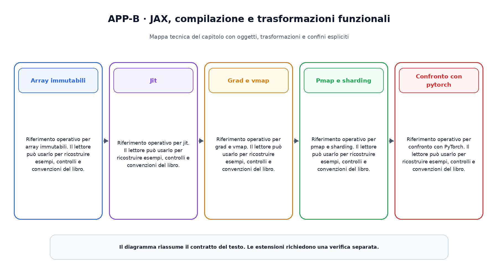

# Appendice B. JAX, compilazione e trasformazioni funzionali

Questa appendice raccoglie riferimenti operativi richiamati dai capitoli.

## Array immutabili

Riferimento operativo per array immutabili. Il lettore  può usarlo per ricostruire esempi, controlli e convenzioni del libro.

## Jit

Riferimento operativo per jit. Il lettore  può usarlo per ricostruire esempi, controlli e convenzioni del libro.

## Grad e vmap

Riferimento operativo per grad e vmap. Il lettore  può usarlo per ricostruire esempi, controlli e convenzioni del libro.

## Pmap e sharding

Riferimento operativo per pmap e sharding. Il lettore  può usarlo per ricostruire esempi, controlli e convenzioni del libro.

## Confronto con pytorch

Riferimento operativo per confronto con PyTorch. Il lettore  può usarlo per ricostruire esempi, controlli e convenzioni del libro.

