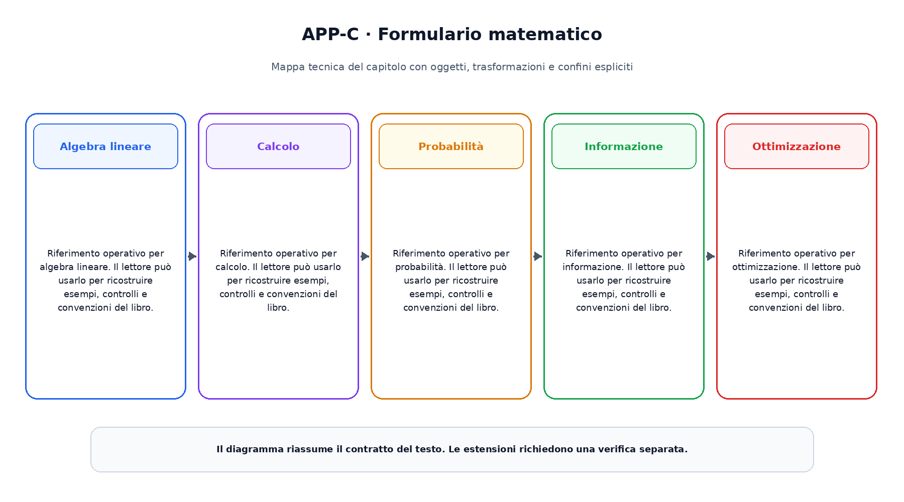

# Appendice C. Formulario matematico

Questa appendice raccoglie riferimenti operativi richiamati dai capitoli.

## Algebra lineare

Riferimento operativo per algebra lineare. Il lettore  può usarlo per ricostruire esempi, controlli e convenzioni del libro.

## Calcolo

Riferimento operativo per calcolo. Il lettore  può usarlo per ricostruire esempi, controlli e convenzioni del libro.

## Probabilità

Riferimento operativo per probabilità. Il lettore  può usarlo per ricostruire esempi, controlli e convenzioni del libro.

## Informazione

Riferimento operativo per informazione. Il lettore  può usarlo per ricostruire esempi, controlli e convenzioni del libro.

## Ottimizzazione

Riferimento operativo per ottimizzazione. Il lettore  può usarlo per ricostruire esempi, controlli e convenzioni del libro.

