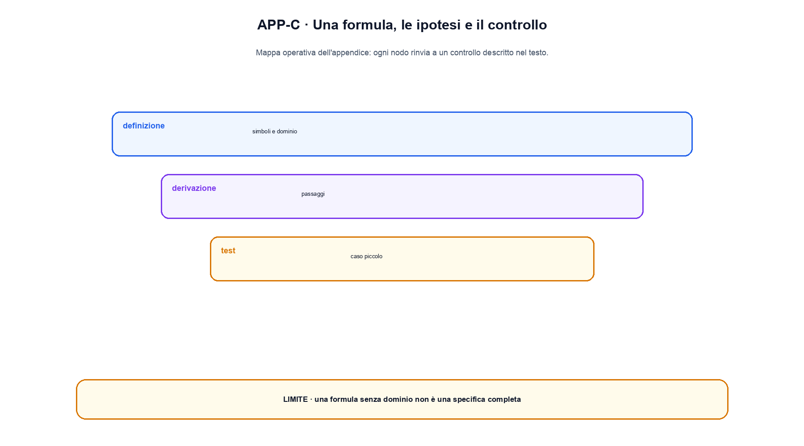

# Appendice C. Formulario matematico

Questo formulario raccoglie relazioni usate nel libro e specifica che cosa rappresentano. Non sostituisce le derivazioni dei capitoli 5-8: serve per ritrovare una formula, controllarne le dimensioni e riconoscere le ipotesi più importanti.

## Algebra lineare

Per un vettore $x \in \mathbb{R}^d$ e una matrice $W \in \mathbb{R}^{m \times d}$:

$$
y = Wx + b, \qquad y \in \mathbb{R}^m
$$

Il numero di colonne di $W$ deve coincidere con la dimensione di $x$. Con batch $X \in \mathbb{R}^{B \times d}$, una convenzione comune è $Y = XW^T + b$, con $Y \in \mathbb{R}^{B \times m}$.

Prodotto scalare e norma euclidea:

$$
x^T y = \sum_i x_i y_i, \qquad \lVert x \rVert_2 = \sqrt{\sum_i x_i^2}
$$

Similarità coseno, definita se entrambe le norme sono non nulle:

$$
\cos(x,y) = \frac{x^Ty}{\lVert x \rVert_2\lVert y \rVert_2}
$$

Una decomposizione ai valori singolari scrive $A = U\Sigma V^T$. Troncare $\Sigma$ costruisce una approssimazione low-rank; non dimostra automaticamente che le direzioni conservate abbiano un significato interpretabile.

## Calcolo differenziale

Derivata e gradiente:

$$
f'(x)=\lim_{h\to0}\frac{f(x+h)-f(x)}{h}, \qquad
\nabla_x f = \begin{bmatrix}\partial f/\partial x_1 & \cdots & \partial f/\partial x_d\end{bmatrix}^T
$$

Regola della catena per $z=f(y)$ e $y=g(x)$:

$$
\frac{\partial z}{\partial x}=\frac{\partial z}{\partial y}\frac{\partial y}{\partial x}
$$

Con vettori, l'ordine dei Jacobiani dipende dalla convenzione adottata; un controllo di shape evita di moltiplicare oggetti incompatibili.

Derivate ricorrenti:

$$
\frac{d}{dx}\sigma(x)=\sigma(x)(1-\sigma(x)), \qquad
\frac{d}{dx}\tanh(x)=1-\tanh^2(x)
$$

Per ReLU, $\max(0,x)$, la derivata vale 0 per $x<0$ e 1 per $x>0$; nel punto zero una libreria adotta una convenzione di subgradiente.

## Probabilità

Regola del prodotto e Bayes:

$$
p(x,y)=p(x\mid y)p(y), \qquad
p(z\mid x)=\frac{p(x\mid z)p(z)}{p(x)}
$$

Valore atteso e varianza:

$$
\mathbb{E}[X]=\sum_x x p(x), \qquad
\operatorname{Var}(X)=\mathbb{E}[(X-\mathbb{E}[X])^2]
$$

La chain rule per una sequenza ordinata è:

$$
p(x_{1:T})=\prod_{t=1}^T p(x_t\mid x_{<t})
$$

È la base dei modelli autoregressivi. L'ordine fa parte del modello: cambiare ordine cambia i fattori condizionali, anche se la distribuzione congiunta ideale può essere espressa in più modi.

## Informazione e loss

Entropia discreta, cross-entropy e divergenza KL:

$$
H(p)=-\sum_i p_i\log p_i
$$

$$
H(p,q)=-\sum_i p_i\log q_i, \qquad
D_{KL}(p\Vert q)=\sum_i p_i\log\frac{p_i}{q_i}
$$

Vale $H(p,q)=H(p)+D_{KL}(p\Vert q)$. La KL non è una distanza: è asimmetrica e non soddisfa in generale la disuguaglianza triangolare.

Softmax e log-sum-exp stabile:

$$
\operatorname{softmax}(z)_i=\frac{e^{z_i-c}}{\sum_j e^{z_j-c}}, \qquad c=\max_j z_j
$$

Sottrarre $c$ non cambia le probabilità e riduce il rischio di overflow.

## Ottimizzazione

Gradient descent:

$$
\theta_{t+1}=\theta_t-\eta\nabla_\theta L(\theta_t)
$$

Con momentum si mantiene uno stato; con Adam si stimano primo e secondo momento del gradiente. AdamW separa il weight decay dall'aggiornamento adattivo. I dettagli di bias correction, epsilon e schedule sono parte della ricetta e non possono essere ricostruiti dal solo learning rate.

## Relazioni dei modelli

Attention scalata:

$$
\operatorname{Attention}(Q,K,V)=\operatorname{softmax}\left(\frac{QK^T}{\sqrt{d_k}}+M\right)V
$$

$M$ rappresenta la mask additiva. Le shape tipiche per una singola head sono $Q,K,V \in \mathbb{R}^{L\times d_k}$; la matrice dei pesi ha shape $L\times L$.

Ritorno scontato e Bellman:

$$
G_t=R_{t+1}+\gamma G_{t+1}, \qquad
V^\pi(s)=\mathbb{E}_\pi[R_{t+1}+\gamma V^\pi(S_{t+1})\mid S_t=s]
$$

ELBO di un VAE:

$$
\log p(x)\ge \mathbb{E}_{q(z\mid x)}[\log p(x\mid z)]-D_{KL}(q(z\mid x)\Vert p(z))
$$

La prima parte misura ricostruzione secondo il likelihood scelto; la seconda regolarizza il posterior approssimato verso il prior.

