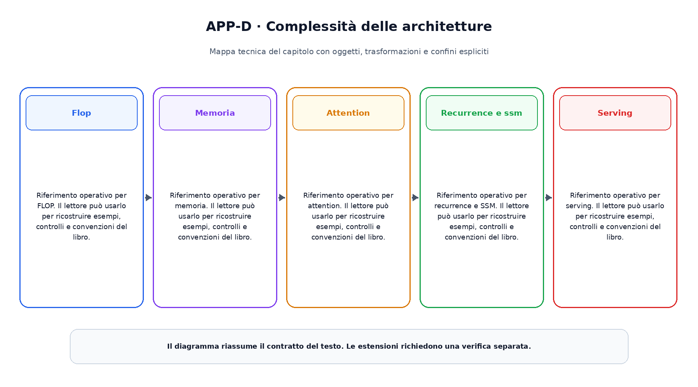

# Appendice D. Complessità delle architetture

Questa appendice raccoglie riferimenti operativi richiamati dai capitoli.

## Flop

Riferimento operativo per FLOP. Il lettore  può usarlo per ricostruire esempi, controlli e convenzioni del libro.

## Memoria

Riferimento operativo per memoria. Il lettore  può usarlo per ricostruire esempi, controlli e convenzioni del libro.

## Attention

Riferimento operativo per attention. Il lettore  può usarlo per ricostruire esempi, controlli e convenzioni del libro.

## Recurrence e ssm

Riferimento operativo per recurrence e SSM. Il lettore  può usarlo per ricostruire esempi, controlli e convenzioni del libro.

## Serving

Riferimento operativo per serving. Il lettore  può usarlo per ricostruire esempi, controlli e convenzioni del libro.

