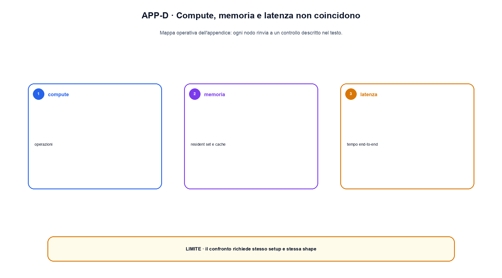

# Appendice D. Complessità delle architetture

Le stime asintotiche aiutano a localizzare un collo di bottiglia, ma non sostituiscono un benchmark. Kernel, dtype, batch, sequenza, layout e hardware decidono quale costo domina davvero. Questa appendice separa FLOP teorici, memoria degli artefatti e metriche di servizio.

## Una convenzione per i simboli

Useremo $B$ per batch, $L$ per lunghezza della sequenza, $d$ per hidden size, $h$ per numero di head, $d_k=d/h$ per dimensione di una head, $d_{ff}$ per ampiezza dell'MLP e $N$ per numero di parametri. Per l'inference distinguiamo prefill, che elabora il prompt, e decode, che aggiunge un token alla volta.

## Parametri, attivazioni e stato dell'optimizer

I soli pesi occupano circa $N$ moltiplicato per i byte del dtype. Un modello con un miliardo di parametri richiede circa 2 GB in FP16 o BF16 soltanto per i pesi, prima di allocator, buffer e cache. Durante il training si aggiungono gradienti, eventuali master weight e stati dell'optimizer. Con Adam, i due momenti possono dominare la memoria dei parametri.

Le attivazioni dipendono da batch, lunghezza, profondità e salvataggi necessari al backward. Activation checkpointing riduce le attivazioni conservate ma ricomputa parti del forward: sposta il costo dalla memoria al calcolo.

## MLP e proiezioni dense

Una moltiplicazione `[B,L,d] @ [d,m]` richiede un numero di multiply-add proporzionale a $BLdm$. Per una MLP Transformer con due proiezioni $d\rightarrow d_{ff}\rightarrow d$, il costo principale è proporzionale a $2BLdd_{ff}$, ignorando costanti e varianti gated.

Ridurre i parametri non produce necessariamente una riduzione proporzionale della latenza. Matrici piccole possono usare peggio l'hardware; una sparsità non supportata dal kernel può lasciare invariato il tempo effettivo.

## Attention standard

Le proiezioni Q, K, V e output costano in modo approssimativo $O(BLd^2)$. La costruzione e applicazione della matrice di attention costa $O(BL^2d)$. La matrice dei punteggi ha una componente di memoria $O(BhL^2)$ se viene materializzata.

FlashAttention non cambia la formula e non elimina il termine quadratico del calcolo esatto; usa tiling e ricomputazione per evitare di materializzare l'intera matrice in memoria ad alta latenza. Il beneficio dipende da shape, dtype, GPU e kernel disponibile.

Con una causal mask, circa metà delle coppie è logicamente esclusa, ma il guadagno reale dipende dall'implementazione. Sliding-window e sparse attention riducono il numero di connessioni modificando il pattern di visibilità.

## KV cache durante il decode

Per ogni layer si conservano key e value dei token precedenti. Una stima dei byte è:

$$
\text{KV bytes}\approx 2\cdot n_{layers}\cdot L\cdot n_{kv\_heads}\cdot d_k\cdot \text{bytes(dtype)}
$$

Il fattore 2 rappresenta K e V. Multi-query e grouped-query attention riducono `n_kv_heads` rispetto al numero di query head. Paginazione, prefix sharing e quantizzazione cambiano frammentazione e precisione, non la necessità di dichiarare il layout.

## Ricorrenza, convoluzione e state-space model

Una RNN elabora normalmente la sequenza in ordine e mantiene uno stato di dimensione fissa per layer. Il costo può essere lineare in $L$, ma la dipendenza temporale limita il parallelismo del training.

Una convoluzione 1D con kernel $k$ ha costo proporzionale a $BLk d$ nella forma depthwise e più alto con mixing denso dei canali. Le SSM cercano una scansione o convoluzione strutturata con costo lineare o quasi lineare nella sequenza. La costante, il parallelismo del kernel e la qualità sul compito restano parte del confronto.

## Training distribuito

Data parallelism replica i pesi e divide il batch; richiede una riduzione dei gradienti. Tensor parallelism divide le matrici e introduce comunicazioni dentro il layer. Pipeline parallelism divide i layer e può introdurre bolle. ZeRO e FSDP shardano parametri, gradienti o stato dell'optimizer, riducendo memoria per worker in cambio di comunicazione e gestione più complessa.

Una stima utile deve nominare volume trasferito, frequenza delle collettive, bandwidth e latenza. Il numero di device da solo non predice lo scaling.

## Serving: oltre i FLOP

Le metriche principali sono time to first token, inter-token latency, throughput, queue time, error rate, memoria KV e goodput sotto un obiettivo di latenza. Continuous batching aumenta l'utilizzo inserendo e rimuovendo richieste durante il decode; può migliorare throughput e peggiorare la coda di una singola richiesta.

Per confrontare due sistemi occorre fissare almeno modello, tokenizer, lunghezze di prompt e output, distribuzione del carico, batch policy, dtype, hardware, warm-up e criterio di correttezza. Un numero senza questi elementi è un'osservazione incompleta.

