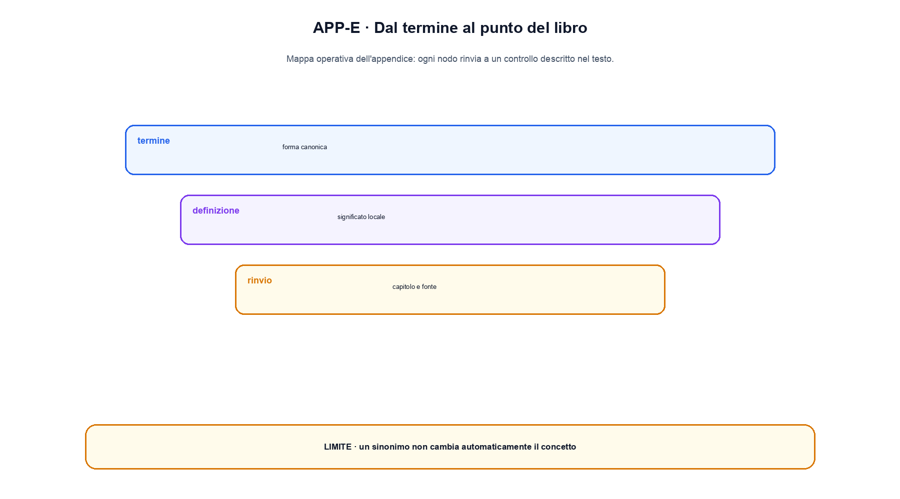

# Appendice E. Glossario italiano-inglese

Il libro conserva in inglese i termini tecnici usati nella documentazione e nel codice. Il glossario non impone traduzioni artificiali: chiarisce il significato operativo e segnala coppie di parole che sembrano sinonimi ma non lo sono.

## Matematica e rappresentazioni

| Termine | Significato nel libro | Da non confondere con |
|---|---|---|
| **scalar** | un singolo numero | tensor di shape `[1]`, che possiede comunque un asse |
| **vector** | sequenza ordinata di numeri, spesso shape `[d]` | lista di token o insieme non ordinato |
| **matrix** | tensor a due assi | tabella semantica generica |
| **tensor** | array multidimensionale con shape e dtype | modello o parametro nel suo complesso |
| **dot product** | somma dei prodotti coordinata per coordinata | cosine similarity, che normalizza le norme |
| **norm** | misura della grandezza di un vettore | normalization layer |
| **embedding** | vettore associato a un elemento o prodotto da un encoder | significato completo e interpretabile dell'elemento |
| **latent** | variabile non osservata direttamente | feature necessariamente umana o disentangled |
| **logit** | valore reale prima della normalizzazione probabilistica | probabilità o confidenza fattuale |

## Training e ottimizzazione

| Termine | Significato operativo |
|---|---|
| **forward pass** | calcolo dagli input a logits, predizioni o loss |
| **backward pass** | applicazione della chain rule per ottenere gradienti |
| **gradient** | derivata locale della loss rispetto a parametri o input |
| **optimizer step** | trasformazione di parametri e stato dell'optimizer usando il gradiente |
| **batch** | insieme di esempi elaborati nello stesso passo; nel language modeling può essere descritto in sequenze o token |
| **epoch** | passaggio sul dataset secondo una definizione di campionamento; non sempre è naturale in training a stream |
| **checkpoint** | snapshot versionato di pesi e, se serve il resume, optimizer, scheduler, RNG e posizione nei dati |
| **fine-tuning** | ulteriore training di tutti o parte dei parametri su un nuovo obiettivo o dataset |
| **pretraining** | training iniziale su larga copertura; il termine non garantisce un particolare obiettivo |
| **post-training** | famiglia di passaggi dopo il pretraining, come SFT, preference learning e verificatori |
| **regularization** | tecnica che modifica obiettivo, dati o dinamica per ridurre overfitting o controllare la soluzione |

`validation` e `test` non sono intercambiabili. La validation guida scelte durante lo sviluppo; il test dovrebbe essere usato per una misura finale secondo un protocollo deciso prima. Se il test guida iterazioni ripetute, diventa di fatto un'altra validation set.

## Architetture

| Termine | Definizione breve |
|---|---|
| **MLP** | sequenza di trasformazioni affini e non linearità |
| **CNN** | rete che condivide kernel su una struttura locale, spesso una griglia |
| **RNN** | rete che aggiorna uno stato riusando parametri lungo una sequenza |
| **attention** | combinazione dipendente dal contenuto di value attraverso score tra query e key |
| **self-attention** | query, key e value derivano dalla stessa sequenza |
| **cross-attention** | query e coppie key/value provengono da sorgenti diverse |
| **Transformer** | architettura che combina attention, MLP, residual, norm e segnali posizionali |
| **residual stream** | percorso principale aggiornato mediante somme residuali |
| **Mixture of Experts, MoE** | calcolo condizionale che instrada token o esempi verso sottoinsiemi di esperti |
| **state-space model, SSM** | famiglia di modelli sequenziali basati su uno stato dinamico strutturato |

`encoder`, `decoder` e `encoder-decoder` descrivono pattern architetturali, mentre `masked`, `causal` e `span corruption` descrivono obiettivi o visibilità. Un decoder causale non è definito soltanto dalla presenza di blocchi chiamati decoder: la mask e l'obiettivo fanno parte del contratto.

## Generazione e inference

**Inference** indica l'uso del modello senza un normale optimizer step. Nel libro comprende prefill, decode, cache e serving. **Decoding** trasforma una distribuzione in una scelta o una sequenza. Greedy, beam search, sampling, temperature, top-k e top-p sono strategie differenti.

**Context window** è il numero massimo di token che l'architettura e il runtime possono accettare secondo il contratto dichiarato. **Effective context** riguarda quanto bene il sistema usa l'informazione nelle diverse posizioni. **Memory** può indicare stato ricorrente, KV cache, memoria applicativa o archivio persistente: il capitolo deve specificare quale.

**Throughput** misura lavoro per unità di tempo; **latency** misura il tempo di una richiesta o fase; **goodput** conta soltanto il lavoro che soddisfa un criterio utile, per esempio una soglia di latenza. Un throughput maggiore non implica automaticamente una migliore esperienza per ogni richiesta.

## Dati, retrieval e agenti

**Corpus** è una raccolta di dati; **dataset** aggiunge normalmente uno scopo, una struttura e un protocollo. **Shard** è una partizione materiale. **Split** è una separazione logica, per esempio train/validation/test. **Manifest** registra identità, trasformazioni, conteggi e checksum.

**Retrieval** seleziona elementi da una collezione. **RAG** usa il risultato del retrieval nel processo generativo. **Reranking** riordina un insieme candidato, normalmente con un modello più costoso. **Grounding** indica il collegamento dell'output a una fonte o osservazione, non la garanzia che la risposta sia vera.

Un **agent** è un sistema che mantiene stato e sceglie azioni in un loop. Un **tool call** è una proposta strutturata di azione. **Authorization** è il controllo esterno che stabilisce se l'azione può avvenire. Lo schema rende una chiamata parsabile, ma non autorizzata.

## Valutazione, sicurezza e governance

**Metric** è una regola di misura; **benchmark** combina task, dati e protocollo; **evaluation suite** raccoglie più misure e slice. **Calibration** collega score e frequenze empiriche secondo un protocollo. **Factuality**, **faithfulness** e **attribution** rispondono a domande differenti: verità rispetto al mondo, coerenza con il contesto e correttezza del collegamento alla fonte.

**Robustness** riguarda la stabilità sotto variazioni definite. **Safety** riguarda rischi e controlli in un contesto d'uso. **Security** considera attaccanti, superfici e asset. **Privacy** riguarda raccolta, uso e leakage dei dati. **Fairness** richiede popolazione, decisione e metrica: non esiste un singolo numero universale.

**Provenance** registra la storia di un artefatto. Un hash rileva una modifica, una firma collega il record a una chiave, una credenziale registra asserzioni. Nessuno di questi meccanismi certifica da solo la verità del contenuto.

