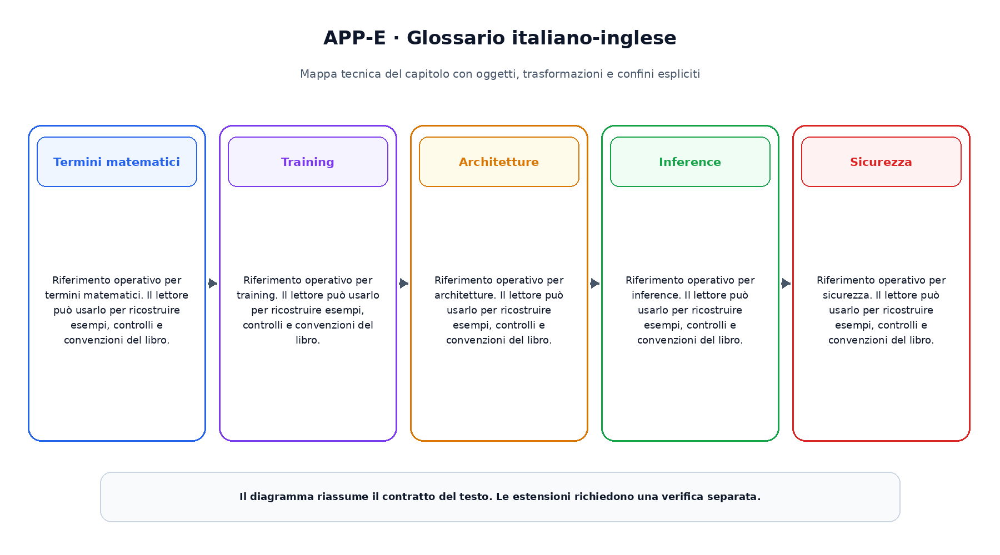

# Appendice E. Glossario italiano-inglese

Questa appendice raccoglie riferimenti operativi richiamati dai capitoli.

## Termini matematici

Riferimento operativo per termini matematici. Il lettore  può usarlo per ricostruire esempi, controlli e convenzioni del libro.

## Training

Riferimento operativo per training. Il lettore  può usarlo per ricostruire esempi, controlli e convenzioni del libro.

## Architetture

Riferimento operativo per architetture. Il lettore  può usarlo per ricostruire esempi, controlli e convenzioni del libro.

## Inference

Riferimento operativo per inference. Il lettore  può usarlo per ricostruire esempi, controlli e convenzioni del libro.

## Sicurezza

Riferimento operativo per sicurezza. Il lettore  può usarlo per ricostruire esempi, controlli e convenzioni del libro.

