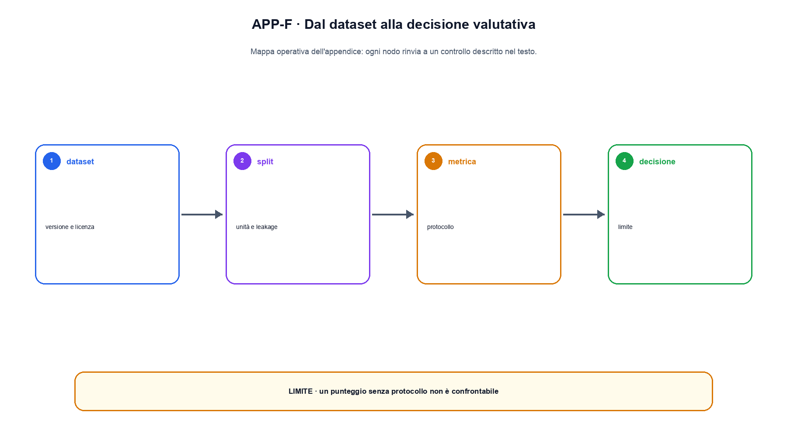

# Appendice F. Dataset, benchmark e metriche

Un dataset non è soltanto un file e un benchmark non è soltanto una colonna di punteggi. Questa appendice fornisce schede operative per collegare origine dei dati, split, task, metrica e decisione.

## Scheda minima di un dataset

Ogni dataset usato per training o valutazione dovrebbe rispondere almeno a queste domande:

| Campo | Domanda |
|---|---|
| Identità | quale nome stabile e quale versione identificano l'artefatto? |
| Provenienza | chi ha raccolto o prodotto i record, da quali sorgenti e in quali date? |
| Scopo | per quale uso è stato costruito e quali usi sono fuori perimetro? |
| Popolazione | quali lingue, domini, gruppi o distribuzioni sono rappresentati? |
| Schema | quali campi esistono, quali sono obbligatori e come vengono validati? |
| Trasformazioni | quali parser, filtri, deduplicazioni e normalizzazioni sono stati applicati? |
| Licenza e diritti | quali condizioni regolano accesso, redistribuzione e uso? |
| Rischi | quali PII, contenuti sensibili, bias e failure mode sono noti? |
| Integrità | quali conteggi, checksum e manifest permettono di ricostruire la versione? |

Una data card deve distinguere fatti osservati e assunzioni. Scrivere “dataset di alta qualità” non è un fatto finché non vengono esplicitati criteri, annotatori, filtri e misure.

## Split e confini temporali

Lo split più comune separa train, validation e test. La separazione deve avvenire sull'unità che potrebbe causare leakage: riga, documento, autore, conversazione, utente, repository o periodo temporale. Dividere casualmente chunk dello stesso documento tra train e test produce un test apparentemente indipendente ma semanticamente contaminato.

Per sistemi aggiornati nel tempo è utile un cutoff temporale. Il cutoff riguarda sia i dati del modello sia le fonti recuperate o gli indici costruiti dopo il training. Un benchmark di conoscenza deve dichiarare quale forma di accesso esterno è consentita.

Lo split va materializzato in un manifest con ID stabili. Un seed senza versione della libreria e senza ordine degli input non sempre ricostruisce lo stesso split.

## Dal task al benchmark

Un benchmark specifica:

1. input e formato del prompt;
2. output atteso o rubric di giudizio;
3. strumenti, retrieval e contesto consentiti;
4. budget di token, tentativi, tempo o denaro;
5. metrica e regola di aggregazione;
6. slice obbligatorie;
7. gestione di errori, astensioni e casi non validi;
8. versione di dataset, evaluator e modello giudice.

Modificare prompt, parser o rubric crea una nuova versione del benchmark anche se il file delle domande resta uguale.

## Scegliere una metrica

Accuracy è appropriata quando ogni esempio ha una decisione discreta e una reference affidabile. Precision e recall separano falsi positivi e falsi negativi. F1 è una media armonica e può nascondere quale dei due è peggiorato. Per probabilità o confidence servono metriche di calibrazione, come Brier score o expected calibration error, accompagnate da diagrammi e binning dichiarato.

Per generazione aperta, sovrapposizione lessicale e similarità semantica non sostituiscono un giudizio sul contenuto. Un LLM giudice deve avere rubric, ordine controllato, calibrazione su giudizi indipendenti e versione registrata. Il costo e i disaccordi vanno riportati insieme alla media.

Per retrieval occorre separare recall dei documenti, precision del contesto, ranking e qualità della risposta. Se il documento corretto non è stato recuperato, la failure non va attribuita esclusivamente al generatore.

## Slice e analisi degli errori

Una media aggregata è compatibile con regressioni importanti. Le slice possono seguire lingua, lunghezza, dominio, difficoltà, presenza di distrattori, tipo di utente o rischio. Devono essere definite prima di guardare i risultati principali oppure etichettate come analisi esplorativa.

Il report conserva esempi falliti con ID, input, output, reference, metrica e classificazione dell'errore. Una tassonomia utile deve condurre a un intervento: problema dei dati, parsing, retrieval, modello, decoding, tool, policy o evaluator.

## Contaminazione

Contaminazione significa che il sistema ha avuto accesso al contenuto di valutazione o a una sua variante rilevante. Hash esatti trovano copie identiche; n-gram, MinHash o embedding possono trovare parafrasi e derivati. Nessuna singola tecnica prova l'assenza completa di contaminazione.

Per benchmark pubblici bisogna registrare la data, cercare sovrapposizioni con i dati disponibili e interpretare punteggi anomali con cautela. In un sistema con retrieval, la consultazione intenzionale di una fonte può essere parte del task, ma va distinta dalla memorizzazione non dichiarata.

## Modello di report

Un report sintetico può usare questa struttura:

```text
Decisione: promuovere o meno la versione candidate-v3
Popolazione: richieste italiane del dominio X, cutoff 2026-07-01
Dataset: eval-it-v4, 1.200 esempi, manifest SHA-256 ...
Sistema: modello, prompt, retrieval, tool e policy versionati
Metriche: accuracy, coverage, costo e latency, con intervalli
Slice: lunghezza, rischio, presenza di documenti mancanti
Failure: 25 esempi rappresentativi con classificazione
Limiti: domini esclusi, giudici non indipendenti, potenza statistica
Decisione e owner: ...
```


