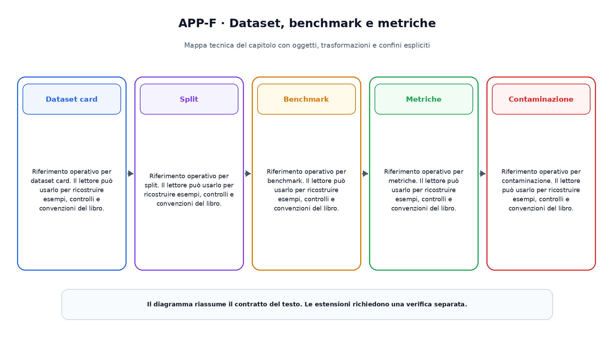

# Appendice F. Dataset, benchmark e metriche

Questa appendice raccoglie riferimenti operativi richiamati dai capitoli.

## Dataset card

Riferimento operativo per dataset card. Il lettore  può usarlo per ricostruire esempi, controlli e convenzioni del libro.

## Split

Riferimento operativo per split. Il lettore  può usarlo per ricostruire esempi, controlli e convenzioni del libro.

## Benchmark

Riferimento operativo per benchmark. Il lettore  può usarlo per ricostruire esempi, controlli e convenzioni del libro.

## Metriche

Riferimento operativo per metriche. Il lettore  può usarlo per ricostruire esempi, controlli e convenzioni del libro.

## Contaminazione

Riferimento operativo per contaminazione. Il lettore  può usarlo per ricostruire esempi, controlli e convenzioni del libro.

