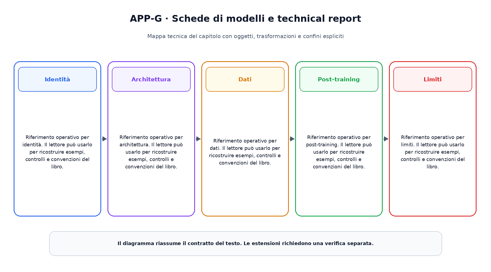

# Appendice G. Schede di modelli e technical report

Questa appendice raccoglie riferimenti operativi richiamati dai capitoli.

## Identità

Riferimento operativo per identità. Il lettore  può usarlo per ricostruire esempi, controlli e convenzioni del libro.

## Architettura

Riferimento operativo per architettura. Il lettore  può usarlo per ricostruire esempi, controlli e convenzioni del libro.

## Dati

Riferimento operativo per dati. Il lettore  può usarlo per ricostruire esempi, controlli e convenzioni del libro.

## Post-training

Riferimento operativo per post-training. Il lettore  può usarlo per ricostruire esempi, controlli e convenzioni del libro.

## Limiti

Riferimento operativo per limiti. Il lettore  può usarlo per ricostruire esempi, controlli e convenzioni del libro.

