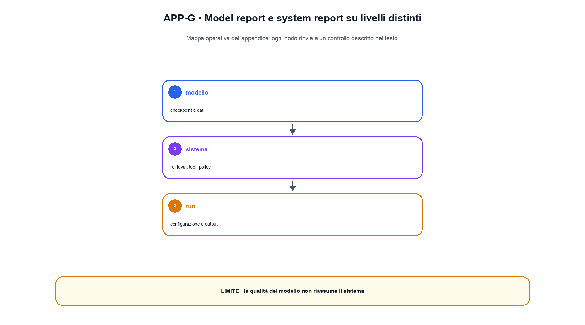

# Appendice G. Schede di modelli e technical report

Una model card descrive un artefatto; un technical report documenta decisioni, esperimenti e risultati; una system card include componenti e controlli oltre il checkpoint. Questa appendice propone un modello di scrittura che separa chiaramente i tre livelli.

## Identità dell'artefatto

La prima sezione deve permettere a un revisore di sapere che cosa sta osservando:

```text
Nome e versione:
Commit, tag o digest:
Data di rilascio:
Owner e contatto:
Tipo: base model, adapter, reward model, retriever, sistema...
Licenza e condizioni d'uso:
Artefatti collegati: tokenizer, config, prompt, tool schema, indice...
```

Un nome commerciale senza digest non identifica i pesi. Un checkpoint senza tokenizer o configurazione può essere inutilizzabile o produrre risultati diversi.

## Architettura

Descrivere l'architettura significa dichiarare dimensioni e varianti, non soltanto dire “Transformer”. Per un language model sono normalmente rilevanti: numero di layer, hidden size, head e KV head, posizione, normalizzazione, MLP, vocabolario, context window, tying dei pesi, dtype e numero di parametri.

Le scelte vanno collegate al comportamento atteso e ai costi. GQA modifica la memoria KV; RoPE definisce una codifica relativa; MoE rende il calcolo condizionale. Se una variante è stata introdotta per una ragione specifica, il report distingue la motivazione dalla misura ottenuta.

## Dati e preprocessing

La sezione dati include sorgenti, periodi, lingue, domini, licenze, filtri, deduplicazione, dati sintetici, tokenizer, quantità in documenti e token e limiti noti. Se i dati non possono essere pubblicati, il report può comunque descrivere categorie, trasformazioni, governance e statistiche aggregate.

La frase “trained on public data” è insufficiente: non consente di valutare cutoff, privacy, contaminazione o rappresentazione. Allo stesso modo, il numero totale di token non sostituisce la mixture effettiva e il numero di esposizioni.

## Training e post-training

Per il pretraining si registrano almeno optimizer, learning rate e schedule, batch in token, sequenza, numero di token visti, precisione, clipping, regolarizzazione, checkpoint policy e hardware. Per il post-training vanno separati SFT, preference data, reward/verifier, algoritmo, policy di riferimento e filtri.

Un report non deve presentare dati di preferenza come una misura assoluta di verità. Annotatori, rubric, disaccordi e distribuzione dei prompt definiscono il segnale.

## Valutazione

Ogni tabella di risultati specifica versione del benchmark, prompt, few-shot setup, decoding, strumenti, evaluator, numero di tentativi e intervalli quando pertinenti. Le baseline devono usare un perimetro comparabile.

È utile organizzare l'evidenza in quattro livelli:

1. test unitari e numerici dei componenti;
2. benchmark offline del modello;
3. valutazione end-to-end del sistema;
4. monitoraggio su distribuzioni reali.

Un risultato positivo al livello 2 non chiude automaticamente i livelli 3 e 4.

## Usi previsti e limiti

La card dichiara utenti, lingue, domini, input consentiti, output e decisioni che il sistema non dovrebbe prendere autonomamente. I limiti devono essere operativi: invece di “può commettere errori”, indicare failure note, slice deboli, dipendenza dalle fonti, lunghezza, attacchi e controlli richiesti.

Rischi e mitigazioni vanno accoppiati. Una mitigazione è una misura da testare, non una garanzia. Per esempio, un filtro di PII richiede recall, falsi positivi, versionamento e controllo prima della persistenza.

## System card

Quando il prodotto include retrieval, prompt, tool e policy, la documentazione deve descrivere il sistema completo:

| Componente | Versione | Input | Output | Failure e controllo |
|---|---|---|---|---|
| modello | digest | messaggi e contesto | logits o testo | eval e astensione |
| retriever | indice e encoder | query | documenti | recall e provenienza |
| tool gateway | schema e policy | chiamata proposta | allow/deny e risultato | auth, conferma, audit |
| monitor | versione | eventi | metriche e alert | privacy e retention |

## Changelog e aggiornamento

Ogni nuova versione elenca ciò che è cambiato in pesi, dati, tokenizer, prompt, tool, evaluator e policy. Se la modifica richiede nuovi test, i risultati precedenti restano storici e non vengono sovrascritti. Una card è utile solo se continua a identificare l'artefatto realmente distribuito.

## Esempio di apertura leggibile

Una card dovrebbe iniziare dal dato più utile, non dalla storia del progetto. Un'apertura possibile è:

```text
Questo artefatto è un decoder causale da 120 milioni di parametri,
addestrato per esperimenti didattici in inglese e italiano. Riceve al
massimo 1.024 token e produce logits sul vocabolario v3. Non è stato
valutato per decisioni sanitarie, legali o finanziarie. La release
comprende checkpoint, tokenizer, config e suite eval-2026-08.
```

Seguono link agli artefatti, risultati principali e limiti. In questo modo il lettore comprende immediatamente che cosa possiede, che cosa può provare e dove deve fermarsi. La descrizione dell'organizzazione, le motivazioni storiche e i ringraziamenti possono venire dopo. Se il sistema usa retrieval o tool, l'apertura lo dichiara: presentarlo come proprietà intrinseca del solo modello renderebbe la card tecnicamente ambigua.


