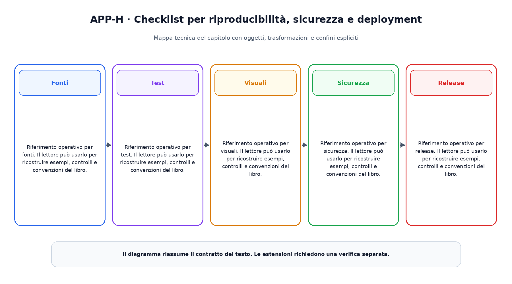

# Appendice H. Checklist per riproducibilità, sicurezza e deployment

Questa appendice raccoglie riferimenti operativi richiamati dai capitoli.

## Fonti

Riferimento operativo per fonti. Il lettore  può usarlo per ricostruire esempi, controlli e convenzioni del libro.

## Test

Riferimento operativo per test. Il lettore  può usarlo per ricostruire esempi, controlli e convenzioni del libro.

## Visuali

Riferimento operativo per visuali. Il lettore  può usarlo per ricostruire esempi, controlli e convenzioni del libro.

## Sicurezza

Riferimento operativo per sicurezza. Il lettore  può usarlo per ricostruire esempi, controlli e convenzioni del libro.

## Release

Riferimento operativo per release. Il lettore  può usarlo per ricostruire esempi, controlli e convenzioni del libro.

