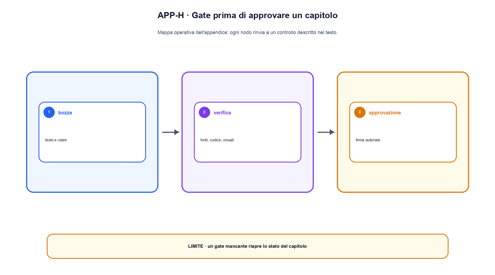

# Appendice H. Checklist per riproducibilità, sicurezza e deployment

Questa appendice è una checklist di rilascio. Non tutte le voci si applicano a ogni capitolo o prototipo, ma ogni voce non applicabile deve avere una motivazione. Un segno di spunta indica un'evidenza collegata, non una dichiarazione di intenti.

## Contenuto e fonti

- [ ] Il claim principale nomina oggetto, condizioni e limite.
- [ ] Ogni risultato esterno ha una fonte primaria o ufficiale vicina.
- [ ] Il locator indica sezione, tabella, equazione o pagina pertinente.
- [ ] La data di consultazione è registrata per standard, normative e documentazione viva.
- [ ] Il testo distingue definizione, risultato del paper, inferenza dell'autore ed evidenza locale.
- [ ] Un URL accessibile non viene presentato come verifica semantica automatica.
- [ ] Le citazioni non trasferiscono risultati numerici a un setup diverso.
- [ ] Termini e simboli restano coerenti con i capitoli precedenti.

## Codice ed esecuzione

- [ ] Il codice compare nel testo quando chiarisce il meccanismo.
- [ ] Il file completo è collegato e coincide con l'estratto pubblico.
- [ ] Versione di Python, dipendenze, device e dtype sono registrati.
- [ ] Il comando di esecuzione è copiabile.
- [ ] L'output mostrato proviene da quella esecuzione ed è versionato.
- [ ] I test controllano il concetto del capitolo, non un helper riutilizzato senza relazione.
- [ ] Esiste almeno un caso limite o failure leggibile.
- [ ] Seed e fonti di non determinismo sono dichiarati.
- [ ] Un toy example non viene presentato come benchmark o performance di produzione.

## Dati ed evaluation

- [ ] Dataset, versione, manifest e split sono identificabili.
- [ ] Cutoff temporale e contaminazione sono considerati.
- [ ] Prompt, decoding, tool e retrieval fanno parte della configurazione.
- [ ] La metrica è collegata alla decisione che deve sostenere.
- [ ] Slice e casi falliti accompagnano la media.
- [ ] Il giudice umano o modello usa una rubric versionata.
- [ ] Intervalli e numerosità sono riportati quando la variabilità è rilevante.
- [ ] Il report separa failure di dati, modello, retrieval, tool e policy.

## Visuali

- [ ] Ogni figura risponde a una domanda pedagogica dichiarata.
- [ ] Due figure della stessa lezione non ripetono la stessa struttura con un layout diverso.
- [ ] Assi, unità, valori e origine dei dati sono presenti nei grafici quantitativi.
- [ ] Numeri illustrativi sono riconoscibili e non imitano un benchmark.
- [ ] Frecce e box descrivono dipendenze reali, non una sequenza arbitraria di categorie.
- [ ] Alt text e didascalia spiegano il messaggio, non soltanto il titolo.
- [ ] Shape e ordine di lettura sono visibili nei diagrammi tecnici.
- [ ] L'immagine resta leggibile alla dimensione di pubblicazione.
- [ ] L'approvazione autoriale è distinta dal controllo raster automatico.

## Sicurezza e privacy

- [ ] Il threat model nomina attaccante, asset, accesso, obiettivo e budget.
- [ ] Input recuperati o caricati sono trattati come non fidati.
- [ ] Il modello propone azioni, mentre policy esterne applicano autorizzazione e scope.
- [ ] Side effect sensibili richiedono idempotenza, conferma o entrambi.
- [ ] Secret e credenziali non entrano nei prompt o nei log non necessari.
- [ ] Log e trace hanno retention, access control e redazione PII.
- [ ] Dipendenze, checkpoint e tokenizer hanno digest e provenienza.
- [ ] Il caricamento di custom code o serializzazioni è limitato.
- [ ] Esiste un percorso di revoca, contenimento e incident response.

## Deployment

- [ ] Checkpoint, tokenizer, adapter, prompt, schema dei tool e policy formano una release identificabile.
- [ ] Test unitari, offline ed end-to-end sono verdi sullo stesso commit.
- [ ] È disponibile una baseline o versione precedente per il confronto.
- [ ] Canary e soglie di promozione sono definite prima del traffico.
- [ ] Il rollback è stato provato, non soltanto documentato.
- [ ] Monitor e alert hanno owner e criteri di escalation.
- [ ] TTFT, inter-token latency, errori, costi e goodput sono misurati per slice rilevanti.
- [ ] Retry e timeout non duplicano side effect.
- [ ] Migrazione e compatibilità dei dati sono verificate.

## Riproducibilità e replica

- [ ] Repository, commit e diff sono conservati.
- [ ] Configurazione e comando sono immutabili o versionati.
- [ ] Dati e artefatti hanno checksum.
- [ ] Hardware e software sono descritti con precisione sufficiente.
- [ ] Una seconda esecuzione ricostruisce gli output previsti.
- [ ] Le divergenze sono riportate, non nascoste con un aggiustamento retroattivo.
- [ ] Riproduzione dello stesso codice e replica indipendente sono nominate correttamente.
- [ ] La conclusione resta limitata al claim e al setup eseguiti.

## Decisione finale

Prima del rilascio, una scheda di decisione dovrebbe contenere:

```text
Versione candidata:
Evidenze esaminate:
Gate superati:
Gate rinviati e motivazione:
Rischi residui:
Owner della decisione:
Data:
Rollback o prossima verifica:
```

Una pipeline verde può dimostrare che i controlli automatici sono passati. Non sostituisce revisione editoriale, approvazione delle immagini, valutazione di sicurezza o decisione di rilascio.


