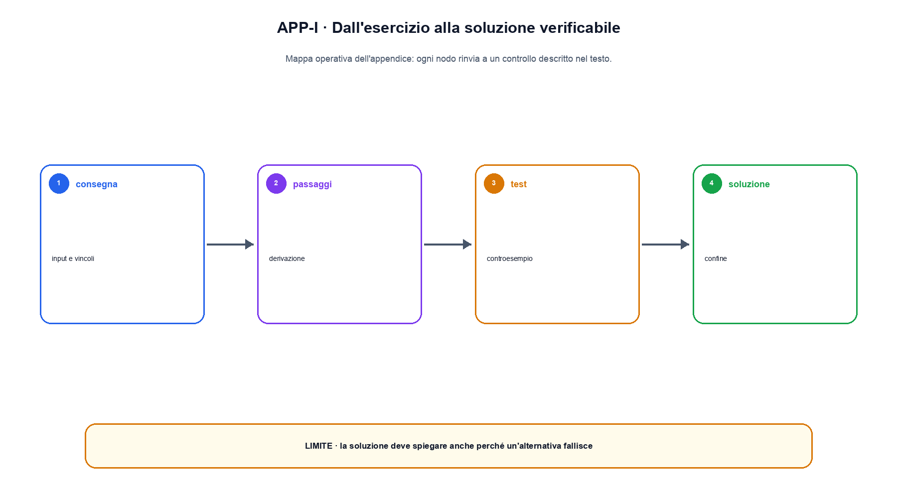

# Appendice I. Soluzioni guidate degli esercizi

Gli esercizi del libro chiedono spesso di ricostruire un meccanismo, modificare una condizione e delimitare una conclusione. Non esiste sempre una sola formulazione corretta. Questa appendice mostra soluzioni complete per esercizi rappresentativi e fornisce una rubric con cui valutare quelli restanti. I capitoli con Python contengono inoltre test e output che fungono da soluzione eseguibile del caso locale.

## Metodo di soluzione

Una risposta completa segue cinque passaggi:

1. nomina input, shape e convenzioni;
2. scrive l'operazione senza saltare i passaggi intermedi;
3. calcola o descrive l'output osservabile;
4. cambia una sola condizione per costruire il caso limite;
5. distingue ciò che il caso dimostra da ciò che richiederebbe nuovi dati.

Una risposta che fornisce soltanto il numero finale può essere matematicamente corretta e didatticamente incompleta. Al contrario, una spiegazione lunga senza input e output verificabili non consente di ricostruire il risultato.

## Soluzione 1: prodotto matrice-vettore

Consideriamo

$$
W=\begin{bmatrix}1&2\\0&-1\end{bmatrix},\qquad
x=\begin{bmatrix}3\\1\end{bmatrix},\qquad
b=\begin{bmatrix}0\\2\end{bmatrix}.
$$

$W$ ha shape $[2,2]$, $x$ shape $[2]$ e $b$ shape $[2]$. Ogni riga di $W$ produce una coordinata:

$$
Wx+b=
\begin{bmatrix}1\cdot3+2\cdot1+0\\0\cdot3-1\cdot1+2\end{bmatrix}
=\begin{bmatrix}5\\1\end{bmatrix}.
$$

Se sostituiamo $x$ con un vettore di tre coordinate, l'operazione non è definita: il numero di colonne di $W$ non coincide con la dimensione dell'input. Questa è la failure attesa. Il risultato non dimostra che $W$ sia un modello utile; verifica soltanto il contratto della trasformazione affine.

## Soluzione 2: chain rule e backpropagation

Sia $y=wx$, $z=y^2$ e $L=z$. Con $w=2$ e $x=3$, il forward produce $y=6$ e $L=36$. La chain rule dà:

$$
\frac{\partial L}{\partial w}=
\frac{\partial L}{\partial z}
\frac{\partial z}{\partial y}
\frac{\partial y}{\partial w}
=1\cdot2y\cdot x=36.
$$

Il gradiente numerico centrale con piccolo $\epsilon$ confronta $L(w+\epsilon)$ e $L(w-\epsilon)$. Se il valore è vicino a 36 entro una tolleranza dichiarata, abbiamo un controllo indipendente della derivazione locale. Non abbiamo verificato la stabilità di una rete profonda o di un optimizer.

## Soluzione 3: probabilità condizionale

Supponiamo $P(A)=0,2$, $P(B\mid A)=0,8$ e $P(B\mid \neg A)=0,1$. Prima calcoliamo

$$
P(B)=P(B\mid A)P(A)+P(B\mid\neg A)P(\neg A)=0,16+0,08=0,24.
$$

Poi Bayes:

$$
P(A\mid B)=\frac{P(B\mid A)P(A)}{P(B)}=\frac{0,16}{0,24}=\frac{2}{3}.
$$

Un errore comune consiste nell'invertire direttamente $P(B\mid A)$ e $P(A\mid B)$. Il denominatore mostra perché le due quantità differiscono.

## Soluzione 4: ritorno scontato

Per reward $[1,0,2]$ e $\gamma=0,5$, partendo dal primo passo:

$$
G_0=1+0,5\cdot0+0,5^2\cdot2=1,5.
$$

Calcolando a ritroso, $G_2=2$, $G_1=0+0,5\cdot2=1$ e $G_0=1+0,5\cdot1=1,5$. Con $\gamma=0$, il ritorno diventa il solo reward immediato. Questo confronto rende visibile il ruolo dello sconto; non stabilisce quale valore di $\gamma$ sia corretto per un'applicazione.

## Soluzione 5: convoluzione 2D

Con input

$$
X=\begin{bmatrix}1&2&0\\0&1&2\\2&0&1\end{bmatrix}
$$

e kernel

$$
K=\begin{bmatrix}1&0\\0&-1\end{bmatrix},
$$

stride 1 e nessun padding producono un output $2\times2$. La prima posizione vale $1\cdot1+2\cdot0+0\cdot0+1\cdot(-1)=0$. Ripetendo lo stesso kernel sulle altre finestre si ottiene:

$$
Y=\begin{bmatrix}0&0\\-2&0\end{bmatrix}.
$$

La condivisione del kernel è il punto centrale. Cambiare il kernel in ogni posizione non sarebbe più la stessa convoluzione.

## Soluzione 6: attention a due token

Usiamo $Q=K=I_2$ e

$$
V=\begin{bmatrix}2&0\\0&3\end{bmatrix}.
$$

Senza il fattore di scala, gli score sono l'identità. La softmax della prima riga `[1,0]` è circa `[0,7311,0,2689]`; la seconda è `[0,2689,0,7311]`. Moltiplicando per $V$ otteniamo circa:

$$
\begin{bmatrix}1,4622&0,8068\\0,5378&2,1932\end{bmatrix}.
$$

Il primo token combina entrambe le value ma assegna più peso alla prima. Una mask causale sulla prima riga dovrebbe azzerare la visibilità del secondo token prima della softmax. La shape corretta non basta a verificare la mask.

## Soluzione 7: target shift nel language modeling

Per la sequenza di ID `[4, 7, 2, 9]`, l'input è `[4, 7, 2]` e il target `[7, 2, 9]`. La predizione alla posizione 0 deve essere confrontata con il token 7, non con il token 4. Nel caso batched, input e target hanno la stessa shape ma sono sfalsati di una posizione.

Un test negativo costruisce deliberatamente target non spostati. La loss può essere numericamente valida, ma il modello imparerebbe a ricostruire il token corrente invece di predire il successivo.

## Soluzione 8: retrieval e attribuzione

Data la query “quale documento parla di cache KV?” e tre documenti, calcoliamo prima il ranking, conserviamo gli ID dei chunk selezionati e soltanto dopo costruiamo la risposta. Una soluzione completa riporta:

```text
ranking: [doc-2, doc-1, doc-3]
context: [doc-2]
answer: ...
citation: doc-2
```

Se la risposta è errata nonostante `doc-2` contenga l'evidenza, la failure è nella generazione o nel prompt. Se `doc-2` non è stato recuperato, la failure è precedente. Senza la traccia non possiamo distinguerle.

## Soluzione 9: quantizzazione affine

Con scala $s=0,25$ e zero point 0, quantizziamo $x$ mediante $q=\operatorname{round}(x/s)$. Per `[-0,5, 0,25, 1,0]` otteniamo `[-2, 1, 4]`; la ricostruzione $\hat{x}=sq$ è esatta in questo caso. Con `0,3` otteniamo `q=1` e ricostruzione `0,25`, quindi errore assoluto `0,05`.

Il confronto corretto riporta sia byte sia errore e, per un modello, anche la regressione sul compito. Il piccolo esempio non predice la velocità di un kernel.

## Rubric per gli altri esercizi

Assegnare fino a due punti per ciascuna voce:

- input, shape e convenzioni dichiarati;
- operazione o derivazione ricostruibile;
- output corretto e unità pertinenti;
- caso limite che rompe una sola premessa;
- conclusione delimitata e fonte o test collegato.

Una soluzione da 8-10 punti è completa; 5-7 punti mostra il meccanismo ma omette verifiche o limiti; sotto 5 punti richiede una nuova ricostruzione. Per gli esercizi di codice, il test del capitolo è parte della soluzione e deve essere eseguito.


