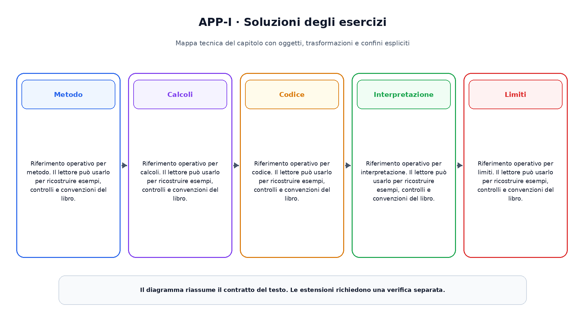

# Appendice I. Soluzioni degli esercizi

Questa appendice raccoglie riferimenti operativi richiamati dai capitoli.

## Metodo

Riferimento operativo per metodo. Il lettore  può usarlo per ricostruire esempi, controlli e convenzioni del libro.

## Calcoli

Riferimento operativo per calcoli. Il lettore  può usarlo per ricostruire esempi, controlli e convenzioni del libro.

## Codice

Riferimento operativo per codice. Il lettore  può usarlo per ricostruire esempi, controlli e convenzioni del libro.

## Interpretazione

Riferimento operativo per interpretazione. Il lettore  può usarlo per ricostruire esempi, controlli e convenzioni del libro.

## Limiti

Riferimento operativo per limiti. Il lettore  può usarlo per ricostruire esempi, controlli e convenzioni del libro.

