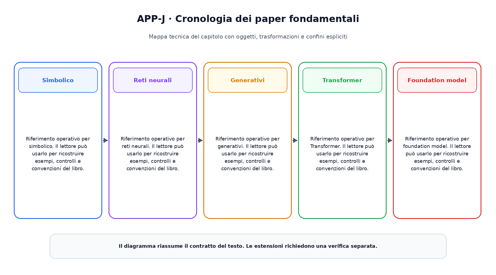

# Appendice J. Cronologia dei paper fondamentali

Questa appendice raccoglie riferimenti operativi richiamati dai capitoli.

## Simbolico

Riferimento operativo per simbolico. Il lettore  può usarlo per ricostruire esempi, controlli e convenzioni del libro.

## Reti neurali

Riferimento operativo per reti neurali. Il lettore  può usarlo per ricostruire esempi, controlli e convenzioni del libro.

## Generativi

Riferimento operativo per generativi. Il lettore  può usarlo per ricostruire esempi, controlli e convenzioni del libro.

## Transformer

Riferimento operativo per Transformer. Il lettore  può usarlo per ricostruire esempi, controlli e convenzioni del libro.

## Foundation model

Riferimento operativo per foundation model. Il lettore  può usarlo per ricostruire esempi, controlli e convenzioni del libro.

