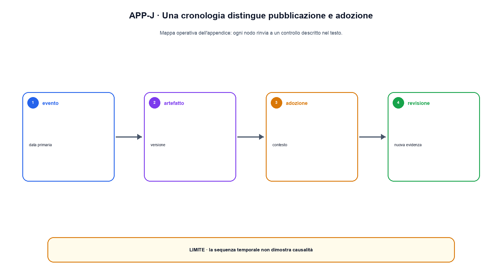

# Appendice J. Cronologia ragionata dei lavori fondamentali

Una cronologia è utile se mostra quali problemi cambiano, non se accumula nomi. Le date sotto indicano la pubblicazione iniziale o il riferimento storico più comunemente usato; non stabiliscono un unico inventore per idee sviluppate da più comunità.

## Dalla computazione simbolica alle reti neurali

| Anno | Lavoro | Passaggio introdotto |
|---|---|---|
| 1943 | McCulloch e Pitts | modello logico semplificato di neurone |
| 1950 | Turing, *Computing Machinery and Intelligence* | sposta la domanda verso comportamento osservabile |
| 1956 | Dartmouth workshop | consolida il termine artificial intelligence |
| 1958 | Rosenblatt, perceptron | apprendimento di un confine lineare |
| 1968 | Hart, Nilsson e Raphael, A* | ricerca informata con costo e euristica |
| 1986 | Rumelhart, Hinton e Williams | rende centrale backpropagation per rappresentazioni distribuite |

Queste linee non sono una successione in cui il neurale sostituisce completamente il simbolico. Ricerca, logica e ottimizzazione continuano a essere componenti di sistemi moderni.

## Sequenze, convoluzioni e representation learning

| Anno | Lavoro | Significato |
|---|---|---|
| 1989-1998 | LeCun e collaboratori, CNN per documenti | condivisione locale dei pesi e training end-to-end |
| 1997 | Hochreiter e Schmidhuber, LSTM | gate per controllare memoria e gradienti nelle sequenze |
| 2003 | Bengio et al., neural probabilistic language model | embedding e predizione neurale del token |
| 2006 | Hinton e Salakhutdinov, autoencoder profondo | riduzione dimensionale neurale e pretraining |
| 2013 | Mikolov et al., word2vec | rappresentazioni distribuzionali efficienti |
| 2014 | Sutskever et al., sequence to sequence | encoder-decoder neurale per trasformare sequenze |
| 2015 | He et al., ResNet | percorso residuale per reti molto profonde |

## Modelli generativi

| Anno | Lavoro | Contratto centrale |
|---|---|---|
| 2013 | Kingma e Welling, VAE | inference approssimata e latent probabilistico tramite ELBO |
| 2014 | Goodfellow et al., GAN | gioco tra generatore e discriminatore |
| 2016 | Dinh et al., Real NVP | trasformazioni invertibili con likelihood trattabile |
| 2020 | Ho et al., DDPM | processo di corruzione e denoising probabilistico |
| 2021 | Song et al., score-based SDE | unifica score matching e dinamiche stocastiche |
| 2022 | Lipman et al., flow matching | apprendimento di campi vettoriali lungo percorsi scelti |

VAE, GAN, flow e diffusion non sono versioni successive dello stesso algoritmo. Ottimizzano obiettivi differenti e offrono compromessi diversi tra likelihood, campionamento e copertura.

## Attention e Transformer

| Anno | Lavoro | Passaggio |
|---|---|---|
| 2014 | Bahdanau et al. | attention per allineamento in neural machine translation |
| 2017 | Vaswani et al., Transformer | self-attention e blocchi senza ricorrenza principale |
| 2018 | BERT | encoder bidirezionale con masked language modeling |
| 2018-2019 | GPT e GPT-2 | decoder causale preaddestrato e trasferimento via prompting/fine-tuning |
| 2020 | GPT-3 | scala e in-context learning misurato su numerosi task |
| 2021 | Switch Transformer | MoE su scala con routing condizionale |
| 2022 | FlashAttention | algoritmo IO-aware per attention esatta |

Il Transformer è un'architettura; masked, causal e span corruption sono obiettivi; encoder-only, decoder-only ed encoder-decoder sono famiglie di composizione. La cronologia non deve fondere questi assi.

## Dati, scaling e post-training

| Anno | Lavoro | Perché è rilevante |
|---|---|---|
| 2020 | Kaplan et al., scaling laws | fit empirici tra loss, parametri, dati e compute |
| 2022 | Hoffmann et al., Chinchilla | allocazione compute-optimal con più dati rispetto a ricette precedenti |
| 2022 | Ouyang et al., InstructGPT | SFT, reward model e RLHF per seguire istruzioni |
| 2022 | Chung et al., instruction tuning | generalizzazione su collezioni di task e istruzioni |
| 2023 | Rafailov et al., DPO | obiettivo diretto su coppie di preferenza |
| 2023 | Lightman et al., process supervision | verifica dei passaggi oltre al solo esito |

La popolarità di un metodo non elimina la necessità di distinguere dataset, annotatori, policy di riferimento, verificatori e protocolli di valutazione.

## Retrieval, agenti e sistemi

| Anno | Lavoro | Contributo |
|---|---|---|
| 2020 | Lewis et al., RAG | retrieval e generazione in un modello con memoria esterna |
| 2022 | Yao et al., ReAct | interleaving di ragionamento testuale e azioni |
| 2023 | Schick et al., Toolformer | apprendimento dell'uso di API da dati sintetici |
| 2023 | Kwon et al., vLLM | gestione paginata della KV cache per serving |
| 2024 | Yang et al., SWE-agent | interfacce agentiche per repository e shell |

Questa linea rende evidente che il comportamento osservato appartiene a un sistema: modello, retrieval, tool, policy, runtime e ambiente.

## Come aggiornare la cronologia

Un nuovo lavoro entra quando possiede una fonte primaria, modifica un oggetto già presente nel libro e chiarisce quale capitolo lo assorbe. La data di pubblicazione non basta per dichiararlo fondamentale. Repliche, adozione, standardizzazione e impatto possono maturare in tempi diversi.

