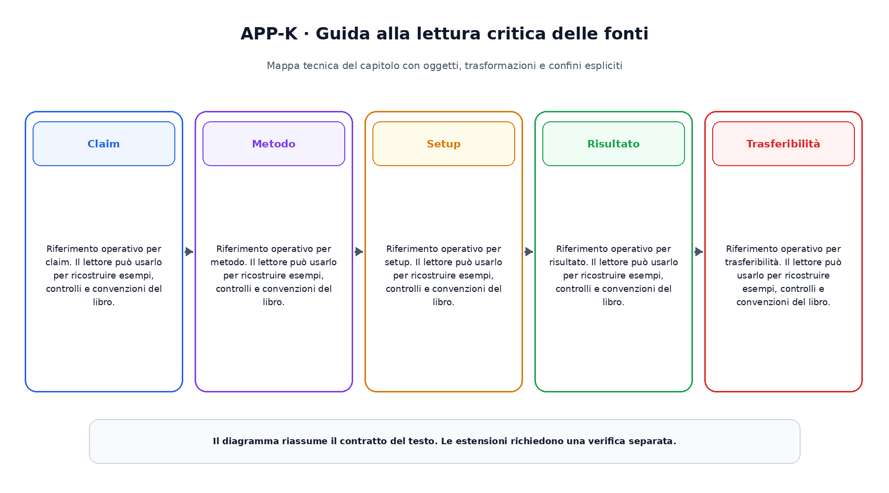

# Appendice K. Guida alla lettura critica delle fonti

Questa appendice raccoglie riferimenti operativi richiamati dai capitoli.

## Claim

Riferimento operativo per claim. Il lettore  può usarlo per ricostruire esempi, controlli e convenzioni del libro.

## Metodo

Riferimento operativo per metodo. Il lettore  può usarlo per ricostruire esempi, controlli e convenzioni del libro.

## Setup

Riferimento operativo per setup. Il lettore  può usarlo per ricostruire esempi, controlli e convenzioni del libro.

## Risultato

Riferimento operativo per risultato. Il lettore  può usarlo per ricostruire esempi, controlli e convenzioni del libro.

## Trasferibilità

Riferimento operativo per trasferibilità. Il lettore  può usarlo per ricostruire esempi, controlli e convenzioni del libro.

