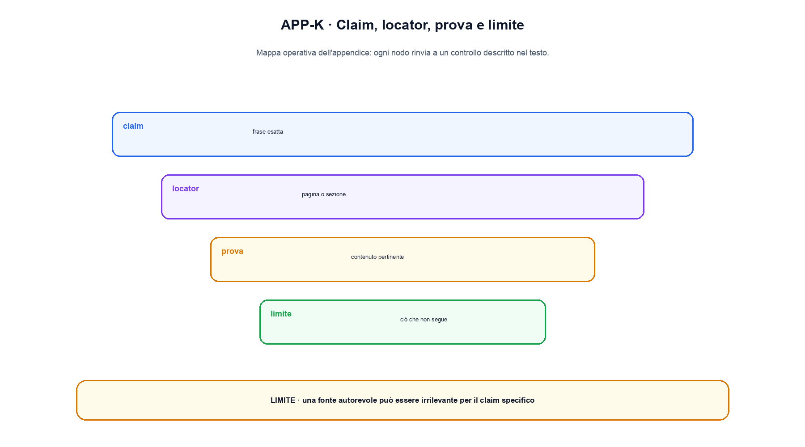

# Appendice K. Guida alla lettura critica delle fonti

Citare una fonte significa collegare una frase a un'evidenza precisa, non aggiungere un URL alla fine del capitolo. Questa appendice propone un metodo per leggere paper, standard e documentazione ufficiale e trasformarli in claim sostenibili.

## 1. Scrivere il claim prima di cercare la citazione

Un claim utile contiene soggetto, relazione e condizioni. “FlashAttention è più veloce” è incompleto. Una forma verificabile è: “FlashAttention calcola attention esatta riducendo letture e scritture in memoria rispetto a una implementazione che materializza la matrice, nel modello IO descritto dagli autori.”

Scrivere prima il claim impedisce di adattare retroattivamente una frase vaga al primo paper trovato.

## 2. Identificare il tipo di fonte

Una fonte primaria presenta il metodo o il risultato originale. Una fonte ufficiale può essere una specifica, documentazione di API o testo normativo. Un survey è utile per orientarsi ma non sempre è la prova migliore per un risultato specifico. Un post o una pagina commerciale possono spiegare un prodotto, ma richiedono cautela per confronti e performance.

Per un'API viva, versione e data sono parte della citazione. Per un paper stabile, versione arXiv e versione pubblicata possono differire; il dossier indica quale è stata letta.

## 3. Localizzare l'evidenza

L'abstract aiuta a capire la domanda, ma spesso non basta per implementazione e limiti. Il locator dovrebbe puntare a:

- definizione o equazione per il meccanismo;
- sezione sperimentale per dataset e setup;
- tabella o figura per un risultato numerico;
- ablation per attribuire una differenza a un componente;
- limitations o discussion per il perimetro;
- versione o sezione normativa per un requisito.

Se la fonte non contiene il concetto con la precisione richiesta, il claim va riscritto o sostenuto da un'altra fonte.

## 4. Ricostruire il setup

Prima di trasferire un numero, annotare modello, dati, hardware, precisione, batch, sequenza, baseline, metrica e numero di run. Due lavori con lo stesso nome di metodo possono usare budget o implementazioni incompatibili.

Un miglioramento relativo del 20% non dice se la metrica passa da 1 a 1,2 o da 100 a 120, né se la baseline è stata ottimizzata allo stesso livello. La tabella deve essere letta insieme alle note e all'appendice sperimentale.

## 5. Separare risultato e interpretazione

Esempio:

```text
Risultato della fonte: nel setup S, il metodo M riduce il tempo T da x a y.
Interpretazione lecita: M può ridurre T quando il collo di bottiglia e il kernel sono simili a S.
Interpretazione non sostenuta: M rende ogni modello più economico in produzione.
```

La seconda frase è un'inferenza delimitata; la terza estende hardware, workload e metrica.

## 6. Leggere un paper con una scheda

```text
Domanda:
Claim principale:
Baseline:
Metodo e oggetto modificato:
Dataset e split:
Budget e hardware:
Metriche:
Risultato con intervallo o variabilità:
Ablation rilevanti:
Limiti dichiarati:
Artefatti disponibili:
Punto che il libro può sostenere:
Punto che resta aperto:
```

Compilare questa scheda prima di scrivere riduce il rischio di fondere contributi di paper differenti.

## 7. Esempio: AWQ, QLoRA e SmoothQuant

Tre lavori di quantizzazione possono sembrare intercambiabili ma modificano oggetti diversi.

- AWQ descrive quantizzazione weight-only post-training guidata dall'attivazione. L'abstract sottolinea che non richiede backpropagation o reconstruction.
- QLoRA congela un modello quantizzato a 4 bit e addestra adapter LoRA. Il claim centrale riguarda fine-tuning efficiente, non quantizzazione generale delle attivazioni per inference.
- SmoothQuant sposta difficoltà dalle attivazioni ai pesi tramite una trasformazione equivalente e mira a W8A8 post-training.

Quindi AWQ non sostiene una spiegazione del quantization-aware training; QLoRA non è la fonte principale per activation quantization; SmoothQuant è pertinente quando si discute W8A8. La somiglianza terminologica non sostituisce l'oggetto modificato.

## 8. Standard e norme

Per una specifica occorre distinguere requisiti normativi, esempi informativi e obiettivi di design. Parole come `MUST`, `SHOULD` e `MAY` hanno un significato definito quando la specifica segue RFC 2119/8174.

Per il diritto, una pagina istituzionale generica o il footer del sito non è un locator. La scheda deve registrare atto, articolo, versione consolidata, giurisdizione, ruolo e data. Il testo tecnico non sostituisce un parere legale.

## 9. Verifica locale

Un claim computazionale può essere affiancato da un esperimento piccolo. L'esperimento verifica l'implementazione locale, non il paper completo. Devono essere separati:

- ciò che è stato letto;
- ciò che è stato implementato;
- ciò che è stato eseguito;
- ciò che è stato misurato;
- ciò che viene inferito.

Se il run usa dati o hardware diversi, il risultato non viene chiamato replica esatta.

## 10. Stato del claim

Usare stati semplici:

- **aperta**: fonte o evidenza non sufficiente;
- **verificata**: locator e perimetro controllati;
- **corretta**: frase modificata per aderire alla fonte;
- **respinta**: la fonte non sostiene il claim;
- **rimossa**: il claim non è necessario o è diventato obsoleto.

La verifica è sempre del claim formulato, non della reputazione della fonte.


