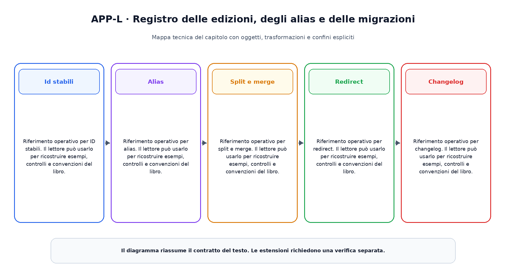

# Appendice L. Registro delle edizioni, degli alias e delle migrazioni

Questa appendice raccoglie riferimenti operativi richiamati dai capitoli.

## Id stabili

Riferimento operativo per ID stabili. Il lettore  può usarlo per ricostruire esempi, controlli e convenzioni del libro.

## Alias

Riferimento operativo per alias. Il lettore  può usarlo per ricostruire esempi, controlli e convenzioni del libro.

## Split e merge

Riferimento operativo per split e merge. Il lettore  può usarlo per ricostruire esempi, controlli e convenzioni del libro.

## Redirect

Riferimento operativo per redirect. Il lettore  può usarlo per ricostruire esempi, controlli e convenzioni del libro.

## Changelog

Riferimento operativo per changelog. Il lettore  può usarlo per ricostruire esempi, controlli e convenzioni del libro.

