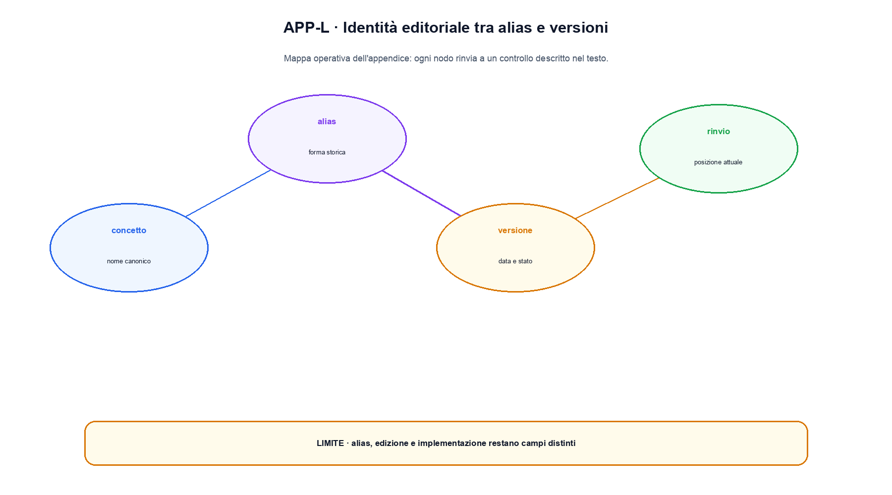

# Appendice L. Registro delle edizioni, degli alias e delle migrazioni

Il numero visibile di un capitolo serve alla lettura; l'identità editoriale serve alla manutenzione. Questa appendice definisce come aggiornare il libro senza rompere link, citazioni, asset e storia delle revisioni.

## Identità stabili

Ogni capitolo possiede nel commento iniziale:

```text
chapter_id: CH-P06-ATTENTION
part_id: P06
order_key: 280
title: Il meccanismo di attention
```

`chapter_id` identifica il contenuto nel tempo. `part_id` identifica la parte proprietaria. `order_key` stabilisce l'ordine corrente. Titolo e numero possono cambiare in una nuova edizione, ma l'ID non cambia se l'oggetto didattico resta lo stesso.

Gli asset usano una cartella collegata al capitolo e un ID di figura. Un nuovo raster crea una versione candidata; non sovrascrive silenziosamente l'immagine usata da una release precedente.

## Alias

Un alias collega un nome storico a un'identità attuale. È appropriato quando cambia la terminologia ma il contratto didattico resta sostanzialmente uguale.

```text
alias: "self-attention"
target: CH-P06-ATTENTION
introduced: edition-2026.1
reason: titolo pubblico più esplicito
```

L'alias non crea una seconda copia del capitolo. Motori di ricerca, indice e link interni possono risolverlo verso il target, mentre il changelog conserva la denominazione precedente.

## Split di un capitolo

Uno split è necessario quando un capitolo contiene due oggetti con prerequisiti, codice o valutazioni indipendenti. La procedura è:

1. conservare l'ID originale come nodo storico;
2. creare due nuovi `chapter_id`;
3. registrare quali sezioni e claim migrano;
4. aggiornare prerequisite e consumer;
5. creare alias o redirect dal vecchio titolo;
6. non riutilizzare i vecchi ID di figura per contenuti diversi.

Esempio di registro:

```text
source: CH-P04-CNN-GEOMETRIC
targets: CH-P04-CNN, CH-P04-GEOMETRIC
kind: split
reason: codice e prerequisiti indipendenti
edition: 2027.1
```

## Merge

Un merge è appropriato quando due capitoli ripetono lo stesso oggetto e nessuno possiede un contratto autonomo. Si crea un nuovo nodo oppure si sceglie un target canonico; gli ID ritirati restano nel registro con stato `merged`, non vengono cancellati dalla storia.

Un merge non deve nascondere la perdita di un esercizio, una fonte o un'implementazione. Il diff editoriale elenca ciò che viene conservato, riscritto e rimosso.

## Redirect e link

I redirect devono essere aciclici. Ogni alias risolve direttamente o attraverso una catena corta a un ID attivo. Il controllo automatico deve rilevare target mancanti, cicli e due capitoli attivi con lo stesso ID.

I link nel Markdown restano relativi al file. Quando una cartella cambia nome, si aggiornano capitolo, piano, claim, fonti, code README e asset. Un check di link impedisce che il testo pubblichi immagini o snippet mancanti.

## Versioni e maturità

La versione del file descrive la revisione editoriale del capitolo. La maturità `CORE`, `ESTABLISHED` o `FRONTIER` descrive stabilità dell'evidenza e collocazione nel libro, non la qualità del testo.

Uno schema possibile:

- `0.x`: draft in revisione;
- `1.0`: prima approvazione autoriale del capitolo;
- incremento minore: chiarimento compatibile, nuova fonte o esempio;
- incremento maggiore: contratto didattico modificato.

Una nuova edizione del libro raccoglie capitoli con versioni diverse e registra il commit esatto. Non è necessario riallineare artificialmente ogni file allo stesso numero.

## Changelog di un capitolo

Una voce utile specifica impatto e motivazione:

```text
2026-08-04, 0.5.0-draft3
- rimossa prosa generata ripetitiva;
- inserito esempio Python eseguito e output;
- separati i due obiettivi visuali;
- corretta la fonte del claim sulla quantizzazione;
- approvazione autoriale ancora aperta.
```

“Migliorato il capitolo” non permette di capire quali evidenze vadano riaperte.

## Registro delle migrazioni

Il file operativo dovrebbe contenere almeno:

| Campo | Significato |
|---|---|
| source ID | identità precedente |
| target ID | identità corrente |
| tipo | rename, alias, split, merge, retired |
| edizione | prima edizione che applica la migrazione |
| motivo | decisione editoriale |
| compatibilità | link, codice, asset o citazioni da aggiornare |

## Controlli prima di una nuova edizione

- tutti i `chapter_id` attivi sono unici;
- order key e indice concordano;
- alias e redirect risolvono senza cicli;
- claim e fonti seguono il capitolo target;
- codice e output mostrati appartengono alla stessa versione;
- figure attive e alt text sono presenti;
- split e merge aggiornano prerequisiti e consumer;
- il changelog distingue correzioni, nuova evidenza e decisioni autoriali;
- il commit dell'edizione è immutabile e riproducibile.


