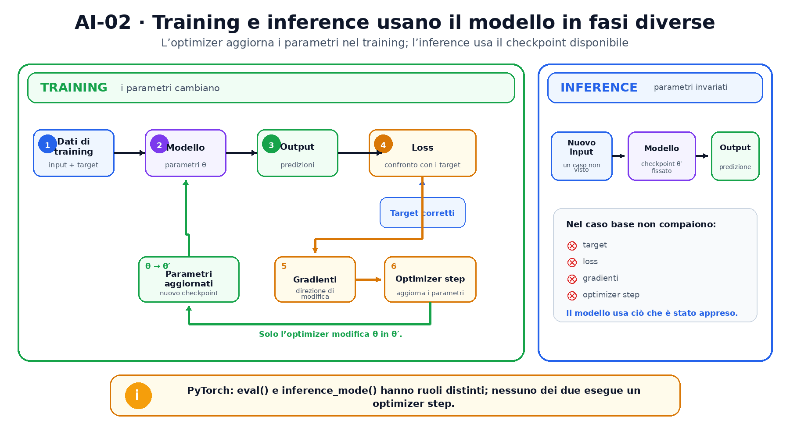
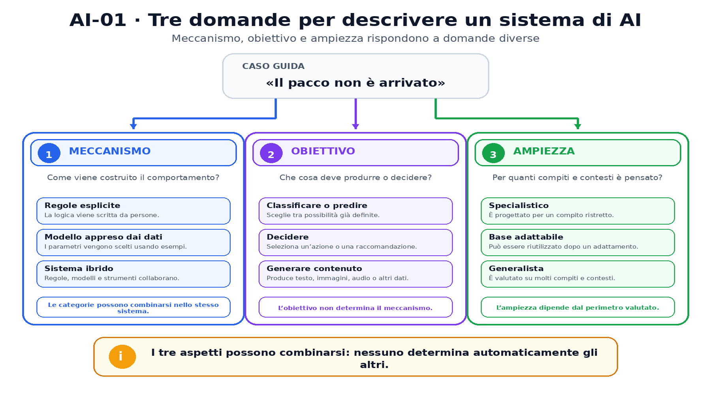

<!--
chapter_id: CH-P01-AI-FIELD
part_id: P01
order_key: 010
title: Che cos'è l'intelligenza artificiale
maturity: CORE
status: candidatura completa in revisione autoriale
version: 0.4.0-rc3
opened: 2026-07-30
last_web_research: 2026-07-30
last_source_check: 2026-07-30
environment: Python 3.13.5, PyTorch 2.10.0+cpu
deferred: generalizzazione, gradienti, architetture neurali, pretraining, scaling, sicurezza, governance
-->

# Capitolo 1. Che cos'è l'intelligenza artificiale

La frase «Il pacco non è arrivato» può ricevere risposte molto diverse. Un programma può cercare alcune parole e aprire un ticket. Un classificatore può assegnare la richiesta alla categoria `problema_di_consegna`. Un modello generativo può scrivere una risposta. Un sistema più ampio può anche consultare il database degli ordini, controllare la spedizione e proporre un'azione.

Dall'esterno, tutti questi casi sembrano simili: entra una frase ed esce un risultato. All'interno, però, possono funzionare in modi profondamente diversi. Alcuni usano regole scritte a mano, altri apprendono dai dati, altri ancora combinano modelli, regole e strumenti esterni. Per orientarci useremo tre domande semplici:

1. **Come viene costruito il comportamento?**
2. **Che cosa deve produrre il sistema?**
3. **Per quanti compiti e contesti è stato pensato?**

Queste domande ci permetteranno di distinguere AI, machine learning, deep learning, modelli generativi e foundation model senza trattarli come sinonimi.

## Una stessa richiesta, sistemi diversi

Ogni programma riceve input, esegue operazioni e produce output. Questa descrizione vale per una calcolatrice, un database e una rete neurale, quindi è troppo ampia per definire da sola l'intelligenza artificiale.

L'OCSE descrive un **sistema di AI** come un sistema basato su macchine che, rispetto a obiettivi espliciti o impliciti, usa gli input per determinare come produrre predizioni, contenuti, raccomandazioni o decisioni. Questi output possono influire su ambienti fisici o virtuali [OECD, 2024].

In parole più semplici, un sistema di AI riceve informazioni, le elabora secondo un meccanismo e produce un risultato collegato a un obiettivo. Il verbo *inferire*, usato nella definizione dell'OCSE, non significa necessariamente che il sistema comprenda come una persona. Indica che il risultato viene calcolato a partire dagli input e dal funzionamento interno del sistema.

Torniamo alla richiesta iniziale. L'applicazione potrebbe produrre una categoria, una frase di risposta oppure la proposta di aprire un ticket. Il tipo di risultato non ci dice ancora come sia stato ottenuto. La stessa categoria `problema_di_consegna` può derivare da una regola, da un modello statistico o da una rete neurale.

Per descrivere questi casi distingueremo **modello** e **sistema**. Il modello è la parte matematica che trasforma numeri in altri numeri. Il sistema comprende il modello, quando presente, e tutto ciò che ne organizza l'uso: controlli sugli input, regole, dati esterni, strumenti, autorizzazioni, interfaccia e controlli sull'output. Questa è una convenzione editoriale del libro, coerente con l'impostazione del NIST, che valuta rischi e prestazioni lungo l'intero ciclo di vita di prodotti, servizi e sistemi AI [NIST AI RMF 1.0, 2023].

La distinzione è pratica. Due applicazioni possono usare lo stesso modello salvato e comportarsi in modo diverso perché consultano dati diversi o hanno autorizzazioni diverse. Al contrario, un sistema può sostituire il modello interno senza cambiare l'interfaccia che vede l'utente.

## Quando il comportamento è scritto e quando viene appreso

Consideriamo una prima soluzione alla richiesta di consegna:

```text
se il testo contiene "pacco" e "non è arrivato":
    categoria = problema_di_consegna
```

Qui il progettista ha scritto direttamente che cosa cercare e che cosa fare. Un sistema di questo tipo è **basato su regole**, o *rule-based*. Quando le regole lavorano con fatti, simboli e relazioni esplicite, il sistema si colloca nella tradizione dell'AI simbolica.

La regola, però, può fallire davanti a frasi non previste, come «Il corriere non è mai passato» o «La spedizione è ferma da una settimana». Per evitare di scrivere una regola diversa per ogni formulazione, possiamo raccogliere esempi già classificati:

```text
"Il corriere non è passato"  -> problema_di_consegna
"Voglio cambiare indirizzo"  -> modifica_ordine
"Il pacco non è arrivato"    -> problema_di_consegna
"La carta è stata rifiutata" -> problema_di_pagamento
```

Nel **machine learning** non descriviamo a mano tutte le decisioni. Scegliamo un modello con numeri interni regolabili, gli mostriamo esempi, misuriamo i suoi errori e modifichiamo quei numeri per ridurli. I numeri regolabili si chiamano **parametri**. I dati non scrivono da soli il programma, ma forniscono il segnale con cui una procedura di apprendimento sceglie i parametri.

Nelle applicazioni reali, regole e apprendimento possono convivere. Il numero d'ordine può essere controllato con una regola, la categoria può essere riconosciuta da un modello e un ultimo controllo può impedire azioni non autorizzate. Per questo `simbolico`, `statistico` e `neurale` sono descrizioni utili, ma non indicano tre mondi sempre separati.

L'**intelligenza artificiale** è il campo più ampio. Comprende apprendimento, ricerca, pianificazione, rappresentazione della conoscenza e decisione. Il machine learning è uno degli approcci all'AI, non l'intero campo [Goodfellow et al., 2016, cap. 1].

Nel **representation learning** il modello apprende anche quali caratteristiche interne sono utili. Un classificatore più tradizionale può ricevere caratteristiche scelte a mano, per esempio la presenza di certe parole. Un modello di representation learning costruisce invece rappresentazioni numeriche intermedie. Il **deep learning** usa più livelli di trasformazioni apprese. Non esiste una soglia universale di livelli oltre la quale un modello diventa `deep`; il termine indica una famiglia di metodi [Goodfellow et al., 2016, cap. 1].

La relazione essenziale è quindi questa: il deep learning è una parte del machine learning, e il machine learning è uno degli approcci all'AI. Una rete profonda può comunque essere inserita in un sistema che usa anche regole, ricerca o strumenti esterni.

## I numeri interni del modello: training e inference

Un modello parametrizzato contiene numeri che determinano la trasformazione eseguita. In un classificatore lineare molto semplice possiamo scrivere:

$$
\mathbf{z}=W\mathbf{x}+\mathbf{b}.
$$

Il vettore `x` contiene i valori in ingresso. La matrice `W` e il vettore `b` sono i parametri. Il risultato `z` contiene due punteggi grezzi, uno per ciascuna classe. Questi punteggi vengono spesso chiamati **logit**.

Durante il **training**, il modello elabora gli esempi e produce risultati. Una funzione di errore, chiamata **loss**, confronta quei risultati con le risposte attese. Il calcolo dei gradienti indica come cambiare i parametri, e l'**optimizer** applica l'aggiornamento. Nel caso mostrato più avanti, l'istruzione che modifica davvero i parametri è `optimizer.step()`.

Alcune scelte configurano il training senza essere modificate dall'optimizer. Il learning rate, che controlla l'ampiezza degli aggiornamenti, e il numero di iterazioni sono esempi di **iperparametri**.

Quando salviamo i parametri e le altre informazioni necessarie a riusare il modello, otteniamo un **checkpoint**. Un checkpoint può contenere soltanto i parametri oppure anche configurazione, contatori e stato dell'optimizer.

Durante l'**inference**, un nuovo input attraversa il modello usando i parametri già disponibili. Nel caso base non viene eseguito `optimizer.step()`, quindi i parametri non cambiano. Il training serve ad apprendere; l'inference serve a usare ciò che è stato appreso.

La figura mette le due fasi una accanto all'altra. Nel pannello del training, i target entrano nella loss e l'optimizer è l'unico nodo che aggiorna i parametri. Nel pannello dell'inference, un nuovo input attraversa il checkpoint fissato senza loss, gradienti o optimizer step.



Il seguente esempio PyTorch rende visibile la stessa differenza. Usa quattro osservazioni illustrative, due valori per osservazione e due classi:

```python
import torch
from torch import nn


torch.manual_seed(7)
features = torch.tensor(
    [[2.0, 0.0], [1.5, 0.2], [0.0, 2.0], [0.2, 1.5]],
    dtype=torch.float32,
)
labels = torch.tensor([0, 0, 1, 1])

model = nn.Linear(2, 2)
loss_fn = nn.CrossEntropyLoss()
optimizer = torch.optim.SGD(model.parameters(), lr=0.1)

model.train()
for _ in range(100):
    optimizer.zero_grad()
    loss = loss_fn(model(features), labels)
    loss.backward()
    optimizer.step()

model.eval()
with torch.inference_mode():
    logits = model(torch.tensor([[1.8, 0.1]]))
    predicted_class = logits.argmax(dim=-1)
```

Nel ciclo di training, `loss.backward()` calcola i gradienti e `optimizer.step()` aggiorna i parametri. Nel blocco finale il modello riceve un nuovo input, produce due logit e sceglie il più alto. La shape `[1,2]` significa che abbiamo una riga di output con due valori, uno per classe.

Nel run registrato, la loss passa da `0.641941` a `0.045580`. Almeno un parametro cambia durante il training; nessun parametro cambia durante l'inference. La classe prevista per il nuovo input è `0`.

Questo risultato mostra soltanto la differenza tra le due fasi. Quattro esempi non bastano per stabilire se il modello funziona bene su dati nuovi. La generalizzazione richiede dati separati e un protocollo di valutazione appropriato.

> **Nota su PyTorch.** `model.eval()` imposta la modalità di valutazione dei moduli che si comportano diversamente durante training e inference, come Dropout e BatchNorm. `torch.inference_mode()` disabilita invece le strutture usate da autograd per calcolare i gradienti. Le due istruzioni svolgono compiti diversi [PyTorch 2.13, `Module` e `inference_mode`].

## Predire una proprietà o generare contenuto

Finora abbiamo chiesto come viene costruito il comportamento. Ora chiediamo che tipo di risultato deve produrre il modello.

Un modello **discriminativo** cerca di distinguere possibilità già definite. Nel nostro esempio riceve una richiesta e sceglie una categoria, come `problema_di_consegna` oppure `modifica_ordine`. Può quindi rispondere a una domanda del tipo: «A quale classe appartiene questo input?»

Un modello **generativo** descrive invece come possono presentarsi i dati e può essere usato per produrre nuovi campioni. Nel caso del testo, può generare una nuova sequenza di parole condizionata da un'istruzione o da un contesto. La distinzione riguarda ciò che il modello rappresenta e il tipo di risultato che può produrre, non il numero di livelli della rete.

Dal punto di vista probabilistico, un classificatore discriminativo può modellare direttamente

$$
p(y\mid x),
$$

cioè la probabilità della classe `y` dato l'input `x`. Un classificatore generativo può invece modellare la distribuzione congiunta

$$
p(x,y)=p(x\mid y)p(y),
$$

e usare quel modello per ricavare la classe. Ng e Jordan analizzano questa distinzione confrontando logistic regression e naive Bayes; il loro risultato riguarda quella coppia e le ipotesi studiate, non stabilisce che un approccio sia sempre migliore dell'altro [Ng e Jordan, 2001].

La parola *generativo* viene usata anche per modelli che producono nuovi esempi. Nelle GAN, per esempio, un generatore produce campioni e un discriminatore prova a distinguere quelli generati dai dati reali [Goodfellow et al., 2014]. I due ruoli fanno parte dello stesso processo di training.

Il termine **generative AI** indica modelli e sistemi orientati alla produzione di contenuto sintetico, come testo, immagini, audio o video [NIST AI 600-1, 2024]. Nel nostro esempio, il classificatore restituisce una categoria; un sistema di generative AI può scrivere: «Mi dispiace per il ritardo. Inserisci il numero dell'ordine e controllerò lo stato della spedizione».

Generare una frase non dimostra intenzione o comprensione umana. Significa produrre un output attraverso il modello, l'input e gli altri componenti del sistema. Un'applicazione può aggiungere un'istruzione iniziale, dati aggiornati sugli ordini, strumenti esterni, autorizzazioni e controlli sulla risposta. Il comportamento finale dipende dall'insieme di questi elementi, non dal solo modello.

## Foundation model, adattamento e varietà dei compiti

Il report dello Stanford Center for Research on Foundation Models introduce il termine **foundation model** per indicare un modello addestrato su grandi raccolte di dati, in genere con self-supervision su larga scala, e adattabile a numerosi compiti successivi [Bommasani et al., 2021]. L'idea centrale è il ruolo di base riutilizzabile.

Un foundation model può essere adattato con nuovi esempi, nuove istruzioni, dati di un dominio o collegamenti a fonti esterne. I metodi specifici verranno studiati più avanti. Per ora basta distinguere tre livelli: il modello di base, l'eventuale adattamento e il sistema applicativo che lo usa.

`Foundation model` e `modello generativo` non sono sinonimi. Il NIST chiarisce che non tutta la generative AI deriva da foundation model [NIST AI 600-1, 2024]. Un modello piccolo e specializzato può generare contenuto senza essere una base riutilizzabile per molti compiti. Allo stesso modo, un'applicazione costruita su un foundation model può restare molto specialistica.

Anche i termini **generalista** e **specialistico** dipendono dal confronto. Un classificatore delle richieste di consegna è specialistico rispetto a un sistema capace di classificare, tradurre, generare testo, analizzare immagini e usare strumenti. Lo stesso sistema più ampio può però essere generalista all'interno di un reparto aziendale e specialistico rispetto all'insieme delle attività umane. Questi termini descrivono la varietà dei compiti e dei contesti d'uso, non la qualità o l'affidabilità del sistema.

## Tre domande per descrivere un sistema

Le etichette introdotte finora rispondono a domande diverse. Possiamo riunirle in una tabella semplice.

| Aspetto | Domanda | Esempi |
|---|---|---|
| Meccanismo | Come viene costruito il comportamento? | regole, modello appreso, rete profonda, sistema ibrido |
| Obiettivo | Che cosa deve produrre o decidere? | classificare, predire, decidere, generare |
| Ampiezza | Per quanti compiti e contesti è pensato? | specialistico, base adattabile, generalista |

La figura usa la stessa richiesta come caso guida e la descrive lungo i tre aspetti. I pannelli sono paralleli: non formano una scala e nessuno determina automaticamente gli altri.



La richiesta «Il pacco non è arrivato» può quindi essere gestita da un'automazione basata su regole, da un classificatore neurale, da un modello generativo specializzato oppure da un sistema ibrido costruito attorno a un foundation model, un database e alcuni strumenti.

Nessun aspetto determina automaticamente gli altri. Una rete profonda non è necessariamente generativa. Un modello generativo non è necessariamente un foundation model. Un foundation model non rende generalista ogni applicazione che lo utilizza.

Le autorizzazioni mostrano perché la distinzione tra modello e sistema è importante. Lo stesso modello può limitarsi a suggerire una categoria oppure può essere inserito in un sistema autorizzato a modificare un ordine. La formula del modello può restare identica, mentre cambiano le conseguenze operative.

## Riepilogo

L'intelligenza artificiale non indica un solo tipo di programma. È un campo ampio che comprende metodi diversi. Il machine learning è uno di questi metodi, e il deep learning è una parte del machine learning.

Per capire un sistema conviene separare tre domande. La prima riguarda il meccanismo: regole scritte a mano, apprendimento dai dati o una combinazione dei due. La seconda riguarda il risultato: classificare, predire, decidere o generare. La terza riguarda l'ampiezza: un compito ristretto oppure molti compiti e contesti.

Bisogna inoltre distinguere il modello dal sistema che lo circonda. Dati esterni, regole, strumenti e autorizzazioni possono cambiare molto il comportamento osservato anche quando i parametri del modello restano invariati.

### Verifica della comprensione

1. Spiega perché AI e machine learning non sono sinonimi.
2. Individua nello snippet l'istruzione che modifica i parametri e il blocco che esegue soltanto l'inference.
3. Spiega con parole semplici la differenza tra un modello discriminativo e uno generativo.
4. Descrivi un filtro antispam usando le tre domande: meccanismo, obiettivo e ampiezza.
5. Supponi di aggiungere al sistema di assistenza uno strumento che legge lo stato reale della spedizione. Quale parte può restare invariata e quale parte del sistema è cambiata?

### Esercizi

1. Descrivi un sistema di raccomandazione separando input, modello, output e componenti circostanti.
2. Scrivi una regola esplicita per riconoscere un problema di consegna e trova due formulazioni che la regola non intercetta.
3. Rimuovi il ciclo di training da `SNIP-AI-001` e verifica che i parametri rimangano invariati.
4. Aggiungi una seconda inference con un input diverso e controlla la shape dell'output.
5. Trova un esempio di modello generativo specialistico che non richieda la nozione di foundation model.
6. Elenca tre componenti di un sistema di generative AI che non appartengono al modello.

## Fonti e materiali verificabili

Le fonti portanti sono la definizione aggiornata di sistema di AI dell'OCSE, il NIST AI RMF 1.0, il profilo NIST sulla generative AI, *Deep Learning* di Goodfellow, Bengio e Courville, il confronto di Ng e Jordan tra classificatori discriminativi e generativi, il paper originale sulle GAN e il report sui foundation model.

Le schede complete e i limiti d'uso sono in [`FONTI_PRIMARIE.md`](FONTI_PRIMARIE.md). Il codice eseguito, i test, gli output e l'ambiente sono raccolti nella cartella [`code/`](code/).
