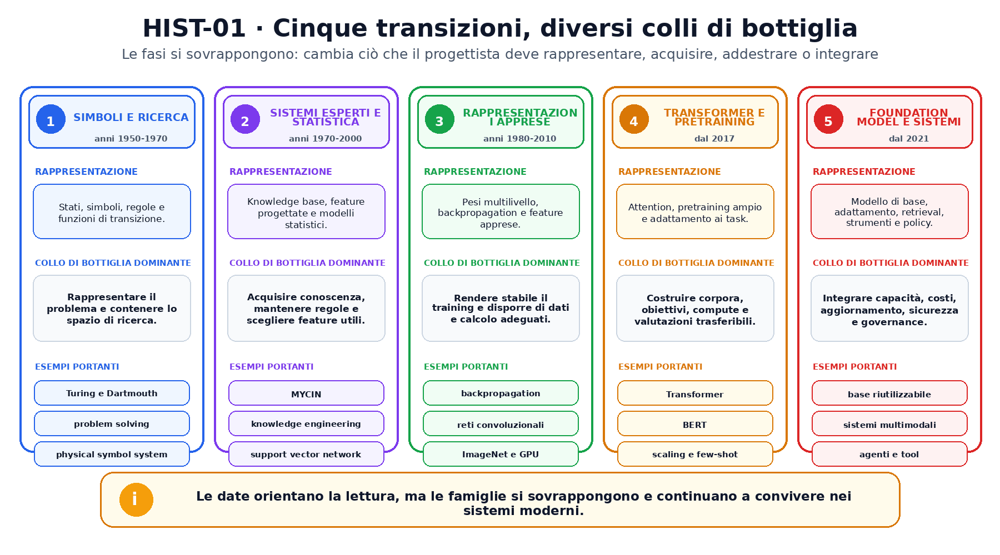
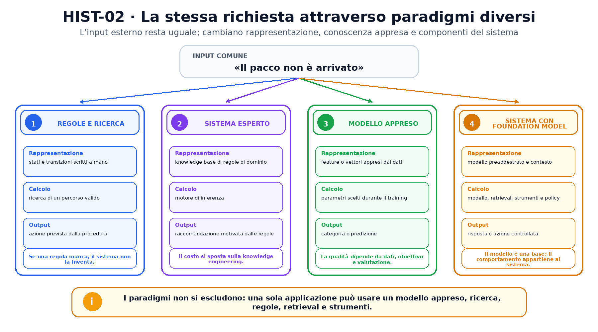

<!--
chapter_id: CH-P01-HISTORY
part_id: P01
order_key: 020
title: Dai simboli ai foundation model
maturity: CORE
status: prima stesura completa, visuali e codice in revisione
version: 0.1.0-draft1
opened: 2026-07-30
last_web_research: 2026-07-30
last_source_check: 2026-07-30
deferred: storia dettagliata dei singoli laboratori, architetture complete, scaling, multimodalità, sicurezza e governance
-->

# Capitolo 2. Dai simboli ai foundation model

Nel capitolo precedente abbiamo usato la frase «Il pacco non è arrivato» per distinguere regole, modelli appresi e sistemi costruiti attorno a un modello. Ora useremo la stessa richiesta per attraversare la storia dell'intelligenza artificiale.

L'obiettivo non è stabilire quale epoca fosse più intelligente della precedente. Una regola scritta bene può essere la soluzione migliore per un controllo semplice; un algoritmo di ricerca può restare indispensabile dentro un sistema neurale; un modello di grandi dimensioni può dipendere da autorizzazioni e verifiche esplicite. La storia diventa più utile quando la leggiamo come una serie di cambiamenti nel modo di rappresentare i problemi, acquisire conoscenza, usare dati e spendere calcolo.

## Una storia di colli di bottiglia, non una marcia lineare

Immaginiamo di voler costruire un sistema che riceva la richiesta «Il pacco non è arrivato» e proponga il passo successivo. Possiamo descrivere a mano le situazioni possibili, cercare una sequenza di azioni, raccogliere regole da persone esperte, apprendere una funzione da esempi, addestrare una rete che costruisce le proprie rappresentazioni oppure adattare un modello preaddestrato e collegarlo al database delle spedizioni.

L'input esterno può restare quasi identico, ma cambia ciò che il progettista deve fornire. In un sistema simbolico servono stati, simboli e regole. In un sistema esperto serve una base di conoscenza sufficientemente completa e coerente. Nell'apprendimento statistico servono esempi e caratteristiche utili. Nel deep learning una parte crescente delle rappresentazioni viene appresa, ma aumentano il peso di dati, calcolo e procedure di ottimizzazione. Con il pretraining su larga scala, il costo principale si sposta ancora: si costruisce un modello di base costoso e lo si riusa in applicazioni differenti.

Queste fasi si sovrappongono. Non esiste un istante in cui le regole scompaiono e vengono sostituite dai gradienti, né un momento in cui ogni modello specializzato diventa un foundation model. La periodizzazione che useremo è uno strumento didattico: mette in primo piano il collo di bottiglia dominante, senza trasformarlo in una legge universale.



## Descrivere il problema con simboli e ricerca

Nel 1950 Alan Turing pubblicò *Computing Machinery and Intelligence*. Invece di cercare una definizione astratta e definitiva del pensiero, introdusse l'imitation game come modo operativo di discutere il comportamento di una macchina [Turing, 1950]. Il lavoro precede il nome del campo che usiamo oggi e non coincide con una definizione moderna di sistema di AI. Mostra però un passaggio importante: una domanda filosofica viene trasformata in una situazione osservabile e discutibile.

La proposta per il Dartmouth Summer Research Project, datata 31 agosto 1955, usa esplicitamente l'espressione *artificial intelligence*. McCarthy, Minsky, Rochester e Shannon proposero uno studio estivo per il 1956 e indicarono tra i temi linguaggio, astrazione, problem solving e possibilità di miglioramento delle macchine [McCarthy et al., 1955]. La proposta è un documento programmatico, non la prova che tutti quei problemi siano stati risolti o che il campo possieda una sola data di nascita.

Una parte importante dei primi programmi rappresentava il problema attraverso oggetti discreti. Uno **stato** descriveva la situazione corrente; un'**azione** produceva un nuovo stato; un **obiettivo** indicava la condizione da raggiungere. Se più azioni erano possibili, un algoritmo di ricerca esplorava lo spazio delle alternative.

Per la nostra richiesta possiamo definire stati come:

```text
richiesta ricevuta
ordine identificato
spedizione controllata
ticket aperto
```

Le azioni collegano gli stati: chiedere il numero dell'ordine, interrogare il sistema logistico, aprire un ticket. In questa rappresentazione il significato operativo è scritto esplicitamente. Il programma non deve apprendere che cosa significhi `spedizione_controllata`; il progettista definisce il simbolo e le transizioni ammesse.

Newell e Simon descrissero simboli e ricerca come elementi centrali del loro programma di ricerca e formularono la *physical symbol system hypothesis* [Newell e Simon, 1976]. Nel libro tratteremo questa formulazione come una tesi storica degli autori, non come una legge dimostrata per ogni forma di intelligenza.

Il seguente snippet mostra una ricerca in ampiezza su un piccolo workflow. Non riproduce un programma storico specifico; rende osservabile il contratto di base: stati espliciti, azioni esplicite e ricerca di un percorso.

```python
from collections import deque

transitions = {
    "request_received": [
        ("ask_order_id", "order_identified"),
    ],
    "order_identified": [
        ("check_shipment", "shipment_checked"),
        ("open_ticket_immediately", "ticket_opened"),
    ],
    "shipment_checked": [
        ("open_ticket", "ticket_opened"),
    ],
    "ticket_opened": [],
}


def shortest_plan(start: str, goal: str) -> list[tuple[str, str]]:
    queue = deque([(start, [])])
    visited = {start}

    while queue:
        state, path = queue.popleft()
        if state == goal:
            return path

        for action, next_state in transitions[state]:
            if next_state not in visited:
                visited.add(next_state)
                queue.append((next_state, path + [(action, next_state)]))

    raise ValueError(f"Goal non raggiungibile: {goal}")


plan = shortest_plan("request_received", "ticket_opened")
```

L'algoritmo trova il percorso con il minor numero di transizioni nel grafo dichiarato. Se manca una transizione, la ricerca non può inventarla. Questa è insieme una forza e un limite: il comportamento è ispezionabile, ma dipende dalla qualità della rappresentazione costruita a mano.

## Quando la conoscenza diventa una base di regole

La ricerca da sola non dice quali azioni siano appropriate in un dominio complesso. Per gestire diagnosi, configurazioni o consulenze servono conoscenze sulle condizioni, sulle eccezioni e sulle conseguenze. I sistemi esperti hanno affrontato questo problema separando, in forme diverse, una base di conoscenza dal meccanismo che applica le regole.

Nel caso della consegna potremmo scrivere:

```text
SE lo stato è "in transito" E il ritardo è inferiore alla soglia
ALLORA informa il cliente e non aprire ancora un reclamo

SE lo stato è "consegnato" MA il cliente dichiara di non aver ricevuto il pacco
ALLORA avvia una verifica di consegna
```

Il progetto MYCIN è uno dei casi più studiati di sistema rule-based. Il volume curato da Buchanan e Shortliffe descrive la struttura del sistema, l'evoluzione delle regole e il lavoro di *knowledge engineering* necessario per costruire e controllare la base di conoscenza [Buchanan e Shortliffe, 1984]. MYCIN riguarda un dominio medico specifico e non rappresenta ogni sistema esperto, ma rende evidente un problema generale: trasformare l'esperienza di un dominio in regole utilizzabili dal programma richiede tempo, revisioni e gestione delle incoerenze.

Quando il dominio cambia, una regola può diventare incompleta. Quando le regole crescono, due condizioni possono entrare in conflitto. Quando un caso non è stato previsto, il sistema non dispone automaticamente di un esempio simile da cui apprendere. Il collo di bottiglia diventa quindi l'acquisizione e la manutenzione della conoscenza esplicita.

Questa osservazione non rende inutili le regole. Nei sistemi moderni, regole e vincoli continuano a essere usati per autorizzazioni, validazione, formati, controlli di sicurezza e procedure che non devono variare liberamente. Ciò che cambia è il ruolo: invece di descrivere ogni possibile interpretazione dell'input, possono delimitare ciò che un componente appreso è autorizzato a fare.

## Lasciare che alcuni numeri siano appresi

Un'altra famiglia di approcci modifica il punto in cui viene inserita la conoscenza. Invece di scrivere tutte le condizioni, si definisce un modello con parametri regolabili e si usa un insieme di esempi per scegliere quei parametri.

Il perceptron di Rosenblatt, pubblicato nel 1958, è uno dei primi modelli di apprendimento di questo percorso [Rosenblatt, 1958]. Non è una rete profonda nel senso moderno e non deve essere caricato retroattivamente di proprietà sviluppate in seguito. Il suo valore storico, per il nostro racconto, è più semplice: una parte del comportamento può essere ottenuta modificando pesi numerici in funzione degli esempi.

Negli anni successivi, molti metodi statistici hanno reso centrale la relazione tra dati, caratteristiche e criterio di apprendimento. Le support vector network del 1995, per esempio, costruiscono una superficie decisionale in uno spazio di feature e rappresentano una delle famiglie importanti dell'apprendimento statistico [Cortes e Vapnik, 1995]. In questi sistemi le **feature** erano spesso progettate da persone esperte del problema.

Per classificare la richiesta di consegna, un progettista poteva scegliere feature come:

```text
presenza di una negazione
presenza di parole legate alla spedizione
giorni trascorsi dall'ordine
stato dichiarato dal corriere
```

Il modello apprendeva come combinare quei valori, ma la rappresentazione iniziale rimaneva in buona parte progettata a mano. Il collo di bottiglia non era più soltanto scrivere regole; diventava scegliere esempi, feature e obiettivi capaci di rappresentare il problema.

La backpropagation permette di modificare i pesi di più livelli usando il gradiente dell'errore. Nel lavoro del 1986, Rumelhart, Hinton e Williams descrivono una procedura che aggiusta ripetutamente i pesi per ridurre la differenza tra output prodotto e desiderato; le unità nascoste possono così costruire rappresentazioni utili del dominio [Rumelhart et al., 1986]. Il paper non è l'unica origine storica della backpropagation, ma è una fonte primaria centrale per la diffusione di questa formulazione nelle reti multilivello.

Le reti convoluzionali studiate da LeCun, Bottou, Bengio e Haffner mostrano come architettura, apprendimento gradient-based e struttura dei dati possano essere progettati insieme per il riconoscimento di documenti [LeCun et al., 1998]. In questo passaggio, una parte crescente delle feature viene appresa. Il progettista continua a scegliere architettura, dati e obiettivo, ma non deve specificare a mano ogni pattern intermedio.

## Quando dati, calcolo e architettura diventano una sola ricetta

Una rete profonda non è utile soltanto perché contiene molti livelli. Deve essere possibile addestrarla, alimentarla con dati appropriati e valutarla con un protocollo adeguato. Nel 2012, Krizhevsky, Sutskever e Hinton addestrarono una rete convoluzionale profonda sul dataset ImageNet usando una implementazione GPU e riportarono un risultato nettamente migliore rispetto agli altri sistemi della competizione descritta nel paper [Krizhevsky et al., 2012].

È comune usare quell'episodio come simbolo della crescita del deep learning, ma una spiegazione accurata non lo riduce a una sola causa. Il risultato dipendeva dall'incontro tra architettura, dati su larga scala, accelerazione hardware, regolarizzazione e una procedura di training che funzionava abbastanza bene. Nessuno di questi elementi, preso da solo, descrive l'intera transizione.

Per la richiesta «Il pacco non è arrivato», questo cambiamento permette di partire dal testo quasi grezzo e apprendere rappresentazioni interne utili. Rimangono però domande aperte: quali dati contengono esempi sufficienti? Che cosa misura la loss? Il modello generalizza a formulazioni nuove? Quali errori introduce il dataset? Il collo di bottiglia non scompare; si sposta verso la costruzione dei dati, il costo del training, la stabilità e la valutazione.

## Dal modello per un compito al pretraining riutilizzabile

Per molto tempo un modello veniva costruito e valutato soprattutto per un compito specifico. Una parte della ricerca successiva ha invece cercato rappresentazioni riutilizzabili: prima si addestra su un obiettivo ampio, poi si adatta il modello a compiti più specifici.

Il Transformer del 2017 costruisce il blocco principale di sequence transduction con attention, senza usare recurrence o convoluzioni nel blocco descritto dagli autori [Vaswani et al., 2017]. Questa scelta rende più parallelizzabile il calcolo durante il training rispetto alle architetture ricorrenti considerate nel paper. Il Transformer non crea da solo il paradigma del foundation model, ma diventa un componente importante di molte ricette successive.

BERT usa il pretraining bidirezionale di un Transformer e il fine-tuning per diversi compiti linguistici [Devlin et al., 2019]. L'idea operativa cambia il punto di partenza: invece di inizializzare da zero un modello per ogni classificatore, si parte da parametri che hanno già elaborato una grande quantità di testo.

Nel 2020, Kaplan e colleghi studiarono relazioni empiriche tra loss, dimensione del modello, quantità di dati e compute per la famiglia di language model analizzata [Kaplan et al., 2020]. Le relazioni osservate sono leggi empiriche del regime studiato, non una garanzia che aumentare una qualunque risorsa migliori sempre ogni capacità.

Nello stesso anno, GPT-3 venne valutato su molti compiti descritti attraverso istruzioni o pochi esempi nel contesto, senza aggiornare i parametri per ciascun task [Brown et al., 2020]. Il paper documenta risultati forti in alcuni casi e limiti in altri. Il punto storico che ci interessa è il cambiamento dell'interfaccia: una parte del comportamento può essere specificata nel testo di input, non soltanto attraverso un nuovo ciclo di training.

Il report del 2021 di Bommasani e colleghi propone il termine **foundation model** per modelli addestrati su dati ampi e adattabili a numerosi compiti successivi [Bommasani et al., 2021]. Il termine sottolinea sia il riuso sia l'incompletezza: il modello è una base, non il prodotto finale. Un'applicazione per le spedizioni può aggiungere istruzioni, esempi, retrieval, strumenti, autorizzazioni e controlli senza riaddestrare da zero l'intero modello.



## Che cosa cambia e che cosa rimane

Possiamo ora rileggere l'intero percorso attraverso quattro risorse.

**Rappresentazione.** Nei sistemi simbolici, stati e relazioni sono dichiarati esplicitamente. Nell'apprendimento statistico, una parte della rappresentazione assume la forma di feature. Nel representation learning, molte feature intermedie vengono apprese. Nei foundation model, rappresentazioni ampie vengono preaddestrate e riutilizzate.

**Conoscenza.** Può essere scritta in regole, incorporata nei dati, distribuita nei parametri o recuperata da fonti esterne. Nessuna posizione garantisce da sola correttezza o aggiornamento.

**Calcolo.** La ricerca esplora alternative; il training ottimizza parametri; l'inference applica il modello; i sistemi moderni combinano calcolo del modello, retrieval, strumenti e controlli. Aumentare il calcolo apre possibilità, ma introduce costi e vincoli di sistema.

**Riuso.** Un programma può essere specifico per una procedura. Un modello appreso può essere riusato in casi simili. Un modello preaddestrato può essere adattato a più compiti. Il riuso aumenta la leva, ma può propagare gli stessi difetti in molte applicazioni.

La storia non termina con la sostituzione di un paradigma. La richiesta di consegna di un sistema moderno può attraversare un modello neurale, una ricerca nel database, una policy esplicita e una regola che impedisce un rimborso non autorizzato. Capire la storia significa riconoscere da dove proviene ciascun componente e quale problema era stato progettato per risolvere.

## Riepilogo

Le prime formulazioni dell'AI hanno trasformato domande generali in programmi di ricerca su linguaggio, problem solving, apprendimento e comportamento osservabile. Una parte dei sistemi rappresentava il mondo con simboli, stati e regole e usava la ricerca per trovare un percorso. I sistemi esperti hanno reso evidente il valore e il costo della conoscenza esplicita.

L'apprendimento statistico ha spostato una parte del lavoro verso dati, feature e criteri di ottimizzazione. La backpropagation e le reti multilivello hanno permesso di apprendere rappresentazioni interne; dataset più grandi e hardware accelerato hanno reso praticabili ricette più profonde. Attention, Transformer e pretraining hanno poi favorito modelli riutilizzabili, mentre scaling e prompting hanno modificato il modo in cui si specificano i compiti.

Il risultato non è una scala che va da `vecchio` a `nuovo`. È una cassetta degli attrezzi sempre più ampia. Regole, ricerca, modelli appresi e foundation model possono convivere nello stesso sistema. La domanda utile rimane quella del Capitolo 1: quale meccanismo produce il comportamento, che cosa deve ottenere e per quale perimetro è stato progettato e verificato?

### Verifica della comprensione

1. Perché la proposta di Dartmouth è importante senza essere necessariamente l'unica nascita dell'AI?
2. Spiega la differenza tra rappresentare una transizione con una regola e apprenderla da esempi.
3. Quale collo di bottiglia rende difficile mantenere una grande base di regole?
4. Che cosa cambia quando le rappresentazioni intermedie vengono apprese?
5. Perché il risultato di AlexNet non può essere attribuito a una sola causa?
6. Che cosa rende un modello una base riutilizzabile invece di un prodotto completo?
7. Trova nel sistema di assistenza un componente simbolico, uno appreso e uno esterno al modello.

### Esercizi

1. Aggiungi allo snippet uno stato `refund_requested` e una regola che richieda l'autorizzazione prima di `refund_approved`.
2. Costruisci un esempio in cui la ricerca trovi un percorso valido ma la rappresentazione del problema sia incompleta.
3. Descrivi la stessa applicazione usando quattro colonne: rappresentazione, conoscenza, calcolo e riuso.
4. Scegli un sistema moderno e individua almeno due paradigmi storici che convivono al suo interno.
5. Spiega perché `più grande` e `più generale` non sono sinonimi.
6. Trasforma una regola esplicita del dominio delle spedizioni in un piccolo dataset di esempi e indica che cosa andrebbe ancora definito per addestrare un modello.

## Fonti e materiali verificabili

Le fonti portanti includono Turing (1950), la proposta di Dartmouth (1955), Newell e Simon (1976), il volume sul progetto MYCIN (1984), Rumelhart, Hinton e Williams (1986), Cortes e Vapnik (1995), LeCun et al. (1998), Krizhevsky et al. (2012), Vaswani et al. (2017), Devlin et al. (2019), Kaplan et al. (2020), Brown et al. (2020) e Bommasani et al. (2021).

Versioni, sezioni, claim sostenibili e limiti sono registrati in [`FONTI_PRIMARIE.md`](FONTI_PRIMARIE.md) e [`CLAIMS.md`](CLAIMS.md). Il codice eseguibile, i test e gli output sono raccolti nella cartella [`code/`](code/).
