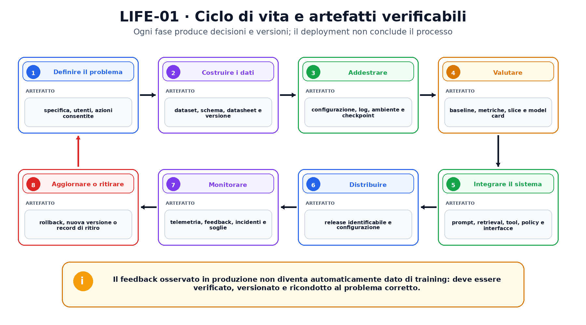
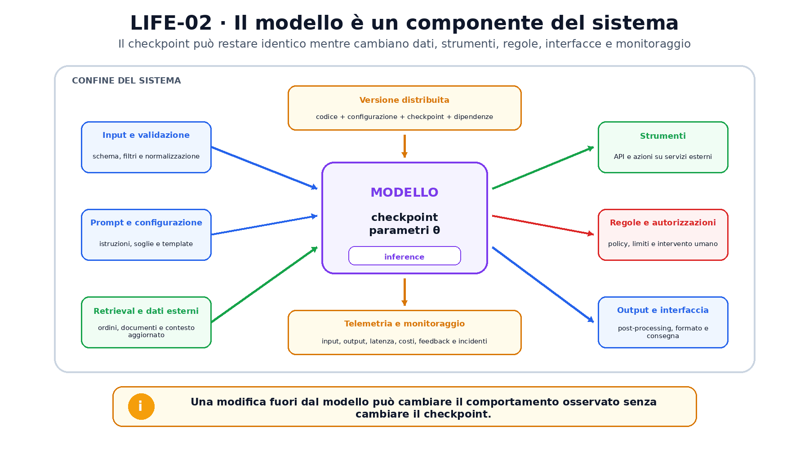

<!--
chapter_id: CH-P01-LIFECYCLE
part_id: P01
order_key: 030
title: Il ciclo di vita di un sistema di AI
maturity: CORE
status: candidatura completa in revisione autoriale
version: 0.2.0-rc1
opened: 2026-07-30
last_web_research: 2026-07-30
last_source_check: 2026-07-30
environment: Python 3.13.5, PyTorch 2.10.0+cpu
deferred: ottimizzazione, data engineering avanzato, serving distribuito, sicurezza e governance normativa
-->

# Capitolo 3. Il ciclo di vita di un sistema di AI

Supponiamo che il sistema di assistenza riceva ancora la frase «Il pacco non è arrivato». Nel Capitolo 1 abbiamo distinto il modello dal sistema che lo circonda. Nel Capitolo 2 abbiamo visto che regole, ricerca e modelli appresi possono convivere. Ora seguiamo ciò che deve accadere prima e dopo l'esecuzione del modello.

Un sistema non nasce quando compare un checkpoint e non termina quando viene messo online. Prima del training bisogna definire il problema, raccogliere e documentare i dati, scegliere un protocollo di valutazione e stabilire quali azioni sono consentite. Dopo il deployment bisogna identificare la versione in uso, osservare il comportamento, gestire incidenti e decidere quando aggiornare, ripristinare o ritirare il sistema.

Il ciclo di vita non è una catena identica per ogni organizzazione. Il NIST AI Risk Management Framework, per esempio, organizza la gestione del rischio nelle funzioni `GOVERN`, `MAP`, `MEASURE` e `MANAGE`, applicabili lungo il ciclo di vita [NIST AI RMF 1.0, 2023]. In questo capitolo useremo una sequenza tecnica più concreta, mantenendo però la stessa idea di fondo: ogni fase produce decisioni e artefatti che devono restare rintracciabili.



## Prima del modello viene il problema

La richiesta «Il pacco non è arrivato» non definisce da sola il compito. Il sistema deve soltanto assegnare una categoria? Deve scrivere una risposta? Può leggere lo stato reale della spedizione? Può aprire un ticket o autorizzare un rimborso? Ogni risposta cambia dati, metriche, rischi e componenti necessari.

Una specifica utile descrive almeno:

- chi usa il sistema;
- quali input sono ammessi;
- quali output può produrre;
- quali azioni sono consentite;
- quali errori hanno conseguenze più gravi;
- quando è richiesto l'intervento umano;
- quali vincoli di latenza, costo e disponibilità esistono.

Queste informazioni appartengono al sistema, non alla sola funzione matematica del modello. Un classificatore con alta accuratezza media può essere inadatto se confonde spesso i casi che richiedono un intervento urgente. Un modello generativo può produrre frasi grammaticalmente corrette ma citare uno stato della spedizione che non ha mai consultato. La prima domanda non è quindi «quale architettura usiamo?», ma «quale comportamento dobbiamo rendere osservabile e controllabile?».

## I dati sono un artefatto versionato

Dopo aver definito il problema, bisogna stabilire da dove provengono gli esempi. Nel nostro caso, i dati potrebbero includere testi delle richieste, categorie assegnate dagli operatori, stato logistico e azione finale. Ogni campo introduce domande: chi ha prodotto l'etichetta? In quale periodo? Con quali regole operative? Sono presenti dati personali? Alcune categorie sono cambiate nel tempo?

Un dataset non è soltanto un file. Ha una motivazione, una composizione, un processo di raccolta, trasformazioni e limiti d'uso. I *Datasheets for Datasets* propongono di documentare questi aspetti, insieme a distribuzione, manutenzione e usi previsti [Gebru et al., 2021]. La scheda non rende automaticamente buoni i dati, ma rende più difficile dimenticare decisioni che altrimenti resterebbero implicite.

Per sviluppare un modello supervisionato, gli esempi vengono normalmente separati in insiemi con ruoli differenti:

- il **training set** viene usato per aggiornare i parametri;
- il **validation set** aiuta a scegliere configurazioni e soglie;
- il **test set** viene usato alla fine per stimare il risultato del protocollo dichiarato.

La separazione deve rispettare la struttura dei dati. Se conversazioni dello stesso cliente compaiono in più split, il modello potrebbe incontrare nel test informazioni quasi duplicate del training. Se si tratta di una previsione temporale, dividere casualmente passato e futuro può produrre una valutazione irrealistica. La regola non è «usare sempre una percentuale fissa», ma impedire che l'informazione disponibile durante lo sviluppo renda artificiosamente facile la valutazione.

Consultare ripetutamente il test set per scegliere il learning rate, la soglia o il prompt lo trasforma di fatto in un altro validation set. Il numero finale rimane calcolabile, ma non svolge più il ruolo di controllo indipendente previsto dal protocollo [Goodfellow et al., 2016, cap. 5].

## Il training è un esperimento riproducibile

Durante il training non vengono modificati soltanto i parametri. Vengono prese decisioni su dati, inizializzazione, optimizer, learning rate, numero di passi, precisione numerica e criteri di arresto. Per ricostruire un risultato servono quindi più artefatti:

```text
dataset e versione
codice e commit
configurazione
seed e ambiente
log del training
checkpoint
metriche intermedie
```

Il checkpoint conserva lo stato numerico del modello, ma non racconta da solo come sia stato ottenuto. Due checkpoint con la stessa architettura possono derivare da dati, obiettivi o configurazioni differenti. Al contrario, lo stesso checkpoint può essere inserito in sistemi con prompt, retrieval e autorizzazioni diversi.

La letteratura sui sistemi ML ha messo in evidenza dipendenze che non compaiono nei piccoli esperimenti isolati. Sculley e colleghi descrivono, tra gli altri, dipendenze dai dati, entanglement tra componenti, feedback loop, glue code e debito di configurazione [Sculley et al., 2015]. Amershi e colleghi osservano inoltre che gestione e versioning dei dati, personalizzazione dei modelli e modularizzazione dei componenti richiedono pratiche diverse da quelle del software tradizionale [Amershi et al., 2019].

Questi lavori non implicano che ogni progetto debba usare la stessa piattaforma. Indicano però un principio utile: il modello è un artefatto dentro un processo, e quel processo deve poter collegare input, configurazione, risultato e versione distribuita.

## Valutare significa confrontare, non soltanto misurare

Una metrica isolata dice poco. Per capire se il sistema è utile bisogna confrontarlo con una **baseline**, cioè una soluzione di riferimento abbastanza semplice da rendere interpretabile il miglioramento. Nel caso della consegna, la baseline potrebbe essere una regola basata su parole chiave o il comportamento operativo precedente.

La valutazione deve inoltre riflettere gli errori importanti. L'accuratezza media può nascondere prestazioni molto diverse tra richieste brevi e lunghe, lingue, tipologie di ordine o categorie rare. Per questo si esaminano anche **slice**, sottoinsiemi definiti da una proprietà rilevante. Una slice piccola non produce automaticamente una stima affidabile, ma può indicare dove serve raccogliere più dati o costruire un test dedicato.

Una model card può registrare uso previsto, procedure di valutazione, metriche, risultati e limiti [Mitchell et al., 2019]. Come il datasheet, non sostituisce i controlli: documenta ciò che è stato fatto e ciò che non è stato dimostrato.

Il seguente esempio rende visibile il ruolo dei tre split. Due learning rate vengono confrontati sulla validation; soltanto dopo la scelta si calcola il risultato sul test. Il batch di produzione simulato viene poi confrontato con il training attraverso una semplice differenza standardizzata della media delle feature.

```python
x, y, split = build_dataset()

candidates = {}
for learning_rate in (0.0005, 0.1):
    state, val_accuracy = train_candidate(
        x,
        y,
        split,
        learning_rate,
    )
    candidates[learning_rate] = (state, val_accuracy)

chosen_lr = max(candidates, key=lambda lr: candidates[lr][1])
chosen_state, chosen_val_accuracy = candidates[chosen_lr]
model = load_model(chosen_state)
test_accuracy = accuracy(model, x[split.test], y[split.test])

train_mean = x[split.train].mean(dim=0)
train_std = x[split.train].std(dim=0).clamp_min(1e-6)
production_batch = x[split.test] + torch.tensor([0.8, 0.0])
standardized_mean_shift = (
    (production_batch.mean(dim=0) - train_mean).abs()
    / train_std
)
```

Nel run registrato, il learning rate `0.1` ottiene il risultato migliore sulla validation. L'accuratezza sul test illustrativo è `1.000`. La prima feature del batch simulato mostra uno spostamento standardizzato di circa `0.73`, maggiore della seconda, circa `0.26`.

Questi numeri non misurano un prodotto reale. Il dataset è sintetico e molto semplice. Lo spostamento della media segnala soltanto una differenza osservabile negli input; non dimostra che il modello abbia perso accuratezza e non identifica la causa del cambiamento.

## Dal checkpoint al sistema distribuito

Dopo la valutazione, il modello deve essere inserito in un sistema. **Deployment** indica la preparazione e distribuzione di una versione utilizzabile. **Serving** riguarda l'infrastruttura che riceve richieste e restituisce risultati. **Inference** è il calcolo con cui il modello trasforma un input usando i parametri disponibili.

I tre concetti sono collegati, ma non sono sinonimi. Si può eseguire inference in un notebook senza distribuire un servizio. Si può distribuire un sistema che contiene più modelli, cache e regole. Un servizio può restare attivo mentre viene sostituito il checkpoint interno.

Nel sistema di assistenza, il checkpoint potrebbe occupare soltanto il centro di una rete di componenti:

- validazione e normalizzazione dell'input;
- prompt o configurazione;
- retrieval dai dati degli ordini;
- strumenti che interrogano servizi esterni;
- regole e autorizzazioni;
- post-processing e interfaccia;
- log, metriche e segnalazioni.



Una modifica al retrieval può cambiare i fatti disponibili. Una nuova regola può impedire un'azione. Un prompt diverso può cambiare il formato della risposta. Il comportamento osservato può quindi cambiare anche quando il checkpoint resta identico.

Per questo una versione distribuita dovrebbe identificare non soltanto i pesi, ma anche gli artefatti necessari a ricostruire il comportamento: codice, configurazione, modello, dipendenze, schema dei dati e componenti collegati. Le piattaforme di produzione come TFX sono state progettate per orchestrare analisi e validazione dei dati, training e serving, riducendo procedure ad hoc e fragili [Baylor et al., 2017]. TFX è un caso specifico; il principio più generale è rendere esplicite le interfacce tra le fasi.

## Monitorare senza confondere segnale e causa

Dopo il deployment, alcuni fenomeni diventano osservabili soltanto in produzione. Gli input possono cambiare, la latenza può crescere, uno strumento esterno può fallire o un aggiornamento del processo aziendale può rendere obsolete le categorie.

Il monitoraggio può includere:

- volume e distribuzione degli input;
- output e tassi di errore osservabili;
- latenza, memoria e costo;
- disponibilità dei servizi esterni;
- frequenza di fallback o intervento umano;
- feedback successivo, quando esiste e può essere collegato all'output;
- incidenti e segnalazioni.

La parola **drift** viene spesso usata per indicare un cambiamento. È utile distinguere almeno due casi. Nel *data drift* cambia la distribuzione degli input. Nel *concept drift* cambia la relazione tra input e risultato desiderato. Osservare che la media di una feature è diversa può segnalare data drift, ma non dimostra da solo che la qualità sia peggiorata. Per stabilirlo servono label affidabili, metriche appropriate o un'analisi ulteriore.

Anche l'assenza di un allarme non garantisce che il sistema funzioni bene. Un monitor controlla ciò che è stato definito e reso misurabile. Può non vedere una nuova categoria di errore, una slice non prevista o un problema semantico che non modifica le statistiche osservate.

Il NIST AI RMF collega misurazione, gestione e governance proprio perché il monitoraggio non è soltanto una dashboard. Gli esiti devono portare a responsabilità, soglie, escalation e decisioni documentate [NIST AI RMF 1.0, 2023; AI RMF Playbook].

## Aggiornare, ripristinare o ritirare

Quando compare un problema, non esiste una sola risposta. Si può correggere un dato, cambiare una regola, aggiornare un prompt, sostituire il checkpoint, disattivare uno strumento o riportare il sistema a una versione precedente.

Un **rollback** è possibile soltanto se la versione precedente è identificabile e ancora compatibile con le dipendenze necessarie. Ripristinare i pesi senza ripristinare configurazione e schema dei dati può non ricostruire il comportamento precedente.

Un aggiornamento richiede una nuova valutazione proporzionata alla modifica. Se cambia soltanto un testo dell'interfaccia, non serve ripetere automaticamente ogni esperimento di training. Se cambiano dati, obiettivo o autorizzazioni, il perimetro della verifica può diventare molto più ampio.

Il ritiro è parte del ciclo di vita. Un modello può non essere più supportato, un dataset può non essere più utilizzabile, un servizio esterno può cambiare contratto o il beneficio può non giustificare più il rischio e il costo. Conservare una versione indefinitamente non equivale a mantenerla sotto controllo.

## Riepilogo

Il ciclo di vita comincia dalla definizione del problema e del perimetro del sistema. I dati vengono raccolti, documentati, versionati e divisi secondo un protocollo. Il training produce parametri, log e checkpoint, ma il risultato è comprensibile soltanto insieme a codice, configurazione e ambiente.

La valutazione confronta il modello con baseline, dati separati e slice rilevanti. Il deployment distribuisce una versione del sistema; il serving la rende disponibile; l'inference elabora i singoli input. Prompt, retrieval, strumenti, regole e autorizzazioni possono cambiare il comportamento senza modificare il checkpoint.

Il monitoraggio osserva segnali, non verità complete. Un cambiamento nella distribuzione può richiedere indagine, ma non dimostra da solo una perdita di qualità. Aggiornamento, rollback e ritiro chiudono temporaneamente il ciclo e ne aprono uno nuovo.

### Verifica della comprensione

1. Perché la richiesta iniziale non definisce da sola il compito del sistema?
2. Spiega la differenza tra training, validation e test.
3. Perché il checkpoint non basta a ricostruire un esperimento?
4. Distingui deployment, serving e inference.
5. Indica due modifiche del sistema che possono cambiare il comportamento senza cambiare il modello.
6. Perché uno spostamento della media degli input non dimostra una degradazione causale?
7. Quali artefatti servono per eseguire un rollback credibile?

### Esercizi

1. Disegna il ciclo di vita di un filtro antispam e indica un artefatto prodotto in ogni fase.
2. Proponi uno split scorretto per dati temporali e spiega quale informazione trapela.
3. Aggiungi allo snippet un terzo learning rate e verifica che il test non venga usato per la scelta.
4. Simula uno spostamento della seconda feature e confrontalo con il primo.
5. Scrivi tre metriche del modello, tre metriche del servizio e due vincoli operativi per il sistema di assistenza.
6. Descrivi un rollback che richieda di ripristinare più del checkpoint.

## Fonti e materiali verificabili

Le fonti portanti sono NIST AI RMF 1.0 e Playbook, *Datasheets for Datasets*, *Model Cards for Model Reporting*, *Hidden Technical Debt in Machine Learning Systems*, *The ML Test Score*, il paper TFX, lo studio di Amershi et al. e il capitolo sulla metodologia del machine learning di *Deep Learning*.

Versioni, claim e limiti sono registrati in [`FONTI_PRIMARIE.md`](FONTI_PRIMARIE.md) e [`CLAIMS.md`](CLAIMS.md). Codice, test, output e ambiente sono raccolti nella cartella [`code/`](code/).
