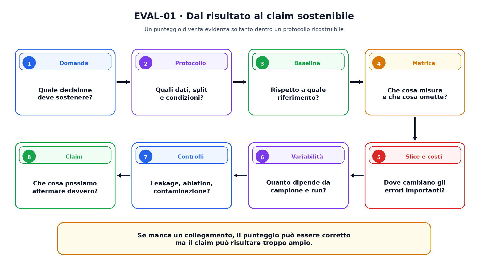
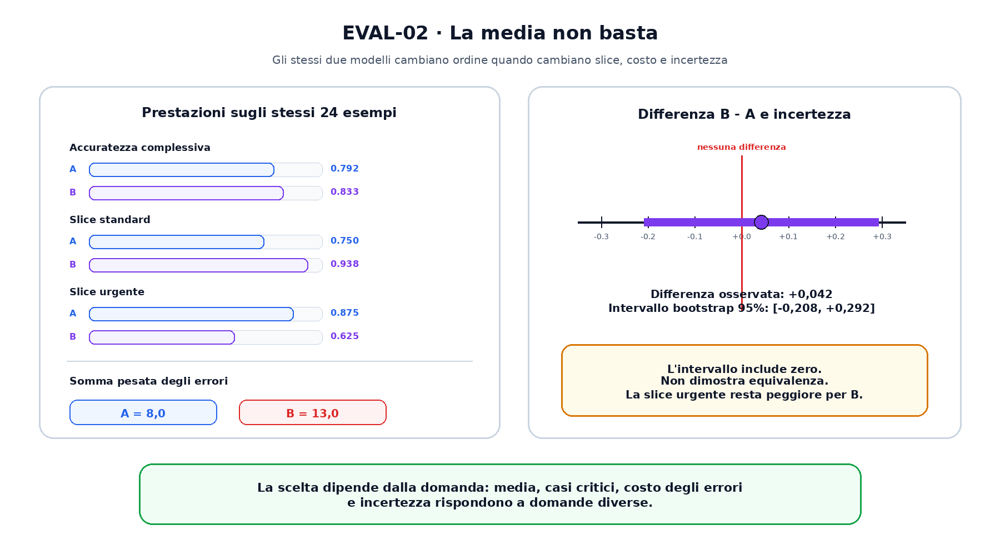

<!--
chapter_id: CH-P01-CRITICAL-EVALUATION
part_id: P01
order_key: 040
title: Come valutare criticamente un risultato di AI
maturity: CORE
status: testo e codice completi, visuali in revisione
version: 0.1.0-draft1
opened: 2026-07-31
last_web_research: 2026-07-31
last_source_check: 2026-07-31
environment: Python 3.13.5, standard library
deferred: inferenza statistica avanzata, causal inference, fairness evaluation, safety benchmark e valutazione agentica
-->

# Capitolo 4. Come valutare criticamente un risultato di AI

Immaginiamo di avere due classificatori per le richieste di assistenza. Entrambi ricevono messaggi come «Il pacco non è arrivato» e decidono se aprire un ticket. Sullo stesso insieme di 24 esempi, il modello A raggiunge un'accuratezza del `79,2%`, mentre il modello B raggiunge l'`83,3%`.

La tentazione è concludere subito che B sia migliore. La differenza esiste, ma il numero da solo non ci dice ancora se sia stabile, utile o pertinente al problema reale. Potrebbe dipendere da pochi esempi, da una particolare suddivisione dei dati, da una scelta fatta osservando ripetutamente il test set o da casi facili che compensano errori gravi. Potrebbe perfino essere corretta sul benchmark e irrilevante nel sistema distribuito.

Valutare criticamente un risultato significa ricostruire il percorso che collega la domanda iniziale al claim finale. Dobbiamo sapere che cosa è stato misurato, su quali dati, rispetto a quale baseline, con quale variabilità e entro quali confini. Solo allora un punteggio può diventare evidenza.

## Un numero non è ancora una conclusione

Una metrica risponde sempre a una domanda precisa, anche quando la domanda non viene dichiarata. L'accuratezza, per esempio, misura la frazione di predizioni corrette secondo le label disponibili. Non misura automaticamente il costo degli errori, la robustezza a input nuovi, la latenza, l'affidabilità delle fonti o la sicurezza delle azioni eseguite dal sistema.

Nel nostro esempio, dire che B ha accuratezza maggiore significa soltanto che ha classificato correttamente un esempio in più su 24. Per trasformare questa osservazione nel claim «B è preferibile ad A» dobbiamo aggiungere condizioni. I due modelli devono essere stati confrontati sugli stessi casi. Le label devono rappresentare il comportamento desiderato. Il campione deve essere pertinente agli utenti e al periodo di interesse. Le differenze più importanti non devono essere nascoste dalla media.

Il NIST AI Risk Management Framework collega la misurazione al contesto, alle persone coinvolte e ai rischi del sistema. Non propone una metrica universale, perché la stessa cifra può avere significati diversi in casi d'uso diversi [NIST AI RMF 1.0, 2023]. Un classificatore usato per suggerire una categoria a un operatore e lo stesso classificatore usato per autorizzare automaticamente un rimborso richiedono controlli differenti, anche se il checkpoint è identico.

La figura seguente riassume il percorso che conduce da un risultato osservato a un claim sostenibile. Ogni passaggio restringe ciò che possiamo affermare. Saltarne uno non rende necessariamente falso il punteggio, ma rende più fragile la conclusione costruita su di esso.



## La domanda viene prima della metrica

Prima di eseguire un benchmark conviene scrivere quale decisione dovrà sostenere. Vogliamo scegliere il modello con meno errori medi? Ridurre i falsi negativi nei casi urgenti? Mantenere la latenza sotto una soglia? Verificare se una nuova componente migliora il sistema senza aumentarne troppo il costo?

Questa domanda determina il protocollo. Se l'obiettivo è riconoscere richieste future, gli esempi di test devono rappresentare condizioni che il modello non ha usato per apprendere o per scegliere la configurazione. Il training set aggiorna i parametri. Il validation set aiuta a scegliere iperparametri, soglie e varianti. Il test set viene consultato dopo tali scelte per stimare il risultato del protocollo dichiarato.

Usare il test set per scegliere il prompt, il learning rate o la versione del modello riduce la sua indipendenza. Il file continua a chiamarsi `test`, ma svolge ormai una parte del lavoro della validation. Questo non rende inutili tutti i risultati precedenti, però cambia ciò che il numero può sostenere.

Anche la costruzione degli split deve rispettare il problema. Se conversazioni quasi duplicate dello stesso cliente compaiono nel training e nel test, il modello può sembrare più capace di quanto sia su utenti nuovi. Se il sistema dovrà lavorare nel futuro, una divisione temporale può essere più informativa di una divisione casuale. La separazione corretta non dipende da una percentuale fissa, ma dall'informazione che sarà realmente disponibile al momento della previsione.

## La baseline dà significato al miglioramento

Un risultato diventa più leggibile quando viene confrontato con una soluzione di riferimento. La baseline non deve essere sofisticata. Deve essere abbastanza semplice da chiarire quale difficoltà è stata superata.

Per le richieste di consegna potremmo usare una regola basata su parole chiave, la classe più frequente o il sistema già in produzione. Se il nuovo modello raggiunge l'`83%` ma la classe più frequente raggiunge l'`82%`, il guadagno ha un significato diverso rispetto a un caso in cui la baseline si ferma al `55%`.

Il confronto deve inoltre essere abbastanza equo da rispondere alla domanda dichiarata. Se B usa più dati, più calcolo e un retrieval esterno, mentre A è un piccolo classificatore isolato, la frase «B ha un'architettura migliore» sarebbe troppo ampia. L'esperimento dimostrerebbe piuttosto che l'intera pipeline B, con quelle risorse, ottiene un certo risultato rispetto alla pipeline A.

Questo principio è importante anche per i modelli generativi. Cambiare contemporaneamente modello, prompt, temperatura, numero di campioni e metodo di verifica può migliorare il risultato complessivo, ma non permette di attribuire il guadagno a una sola componente.

## La media può nascondere il caso che conta

Torniamo ai 24 esempi. Sedici sono richieste standard; otto sono richieste urgenti, per le quali mancare il ticket ha conseguenze maggiori. L'accuratezza complessiva favorisce B:

| Lettura | Modello A | Modello B |
|---|---:|---:|
| accuratezza complessiva | `0,792` | `0,833` |
| accuratezza standard | `0,750` | `0,938` |
| accuratezza urgente | `0,875` | `0,625` |
| somma pesata degli errori | `8,0` | `13,0` |

B ottiene un risultato medio migliore perché commette meno errori nei casi standard. A riconosce però sette casi urgenti su otto, mentre B ne riconosce cinque. Se assegniamo un peso illustrativo pari a `4` agli errori urgenti e `1` agli altri, A ha un costo complessivo inferiore.

I pesi non provengono da un processo aziendale reale. Servono a mostrare un principio: la metrica aggregata e la decisione operativa non sono la stessa cosa. Il costo di un falso positivo può differire da quello di un falso negativo; una slice rara può essere più importante della maggioranza dei casi; una variazione piccola nella media può nascondere una variazione grande in un gruppo specifico.

Una **slice** è un sottoinsieme definito da una proprietà rilevante, per esempio lingua, lunghezza del testo, tipo di ordine o livello di urgenza. Esaminare le slice non significa cercare all'infinito il gruppo in cui il modello appare peggiore. Significa dichiarare prima o motivare dopo quali condizioni sono importanti per l'uso previsto e quanti esempi sostengono la stima.



## Ogni risultato ha una variabilità

Due esecuzioni della stessa pipeline possono produrre risultati differenti. Possono cambiare l'inizializzazione dei parametri, l'ordine dei batch, il campionamento dei dati, l'augmentazione o la ricerca degli iperparametri. Bouthillier e colleghi mostrano che queste fonti di variazione possono incidere sensibilmente sui benchmark e sulle conclusioni dei confronti [Bouthillier et al., 2021].

Per questo un singolo run non descrive sempre la pipeline. Quando il training è stocastico, è utile registrare più esecuzioni e riportare una distribuzione, una media con dispersione o un intervallo. Il numero di run adeguato dipende dal costo e dalla variabilità osservata; non esiste una cifra universale che renda automaticamente affidabile ogni esperimento.

Nel nostro piccolo esempio i modelli non vengono riaddestrati. Possediamo due predizioni per ciascuno dei 24 casi. Possiamo quindi ricampionare gli esempi mantenendo accoppiate le predizioni di A e B. Il **bootstrap appaiato** estrae con ripetizione gli indici dei casi, ricalcola la differenza di accuratezza e ripete il procedimento molte volte.

Il codice completo è in `code/snip_eval_001_paired_comparison.py`. Le funzioni centrali sono:

```python
def accuracy(rows, model):
    return sum(value(row, model) == row.label for row in rows) / len(rows)


def paired_bootstrap_difference(rows, samples=10_000, seed=7):
    rng = Random(seed)
    differences = []

    for _ in range(samples):
        indices = [rng.randrange(len(rows)) for _ in rows]
        sample = tuple(rows[index] for index in indices)
        differences.append(
            accuracy(sample, "B") - accuracy(sample, "A")
        )

    differences.sort()
    observed = accuracy(rows, "B") - accuracy(rows, "A")
    lower = differences[int(0.025 * (samples - 1))]
    upper = differences[int(0.975 * (samples - 1))]
    return observed, lower, upper
```

Nel run registrato, la differenza osservata `B - A` è `0,042`. L'intervallo percentile illustrativo al 95% è `[-0,208, 0,292]`, quindi include zero.

Questo risultato non dimostra che A e B siano equivalenti. Dice qualcosa di più limitato: con questi 24 casi e con questo semplice metodo di ricampionamento, la differenza osservata è compatibile con variazioni in entrambe le direzioni. Un campione più ampio, una metrica diversa o un protocollo diverso potrebbero produrre una conclusione differente.

Anche la significatività statistica non coincide con l'utilità pratica. Con milioni di esempi, una differenza minuscola può essere stimata con grande precisione e restare irrilevante per gli utenti. Al contrario, una differenza potenzialmente importante può essere troppo incerta in un campione piccolo. Per leggere bene un risultato servono entrambe le domande: quanto è grande l'effetto e quanto è incerta la stima?

## Quando il test set smette di essere un arbitro indipendente

Una valutazione può essere ottimistica anche senza errori nel calcolo della metrica. Il problema può trovarsi nella relazione tra dati, sviluppo e test.

Il **leakage** si verifica quando la pipeline usa informazione sul target che non sarebbe legittimamente disponibile al momento della previsione [Kaufman et al., 2012]. Un campo compilato dopo la risoluzione del ticket, per esempio, potrebbe rendere facile predire l'esito ma non essere disponibile quando il sistema deve decidere.

Il test set può inoltre influenzare indirettamente lo sviluppo. Un benchmark pubblico consultato per anni può orientare architetture, scelte e procedure. Recht e colleghi costruirono nuovi test set per CIFAR-10 e ImageNet e osservarono cali di accuratezza rispetto ai test originali, pur trovando che i miglioramenti relativi tendevano a trasferirsi [Recht et al., 2019]. Il loro risultato non dimostra che ogni benchmark molto usato sia inutilizzabile. Mostra che la prestazione sul test storico e quella su nuovi dati non sono necessariamente identiche.

Anche le label del benchmark possono contenere errori. Northcutt, Athalye e Mueller identificarono e validarono errori in diversi test set molto usati e mostrarono che la correzione poteva modificare il confronto tra modelli [Northcutt et al., 2021]. Non possiamo trasferire le loro percentuali a qualunque dataset, ma dobbiamo ricordare che il test set è un artefatto costruito, non una verità priva di errori.

Nei grandi modelli linguistici compare un problema aggiuntivo. Se gli esempi di benchmark, o varianti molto vicine, sono presenti nei dati di pretraining, il punteggio può riflettere in parte memorizzazione o familiarità. Oren e colleghi propongono un test per rilevare alcune forme di contaminazione in modelli black-box attraverso la probabilità dell'ordine canonico degli esempi [Oren et al., 2024]. Il metodo ha ipotesi e un perimetro specifico; non trasforma la contaminazione in una proprietà sempre osservabile con un unico controllo.

Una strategia utile consiste nel combinare più difese: deduplicazione quando i dati sono disponibili, benchmark successivi al cutoff, set privati o dinamici, varianti controllate, analisi degli errori e descrizione trasparente dei limiti. Nessuna singola difesa rende perfetta la valutazione.

## Un buon punteggio può dipendere dalla ragione sbagliata

Un modello può avere imparato una regolarità che funziona nel benchmark ma non rappresenta il comportamento desiderato. Geirhos e colleghi chiamano **shortcut learning** l'uso di regole decisionali che funzionano nelle condizioni standard e falliscono in condizioni più impegnative [Geirhos et al., 2020].

Nel nostro caso, un classificatore potrebbe associare la parola `urgente` all'apertura di un ticket senza comprendere altri segnali. Sul test storico la scorciatoia potrebbe essere efficace. Se gli utenti cambiano formulazione, il risultato può crollare.

Per indagare il motivo di un miglioramento si usano controlli e **ablation**. Una ablation rimuove o sostituisce una componente mantenendo il resto del protocollo il più stabile possibile. Se un sistema con retrieval supera quello senza retrieval, il confronto restringe il contributo attribuibile alla presenza di quella componente. Non dimostra però automaticamente che ogni documento recuperato sia corretto o che lo stesso guadagno si mantenga in un altro dominio.

Un claim causale richiede attenzione alle differenze introdotte insieme alla modifica. Se cambiano contemporaneamente dati, numero di parametri, budget di calcolo e procedura di tuning, non possiamo attribuire il risultato a una sola scelta. L'ablation è utile proprio perché riduce il numero di spiegazioni compatibili, ma una singola ablation raramente esaurisce tutte le alternative.

## Rendere il risultato riproducibile e controllabile

Un lettore non può verificare un punteggio se conosce soltanto il valore finale. Servono almeno la definizione della metrica, i dati e gli split, le configurazioni, il numero di run, il criterio con cui sono stati scelti gli iperparametri, l'ambiente e il codice necessario a ricostruire il risultato.

Il programma di riproducibilità NeurIPS descritto da Pineau e colleghi combina checklist, rilascio del codice e repliche comunitarie per migliorare trasparenza e workflow sperimentali [Pineau et al., 2021]. La checklist corrente di NeurIPS chiede, tra le altre cose, dettagli sugli split, sui run, sugli error bar, sulle risorse e sulle istruzioni di riproduzione. Rispondere a una checklist non rende vero un claim, ma rende più visibili le informazioni mancanti.

Una model card può aggiungere uso previsto, gruppi valutati, metriche, condizioni e limiti [Mitchell et al., 2019]. Anche in questo caso il documento non certifica la qualità. Permette a chi legge di capire che cosa è stato provato e che cosa rimane fuori dal perimetro.

Per il confronto tra A e B, una descrizione minima dovrebbe quindi includere:

- i 24 esempi o il modo in cui sono stati costruiti;
- le label e il criterio con cui sono state assegnate;
- le predizioni di entrambi i modelli sugli stessi casi;
- la definizione delle slice;
- la motivazione dei pesi degli errori;
- il metodo di ricampionamento, il seed e il numero di resample;
- il fatto che il dataset è illustrativo e non rappresenta una distribuzione reale.

Questi dettagli non sono un'aggiunta burocratica. Definiscono il significato del risultato.

## Riepilogo

Siamo partiti da una differenza semplice: B raggiunge `0,833`, A raggiunge `0,792`. Il confronto complessivo favorisce B, ma la slice urgente e il costo pesato favoriscono A. Il bootstrap appaiato mostra inoltre che il piccolo campione non restringe la differenza a una sola direzione.

La lezione non è che l'accuratezza sia inutile o che ogni benchmark sia inaffidabile. La lezione è che una metrica misura soltanto ciò che il protocollo le permette di misurare. Domanda, baseline, dati, split, slice, variabilità, leakage, contaminazione e riproducibilità determinano il confine del claim.

Un risultato di AI diventa convincente quando un'altra persona può ricostruire il confronto, capire quali alternative sono state escluse e vedere dove l'evidenza termina. La qualità della valutazione non dipende dal numero di cifre decimali, ma dalla corrispondenza tra domanda, esperimento e conclusione.

### Verifica della comprensione

1. Perché `83,3%` contro `79,2%` non basta a scegliere automaticamente il modello B?
2. Quale ruolo distingue il validation set dal test set?
3. Come può una media migliore convivere con un costo operativo peggiore?
4. Perché un intervallo che include zero non dimostra equivalenza?
5. Qual è la differenza tra leakage, riuso adattivo del test set e contaminazione di pretraining?
6. Che cosa può sostenere una ablation e quale claim resta fuori dal suo perimetro?

### Esercizi

1. Modifica i pesi degli errori nello snippet e trova il valore a partire dal quale B torna preferibile anche nel costo pesato.
2. Aggiungi una slice `lingua_non_italiana` e verifica quanto cambia la lettura del confronto.
3. Riduci il numero di esempi e osserva come cambia l'intervallo bootstrap.
4. Costruisci un esempio di leakage per un sistema che prevede l'annullamento di un ordine.
5. Progetta una ablation per distinguere il contributo del modello da quello del retrieval.
6. Scrivi il claim più forte che i dati dello snippet consentono e un claim più ampio che non consentono.

## Fonti e materiali verificabili

Le fonti portanti comprendono NIST AI RMF 1.0, il programma di riproducibilità NeurIPS, i lavori su variabilità dei benchmark, test statistici, leakage, nuovi test set, errori nelle label, shortcut learning, contaminazione dei LLM e model card.

Le schede complete e i limiti d'uso sono in [`FONTI_PRIMARIE.md`](FONTI_PRIMARIE.md). Claim, codice eseguito, output, ambiente e test sono raccolti nei file del capitolo e nella cartella [`code/`](code/).
