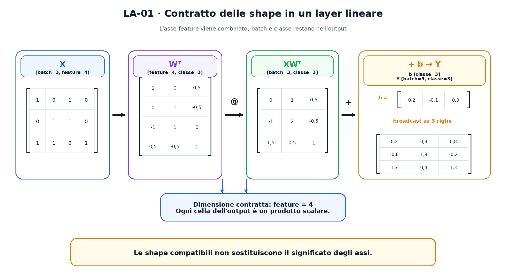
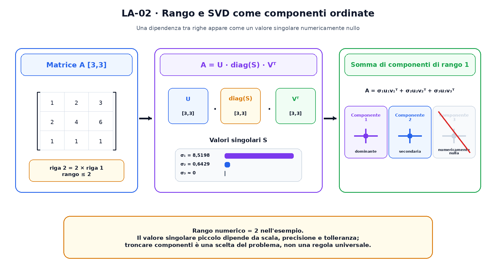

<!--
chapter_id: CH-P02-LINEAR-ALGEBRA
part_id: P02
order_key: 050
title: Algebra lineare, vettori e tensori
maturity: CORE
status: candidatura completa in revisione autoriale
version: 0.2.0-rc1
opened: 2026-07-31
last_web_research: 2026-07-31
last_source_check: 2026-07-31
environment: Python 3.13.5, PyTorch 2.10.0+cpu
deferred: derivate, probabilità, condizionamento, stabilità numerica, decomposizioni avanzate e algebra multilineare specializzata
-->

# Capitolo 5. Algebra lineare, vettori e tensori

Un modello non riceve direttamente la frase «Il pacco non è arrivato». Prima di poter eseguire operazioni, deve lavorare con numeri. Immaginiamo quindi una rappresentazione molto semplice: per ogni richiesta registriamo quattro quantità, per esempio la presenza di parole legate alla consegna, la presenza di una negazione, un'indicazione di urgenza e la disponibilità del numero d'ordine.

Una richiesta può essere rappresentata dal vettore

$$
[1,0,1,0].
$$

I quattro numeri non possiedono un significato universale. Lo ricevono dalla convenzione con cui abbiamo costruito i dati. Se cambiamo l'ordine delle caratteristiche senza cambiare il modello, cambiamo il significato dell'input anche se la shape resta identica.

L'algebra lineare ci permette di organizzare queste quantità, combinarle e trasformarle in modo controllabile. È il linguaggio con cui descriviamo layer neurali, embedding, attention, convoluzioni, decomposizioni e gran parte dell'ottimizzazione. Per usarlo bene non basta ricordare una formula. Dobbiamo sapere che cosa rappresenta ogni asse, quali dimensioni vengono combinate e quali restano nell'output.

## Da un numero a un tensore

Uno **scalare** è una singola quantità, come il learning rate `0,1` o una loss pari a `0,42`. Un **vettore** è una sequenza ordinata di scalari. La nostra richiesta ha quattro componenti e quindi vive, secondo la convenzione adottata, in uno spazio a quattro dimensioni.

Se raccogliamo tre richieste, possiamo disporle nelle righe di una matrice:

$$
X=
\begin{bmatrix}
1&0&1&0\\
0&1&1&0\\
1&1&0&1
\end{bmatrix}.
$$

La shape di `X` è `[3,4]`. Nel nostro esempio il primo asse indica il numero di richieste, cioè il **batch**, e il secondo indica le quattro **feature**. Scriveremo quindi anche

$$
X[\text{batch},\text{feature}].
$$

La shape descrive quanto è lungo ciascun asse. Il nome dell'asse descrive che cosa rappresenta. Due matrici possono avere shape `[3,4]` e significati completamente diversi. Una potrebbe contenere tre richieste con quattro feature, un'altra tre classi con quattro pesi per classe.

Un **tensore**, nel significato usato dalle librerie di deep learning, generalizza questa organizzazione a un numero arbitrario di assi. Un batch di 32 immagini RGB da 224 per 224 pixel può avere shape

```text
[32, 3, 224, 224]
```

se gli assi sono ordinati come batch, canale, altezza e larghezza. Una sequenza di embedding può avere shape

```text
[batch, token, dimensione]
```

Un insieme di matrici di attention può aggiungere un asse per le head. Il termine `tensore` non elimina il significato dei vettori e delle matrici. Li include come casi con uno o due assi.

## Le operazioni elemento per elemento

Due vettori della stessa dimensione possono essere sommati componente per componente:

$$
[1,0,1,0]+[0,1,1,0]=[1,1,2,0].
$$

Possiamo inoltre moltiplicare ogni componente per uno scalare:

$$
2[1,0,1,0]=[2,0,2,0].
$$

Queste operazioni non mescolano le posizioni. Il primo valore dell'output dipende dal primo valore dell'input, il secondo dal secondo e così via. Per questo vengono chiamate operazioni **elemento per elemento**.

La moltiplicazione elemento per elemento tra due vettori si scrive spesso con il simbolo $\odot$:

$$
[1,0,1,0]\odot[2,3,-1,4]=[2,0,-1,0].
$$

Non va confusa con il prodotto scalare o con il prodotto matriciale. Le operazioni possono usare gli stessi numeri e produrre output con shape differenti.

Una **norma** riassume la grandezza di un vettore. La norma euclidea, o norma $L_2$, è

$$
\lVert x\rVert_2=\sqrt{\sum_i x_i^2}.
$$

Per $x=[1,0,1,0]$ vale $\sqrt{2}$. La distanza euclidea tra due vettori è la norma della loro differenza. Questa misura è utile quando le coordinate hanno scale e significati compatibili; non diventa automaticamente una misura di somiglianza semantica soltanto perché i vettori provengono da un modello.

## Il prodotto scalare confronta due vettori

Il **prodotto scalare** moltiplica le componenti corrispondenti e somma i risultati:

$$
x\cdot y=\sum_i x_i y_i.
$$

Con

$$
x=[1,0,1,0],\qquad y=[0,1,1,0],
$$

otteniamo

$$
x\cdot y=1\cdot0+0\cdot1+1\cdot1+0\cdot0=1.
$$

Il risultato è uno scalare. I due vettori devono avere la stessa lunghezza perché ogni componente di uno deve trovare la componente corrispondente dell'altro.

Il prodotto scalare può essere collegato all'angolo tra vettori:

$$
x\cdot y=\lVert x\rVert_2\lVert y\rVert_2\cos\theta.
$$

Se normalizziamo entrambi i vettori a norma uno, il prodotto scalare coincide con il coseno dell'angolo. Questa relazione è alla base della cosine similarity. Rimane però una proprietà geometrica della rappresentazione numerica. Per interpretarla come somiglianza tra testi, immagini o utenti dobbiamo sapere come quella rappresentazione è stata costruita e valutata.

Con più vettori, possiamo calcolare molti prodotti scalari in una sola operazione. La matrice

$$
XX^T
$$

contiene il prodotto scalare tra ogni coppia di righe di `X`. Nel nostro esempio:

$$
XX^T=
\begin{bmatrix}
2&1&1\\
1&2&1\\
1&1&3
\end{bmatrix}.
$$

La diagonale contiene il prodotto di ogni riga con sé stessa, quindi il quadrato della sua norma euclidea. La matrice è simmetrica perché $x_i\cdot x_j=x_j\cdot x_i$.

## Una matrice rappresenta molte combinazioni insieme

Consideriamo tre classi possibili. A ciascuna associamo una riga di quattro pesi:

$$
W=
\begin{bmatrix}
1&0&-1&0{,}5\\
0&1&1&-0{,}5\\
0{,}5&-0{,}5&0&1
\end{bmatrix}.
$$

`W` ha shape `[3,4]`: tre classi e quattro feature per classe. Per una singola richiesta $x[4]$, il prodotto

$$
Wx
$$

produce tre punteggi, uno per riga di `W`. Ogni punteggio è un prodotto scalare tra l'input e i pesi della classe corrispondente.

Quando gli esempi sono nelle righe di `X[3,4]`, usiamo

$$
XW^T.
$$

La trasposta $W^T$ scambia i due assi di `W`, portando la shape da `[3,4]` a `[4,3]`. I valori non vengono trasformati da una nuova funzione; cambiano le coppie di indici con cui li leggiamo.

Le shape rendono visibile la compatibilità:

```text
X      [3,4]
W.T    [4,3]
              asse 4 contratto
output [3,3]
```

La dimensione interna, pari a `4`, deve coincidere. Per ogni coppia esempio-classe vengono moltiplicate e sommate le quattro feature. Restano nell'output il numero di esempi e il numero di classi.

In generale, se

$$
A\in\mathbb{R}^{m\times n},\qquad
B\in\mathbb{R}^{n\times p},
$$

allora

$$
AB\in\mathbb{R}^{m\times p}.
$$

L'elemento in posizione $(i,j)$ è

$$
(AB)_{ij}=\sum_{k=1}^{n}A_{ik}B_{kj}.
$$

L'indice $k$ compare in entrambi i fattori e viene sommato. Possiamo pensarlo come l'asse contratto. Gli indici $i$ e $j$ restano nell'output.



## Dal lineare all'affine

Una trasformazione lineare preserva somme e moltiplicazioni per scalari:

$$
T(x+y)=T(x)+T(y),
$$

$$
T(\alpha x)=\alpha T(x).
$$

Una matrice rappresenta una trasformazione lineare una volta scelte le basi degli spazi di input e output. Il layer usato comunemente nelle reti neurali aggiunge però un vettore di bias:

$$
y=Wx+b.
$$

Questa è una trasformazione **affine**. Il bias permette di spostare l'output anche quando l'input è zero. Nel linguaggio quotidiano delle librerie viene comunque chiamato spesso `Linear`, come in `torch.nn.Linear`, ma la presenza del bias rende l'operazione matematicamente affine.

Per il batch completo scriviamo

$$
Y=XW^T+b.
$$

Nel nostro esempio `XW^T` ha shape `[3,3]`, mentre `b` ha shape `[3]`. PyTorch applica il bias a ogni riga attraverso il **broadcasting**. La dimensione finale coincide, quindi il vettore di tre bias viene trattato logicamente come se fosse disponibile per ciascuno dei tre esempi.

Il broadcasting confronta le dimensioni a partire da destra. Due dimensioni sono compatibili quando sono uguali, una delle due è `1` oppure una non esiste. Questo meccanismo evita di scrivere copie esplicite in molti calcoli, ma non autorizza combinazioni prive di significato. Una shape compatibile non garantisce che stiamo sommando gli assi corretti.

Il risultato eseguito è

$$
Y=
\begin{bmatrix}
0{,}2&0{,}9&0{,}8\\
-0{,}8&1{,}9&-0{,}2\\
1{,}7&0{,}4&1{,}3
\end{bmatrix}.
$$

Ogni riga appartiene a una richiesta. Ogni colonna appartiene a una classe. Se invertissimo per errore questi significati, potremmo applicare una softmax o scegliere un massimo lungo l'asse sbagliato pur mantenendo un programma sintatticamente valido.

## Il batch aggiunge assi, non cambia la regola di base

Finora `X` contiene un solo batch. In applicazioni più complesse possono comparire altri assi:

```text
[batch, token, dimensione]
[batch, head, token, dimensione]
[batch, canale, altezza, larghezza]
```

Il prodotto matriciale opera sugli ultimi assi secondo le regole documentate e può broadcastare gli assi precedenti quando sono compatibili. Per esempio:

```text
A [batch, m, n]
B [batch, n, p]
-> [batch, m, p]
```

Ogni elemento del batch riceve il proprio prodotto tra matrici. Se `B` ha shape `[1,n,p]`, la dimensione batch pari a uno può essere broadcastata sugli elementi di `A`.

Questa flessibilità è utile, ma rende importante nominare gli assi. Il numero `32` può indicare batch, token, head o feature. Guardare soltanto la tupla della shape non basta per ricostruire l'operazione.

La notazione di Einstein rende espliciti gli assi contratti. Il prodotto del layer può essere scritto concettualmente come

```text
bf,cf -> bc
```

Dove `b` è il batch, `f` la feature e `c` la classe. L'indice `f` compare negli input e scompare nell'output perché viene sommato. PyTorch offre `torch.einsum` per esprimere contrazioni di questo tipo, ma il prodotto `@` resta più leggibile nel caso matriciale ordinario.

## Combinazioni lineari, span e basi

Una combinazione lineare di vettori $v_1,\dots,v_k$ ha la forma

$$
\alpha_1v_1+\cdots+\alpha_kv_k.
$$

L'insieme di tutte le combinazioni possibili si chiama **span**. Se le colonne di una matrice sono $v_1,\dots,v_k$, il prodotto matrice-vettore

$$
A\alpha
$$

costruisce precisamente una combinazione delle colonne di `A`, usando le componenti di $\alpha$ come coefficienti.

Questa lettura cambia il modo in cui interpretiamo un layer. Una matrice non è soltanto una tabella di numeri. Le sue colonne descrivono le direzioni che possono contribuire all'output, mentre il vettore in ingresso sceglie i coefficienti della combinazione.

Un insieme di vettori è **linearmente indipendente** quando nessun vettore può essere scritto come combinazione degli altri. In forma equivalente, l'unica soluzione di

$$
\alpha_1v_1+\cdots+\alpha_kv_k=0
$$

è quella con tutti i coefficienti uguali a zero.

Una **base** è un insieme indipendente che genera lo spazio considerato. Le coordinate di un vettore dipendono dalla base, mentre il vettore astratto può essere pensato come lo stesso oggetto geometrico. Nei modelli neurali, le coordinate apprese non possiedono in genere una interpretazione semplice una per una; spesso è la struttura dello spazio e delle trasformazioni a essere importante.

## Il rango misura quante direzioni indipendenti restano

Consideriamo

$$
A=
\begin{bmatrix}
1&2&3\\
2&4&6\\
1&1&1
\end{bmatrix}.
$$

La seconda riga è il doppio della prima. Non introduce quindi una nuova direzione indipendente. La matrice ha rango due.

Il **rango** è la dimensione dello spazio generato dalle colonne, e coincide con la dimensione dello spazio generato dalle righe. Se una matrice `m × n` ha rango `r`, possiede `r` direzioni indipendenti rilevanti per la trasformazione lineare.

In matematica esatta, una dipendenza è nulla oppure non lo è. Nei calcoli in virgola mobile incontriamo valori molto piccoli ma non esattamente zero. Le librerie usano quindi tolleranze per stimare il **rango numerico**. Cambiare precisione, scala o tolleranza può cambiare la classificazione di un valore singolare vicino allo zero.

Il rango compare in numerosi contesti del machine learning. Un layer a rango ridotto usa meno direzioni indipendenti rispetto alla matrice piena. Alcuni metodi di adattamento rappresentano un aggiornamento come prodotto di due matrici sottili. Le rappresentazioni possono concentrarsi vicino a sottospazi di dimensione inferiore. Questi usi verranno studiati nei capitoli pertinenti; qui ci interessa il contratto matematico comune.

## La SVD separa direzioni e intensità

La **singular value decomposition**, o SVD, scrive una matrice reale nella forma

$$
A=U\operatorname{diag}(S)V^T.
$$

Nella versione ridotta, se $A$ ha shape `[m,n]` e $k=\min(m,n)$:

- `U` ha shape `[m,k]`;
- `S` contiene `k` valori singolari non negativi;
- `V^T` ha shape `[k,n]`.

Le colonne di `U` e `V` sono ortonormali. I valori singolari vengono ordinati dal più grande al più piccolo. Possiamo leggere la trasformazione in tre passaggi: `V^T` esprime l'input lungo direzioni ortogonali, `S` ridimensiona ciascuna direzione e `U` ricompone il risultato nello spazio di output.

Per la matrice di rango due dell'esempio, PyTorch restituisce valori singolari approssimativamente uguali a

$$
[8{,}5198,\ 0{,}6429,\ 7{,}5\times10^{-16}].
$$

L'ultimo valore è numericamente compatibile con zero nella precisione usata. La matrice contiene quindi due componenti indipendenti rilevanti.

La SVD può essere riscritta come somma di matrici di rango uno:

$$
A=\sum_{i=1}^{k}\sigma_i u_i v_i^T.
$$

Ogni termine è costruito da un vettore colonna $u_i$, un valore singolare $\sigma_i$ e un vettore riga $v_i^T$. Se conserviamo soltanto i primi `r` termini, otteniamo una matrice di rango al massimo `r`.



Una approssimazione a rango ridotto può comprimere una matrice o isolare le direzioni dominanti. Questo non significa che le componenti piccole siano sempre rumore. Il loro valore dipende dal problema, dalla scala e dalla quantità che vogliamo preservare.

## Dalla formula a PyTorch

Lo snippet seguente riproduce il layer affine, la matrice di Gram e la SVD:

```python
import torch

x = torch.tensor(
    [
        [1.0, 0.0, 1.0, 0.0],
        [0.0, 1.0, 1.0, 0.0],
        [1.0, 1.0, 0.0, 1.0],
    ],
    dtype=torch.float64,
)

weight = torch.tensor(
    [
        [1.0, 0.0, -1.0, 0.5],
        [0.0, 1.0, 1.0, -0.5],
        [0.5, -0.5, 0.0, 1.0],
    ],
    dtype=torch.float64,
)

bias = torch.tensor([0.2, -0.1, 0.3], dtype=torch.float64)

scores = x @ weight.transpose(0, 1) + bias
gram = x @ x.transpose(0, 1)

matrix = torch.tensor(
    [[1.0, 2.0, 3.0],
     [2.0, 4.0, 6.0],
     [1.0, 1.0, 1.0]],
    dtype=torch.float64,
)

u, singular_values, vh = torch.linalg.svd(
    matrix,
    full_matrices=False,
)
reconstruction = (u * singular_values) @ vh
rank = torch.linalg.matrix_rank(matrix)
```

Nel run registrato, gli score hanno shape `[3,3]`, il rango numerico è `2` e l'errore massimo della ricostruzione SVD completa è circa `3,553 × 10^-15`.

L'espressione `(u * singular_values)` usa broadcasting. `u` ha una colonna per valore singolare; il vettore `singular_values` viene applicato lungo l'ultimo asse e scala ciascuna colonna. La successiva moltiplicazione per `vh` ricostruisce la matrice.

## Shape, stride e memoria

La definizione matematica di un tensore non specifica come i valori siano disposti nella memoria del computer. In PyTorch, un tensore possiede anche uno **stride**, che indica di quanto bisogna avanzare nello storage per spostarsi di una posizione lungo ciascun asse.

Una trasposizione può restituire una **view** degli stessi dati con shape e stride differenti. I valori non vengono necessariamente copiati. Per questo un tensore trasposto può non essere contiguo nella disposizione attesa da alcune operazioni.

`view` richiede una disposizione compatibile con la nuova shape. `reshape` può restituire una view quando possibile oppure creare una copia. `contiguous()` materializza una disposizione contigua quando necessario. Queste regole riguardano l'implementazione e le prestazioni; non cambiano l'identità matematica delle operazioni spiegate finora.

È utile mantenere distinti tre livelli:

1. il significato dell'asse nel problema;
2. la shape richiesta dall'operazione;
3. il layout fisico con cui i dati sono memorizzati.

Molti errori nascono quando uno di questi livelli viene corretto soltanto per far eseguire il codice. Una `reshape` può eliminare un errore di shape e, nello stesso momento, mescolare batch, token o canali in un ordine privo di significato.

## Riepilogo

Siamo partiti da una richiesta descritta da quattro numeri. Tre richieste hanno formato la matrice `X[batch,feature]`. Una matrice di pesi `W[classe,feature]` ha trasformato il batch in `scores[batch,classe]` attraverso la contrazione dell'asse feature. Il bias è stato applicato a ogni riga tramite broadcasting.

Il prodotto scalare confronta vettori della stessa dimensione e restituisce uno scalare. Il prodotto matriciale organizza molti prodotti scalari e conserva soltanto gli assi non contratti. Le shape dicono quali dimensioni sono presenti; i nomi degli assi dicono che cosa significano.

Span, indipendenza e rango descrivono quante direzioni possono essere generate senza ridondanza. La SVD separa una matrice in direzioni ortogonali e valori singolari ordinati, rendendo visibili componenti dominanti e possibilità di approssimazione a rango ridotto.

Nel codice, shape e operazioni matematiche convivono con broadcasting, stride, view e contiguità. Questi dettagli implementativi sono importanti, ma vengono dopo il contratto semantico: quali assi entrano, quale asse viene combinato e quali assi devono uscire.

### Verifica della comprensione

1. Che differenza c'è tra shape `[3,4]` e significato `[batch,feature]`?
2. Perché `X[3,4] @ W.T[4,3]` produce `[3,3]`?
3. In quale passaggio l'asse feature scompare dall'output?
4. Perché il bias `[3]` può essere sommato a una matrice `[3,3]` nel nostro esempio?
5. Che cosa contiene la matrice `XX^T`?
6. Perché la matrice dell'esempio ha rango due?
7. Come si legge la SVD come somma di componenti di rango uno?
8. Perché una reshape sintatticamente valida può essere semanticamente sbagliata?

### Esercizi

1. Calcola a mano la prima riga di `XW^T+b`.
2. Scambia la seconda e la terza feature sia in `X` sia in `W` e verifica che gli score restino invariati. Poi scambiale soltanto in `X` e osserva la differenza.
3. Aggiungi un quarto esempio a `X` e determina la nuova shape degli score e della matrice di Gram.
4. Sostituisci `bias` con shape `[1,3]` e verifica che il risultato coincida. Prova una shape incompatibile e interpreta l'errore.
5. Scrivi il prodotto del layer con `torch.einsum` usando nomi concettuali per batch, feature e classe.
6. Ricostruisci la matrice usando soltanto i primi due valori singolari e confrontala con l'originale.
7. Costruisci una matrice di rango uno come prodotto esterno di due vettori.
8. Trasponi un tensore, controlla `stride()` e `is_contiguous()`, poi confronta `view`, `reshape` e `contiguous()`.

## Fonti e materiali verificabili

Le fonti portanti comprendono il Capitolo 2 di *Deep Learning*, i materiali di algebra lineare di Gilbert Strang, *Matrix Computations*, LAPACK e la documentazione ufficiale PyTorch per `matmul`, broadcasting, `torch.linalg`, SVD e tensor views.

Le schede complete e i limiti d'uso sono in [`FONTI_PRIMARIE.md`](FONTI_PRIMARIE.md). Claim, codice, output, ambiente e test sono raccolti nei file del capitolo e nella cartella [`code/`](code/).
