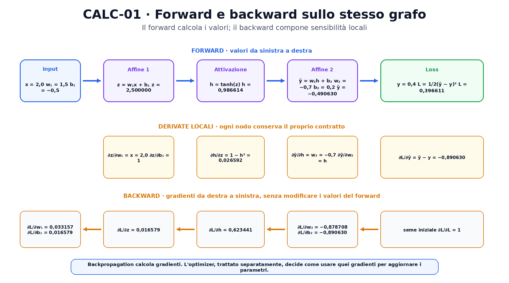
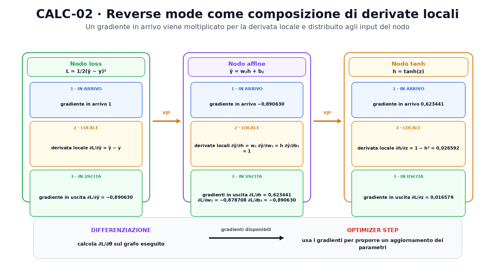

<!--
chapter_id: CH-P02-CALCULUS-BACKPROP
part_id: P02
order_key: 060
title: Calcolo differenziale e backpropagation
maturity: CORE
status: candidatura completa in revisione autoriale
version: 0.2.0-rc1
opened: 2026-07-31
last_web_research: 2026-07-31
last_source_check: 2026-07-31
environment: Python 3.13.5, PyTorch 2.10.0+cpu
deferred: ottimizzatori, Hessiane, metodi del secondo ordine, differenziazione implicita, checkpointing e sistemi distribuiti
-->

# Capitolo 6. Calcolo differenziale e backpropagation

Nel capitolo precedente abbiamo trasformato un batch di richieste con matrici e vettori. Sapevamo calcolare l'output di un layer, ma non ancora come attribuire un errore ai numeri che avevano contribuito a produrlo. È questo il problema che affrontiamo ora.

Il filo comune resta la richiesta «Il pacco non è arrivato»: qui la traduciamo in feature e target, poi seguiamo come una loss attribuisce il proprio cambiamento ai parametri della rete.

Consideriamo una rete minuscola, con un solo input e quattro parametri:

$$
z=w_1x+b_1,
$$

$$
h=\tanh(z),
$$

$$
\hat y=w_2h+b_2,
$$

$$
L=\frac{1}{2}(\hat y-y)^2.
$$

La rete riceve `x`, produce la previsione $\hat y$ e la confronta con il valore atteso $y$. Se la loss $L$ è alta, vorremmo sapere quale piccola modifica di $w_1$, $b_1$, $w_2$ o $b_2$ tenderebbe a farla aumentare o diminuire. Il calcolo differenziale fornisce questa informazione locale. La backpropagation la calcola in modo efficiente lungo le dipendenze del programma.

Useremo i valori

```text
x = 2,0
y = 0,4
w₁ = 1,5
b₁ = −0,5
w₂ = −0,7
b₂ = 0,2
```

L'esempio è volutamente scalare. In una rete reale gli oggetti sono vettori e tensori, ma la regola di composizione rimane la stessa. Prima seguiremo ogni passaggio a mano, poi collegheremo il calcolo a Jacobiane, reverse mode e autograd di PyTorch.

## La derivata descrive una sensibilità locale

Supponiamo che una funzione $f$ trasformi un numero $x$ in un numero $f(x)$. Per osservare quanto cambia l'output quando modifichiamo leggermente l'input, possiamo calcolare il rapporto

$$
\frac{f(x+\varepsilon)-f(x)}{\varepsilon}.
$$

Per un valore finito di $\varepsilon$ otteniamo una variazione media sul tratto considerato. La **derivata** è il limite di questo rapporto quando la perturbazione tende a zero:

$$
f'(x)=\lim_{\varepsilon\to 0}
\frac{f(x+\varepsilon)-f(x)}{\varepsilon}.
$$

La derivata è quindi una pendenza locale. Se $f'(x)=3$, una variazione molto piccola $\Delta x$ produce, al primo ordine, una variazione approssimata

$$
\Delta f\approx 3\,\Delta x.
$$

Questa è un'approssimazione locale, non una promessa valida per spostamenti arbitrariamente grandi. Una funzione può cambiare curvatura, attraversare un punto non differenziabile o entrare in una regione con pendenza molto diversa.

Per la funzione quadratica

$$
f(x)=x^2,
$$

la derivata è

$$
f'(x)=2x.
$$

Nel punto $x=2$ la pendenza vale `4`. Se aumentiamo l'input di `0,001`, il cambiamento previsto al primo ordine è circa `0,004`. Il valore esatto è

$$
(2{,}001)^2-2^2=0{,}004001.
$$

La piccola differenza tra `0,004` e `0,004001` deriva dai termini di ordine superiore che l'approssimazione lineare trascura.

## Più input richiedono derivate parziali e gradienti

Una loss dipende normalmente da molti parametri. Se

$$
L=L(w_1,b_1,w_2,b_2),
$$

possiamo chiedere come varia rispetto a un parametro mantenendo fissi gli altri. Otteniamo una **derivata parziale**:

$$
\frac{\partial L}{\partial w_1}.
$$

Il simbolo $\partial$ ricorda che la funzione ha più ingressi. Il **gradiente** raccoglie tutte le derivate parziali della funzione scalare:

$$
\nabla_\theta L=
\begin{bmatrix}
\frac{\partial L}{\partial w_1}\\
\frac{\partial L}{\partial b_1}\\
\frac{\partial L}{\partial w_2}\\
\frac{\partial L}{\partial b_2}
\end{bmatrix},
$$

con

$$
\theta=[w_1,b_1,w_2,b_2]^T.
$$

Il gradiente non modifica i parametri. Descrive la sensibilità locale della loss rispetto a ciascuna coordinata. Un optimizer può usare questa informazione per proporre un aggiornamento, ma la scelta dell'aggiornamento è un passaggio successivo e separato.

Il gradiente permette anche di descrivere una variazione lungo una direzione $v$. Per una piccola perturbazione $\Delta\theta=\varepsilon v$:

$$
L(\theta+\varepsilon v)-L(\theta)
\approx
\varepsilon\,\nabla_\theta L^T v.
$$

Il prodotto $\nabla_\theta L^T v$ è la **derivata direzionale**. Non misura una nuova funzione diversa dal gradiente. Chiede quanto varia la loss se tutti i parametri cambiano insieme secondo la direzione scelta.

Quando anche l'output è vettoriale, un solo gradiente non basta a raccogliere tutte le dipendenze. Se

$$
f:\mathbb{R}^n\to\mathbb{R}^m,
$$

la **Jacobiana** ha shape `[m,n]` e contiene

$$
J_{ij}=\frac{\partial f_i}{\partial x_j}.
$$

Nelle reti neurali la Jacobiana completa può essere enorme. I sistemi di differenziazione automatica evitano spesso di materializzarla, calcolando invece prodotti della Jacobiana con vettori.

## La regola della catena collega i passaggi

La nostra rete non calcola la loss in una sola operazione. Costruisce prima $z$, poi $h$, poi $\hat y$, infine $L$. Se una quantità dipende da un'altra attraverso una composizione, le sensibilità locali si moltiplicano.

Per due funzioni

$$
y=g(x),\qquad L=f(y),
$$

la regola della catena afferma

$$
\frac{dL}{dx}
=
\frac{dL}{dy}
\frac{dy}{dx}.
$$

Il fattore $dL/dy$ descrive quanto la loss è sensibile a $y$. Il fattore $dy/dx$ descrive quanto $y$ è sensibile a $x$. Il prodotto trasferisce la sensibilità fino a $x$.

Per una composizione più lunga,

$$
x\to z\to h\to \hat y\to L,
$$

otteniamo, per esempio,

$$
\frac{\partial L}{\partial z}
=
\frac{\partial L}{\partial \hat y}
\frac{\partial \hat y}{\partial h}
\frac{\partial h}{\partial z}.
$$

Questa formula non richiede di riscrivere la loss direttamente come una singola espressione gigantesca. Possiamo calcolare e riusare le derivate locali di ogni operazione.

Un **grafo computazionale** rende esplicite queste dipendenze. I nodi rappresentano valori o operazioni; gli archi indicano quali risultati vengono usati dai passaggi successivi. Durante il forward calcoliamo i valori. Durante il backward percorriamo le dipendenze in senso inverso e componiamo le sensibilità attraverso la regola della catena [Goodfellow et al., 2016; Baydin et al., 2018].

## Un forward e un backward completi

Eseguiamo prima il forward. Il primo nodo affine produce

$$
z=w_1x+b_1=1{,}5\cdot2-0{,}5=2{,}5.
$$

L'attivazione produce

$$
h=\tanh(2{,}5)=0{,}986614.
$$

Il secondo nodo affine calcola

$$
\hat y=w_2h+b_2
=-0{,}7\cdot0{,}986614+0{,}2
=-0{,}490630.
$$

L'errore rispetto al target è

$$
\hat y-y=-0{,}890630,
$$

quindi

$$
L=\frac{1}{2}(-0{,}890630)^2=0{,}396611.
$$

Ora partiamo dalla loss e procediamo all'indietro. Per costruzione,

$$
\frac{\partial L}{\partial L}=1.
$$

La derivata della loss quadratica rispetto alla previsione è

$$
\frac{\partial L}{\partial \hat y}=\hat y-y=-0{,}890630.
$$

Il secondo nodo affine è

$$
\hat y=w_2h+b_2.
$$

Le sue derivate locali sono

$$
\frac{\partial \hat y}{\partial w_2}=h,
\qquad
\frac{\partial \hat y}{\partial b_2}=1,
\qquad
\frac{\partial \hat y}{\partial h}=w_2.
$$

Moltiplicando per il gradiente in arrivo otteniamo

$$
\frac{\partial L}{\partial w_2}
=
\frac{\partial L}{\partial \hat y}
\frac{\partial \hat y}{\partial w_2}
=
-0{,}890630\cdot0{,}986614
=
-0{,}878708,
$$

$$
\frac{\partial L}{\partial b_2}=-0{,}890630,
$$

$$
\frac{\partial L}{\partial h}
=
-0{,}890630\cdot(-0{,}7)
=
0{,}623441.
$$

Per $h=\tanh(z)$ la derivata locale è

$$
\frac{\partial h}{\partial z}=1-h^2.
$$

Nel punto corrente vale

$$
1-0{,}986614^2=0{,}026592.
$$

Quindi

$$
\frac{\partial L}{\partial z}
=
\frac{\partial L}{\partial h}
\frac{\partial h}{\partial z}
=
0{,}623441\cdot0{,}026592
=
0{,}016579.
$$

Infine,

$$
z=w_1x+b_1,
$$

con

$$
\frac{\partial z}{\partial w_1}=x,
\qquad
\frac{\partial z}{\partial b_1}=1.
$$

Otteniamo

$$
\frac{\partial L}{\partial w_1}
=
0{,}016579\cdot2
=
0{,}033157,
$$

$$
\frac{\partial L}{\partial b_1}=0{,}016579.
$$



La figura separa tre informazioni. La fascia superiore contiene i valori del forward. La fascia centrale contiene le derivate locali delle singole operazioni. La fascia inferiore contiene i gradienti della loss rispetto ai parametri e agli intermedi. Il backward non riscrive i valori del forward; usa le dipendenze registrate per calcolare nuove quantità.

Un gradiente positivo non significa automaticamente che il parametro debba aumentare. Significa che, localmente, un piccolo aumento del parametro tende ad aumentare la loss. Un algoritmo di discesa del gradiente usa normalmente la direzione opposta, ma learning rate, momentum, adattamento della scala e vincoli appartengono all'optimizer, non alla backpropagation.

## Dal grafo scalare al reverse mode

Nel caso scalare, ogni passaggio del backward moltiplica numeri. Con vettori e tensori, la stessa idea usa Jacobiane e prodotti tra Jacobiane e vettori.

Supponiamo che un nodo calcoli

$$
y=f(x),
$$

con $x\in\mathbb{R}^n$ e $y\in\mathbb{R}^m$. Se dal resto del grafo arriva il gradiente

$$
\bar y=\frac{\partial L}{\partial y},
$$

il nodo restituisce

$$
\bar x
=
\frac{\partial L}{\partial x}
=
J_f(x)^T\bar y.
$$

Questa operazione è spesso chiamata **vector-Jacobian product**, o VJP, adottando la convenzione delle righe o delle colonne usata dall'API. Il punto essenziale è che non serve costruire tutta la Jacobiana. Il nodo combina il gradiente in arrivo con la propria derivata locale e produce i gradienti necessari ai suoi input.

Se un valore viene usato da più rami del grafo, i contributi si sommano. Per esempio, se

$$
L=L_1(x)+L_2(x),
$$

allora

$$
\frac{\partial L}{\partial x}
=
\frac{\partial L_1}{\partial x}
+
\frac{\partial L_2}{\partial x}.
$$

Questo accumulo non è un dettaglio di implementazione. Deriva dalla regola di somma e dalla struttura del grafo.

La **forward-mode automatic differentiation** propaga invece una perturbazione dall'input verso l'output, calcolando prodotti Jacobiana-vettore. È conveniente quando gli ingressi rispetto ai quali differenziare sono pochi e gli output sono molti. Il **reverse mode** propaga una sensibilità dagli output verso gli input. Per una loss scalare e milioni o miliardi di parametri, una singola traversata inversa produce le derivate rispetto a tutti i parametri coinvolti, con un costo legato al calcolo eseguito e alle operazioni locali [Griewank e Walther, 2008; Baydin et al., 2018].

La backpropagation è l'applicazione del reverse mode ai grafi delle reti neurali. Non coincide con l'intero training loop e non coincide con l'optimizer step. Calcola i gradienti; l'optimizer decide come usarli.



La figura segue tre nodi. Ognuno riceve un gradiente, applica la propria derivata locale e restituisce uno o più gradienti agli input. Nel nodo affine lo stesso gradiente in arrivo viene distribuito a $h$, $w_2$ e $b_2$ attraverso tre derivate locali diverse.

## Automatic differentiation non è differenziazione simbolica

Esistono almeno tre modi comuni per ottenere una derivata numerica.

Le **differenze finite** perturbano l'input e rivalutano la funzione. Una formula centrata è

$$
f'(x)\approx
\frac{f(x+\varepsilon)-f(x-\varepsilon)}{2\varepsilon}.
$$

È semplice e utile per controllare un gradiente, ma richiede valutazioni aggiuntive della funzione e dipende dalla scelta di $\varepsilon$. Un passo troppo grande aumenta l'errore di troncamento; un passo troppo piccolo può amplificare l'errore di arrotondamento.

La **differenziazione simbolica** manipola espressioni algebriche per produrre una nuova espressione. Può generare risultati leggibili, ma può duplicare sottotermini e non segue naturalmente tutto il controllo di flusso di un programma numerico arbitrario.

L'**automatic differentiation** esegue il programma usando operazioni elementari con regole di derivazione note. Registra o trasforma la composizione effettivamente eseguita e applica la regola della catena. Le derivate locali sono analitiche per le operazioni supportate; i valori restano soggetti all'aritmetica numerica del tipo di dato usato [Baydin et al., 2018].

Questa distinzione spiega perché autograd può seguire un grafo costruito dinamicamente. Il programma Python decide quali operazioni vengono eseguite nel forward; PyTorch registra le operazioni rilevanti e ricrea il grafo a ogni iterazione [PyTorch, Autograd mechanics].

## Autograd in PyTorch

In PyTorch, un tensore creato con `requires_grad=True` partecipa al tracciamento quando viene usato in operazioni registrabili. Gli output intermedi possiedono un riferimento `grad_fn` al nodo che li ha prodotti. Al termine del forward, `backward()` attraversa il grafo in reverse mode e applica la regola della catena [PyTorch 2.13, Autograd mechanics].

Il seguente estratto ripete l'esempio:

```python
import torch

x = torch.tensor(2.0, dtype=torch.float64)
target = torch.tensor(0.4, dtype=torch.float64)

w1 = torch.tensor(1.5, dtype=torch.float64, requires_grad=True)
b1 = torch.tensor(-0.5, dtype=torch.float64, requires_grad=True)
w2 = torch.tensor(-0.7, dtype=torch.float64, requires_grad=True)
b2 = torch.tensor(0.2, dtype=torch.float64, requires_grad=True)

z = w1 * x + b1
h = torch.tanh(z)
y_hat = w2 * h + b2
loss = 0.5 * (y_hat - target) ** 2

loss.backward()

print(w1.grad, b1.grad, w2.grad, b2.grad)
```

Il risultato coincide con il calcolo manuale:

```text
0.0331573691
0.0165786846
-0.8787083010
-0.8906300087
```

`w1`, `b1`, `w2` e `b2` sono **tensori foglia**, perché sono stati creati direttamente e non sono il risultato di un'operazione tracciata. `Tensor.backward()` accumula i gradienti nei campi `.grad` dei tensori foglia coinvolti. Per questo, in un training loop, i gradienti vanno azzerati o impostati a `None` tra fasi di accumulo distinte [PyTorch 2.13, `Tensor.backward` e `Tensor.grad`].

Nel run del capitolo, due chiamate consecutive a `backward()` sulla funzione $u^2$ con $u=2$ producono:

```text
prima chiamata: 4,0
seconda chiamata: 8,0
```

La seconda chiamata non ha ricalcolato una derivata diversa. Ha aggiunto un altro contributo pari a `4,0` al valore già presente in `.grad`.

Per un output scalare, `backward()` usa implicitamente un gradiente iniziale pari a uno. Se l'output contiene più elementi, occorre fornire un tensore compatibile che rappresenti il gradiente rispetto all'output, oppure ridurre l'output a uno scalare. In quel caso il calcolo è un prodotto vettore-Jacobiana [PyTorch 2.13, `Tensor.backward`].

`torch.autograd.grad` offre un contratto diverso. Restituisce i gradienti rispetto agli input richiesti e non li accumula nello stesso modo nei loro campi `.grad`. L'argomento `grad_outputs` rappresenta il vettore usato nel VJP quando gli output non sono scalari [PyTorch 2.13, `torch.autograd.grad`].

## Controllare un gradiente

Un gradiente può essere formalmente calcolato e tuttavia risultare sbagliato a causa di una formula locale errata, una shape interpretata male o una operazione non prevista. Per questo il capitolo confronta tre risultati:

1. derivazione manuale;
2. autograd;
3. differenze finite centrate.

Per $w_1$ la differenza finita usa

$$
\frac{L(w_1+\varepsilon)-L(w_1-\varepsilon)}{2\varepsilon}.
$$

Con $\varepsilon=10^{-6}$ produce

```text
0.03315736910036726
```

mentre autograd produce

```text
0.033157369115269356
```

La differenza è circa $1{,}5\times10^{-11}$ nel run registrato.

PyTorch offre inoltre `torch.autograd.gradcheck`. La funzione confronta i gradienti calcolati da autograd con differenze finite e usa tolleranze predefinite progettate per input in doppia precisione. Può fallire vicino a punti non differenziabili, in presenza di operazioni non deterministiche o quando più elementi condividono la stessa memoria [PyTorch 2.13, Gradcheck mechanics].

Nel nostro esempio:

```python
parameters = tuple(
    torch.tensor(v, dtype=torch.float64, requires_grad=True)
    for v in (1.5, -0.5, -0.7, 0.2)
)

torch.autograd.gradcheck(
    torch_loss,
    parameters,
    eps=1e-6,
    atol=1e-5,
    rtol=1e-3,
)
```

restituisce `True`.

Superare `gradcheck` non dimostra che l'intero modello sia corretto. Verifica il contratto differenziale della funzione e degli input testati. Non controlla la qualità dei dati, la scelta della loss, la correttezza delle label o l'efficacia del training.

## Grafi, modalità dei gradienti e operazioni in-place

Per impostazione predefinita, PyTorch libera il grafo usato dal backward quando non è più necessario. Chiamare nuovamente `backward()` sullo stesso grafo può quindi generare un errore. `retain_graph=True` mantiene le strutture, ma la documentazione specifica che nella maggior parte dei casi non è necessario e che spesso esistono soluzioni più efficienti [PyTorch 2.13, `Tensor.backward`].

`detach()` restituisce un tensore separato dalla relazione autograd corrente. `torch.no_grad()` evita che le operazioni nel blocco vengano registrate nel grafo, pur permettendo in seguito di usare i tensori prodotti in normali calcoli tracciati. `torch.inference_mode()` elimina ulteriore overhead, ma impone restrizioni più forti ai tensori creati al suo interno. Queste modalità riguardano autograd e non coincidono con `model.eval()`, che modifica soltanto il comportamento dei moduli che distinguono training ed evaluation, come Dropout e BatchNorm [PyTorch 2.13, Autograd mechanics].

Le operazioni **in-place** modificano direttamente la memoria di un tensore. Possono entrare in conflitto con i valori salvati per il backward. PyTorch mantiene contatori di versione e genera un errore quando rileva che un tensore necessario alla derivazione è stato modificato in modo incompatibile. Il fatto che una operazione in-place sia sintatticamente disponibile non significa che sia utile o sicura nel grafo corrente.

Infine, autograd deve assegnare un comportamento anche ad alcune operazioni non differenziabili in punti specifici. Le convenzioni sono definite per permettere l'esecuzione, ma il valore restituito in un punto non regolare non va interpretato come una derivata classica che non esiste. ReLU in zero è l'esempio più noto; i dettagli delle convenzioni appartengono alla documentazione dell'operatore e di autograd.

## Riepilogo

Una derivata descrive la sensibilità locale di un output rispetto a un input. Con più parametri, il gradiente raccoglie le derivate parziali della loss. Se il calcolo contiene più operazioni, la regola della catena compone le sensibilità locali lungo le dipendenze del grafo.

Il forward calcola valori intermedi e loss. Il reverse mode parte dall'output e propaga gradienti verso gli input attraverso prodotti vettore-Jacobiana. La backpropagation applica questo meccanismo alle reti neurali. Non aggiorna i parametri e non garantisce che l'ottimizzazione converga.

PyTorch autograd registra durante il forward le operazioni rilevanti, esegue il backward con la regola della catena e accumula i gradienti nei tensori foglia. Differenze finite e `gradcheck` permettono di controllare localmente il risultato, entro tolleranze e condizioni dichiarate.

### Verifica della comprensione

1. Spiega la differenza tra variazione finita e derivata locale.
2. Perché il gradiente non è un aggiornamento dei parametri?
3. Ricostruisci il percorso da $L$ a $w_1$ usando la regola della catena.
4. Quale derivata locale introduce il fattore piccolo nel passaggio attraverso `tanh`?
5. Perché il reverse mode è adatto a una loss scalare con molti parametri?
6. Che cosa accade a `.grad` dopo due chiamate a `backward()` senza azzeramento?
7. Perché `gradcheck=True` non dimostra che il training sia corretto?

### Esercizi

1. Sostituisci $w_2=-0{,}7$ con $w_2=0{,}7$ e ricalcola forward e gradienti.
2. Sostituisci `tanh` con l'identità $h=z$. Quali fattori scompaiono dal backward?
3. Calcola anche $\partial L/\partial x$ per l'esempio principale.
4. Modifica `SNIP-CALC-001` usando una loss $L=(\hat y-y)^2$ senza il fattore $1/2$. Confronta i gradienti.
5. Crea un output vettoriale di due elementi e usa `torch.autograd.grad` con due diversi `grad_outputs`.
6. Esegui la differenza finita con $\varepsilon=10^{-2}$, $10^{-6}$ e $10^{-10}$. Confronta gli errori.
7. Mostra con un test che `zero_grad()` o l'assegnazione di `.grad=None` impediscono l'accumulo tra due iterazioni indipendenti.

## Fonti e materiali verificabili

La regola della catena, i grafi computazionali e la backpropagation sono trattati in *Deep Learning* di Goodfellow, Bengio e Courville e nel lavoro di Rumelhart, Hinton e Williams. La distinzione tra differenze finite, differenziazione simbolica, forward mode e reverse mode segue la letteratura sull'automatic differentiation, in particolare Baydin et al. e Griewank e Walther. I contratti di `backward`, `grad`, `gradcheck`, `no_grad` e `inference_mode` sono verificati sulla documentazione ufficiale PyTorch stable.

Le schede complete e i limiti d'uso sono in [`FONTI_PRIMARIE.md`](FONTI_PRIMARIE.md). Il codice eseguito, i test, gli output e l'ambiente sono raccolti nella cartella [`code/`](code/).
