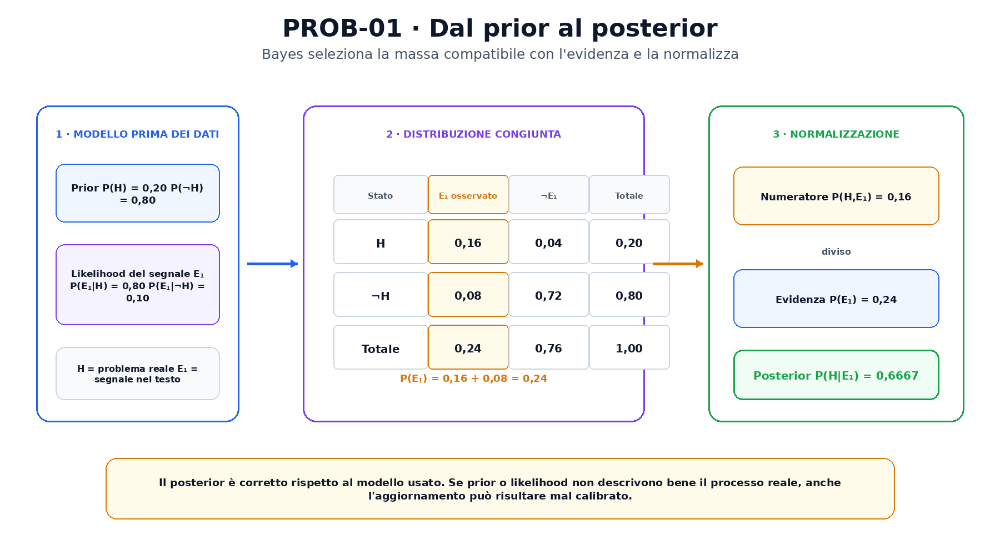
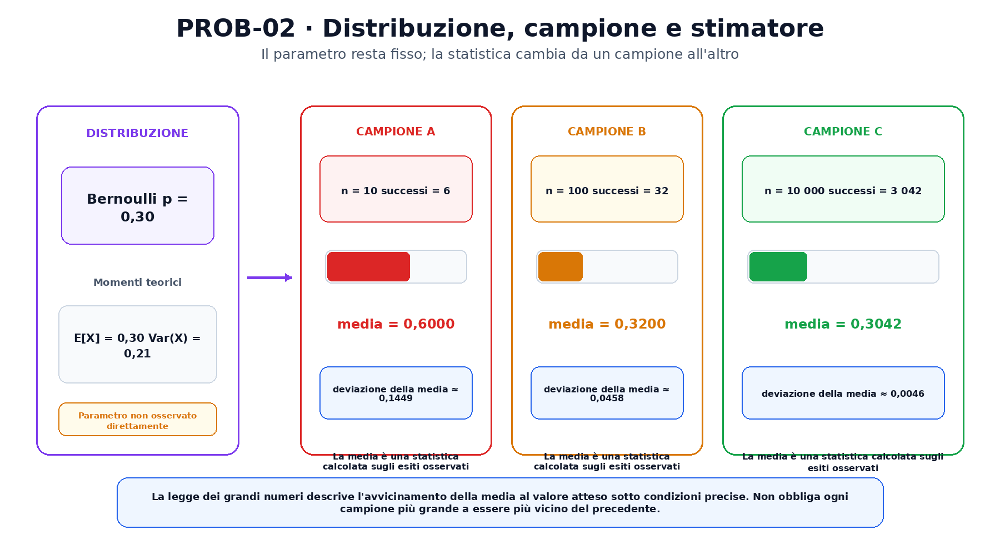

<!--
chapter_id: CH-P02-PROBABILITY
part_id: P02
order_key: 070
title: Probabilità, statistica e inferenza
maturity: CORE
status: candidatura completa in revisione autoriale
version: 0.2.0-rc1
opened: 2026-07-31
last_web_research: 2026-07-31
last_source_check: 2026-07-31
environment: Python 3.13.5, PyTorch 2.10.0+cpu
deferred: entropia, cross-entropy, inferenza causale, MCMC, variational inference, processi stocastici e test statistici avanzati
-->

# Capitolo 7. Probabilità, statistica e inferenza

La frase «Il pacco non è arrivato» non ci dice con certezza che esista un problema reale di consegna. Potrebbe esserci un ritardo, un errore nel tracking, un indirizzo incompleto oppure una richiesta inviata prima della data prevista. Il sistema osserva alcuni segnali, ma lo stato che ci interessa non è sempre visibile direttamente.

La probabilità offre un linguaggio per descrivere questa incertezza. La statistica collega quel linguaggio a dati osservati. L'inferenza usa un modello e un campione per formulare conclusioni su quantità che non conosciamo direttamente.

Seguiremo un caso binario. Indichiamo con $H$ l'evento

```text
esiste un problema di consegna reale
```

e con $E_1$ l'evidenza

```text
il testo contiene una formulazione compatibile con mancata consegna
```

Useremo probabilità illustrative, scelte per rendere i passaggi controllabili. Non descrivono un servizio reale. Dopo l'esempio introdurremo variabili aleatorie, distribuzioni, valore atteso, varianza, campioni, likelihood e due modi diversi di intendere l'inferenza.

## Esiti, eventi e probabilità

Uno **spazio campionario** raccoglie gli esiti possibili del modello considerato. Nel caso più semplice:

$$
\Omega=\{H,\neg H\}.
$$

Un **evento** è un insieme di esiti. In uno spazio con due soli stati, l'evento $H$ contiene l'esito in cui il problema di consegna esiste; il suo complemento $\neg H$ contiene l'altro esito.

Una misura di probabilità assegna valori agli eventi rispettando tre proprietà fondamentali:

1. $P(A)\ge 0$ per ogni evento $A$;
2. $P(\Omega)=1$;
3. per eventi disgiunti, la probabilità dell'unione è la somma delle probabilità.

Queste proprietà non spiegano da sole come scegliere un modello o stimarne i numeri. Stabiliscono però le regole che rendono coerenti i calcoli [Kolmogorov, 1933; Blitzstein e Hwang, 2019].

Supponiamo che, prima di leggere il testo corrente, il sistema assegni

$$
P(H)=0{,}20,
$$

$$
P(\neg H)=0{,}80.
$$

La prima quantità è il nostro **prior**, cioè la probabilità attribuita allo stato prima di usare la nuova evidenza. Può derivare da dati storici, da un modello precedente o da una scelta esplicita. Non è una proprietà universale della frase.

## Congiunta, marginale e condizionata

Per collegare stato ed evidenza dobbiamo descrivere quanto spesso l'evidenza sarebbe compatibile con ciascuno stato. Assumiamo

$$
P(E_1\mid H)=0{,}80,
$$

$$
P(E_1\mid \neg H)=0{,}10.
$$

La barra verticale si legge «dato». La prima probabilità chiede: se esiste davvero un problema di consegna, con quale probabilità osserviamo il segnale testuale $E_1$? La seconda pone la stessa domanda quando il problema non esiste.

La probabilità condizionata è definita come

$$
P(A\mid B)=\frac{P(A\cap B)}{P(B)},
$$

quando $P(B)>0$. Da questa definizione segue la regola del prodotto:

$$
P(A\cap B)=P(A\mid B)P(B).
$$

Nel nostro caso:

$$
P(H\cap E_1)=0{,}20\cdot0{,}80=0{,}16,
$$

$$
P(\neg H\cap E_1)=0{,}80\cdot0{,}10=0{,}08.
$$

Possiamo completare la tabella con i casi in cui il segnale non compare:

| Stato | $E_1$ | $\neg E_1$ | Totale |
|---|---:|---:|---:|
| $H$ | $0{,}16$ | $0{,}04$ | $0{,}20$ |
| $\neg H$ | $0{,}08$ | $0{,}72$ | $0{,}80$ |
| Totale | $0{,}24$ | $0{,}76$ | $1{,}00$ |

Le celle interne sono probabilità **congiunte**, perché descrivono stato ed evidenza insieme. I totali di riga e di colonna sono probabilità **marginali**. Per ottenere $P(E_1)$ sommiamo su tutti gli stati compatibili:

$$
P(E_1)
=
P(E_1\mid H)P(H)
+
P(E_1\mid\neg H)P(\neg H)
=
0{,}24.
$$

Questa è un'applicazione della legge della probabilità totale. Marginalizzare significa sommare o integrare le variabili che non vogliamo mantenere esplicite.

## Bayes aggiorna una probabilità con l'evidenza

Ora possiamo invertire la domanda. Non chiediamo più quanto sia probabile il testo dato lo stato, ma quanto sia probabile lo stato dopo aver osservato il testo:

$$
P(H\mid E_1).
$$

Il teorema di Bayes fornisce

$$
P(H\mid E_1)
=
\frac{P(E_1\mid H)P(H)}{P(E_1)}.
$$

Sostituendo i valori:

$$
P(H\mid E_1)
=
\frac{0{,}80\cdot0{,}20}{0{,}24}
=
\frac{0{,}16}{0{,}24}
=
0{,}666667.
$$

Il numeratore seleziona la massa congiunta compatibile con $H$ ed $E_1$. Il denominatore normalizza tutte le spiegazioni che avrebbero potuto produrre la stessa evidenza. Il risultato è il **posterior**, la probabilità dello stato dopo l'osservazione.



La figura parte dalla tabella congiunta. La colonna dell'evidenza osservata contiene massa `0,16` sotto $H$ e `0,08` sotto $\neg H$. La loro somma è `0,24`; normalizzando la prima cella otteniamo `0,6667`.

Bayes non crea informazioni che il modello non possiede. Il posterior dipende dal prior e dalle likelihood. Se $P(E_1\mid H)$ e $P(E_1\mid\neg H)$ sono mal stimate, il risultato può essere numericamente corretto rispetto al modello e poco affidabile rispetto al mondo reale.

Supponiamo ora di osservare una seconda evidenza $E_2$: il tracking è fermo. Usiamo

$$
P(E_2\mid H)=0{,}70,
$$

$$
P(E_2\mid\neg H)=0{,}20.
$$

Se assumiamo che $E_1$ ed $E_2$ siano indipendenti una volta noto lo stato, possiamo usare il primo posterior come prior del secondo aggiornamento:

$$
P(H\mid E_1,E_2)=0{,}875.
$$

L'indipendenza condizionata è una assunzione del modello. Se il testo e il tracking condividono una causa non rappresentata, moltiplicare le likelihood come se fossero indipendenti può contare due volte informazioni simili e produrre un posterior troppo sicuro.

## Indipendenza non significa assenza di relazione in ogni contesto

Due eventi $A$ e $B$ sono indipendenti quando

$$
P(A\cap B)=P(A)P(B).
$$

Se $P(B)>0$, la stessa condizione implica

$$
P(A\mid B)=P(A).
$$

Osservare $B$ non cambia la probabilità di $A$ nel modello.

L'indipendenza condizionata introduce una terza variabile:

$$
P(A,B\mid C)
=
P(A\mid C)P(B\mid C).
$$

Due osservazioni possono essere dipendenti nella popolazione complessiva e diventare indipendenti dopo aver fissato una causa comune. Può avvenire anche il contrario: condizionare su una variabile può introdurre una dipendenza che prima non era presente.

Per questo l'indipendenza non va dedotta da una semplice assenza di correlazione. La covarianza nulla esclude una associazione lineare media, ma non tutte le possibili dipendenze. Inoltre né dipendenza né correlazione stabiliscono da sole un rapporto causale.

## Variabili aleatorie e distribuzioni

Una **variabile aleatoria** associa un valore numerico agli esiti. Definiamo

$$
D=
\begin{cases}
1 & \text{se esiste un problema di consegna},\\
0 & \text{altrimenti}.
\end{cases}
$$

Se $P(D=1)=p$, la variabile segue una distribuzione di **Bernoulli**. La sua funzione di massa è

$$
P(D=d)=p^d(1-p)^{1-d},
$$

per $d\in\{0,1\}$.

Una distribuzione discreta assegna massa a singoli valori. Per una variabile continua usiamo invece una densità $f(x)$. La probabilità di un intervallo è

$$
P(a\le X\le b)=\int_a^b f(x)\,dx.
$$

In una distribuzione continua regolare, la probabilità di un singolo valore è zero anche quando la densità in quel punto è alta. La densità può inoltre superare uno; è l'area totale sotto la curva a dover valere uno. Densità e probabilità puntuale non sono la stessa quantità.

La funzione di distribuzione cumulativa

$$
F(x)=P(X\le x)
$$

vale sia per variabili discrete sia per variabili continue. È non decrescente, tende a zero a sinistra e a uno a destra.

## Valore atteso, varianza e covarianza

Il **valore atteso** riassume la media rispetto alla distribuzione. Per una variabile discreta:

$$
\mathbb{E}[X]=\sum_x xP(X=x),
$$

quando la somma esiste. Per una variabile continua sostituiamo la somma con un integrale.

Per una Bernoulli:

$$
\mathbb{E}[D]=p.
$$

Il valore atteso non deve coincidere con un esito possibile. La media di un dado equo è `3,5`, anche se nessuna faccia mostra `3,5`.

La **varianza** misura lo scarto quadratico medio dalla media:

$$
\operatorname{Var}(X)
=
\mathbb{E}[(X-\mathbb{E}[X])^2].
$$

Per la Bernoulli:

$$
\operatorname{Var}(D)=p(1-p).
$$

Con $p=0{,}30$ otteniamo

$$
\mathbb{E}[D]=0{,}30,
\qquad
\operatorname{Var}(D)=0{,}21.
$$

La deviazione standard è la radice della varianza e torna nella stessa unità della variabile.

Per due variabili, la **covarianza** è

$$
\operatorname{Cov}(X,Y)
=
\mathbb{E}[(X-\mathbb{E}[X])(Y-\mathbb{E}[Y])].
$$

Un valore positivo indica che scarti dello stesso segno tendono a comparire insieme; un valore negativo indica scarti opposti. La correlazione normalizza la covarianza dividendo per le deviazioni standard. Entrambe descrivono associazioni nel modello o nei dati, non dimostrano una causa.

## Popolazione, campione e statistica

La distribuzione che vorremmo conoscere viene spesso chiamata **popolazione** o distribuzione generatrice. I dati disponibili costituiscono un **campione**. Un parametro, come la probabilità Bernoulli $p$, appartiene al modello della popolazione. Una **statistica** è una funzione dei dati osservati.

Se osserviamo venti casi binari e sette hanno valore uno, la media campionaria è

$$
\bar D=\frac{7}{20}=0{,}35.
$$

Il numero `0,35` è una stima prodotta dal campione. Non è identico per definizione al parametro vero. Un altro campione della stessa dimensione può produrre `0,20`, `0,40` o un altro valore.

Uno **stimatore** è la regola applicata ai dati, per esempio la media campionaria. La **stima** è il valore ottenuto sul campione concreto. Questa distinzione è importante perché bias, varianza e consistenza descrivono il comportamento dello stimatore attraverso possibili campioni, non soltanto il numero osservato una volta.

## La likelihood valuta i parametri sui dati osservati

Supponiamo che le osservazioni binarie $d_1,\ldots,d_n$ siano modellate come Bernoulli indipendenti con parametro $p$. La probabilità congiunta dei dati è

$$
P(d_1,\ldots,d_n\mid p)
=
\prod_{i=1}^n p^{d_i}(1-p)^{1-d_i}.
$$

Quando i dati sono fissati e consideriamo questa espressione come funzione di $p$, la chiamiamo **likelihood**:

$$
\mathcal{L}(p;d_{1:n}).
$$

La likelihood confronta valori del parametro in base a quanto rendono compatibili i dati osservati. Non è automaticamente una distribuzione normalizzata su $p$.

Se il campione contiene $k$ valori uno e $n-k$ valori zero:

$$
\mathcal{L}(p)=p^k(1-p)^{n-k}.
$$

È più comodo lavorare con la log-likelihood:

$$
\ell(p)=k\log p+(n-k)\log(1-p).
$$

Derivando e ponendo a zero:

$$
\ell'(p)=\frac{k}{p}-\frac{n-k}{1-p}=0,
$$

otteniamo

$$
\hat p_{\mathrm{MLE}}=\frac{k}{n}.
$$

Per sette successi su venti, la stima di massima verosimiglianza è `0,35`. Se tutti i valori sono zero o tutti sono uno, il massimo cade sul bordo `0` o `1`; la derivazione interna va interpretata con questo confine.

La MLE sceglie il parametro che massimizza la likelihood dei dati. Non assegna da sola una probabilità ai diversi valori del parametro e non incorpora un prior. Un posterior bayesiano usa invece

$$
p(\theta\mid D)
=
\frac{p(D\mid\theta)p(\theta)}{p(D)}.
$$

Likelihood e prior contribuiscono entrambi al risultato.

## Campionamento e incertezza della stima

Immaginiamo una Bernoulli con parametro fisso $p=0{,}30$. Se campioniamo dieci volte, la frequenza osservata può essere lontana da `0,30`. Nel run registrato otteniamo:

| Dimensione | Media campionaria | Varianza campionaria con divisore $n$ |
|---:|---:|---:|
| 10 | 0,6000 | 0,2400 |
| 100 | 0,3200 | 0,2176 |
| 10 000 | 0,3042 | 0,211662 |

Il primo campione contiene sei valori uno su dieci. Non contraddice il parametro `0,30`; mostra che un campione piccolo può variare molto.

La **legge dei grandi numeri** afferma, sotto condizioni appropriate, che la media campionaria si avvicina al valore atteso al crescere del numero di osservazioni. Non richiede che ogni campione più grande sia più vicino del precedente, né fornisce da sola una garanzia deterministica su una specifica sequenza finita.

Il **teorema centrale del limite**, in una forma classica, considera variabili indipendenti e identicamente distribuite con media $\mu$ e varianza finita $\sigma^2$. La quantità

$$
\frac{\sqrt{n}(\bar X_n-\mu)}{\sigma}
$$

converge in distribuzione verso una normale standard. Il teorema riguarda la distribuzione della media standardizzata, non trasforma la popolazione originale in una normale e non specifica una soglia universale di campione sufficiente.



La figura mantiene fisso il parametro `p=0,30` e mostra tre campioni diversi. Le statistiche cambiano perché dipendono dagli esiti osservati. La distribuzione campionaria descrive come una statistica varierebbe attraverso ripetizioni del protocollo.

## Due prospettive sull'inferenza

Nell'inferenza **frequentista**, il parametro del modello viene trattato come fisso e il campione come variabile. Le proprietà di uno stimatore o di un intervallo vengono definite rispetto a ripetizioni ipotetiche del protocollo di campionamento.

Un intervallo di confidenza al 95% viene costruito da una procedura che, sotto le assunzioni dichiarate, copre il parametro vero nel 95% delle ripetizioni. Dopo aver osservato un intervallo specifico, l'interpretazione frequentista standard non assegna probabilità 95% al parametro fisso dentro quell'intervallo [Wasserman, 2004; OpenIntro, 2026].

Nell'inferenza **bayesiana**, l'incertezza sul parametro viene rappresentata con una distribuzione. Il prior viene aggiornato con la likelihood per ottenere il posterior. Un intervallo credibile al 95% contiene il 95% della massa posteriore secondo quel modello. L'interpretazione dipende quindi da prior, likelihood e dati.

Le due prospettive rispondono a domande diverse e possono produrre procedure numericamente simili in alcuni casi. Non è corretto mescolarne le interpretazioni senza dichiararlo.

## Probabilità e distribuzioni in PyTorch

`torch.distributions` contiene distribuzioni parametrizzabili, funzioni di campionamento e `log_prob`. Una Bernoulli può essere costruita con `probs` oppure con `logits`, ma non con entrambi [PyTorch 2.13, `torch.distributions`].

Il seguente estratto esegue il caso di Bayes e la simulazione:

```python
first = bayes_update(
    prior=0.20,
    likelihood_if_h=0.80,
    likelihood_if_not_h=0.10,
)

second = bayes_update(
    prior=first.posterior,
    likelihood_if_h=0.70,
    likelihood_if_not_h=0.20,
)

bernoulli = torch.distributions.Bernoulli(
    probs=torch.tensor(0.30, dtype=torch.float64)
)

sample = bernoulli.sample((10_000,))
sample_mean = sample.mean()
sample_variance = sample.var(unbiased=False)
```

Nel run registrato:

```text
posterior dopo E1: 0,666667
posterior dopo E2: 0,875000
media teorica: 0,300000
varianza teorica: 0,210000
media campionaria con n=10 000: 0,304200
```

`sample()` produce esiti casuali secondo la distribuzione e il generatore configurato. `log_prob()` valuta il logaritmo della massa o densità nel punto fornito. Sommare le log-probabilità di osservazioni indipendenti corrisponde al logaritmo del prodotto delle probabilità del modello.

Il seed rende riproducibile il run nell'ambiente registrato. Non rende generale la specifica frequenza ottenuta e non sostituisce i risultati teorici.

## Riepilogo

La probabilità assegna massa a eventi secondo regole coerenti. Probabilità congiunte, marginali e condizionate descrivono domande diverse. Il teorema di Bayes combina prior e likelihood e normalizza attraverso la probabilità dell'evidenza.

Una variabile aleatoria trasforma esiti in valori. La sua distribuzione determina valore atteso, varianza e dipendenze con altre variabili. Nei dati osserviamo un campione, non l'intera distribuzione. Parametri, statistiche, stimatori e stime devono quindi restare distinti.

La likelihood valuta parametri a dati fissati; la MLE sceglie un massimo. L'inferenza frequentista studia il comportamento delle procedure attraverso campioni possibili, mentre quella bayesiana aggiorna una distribuzione sui parametri. Legge dei grandi numeri e teorema centrale del limite descrivono comportamenti asintotici sotto condizioni precise, non garanzie assolute su un singolo campione.

### Verifica della comprensione

1. Spiega la differenza tra probabilità congiunta, marginale e condizionata.
2. Ricostruisci il denominatore del teorema di Bayes nel caso $H,E_1$.
3. Perché l'indipendenza condizionata tra $E_1$ ed $E_2$ è una assunzione e non una conseguenza automatica?
4. Qual è la differenza tra parametro, stimatore e stima?
5. Perché una densità continua non è una probabilità puntuale?
6. Perché la likelihood non è automaticamente un posterior?
7. Che cosa affermano, e che cosa non affermano, legge dei grandi numeri e CLT?
8. Confronta l'interpretazione di un intervallo di confidenza con quella di un intervallo credibile.

### Esercizi

1. Ricalcola $P(H\mid E_1)$ usando un prior `0,05` e confronta il risultato.
2. Mantieni il prior `0,20`, ma sostituisci $P(E_1\mid\neg H)$ con `0,40`. Spiega l'effetto sul posterior.
3. Completa una tabella congiunta per due eventi binari e ricava entrambe le marginali.
4. Dimostra che la MLE di una Bernoulli è $k/n$, includendo i casi di bordo.
5. Costruisci due variabili dipendenti con covarianza zero.
6. Esegui `SNIP-PROB-001` con cinque seed diversi e confronta le medie per `n=10` e `n=10 000`.
7. Usa `torch.distributions.Categorical` per modellare tre cause possibili della richiesta di consegna.
8. Scrivi una frase corretta e una scorretta per interpretare un intervallo di confidenza al 95%.

## Fonti e materiali verificabili

Gli assiomi, il condizionamento, Bayes, le variabili aleatorie e i momenti seguono Blitzstein e Hwang e la formulazione assiomatica di Kolmogorov. Likelihood, MLE e inferenza seguono Murphy, Wasserman, Casella e Berger e il NIST/SEMATECH e-Handbook. Campionamento e interpretazione degli intervalli sono ricontrollati anche su *Introduction to Modern Statistics*. Le API sono verificate sulla documentazione ufficiale PyTorch stable.

Le schede complete e i limiti d'uso sono in [`FONTI_PRIMARIE.md`](FONTI_PRIMARIE.md). Il codice eseguito, i test, gli output e l'ambiente sono raccolti nella cartella [`code/`](code/).
