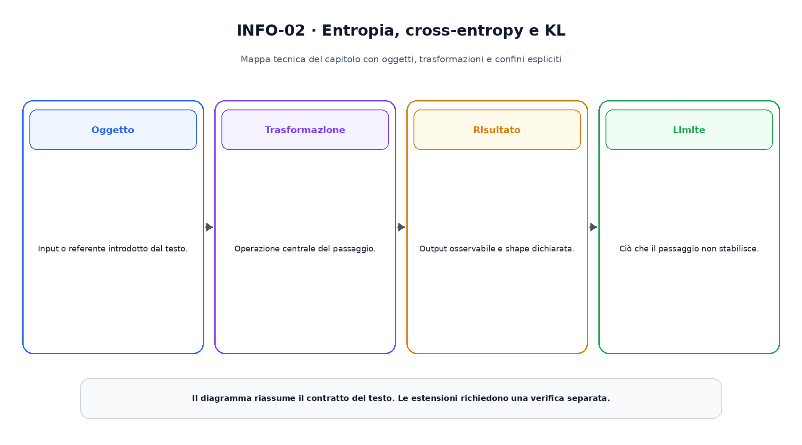

<!--
chapter_id: CH-P02-INFORMATION-THEORY
part_id: P02
order_key: 080
title: Teoria dell'informazione e funzioni obiettivo
maturity: CORE
status: candidatura completa in revisione autoriale
version: 0.2.0-rc1
opened: 2026-07-31
last_web_research: 2026-07-31
last_source_check: 2026-07-31
environment: Python 3.13.5, PyTorch 2.10.0+cpu
deferred: ottimizzazione, regolarizzazione avanzata, contrastive objectives, reinforcement learning objectives e calibration methods
-->

# Capitolo 8. Teoria dell'informazione e funzioni obiettivo

Nel capitolo precedente abbiamo rappresentato l'incertezza con distribuzioni. Ora dobbiamo trasformare una distribuzione prevista e un risultato osservato in un numero che possa guidare l'apprendimento.

Riprendiamo il classificatore delle richieste. Le tre classi sono:

```text
0 = problema di consegna
1 = modifica ordine
2 = problema di pagamento
```

Per la frase «Il pacco non è arrivato», il modello produce i logits

$$
z=[2{,}0,\;0{,}5,\;-1{,}0].
$$

Il target osservato è la classe zero. Vogliamo rispondere a tre domande:

1. quanta incertezza contiene la distribuzione prevista?
2. quanto è costoso assegnare una probabilità piccola alla classe osservata?
3. come trasformiamo questo costo in gradienti numericamente stabili?

La teoria dell'informazione fornisce le quantità principali. La statistica collega la negative log-likelihood alla stima dei parametri. Le funzioni obiettivo trasformano queste idee in un contratto eseguibile.

## Informazione di un evento

Un evento molto probabile sorprende poco quando si verifica. Un evento raro sorprende di più. Shannon formalizza questa intuizione con la **self-information**:

$$
I(x)=-\log p(x).
$$

La quantità cresce quando la probabilità diminuisce. Se $p(x)=1$, l'evento era certo nel modello e l'informazione è zero. Se $p(x)$ tende a zero, la self-information cresce senza limite.

La base del logaritmo determina l'unità:

- base due, bit;
- logaritmo naturale, nat;
- base dieci, hartley.

Nel machine learning si usa spesso il logaritmo naturale, perché deriva naturalmente dalle funzioni esponenziali e dalle implementazioni numeriche. In questo capitolo le quantità sono quindi espresse in nat, salvo indicazione diversa.

La self-information non misura importanza, verità o significato semantico. Descrive quanto un esito è inatteso secondo una distribuzione dichiarata.

## Entropia come informazione media

Per una variabile discreta $X$ con distribuzione $p(x)$, l'**entropia** è il valore atteso della self-information:

$$
H(X)
=
-\sum_x p(x)\log p(x).
$$

Se tutta la massa è concentrata su un unico esito, l'entropia è zero. Su un supporto finito fissato, la distribuzione uniforme massimizza l'entropia [Shannon, 1948; Cover e Thomas, 2006].

Una distribuzione con alta entropia è più dispersa nel senso informativo del modello. Non implica che il sistema sia più intelligente, creativo o corretto. Una distribuzione può avere bassa entropia ed essere confidentemente sbagliata.

Per la previsione del nostro classificatore, la softmax produrrà

$$
p=[0{,}785597,\;0{,}175290,\;0{,}039113].
$$

L'entropia è

$$
H(p)=0{,}621585\;\text{nat}.
$$

Il primo esito domina, ma una parte della massa rimane sulle altre classi.

Con due variabili possiamo definire l'entropia congiunta $H(X,Y)$ e l'entropia condizionata $H(Y\mid X)$. Vale la chain rule:

$$
H(X,Y)=H(X)+H(Y\mid X).
$$

La **mutua informazione** misura quanto conoscere una variabile riduce l'incertezza sull'altra:

$$
I(X;Y)=H(X)-H(X\mid Y).
$$

Può essere scritta anche come

$$
I(X;Y)
=
D_{\mathrm{KL}}\bigl(p(x,y)\,\|\,p(x)p(y)\bigr).
$$

Se le variabili sono indipendenti nel modello, la congiunta fattorizza e la mutua informazione è zero. Questa quantità non stabilisce da sola una direzione causale.

## Cross-entropy e KL divergence

Supponiamo di avere una distribuzione target $q$ e una distribuzione prevista $p$. La **cross-entropy** è

$$
H(q,p)=-\sum_i q_i\log p_i.
$$

Misura la self-information media che otteniamo valutando gli esiti di $q$ con le probabilità assegnate da $p$.

La **Kullback-Leibler divergence** è

$$
D_{\mathrm{KL}}(q\|p)
=
\sum_i q_i\log\frac{q_i}{p_i}.
$$

Le due quantità sono collegate:

$$
H(q,p)
=
H(q)+D_{\mathrm{KL}}(q\|p).
$$

Per un target fissato, $H(q)$ non dipende dal modello. Minimizzare la cross-entropy rispetto a $p$ equivale quindi a minimizzare la KL $D_{\mathrm{KL}}(q\|p)$, quando le quantità sono finite.

La KL è non negativa, ma non è una distanza metrica. In generale

$$
D_{\mathrm{KL}}(q\|p)
\ne
D_{\mathrm{KL}}(p\|q),
$$

e non soddisfa la simmetria richiesta da una distanza.

Usiamo il target morbido

$$
q=[0{,}90,\;0{,}05,\;0{,}05].
$$

Nel run registrato:

$$
H(q)=0{,}394398,
$$

$$
D_{\mathrm{KL}}(q\|p)=0{,}071914,
$$

$$
H(q,p)=0{,}466311.
$$

La somma $H(q)+D_{\mathrm{KL}}(q\|p)$ coincide con la cross-entropy entro la precisione numerica.



La figura separa l'incertezza già presente nel target dalla divergenza tra target e previsione. Con un target one-hot, l'entropia del target è zero; la cross-entropy coincide quindi con la KL e con la negative log-probability della classe osservata.

## Dalla likelihood alla negative log-likelihood

Se il target è la classe zero, possiamo rappresentarlo con il vettore one-hot

$$
q=[1,0,0].
$$

La cross-entropy diventa

$$
H(q,p)=-\log p_0.
$$

È la **negative log-likelihood** dell'esito osservato. Per esempi indipendenti, la likelihood del dataset è il prodotto delle probabilità assegnate ai target:

$$
\mathcal{L}(\theta)
=
\prod_{n=1}^{N}p_\theta(y_n\mid x_n).
$$

Prendendo il logaritmo:

$$
\log\mathcal{L}(\theta)
=
\sum_{n=1}^{N}\log p_\theta(y_n\mid x_n).
$$

Massimizzare la likelihood equivale a minimizzare

$$
-\sum_{n=1}^{N}\log p_\theta(y_n\mid x_n).
$$

Il log trasforma un prodotto in una somma, semplifica il calcolo e rende più gestibili probabilità molto piccole. Non cambia il punto che massimizza la likelihood, perché il logaritmo è strettamente crescente.

La NLL valuta soltanto la probabilità assegnata al risultato osservato. La distribuzione completa influenza però quella probabilità attraverso la normalizzazione.

## Dai logits alle probabilità

Un classificatore neurale produce normalmente **logits**, punteggi reali non normalizzati. I logits possono essere negativi e non devono sommare a uno.

La softmax trasforma i logits in probabilità:

$$
p_i
=
\frac{e^{z_i}}{\sum_j e^{z_j}}.
$$

Per

$$
z=[2{,}0,\;0{,}5,\;-1{,}0],
$$

otteniamo

$$
p=[0{,}785597,\;0{,}175290,\;0{,}039113].
$$

La probabilità della classe osservata è `0,785597`; la loss è

$$
-\log(0{,}785597)=0{,}241311.
$$

Consideriamo ora logits con lo stesso insieme di valori, ma assegnati in ordine opposto:

$$
z_{\text{errato}}=[-1{,}0,\;0{,}5,\;2{,}0].
$$

La classe corretta riceve probabilità `0,039113` e la loss sale a

$$
-\log(0{,}039113)=3{,}241311.
$$


La figura confronta due previsioni con la stessa entropia, perché le probabilità sono una permutazione. La cross-entropy è però molto diversa: dipende da dove cade la massa rispetto al target, non soltanto da quanto la distribuzione è concentrata.

## Il gradiente rispetto ai logits

La combinazione tra softmax e cross-entropy produce un gradiente semplice. Per target probabilistico $q$:

$$
\frac{\partial H(q,p)}{\partial z_i}=p_i-q_i.
$$

Con target one-hot sulla classe zero:

$$
p-q
=
[-0{,}214403,\;0{,}175290,\;0{,}039113].
$$

Il gradiente della classe target è negativo, quindi una discesa del gradiente tende ad aumentare il suo logit. I gradienti delle altre classi sono positivi, quindi la stessa discesa tende a ridurne i logits.

La somma dei tre componenti è zero. Aggiungere la stessa costante a tutti i logits non cambia la softmax:

$$
\operatorname{softmax}(z+c\mathbf{1})
=
\operatorname{softmax}(z).
$$

La loss non identifica quindi un livello assoluto dei logits; dipende dalle differenze tra loro.

Il gradiente semplice non significa che il training complessivo sia semplice. I logits dipendono da molti layer e parametri; la backpropagation del Capitolo 6 deve ancora trasferire questo segnale attraverso l'intera rete.

## Stabilità numerica di softmax e log-softmax

La formula matematica usa esponenziali. Calcolarla ingenuamente con logits grandi può produrre overflow. Nel run del capitolo:

```text
logits = [1000, 999, 998]
```

`exp(logits)` diventa infinito in float64 e la divisione `inf/inf` produce `nan`.

Possiamo sottrarre il massimo senza cambiare la softmax:

$$
\frac{e^{z_i}}{\sum_j e^{z_j}}
=
\frac{e^{z_i-m}}{\sum_j e^{z_j-m}},
$$

con

$$
m=\max_j z_j.
$$

La forma logaritmica usa la funzione log-sum-exp:

$$
\log p_i
=
z_i-\log\sum_j e^{z_j}.
$$

`torch.log_softmax` combina i passaggi in una formulazione numericamente stabile. Per i logits grandi restituisce

```text
[-0,4076, -1,4076, -2,4076]
```

invece di `nan` [PyTorch 2.13, `log_softmax`].

Stabilità numerica non significa aritmetica esatta. Precisione, dtype e riduzioni continuano a influenzare il risultato.

## Target hard, target soft e label smoothing

Con un target come indice di classe, `CrossEntropyLoss` usa la log-probabilità della classe osservata. Con un target probabilistico, la loss calcola

$$
-\sum_i q_i\log p_i.
$$

I target morbidi possono rappresentare ambiguità, distillazione, mixup o label smoothing. Devono comunque essere distribuzioni valide, con valori non negativi e somma uno.

PyTorch accetta target probabilistici della stessa shape dei logits, ma la documentazione specifica che non controlla automaticamente tutti i vincoli. Valori negativi o righe che non sommano a uno possono produrre loss e gradienti privi dell'interpretazione attesa [PyTorch 2.13, `CrossEntropyLoss`].

Il label smoothing mescola il target originale con una distribuzione più diffusa. Cambia l'obiettivo, non soltanto l'implementazione. Non va presentato come garanzia universale di calibrazione o robustezza.

## Rischio empirico e riduzione sul batch

Per un dataset di $N$ esempi, una funzione obiettivo comune è il rischio empirico medio:

$$
\hat R(\theta)
=
\frac{1}{N}
\sum_{n=1}^{N}
\ell\bigl(f_\theta(x_n),y_n\bigr).
$$

La scelta tra somma e media cambia la scala dei gradienti. Con batch di dimensioni diverse, la media mantiene più stabile il contributo per esempio; la somma cresce con il numero di elementi.

Le API PyTorch permettono tipicamente `reduction='none'`, `'sum'` o `'mean'`. `none` conserva una loss per elemento e rende possibili pesi, maschere e analisi per slice. Una riduzione applicata troppo presto può nascondere la distribuzione degli errori.

Una funzione obiettivo può includere un termine aggiuntivo:

$$
J(\theta)=\hat R(\theta)+\lambda\,\Omega(\theta).
$$

$\Omega$ può penalizzare parametri, imporre vincoli o rappresentare una preferenza progettuale. Il termine regolarizzante non deriva automaticamente dalla likelihood dei dati; va dichiarato separatamente.

## La loss esprime una ipotesi sul problema

La cross-entropy è adatta quando il modello produce una distribuzione sulle classi e il target viene interpretato in quel supporto. Non è una loss universale.

Per una regressione con target reale, la MSE è

$$
\operatorname{MSE}
=
\frac{1}{N}\sum_n(\hat y_n-y_n)^2.
$$

Se assumiamo

$$
y\mid x\sim\mathcal{N}(\mu_\theta(x),\sigma^2),
$$

con varianza $\sigma^2$ fissata, la negative log-likelihood differisce dalla somma degli errori quadratici per costanti e un fattore di scala. L'equivalenza dipende dall'assunzione gaussiana e dalla varianza fissata.

La L1 loss usa

$$
|\hat y-y|.
$$

Può essere collegata alla negative log-likelihood di un modello laplaciano con scala fissata. Anche qui il collegamento richiede un modello probabilistico specifico.

La funzione obiettivo definisce quali errori il training rende costosi. Non rappresenta automaticamente latenza, equità, sicurezza, utilità operativa o costo umano. Questi aspetti possono richiedere metriche, vincoli e procedure aggiuntive.

## PyTorch: contratti da non confondere

`torch.nn.CrossEntropyLoss` si aspetta logits non normalizzati. Con target come indici, equivale a `LogSoftmax` seguito da `NLLLoss` [PyTorch 2.13]. Applicare prima una softmax e passare poi le probabilità come input standard cambia il calcolo e può peggiorare la stabilità.

`NLLLoss` si aspetta log-probabilità, non logits e non probabilità ordinarie.

`KLDivLoss` si aspetta l'input in spazio logaritmico. Se il target è fornito come probabilità, il termine puntuale segue

$$
q_i(\log q_i-\log p_i).
$$

La documentazione avverte che `reduction='mean'` non coincide direttamente con la KL matematica sul batch; `batchmean` somma i termini e divide per la dimensione del batch [PyTorch 2.13, `KLDivLoss`].

Il seguente estratto verifica il caso principale:

```python
logits = torch.tensor(
    [2.0, 0.5, -1.0],
    dtype=torch.float64,
    requires_grad=True,
)
target = torch.tensor(0)

log_probabilities = torch.log_softmax(logits, dim=0)
manual_nll = -log_probabilities[target]
api_loss = F.cross_entropy(
    logits.unsqueeze(0),
    target.unsqueeze(0),
)

api_loss.backward()
```

Nel run, `manual_nll` e `api_loss` valgono entrambi `0,241311`; il gradiente dei logits è `p-one_hot`.

## Riepilogo

La self-information assegna un costo logaritmico a un evento. L'entropia ne calcola il valore medio sotto una distribuzione. Cross-entropy e KL confrontano una distribuzione target con una previsione, ma rispondono a domande diverse e non vanno confuse con una distanza metrica.

Per un target di classe, la cross-entropy coincide con la negative log-likelihood. I logits vengono normalizzati con softmax; `log_softmax` calcola direttamente log-probabilità in modo più stabile. La previsione confidentemente errata riceve una loss elevata perché assegna probabilità molto piccola all'esito osservato.

Una funzione obiettivo esprime un modello degli errori che il training deve ridurre. Cross-entropy, MSE, L1 e regolarizzazioni hanno contratti diversi. Una loss bassa non dimostra da sola accuratezza operativa, calibrazione, robustezza o sicurezza.

### Verifica della comprensione

1. Perché la self-information cresce quando la probabilità diminuisce?
2. Qual è la differenza tra entropia e cross-entropy?
3. Perché la KL non è una distanza metrica?
4. Come si riduce la cross-entropy con target one-hot?
5. Perché due previsioni con la stessa entropia possono avere loss diverse sullo stesso target?
6. Ricostruisci il gradiente `p-q` rispetto ai logits.
7. Perché `log_softmax` è preferibile a `log(softmax(x))` calcolati separatamente?
8. Quali assunzioni collegano MSE e likelihood gaussiana?
9. Perché una loss bassa non basta a valutare un sistema?

### Esercizi

1. Calcola self-information in bit e nat per probabilità `0,5`, `0,1` e `0,01`.
2. Calcola l'entropia di una Bernoulli per `p=0`, `0,5` e `1`.
3. Verifica a mano `H(q,p)=H(q)+KL(q||p)` per il target morbido del capitolo.
4. Aggiungi una costante `100` a tutti i logits e verifica che softmax e loss non cambino.
5. Cambia il target dalla classe zero alla classe uno e ricalcola loss e gradiente.
6. Usa `CrossEntropyLoss` con target probabilistico valido e confronta il risultato con la formula manuale.
7. Passa intenzionalmente un target probabilistico che non somma a uno e osserva il comportamento dell'API, senza interpretare il risultato come cross-entropy valida.
8. Confronta `reduction='none'`, `'sum'` e `'mean'` su un batch di tre esempi.
9. Deriva la NLL gaussiana e mostra il termine proporzionale all'errore quadratico.

## Fonti e materiali verificabili

Le definizioni informative seguono Shannon e Cover e Thomas. I collegamenti con inferenza e apprendimento seguono MacKay, Goodfellow, Bengio e Courville e Murphy. Le proprietà del log score sono ricontrollate su Gneiting e Raftery. I contratti di cross-entropy, NLL, KL, log-softmax, MSE e L1 sono verificati sulla documentazione ufficiale PyTorch stable.

Le schede complete e i limiti d'uso sono in [`FONTI_PRIMARIE.md`](FONTI_PRIMARIE.md). Il codice eseguito, i test, gli output e l'ambiente sono raccolti nella cartella [`code/`](code/).
