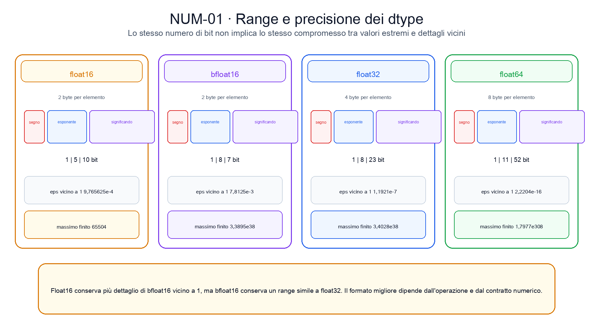
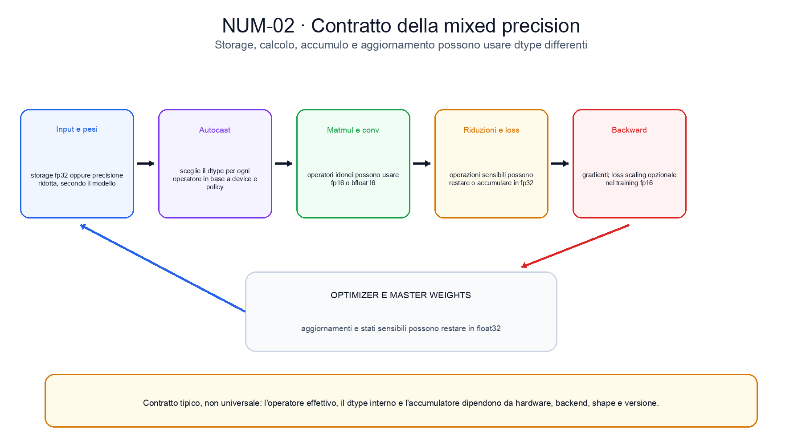

<!--
chapter_id: CH-P02-NUMERICS-HARDWARE
part_id: P02
order_key: 090
title: Calcolo numerico, precisione e hardware
maturity: CORE
status: testo e codice completi, visuali in revisione
version: 0.1.0-draft1
opened: 2026-07-31
last_web_research: 2026-07-31
last_source_check: 2026-07-31
environment: Python 3.13.5, PyTorch 2.10.0+cpu
deferred: quantizzazione intera, formati fp8 e inferiori, kernel specializzati, compiler, training distribuito e benchmark di serving
-->

# Capitolo 9. Calcolo numerico, precisione e hardware

Nel capitolo precedente abbiamo trasformato tre logits in probabilità e cross-entropy. Sulla carta, le operazioni erano esatte: esponenziali, somme, divisioni e logaritmi. Su un computer, invece, ogni valore deve essere registrato con un numero finito di bit e ogni operazione restituisce un valore rappresentabile dal formato scelto.

Riprendiamo la richiesta «Il pacco non è arrivato» come esempio comune: il classificatore deve trasformare segnali della richiesta in logits, e il capitolo mostra come precisione e hardware cambino il modo in cui quel calcolo viene eseguito.

Questa differenza non è un dettaglio marginale. Consideriamo i logits

$$
[1000,999,998].
$$

La softmax è ben definita e assegna probabilità finite alle tre classi. Se però calcoliamo direttamente

$$
\log\left(e^{1000}+e^{999}+e^{998}\right),
$$

gli esponenziali possono superare il massimo rappresentabile e diventare `inf`. Una formula equivalente, costruita sottraendo il valore massimo prima dell'esponenziale, restituisce invece un numero finito. Il modello matematico non è cambiato. È cambiato l'algoritmo con cui lo eseguiamo.

Questo capitolo segue lo stesso piccolo classificatore attraverso quattro domande:

1. quali numeri può rappresentare un dtype;
2. come l'arrotondamento modifica le operazioni;
3. perché precisione ridotta e mixed precision possono essere utili;
4. come hardware, librerie e kernel cambiano il contratto numerico e prestazionale.

L'obiettivo non è scegliere un dtype universalmente migliore. È imparare a dichiarare quale precisione viene usata, dove viene usata, quali errori può introdurre e quali misure servono per stabilire se il compromesso è accettabile.

## I numeri del modello non sono numeri reali

Un numero reale può richiedere infinite cifre. Un computer dispone invece di un insieme finito di configurazioni di bit. Nei formati floating point binari, un valore normale viene descritto, in forma semplificata, da tre parti:

- un bit di **segno**;
- un **esponente**, che sposta la scala;
- un **significando**, spesso chiamato anche mantissa nel linguaggio informale, che conserva le cifre significative.

Il valore può essere pensato come

$$
(-1)^s \times m \times 2^e,
$$

dove `s` è il segno, `e` è l'esponente e `m` contiene la precisione significativa. Lo standard IEEE 754 specifica formati, operazioni, modalità di arrotondamento e valori speciali come `inf` e `nan` [IEEE 754-2019].

La rappresentazione è simile alla notazione scientifica. Con un numero limitato di cifre possiamo scrivere quantità molto grandi o molto piccole spostando l'esponente, ma non possiamo conservare ogni dettaglio. Due numeri reali vicini possono quindi essere registrati come lo stesso valore floating point.

In PyTorch, il dtype è una proprietà del tensore:

```python
x = torch.tensor([1.0, 2.0], dtype=torch.float32)
```

Il nome `float32` indica che ciascun elemento usa 32 bit. Non dice però da solo quale algoritmo verrà scelto dal backend, quale precisione userà un accumulatore interno o se una moltiplicazione sarà eseguita da unità specializzate. Dtype di input, precisione di calcolo, precisione di accumulo e dtype di output sono contratti collegati, ma non sempre identici.

## Range e precisione rispondono a domande diverse

Per descrivere un formato servono almeno due idee.

Il **range** indica quanto possono essere grandi o piccoli i valori rappresentabili. Dipende soprattutto dal numero di bit destinati all'esponente.

La **precisione** indica quanto sono vicini i valori rappresentabili a una certa scala. Dipende soprattutto dai bit del significando.

PyTorch espone alcune proprietà attraverso `torch.finfo(dtype)`:

- `eps`: la distanza tra `1` e il successivo valore rappresentabile maggiore di `1`;
- `tiny`: il più piccolo valore normale positivo;
- `max`: il più grande valore finito positivo;
- `bits`: il numero totale di bit del formato.

Nel run del capitolo otteniamo:

| dtype | bit | `eps` vicino a 1 | `tiny` normale | `max` finito |
|---|---:|---:|---:|---:|
| `float16` | 16 | `9,765625e-4` | `6,103515625e-5` | `65504` |
| `bfloat16` | 16 | `7,8125e-3` | `1,17549435e-38` | `3,38953139e38` |
| `float32` | 32 | `1,19209290e-7` | `1,17549435e-38` | `3,40282347e38` |
| `float64` | 64 | `2,22044605e-16` | `2,22507386e-308` | `1,79769313e308` |

`float16` e `bfloat16` occupano entrambi due byte, ma si comportano in modo diverso. IEEE binary16 usa più bit per il significando e meno per l'esponente. Bfloat16 conserva un esponente della stessa ampiezza di float32, ma usa meno bit per il significando. Di conseguenza, bfloat16 raggiunge ordini di grandezza simili a float32, ma distingue meno valori vicini a uno [PyTorch Tensor Attributes; Kalamkar et al., 2019].

Questa differenza è visibile con il numero `70000`. Nel run registrato:

```text
float16 -> inf
bfloat16 -> 70144
```

Float16 supera il proprio massimo finito. Bfloat16 conserva il range, ma arrotonda il valore a `70144`. Nessuno dei due risultati è una copia esatta del numero reale richiesto.

<!-- Inserire NUM-01 dopo la materializzazione e l'audit del PNG. -->

## L'arrotondamento avviene dopo ogni operazione

Supponiamo di lavorare in float32 con

$$
a=10^{20}, \qquad b=-10^{20}, \qquad c=3{,}14.
$$

In aritmetica reale,

$$
(a+b)+c = a+(b+c)=3{,}14.
$$

Nel run floating point, invece:

```text
(a+b)+c = 3,1400001049
a+(b+c) = 0
```

Nel primo raggruppamento, `a+b` si annulla esattamente nel formato usato e resta `c`. Nel secondo, quando `c` viene aggiunto a `b`, è troppo piccolo rispetto alla scala di `10^20` per modificare il valore rappresentato. Il contributo viene perso prima che arrivi l'addizione con `a`.

L'addizione floating point non è quindi associativa in generale [Goldberg, 1991; PyTorch Numerical Accuracy]. Lo stesso vale per molte riduzioni: la somma di un vettore può cambiare leggermente se il backend usa un albero parallelo, blocchi di dimensione diversa o un ordine differente.

Questo spiega perché due calcoli matematicamente equivalenti possono non essere bitwise identici:

```python
batched = (A @ B)[0]
sliced = A[0] @ B[0]
```

PyTorch documenta che operazioni batched e operazioni sulle singole slice possono seguire implementazioni diverse e produrre piccole differenze [PyTorch Numerical Accuracy]. Il punto non è che uno dei due risultati sia necessariamente sbagliato. Il punto è che l'uguaglianza matematica non implica identità dei bit dopo una sequenza diversa di arrotondamenti.

### Cancellazione

Quando sottraiamo due quantità quasi uguali, le cifre comuni si annullano e il risultato può dipendere soprattutto dalle cifre meno accurate. Questo fenomeno viene chiamato **cancellazione**.

La sottrazione non è sempre evitabile. Il problema nasce quando una formula amplifica errori già presenti negli operandi. In questi casi si cerca una formulazione equivalente che eviti la sottrazione critica, oppure si usa una precisione maggiore per le quantità sensibili.

### Errore forward, errore backward e condizionamento

È utile distinguere il problema matematico dall'algoritmo.

L'**errore forward** confronta il risultato calcolato con il risultato esatto.

L'**errore backward** chiede quanto bisognerebbe modificare gli input affinché il risultato calcolato sia esatto per quegli input perturbati.

Il **condizionamento** descrive quanto il problema stesso amplifica piccole perturbazioni degli input. Un problema mal condizionato può trasformare una piccola incertezza nei dati in una grande variazione dell'output, anche con un buon algoritmo. Un algoritmo instabile può invece introdurre un errore grande anche su un problema ben condizionato [Higham, 2002].

Passare a float64 può ridurre molti errori di arrotondamento, ma non rende ben condizionato un problema e non corregge automaticamente un algoritmo instabile.

## Overflow, underflow, inf e nan

Un **overflow** si verifica quando il valore supera il massimo finito del formato. Il risultato può diventare `inf`.

Un **underflow** si verifica nella regione dei valori estremamente piccoli. I numeri possono diventare subnormal, perdere precisione o arrotondare a zero. Il comportamento dei subnormal può inoltre dipendere dall'hardware e dalle impostazioni del backend.

`nan`, abbreviazione di *not a number*, compare in operazioni senza un risultato reale definito nel dominio usato, oppure come conseguenza di operazioni che coinvolgono valori non finiti. Esempi comuni sono `0/0`, `inf-inf` e la propagazione di un `nan` precedente.

In un training loop, `inf` o `nan` non devono essere trattati soltanto alla fine. Conviene localizzare il primo punto in cui compaiono:

```python
assert torch.isfinite(loss)
assert all(torch.isfinite(p).all() for p in model.parameters())
```

Queste asserzioni non spiegano la causa. Possono però restringere la ricerca a input, forward, loss, backward o optimizer step.

Un intermedio può overfloware anche quando il risultato finale sarebbe rappresentabile. La documentazione PyTorch mostra, per esempio, che una norma calcolata in float32 può diventare `inf` per valori grandi, mentre la stessa norma calcolata in float64 resta finita [PyTorch Numerical Accuracy]. La soluzione non è sempre convertire tutto in float64. Spesso è preferibile usare una formula o un kernel progettato per evitare intermedi estremi.

## Formule equivalenti, stabilità diversa

Torniamo ai logits

$$
x=[1000,999,998].
$$

La formula diretta

$$
\log\sum_i e^{x_i}
$$

produce `inf` nel run float32, perché ciascun esponenziale overflowa. Possiamo però sottrarre il massimo `m=1000`:

$$
\log\sum_i e^{x_i}
=
 m+\log\sum_i e^{x_i-m}.
$$

Ora gli esponenti sono `0`, `-1` e `-2`. Nessuno richiede un numero enorme. Il run di `torch.logsumexp` restituisce

```text
1000,4075927734375
```

La funzione ufficiale documenta esplicitamente un calcolo stabilizzato [PyTorch `logsumexp`]. La stessa idea sostiene implementazioni stabili di softmax e cross-entropy.

### Stabilizzare non significa ottenere il risultato esatto

La trasformazione evita un overflow specifico, ma il risultato continua a essere arrotondato. La stabilità è relativa al problema, all'algoritmo, al dtype e alla scala degli input.

Altre strategie ricorrenti includono:

- normalizzare o riscalare prima di un'operazione;
- accumulare in un dtype più ampio;
- usare `log1p(x)` quando `x` è vicino a zero invece di `log(1+x)`;
- usare `expm1(x)` per `exp(x)-1` vicino a zero;
- evitare di formare esplicitamente matrici o intermedi mal condizionati;
- usare algoritmi dedicati delle librerie numeriche.

Queste trasformazioni non sono trucchi separati dalla matematica. Sono parte del contratto dell'implementazione.

## Scegliere un dtype significa scegliere un compromesso

### Float64

Float64 offre il range e la precisione maggiori tra i quattro formati considerati. È utile per verifiche numeriche, derivazioni, gradcheck, problemi scientifici e operazioni sensibili. Richiede però otto byte per elemento e, su molti acceleratori destinati al deep learning, può avere throughput molto inferiore rispetto ai formati ridotti.

Il costo effettivo dipende dall'hardware. Non basta contare i bit per prevedere il tempo di esecuzione.

### Float32

Float32 è il dtype predefinito per molti tensori PyTorch creati da numeri Python. Offre circa sette cifre decimali significative e un range sufficiente per numerosi workload. È spesso usato come riferimento pratico, per accumulatori e per quantità sensibili.

Anche quando input e output sono float32, la precisione interna di una moltiplicazione matriciale può dipendere dalle impostazioni del backend. PyTorch espone `torch.set_float32_matmul_precision`, che permette di scegliere politiche come `highest` e `high`; sui dispositivi compatibili, una politica più rapida può usare TF32 o decomposizioni basate su bfloat16 [PyTorch `set_float32_matmul_precision`].

### Float16

Float16 riduce a due byte lo storage di ogni elemento e può usare unità hardware ad alto throughput. Il range è però molto più ristretto. Gradienti piccoli possono arrotondare a zero, mentre attivazioni o intermedi grandi possono overfloware.

Il paper *Mixed Precision Training* propone due strumenti centrali per il training fp16:

- mantenere una copia dei pesi in float32 per gli aggiornamenti;
- scalare la loss per spostare i gradienti in un intervallo rappresentabile prima del backward [Micikevicius et al., 2017].

### Bfloat16

Bfloat16 occupa due byte e conserva un esponente ampio come float32. Riduce quindi il rischio di overflow rispetto a float16, ma possiede meno bit di significando. Vicino a uno, il suo `eps` è `0,0078125`, più grande di quello di float16.

Questo formato è spesso utile quando il range è più importante della precisione fine. Non significa che ogni modello possa essere convertito senza verifiche. Operazioni sensibili, riduzioni e aggiornamenti possono comunque richiedere float32.

<!-- Inserire NUM-01 dopo la materializzazione e l'audit del PNG. -->

## Storage, calcolo, accumulo e output

La frase «il modello usa bfloat16» è spesso troppo vaga. Per una singola operazione possiamo distinguere:

1. dtype con cui input e pesi sono memorizzati;
2. dtype con cui vengono letti o convertiti;
3. precisione della moltiplicazione;
4. precisione dell'accumulatore;
5. dtype dell'output;
6. dtype della copia usata dall'optimizer.

Una moltiplicazione può leggere input fp16, moltiplicare in precisione ridotta, accumulare in fp32 e infine restituire fp16. Un'altra implementazione può troncare alcuni accumulatori per aumentare il throughput. PyTorch documenta opzioni separate per le riduzioni fp16 e bfloat16 nelle GEMM e per alcune implementazioni dell'attention [PyTorch Numerical Accuracy].

Per questo il dtype visibile del tensore non descrive sempre l'intero percorso numerico.

## Mixed precision e autocast

La **mixed precision** assegna dtype differenti a operazioni differenti. Gli operatori che beneficiano della precisione ridotta, come molte moltiplicazioni matriciali e convoluzioni, possono essere eseguiti in fp16 o bfloat16. Riduzioni, loss e operazioni numericamente sensibili possono restare in float32.

In PyTorch, `torch.autocast` seleziona il dtype secondo una policy associata al device e all'operatore. La documentazione corrente indica, per esempio, che su CPU molte matmul e linear possono essere eseguite in bfloat16, mentre diverse loss e decomposizioni restano in float32 [PyTorch AMP].

Nel run del capitolo:

```python
with torch.autocast(device_type="cpu", dtype=torch.bfloat16):
    reduced = left @ right
```

l'output è bfloat16. Con matrici casuali 16×16 e seed `0`, il confronto con il riferimento float32 produce:

```text
max_abs_error: 0,0463953
median_rel_error: 0,00299118
```

Questi valori descrivono un solo input su una sola CPU. Non misurano la qualità di un modello e non prevedono il comportamento di una GPU.

### Autocast e GradScaler non sono la stessa cosa

Autocast sceglie la precisione delle operazioni. `GradScaler` modifica la scala della loss e dei gradienti per ridurre il rischio di underflow nel training fp16. Sono componenti modulari e risolvono problemi diversi [PyTorch AMP].

Su CPU con bfloat16, la documentazione PyTorch mostra normalmente autocast senza scaler. Su CUDA con fp16, autocast e scaler vengono spesso usati insieme. La scelta deve seguire il device, il dtype e il comportamento osservato.

### Master weights e stato dell'optimizer

Anche quando forward e backward usano precisione ridotta, l'optimizer può aggiornare una copia float32 dei pesi. Inoltre, stati come medie mobili e varianze dell'optimizer possono occupare più memoria dei soli parametri.

Dire che un modello ha un miliardo di parametri in fp16 non basta quindi a calcolare la memoria del training. Servono almeno:

- parametri;
- gradienti;
- stati dell'optimizer;
- attivazioni salvate;
- buffer temporanei;
- comunicazioni e copie del runtime.

Il nostro calcolo di storage è volutamente più ristretto. Un tensore 1024×1024 contiene `1.048.576` elementi:

```text
float32: 4.194.304 byte
float16: 2.097.152 byte
```

Questi sono i byte teorici dei soli elementi, non la memoria totale del processo.

<!-- Inserire NUM-02 dopo la materializzazione e l'audit del PNG. -->

## Hardware: il picco di calcolo non basta

CPU, GPU e altri acceleratori hanno architetture differenti. Una GPU offre molte unità parallele e una gerarchia di memoria progettata per throughput elevato. Una CPU dispone di pochi core più generali, cache sofisticate e buone prestazioni su controllo e workload meno regolari. Queste descrizioni sono orientative: il comportamento reale dipende dal dispositivo e dall'operazione.

Per una moltiplicazione matriciale, le prestazioni dipendono almeno da:

- shape e allineamento;
- dtype degli input;
- tipo di accumulatore;
- layout e contiguità;
- dimensione del batch;
- kernel scelto dalla libreria;
- costo di trasferimento dei dati;
- occupazione e parallelismo;
- warm-up e sincronizzazione usati nel benchmark.

Un kernel fp16 può essere molto rapido su Tensor Core e non offrire lo stesso vantaggio su un dispositivo privo di quelle unità. Una shape piccola può essere dominata dall'overhead. Un'operazione può essere limitata dalla memoria prima di saturare le unità di calcolo.

### Tensor Core e TF32

Le GPU NVIDIA compatibili dispongono di Tensor Core per operazioni matriciali su formati specifici. La documentazione CUDA descrive supporto per fp16, bfloat16, TF32 e altri formati in funzione della compute capability [NVIDIA CUDA Programming Guide].

TF32 usa un range simile a float32 e una precisione del significando ridotta. In PyTorch, il suo uso per matmul e convoluzioni è configurabile e le API correnti distinguono precisione IEEE e TF32 [PyTorch Numerical Accuracy].

TF32 non cambia necessariamente il dtype esterno del tensore. Un output può restare float32 mentre il percorso interno usa input troncati alla precisione TF32. Per questo il benchmark deve registrare anche le impostazioni del backend.

### Intensità aritmetica e Roofline

Il modello Roofline mette in relazione due limiti:

- il picco di operazioni del dispositivo;
- la bandwidth con cui i dati possono essere trasferiti.

L'**intensità aritmetica** è il rapporto tra operazioni eseguite e byte trasferiti. Se l'intensità è bassa, il kernel può essere limitato dalla memoria. Se è alta, può avvicinarsi al limite di calcolo [Williams et al., 2009].

Ridurre il dtype dimezza i byte per elemento passando da float32 a un formato a 16 bit. Questo può aumentare l'intensità effettiva e permettere più dati in cache. Non garantisce però un raddoppio della velocità. Servono kernel idonei, sufficiente lavoro parallelo e un collo di bottiglia compatibile con la riduzione del traffico.

## Misurare correttamente il tempo

Gli acceleratori eseguono spesso le operazioni in modo asincrono. Il codice Python può terminare l'invio di un kernel prima che il dispositivo abbia completato il lavoro. Un timer che non sincronizza può misurare soprattutto il tempo di dispatch.

Un benchmark affidabile dichiara:

- hardware e driver;
- versione del framework e delle librerie;
- shape, dtype e layout;
- warm-up;
- sincronizzazione;
- numero di ripetizioni;
- statistica riportata;
- eventuali compilazioni o autotuning;
- memoria allocata e condizioni del sistema.

Questo capitolo non riporta benchmark di throughput perché il run disponibile è CPU e il suo scopo è verificare contratti numerici, non confrontare hardware.

## Determinismo, riproducibilità e identità bitwise

Tre obiettivi vengono spesso confusi.

**Identità bitwise** significa ottenere esattamente gli stessi bit.

**Determinismo nello stesso ambiente** significa che la stessa esecuzione, con le stesse condizioni, segue algoritmi deterministici e produce lo stesso risultato previsto dal contratto.

**Riproducibilità sperimentale** significa ricostruire le conclusioni rilevanti entro tolleranze e variabilità dichiarate, anche quando non tutti i bit coincidono.

PyTorch non garantisce risultati completamente riproducibili tra release, piattaforme, CPU e GPU. Anche con lo stesso seed possono restare algoritmi non deterministici o differenze numeriche [PyTorch Reproducibility].

Le impostazioni deterministiche possono inoltre ridurre le prestazioni. Sono spesso utili per debugging, test di regressione e confronto controllato, ma il loro costo deve essere misurato.

### Confronti con tolleranza

Per floating point, un test usa spesso una combinazione di tolleranza assoluta e relativa:

$$
|a-b| \leq \text{atol} + \text{rtol}\,|b|.
$$

La tolleranza deve dipendere dal dtype, dalla scala, dall'operazione e dalla quantità di riduzioni. Una tolleranza enorme nasconde errori; un confronto esatto può respingere differenze innocue.

`torch.testing.assert_close` permette di dichiarare esplicitamente `rtol` e `atol`. Nei test del capitolo usiamo invece contratti qualitativi o soglie motivate: la formula ingenua deve essere non finita, quella stabile finita; l'errore autocast deve essere positivo ma inferiore alla soglia registrata per l'esempio.

## Uno snippet che rende visibili i contratti

Il file [`code/snip_num_001_precision_contracts.py`](code/snip_num_001_precision_contracts.py) riunisce gli esempi principali.

```python
left_grouping, right_grouping = non_associativity_example()
naive, stable = logsumexp_example()
fp16_value, bf16_value = range_example()
autocast = autocast_example()
```

Il risultato mostra:

```text
(a+b)+c: 3,1400001049041748
a+(b+c): 0

naive logsumexp: inf
stable logsumexp: 1000,4075927734375

float16(70000): inf
bfloat16(70000): 70144

autocast output: torch.bfloat16
max absolute error: 0,0463953
```

I sette test controllano proprietà del dtype, incremento vicino a uno, non associatività, stabilità di logsumexp, range, autocast e byte di storage. Codice, output e ambiente sono separati dalla documentazione stable consultata.

## Un contratto numerico per ogni esperimento

Prima di interpretare un risultato conviene registrare:

```text
dtype di input e parametri
precisione di calcolo e accumulo
precisione della loss e dell'optimizer
device e modello hardware
backend e impostazioni numeriche
shape, layout e batch
seed e algoritmi deterministici
tolleranze dei test
versione del framework e delle librerie
presenza di inf e nan
metodo di benchmark
```

Questo elenco non obbliga ogni esperimento a usare float64 o modalità deterministiche. Impedisce però di descrivere il risultato come se la matematica astratta fosse l'unica cosa eseguita.

## Riepilogo

Un tensore floating point rappresenta un insieme finito di valori. L'esponente governa soprattutto il range, mentre il significando governa la precisione. Due formati con lo stesso numero di bit possono quindi avere compromessi molto differenti.

Ogni operazione arrotonda. Per questo l'addizione non è associativa, l'ordine delle riduzioni conta e formule equivalenti possono avere stabilità diversa. Overflow, underflow, `inf` e `nan` devono essere localizzati e interpretati nel contesto dell'algoritmo.

Mixed precision separa storage, calcolo e accumulo. Autocast seleziona il dtype di alcune operazioni; loss scaling protegge gradienti fp16 piccoli; master weights e accumulatori più ampi conservano quantità sensibili. Il percorso effettivo dipende da device, backend e versione.

L'hardware non si descrive soltanto con il picco di operazioni. Shape, kernel, layout, bandwidth, intensità aritmetica e sincronizzazione determinano le prestazioni osservate. La riproducibilità richiede quindi un contratto che includa matematica, numerica e sistema.

### Verifica della comprensione

1. Spiega la differenza tra range e precisione usando float16 e bfloat16.
2. Perché `(a+b)+c` può differire da `a+(b+c)`?
3. Perché sottrarre il massimo stabilizza logsumexp?
4. Distingui dtype di storage, calcolo, accumulo e output.
5. Quale problema risolve autocast e quale problema risolve GradScaler?
6. Perché dimezzare i byte per elemento non garantisce il doppio della velocità?
7. Perché lo stesso seed non garantisce identità bitwise tra CPU e GPU?

### Esercizi

1. Modifica i valori dell'esempio di non associatività e trova la scala minima a cui `c` viene perso in float32.
2. Ripeti `logsumexp` in float64 e confronta il risultato con float32.
3. Calcola lo storage teorico di una matrice 4096×4096 nei quattro dtype del capitolo.
4. Cambia il seed e la shape della matmul autocast; registra errore massimo e mediano senza generalizzare il risultato.
5. Implementa una softmax stabile sottraendo il massimo e confrontala con `torch.softmax`.
6. Costruisci un test con `torch.testing.assert_close` e giustifica `rtol` e `atol`.
7. Progetta un protocollo di benchmark per una matmul GPU, includendo warm-up e sincronizzazione.

## Fonti e materiali verificabili

Le fonti portanti sono IEEE 754-2019, Goldberg e Higham per l'aritmetica numerica, la documentazione ufficiale PyTorch per dtype, accuratezza, AMP e riproducibilità, i lavori su mixed precision e bfloat16, la documentazione CUDA/cuBLAS e il modello Roofline.

Le schede complete e i limiti d'uso sono in [`FONTI_PRIMARIE.md`](FONTI_PRIMARIE.md). Claim, codice, test, output e ambiente sono raccolti in [`CLAIMS.md`](CLAIMS.md) e nella cartella [`code/`](code/).






