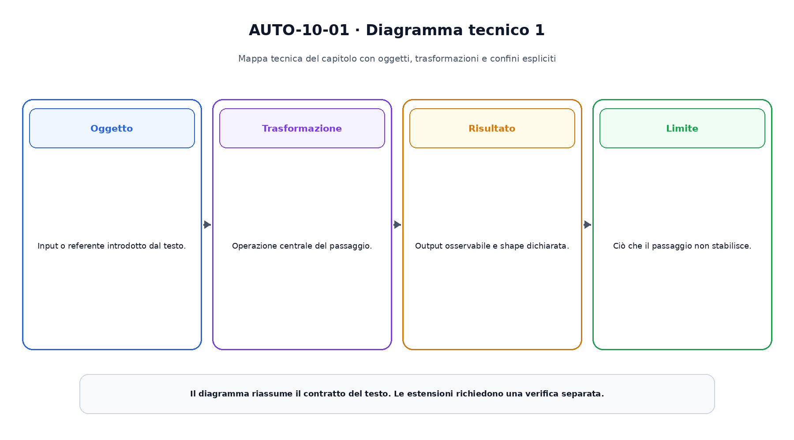

<!--
chapter_id: CH-P03-SEARCH-PLANNING
part_id: P03
order_key: 100
title: Ricerca, pianificazione e giochi
maturity: CORE
status: testo e codice completi, visuali in revisione
version: 0.1.0-draft1
opened: 2026-07-31
last_web_research: 2026-07-31
last_source_check: 2026-07-31
environment: Python 3.13.5, standard library
deferred: processi decisionali di Markov completi, reinforcement learning, planning parzialmente osservabile, agenti con tool e ricerca durante il decoding
-->

# Capitolo 10. Ricerca, pianificazione e giochi

La frase «Il pacco non è arrivato» non richiede soltanto una classificazione. Un sistema operativo potrebbe dover identificare l'ordine, controllare il tracking, verificare il ritardo e infine aprire il ticket corretto. Tra il messaggio iniziale e l'azione finale esistono più sequenze possibili, con costi e conseguenze differenti.

Una soluzione può aprire subito un ticket generico. Un'altra può chiedere informazioni inutili. Una terza può seguire una sequenza più lunga ma raccogliere i dati necessari a scegliere il canale corretto. Il problema non è generare una frase plausibile. È scegliere una sequenza di azioni che conduca da uno stato iniziale a uno stato desiderato.

La **ricerca** esplora possibilità definite da un modello del problema. La **pianificazione** descrive azioni attraverso condizioni ed effetti, così che una sequenza possa essere costruita rispetto a un goal. Nei **giochi**, il risultato dipende anche dalle azioni di un avversario. Questi tre casi condividono l'idea di guardare oltre la prossima mossa, ma non hanno lo stesso contratto.

In questo capitolo useremo due esempi piccoli. Il primo è un workflow per la richiesta di consegna. Il secondo è un albero di gioco con valori numerici. Gli esempi servono a rendere visibili frontiera, costi, euristiche e potature prima di passare ai sistemi neurali che guidano la ricerca.

## Dal problema allo spazio degli stati

Per cercare una soluzione dobbiamo decidere che cosa conta come stato.

Nel workflow della spedizione possiamo usare:

```text
message_received
order_identified
tracking_checked
delay_confirmed
ticket_opened
```

Uno **stato** contiene le informazioni che il modello del problema considera necessarie per decidere le azioni successive. Non è necessariamente una fotografia completa del mondo. Se omettiamo una proprietà rilevante, due situazioni che richiedono decisioni diverse possono essere trattate come lo stesso stato.

Un problema di ricerca viene descritto, nella forma didattica usata qui, da:

- uno stato iniziale;
- un insieme di azioni applicabili;
- una funzione di transizione che indica lo stato successivo;
- un costo per ogni azione o cammino;
- un test del goal.

Per esempio:

```text
message_received
-- identify_order, costo 1 --> order_identified

order_identified
-- check_tracking, costo 2 --> tracking_checked

tracking_checked
-- confirm_delay, costo 1 --> delay_confirmed

delay_confirmed
-- open_delay_ticket, costo 2 --> ticket_opened
```

Il costo totale del piano è

$$
1+2+1+2=6.
$$

Nel grafo esiste anche l'azione `open_generic_ticket` di costo `7`. Raggiunge il goal in un solo passo, ma costa più del percorso composto da quattro azioni. Questo esempio mostra perché «meno passi» e «minor costo» non sono sinonimi.

### Stato e nodo di ricerca

Lo stato `tracking_checked` descrive una situazione del problema. Un **nodo di ricerca** contiene invece anche il cammino usato per raggiungerla, il costo accumulato e il riferimento al nodo precedente.

Lo stesso stato può comparire in più nodi se viene raggiunto attraverso cammini differenti. Una tree search può esplorare queste copie separatamente. Una graph search mantiene invece una struttura per riconoscere stati già incontrati e, quando necessario, conserva il costo migliore noto.

Questa distinzione è importante. Eliminare ogni duplicato senza confrontare i costi può scartare un cammino migliore scoperto più tardi. Al contrario, ignorare i duplicati può far crescere enormemente l'albero o creare cicli.

## La frontiera decide che cosa esplorare dopo

Gli algoritmi di ricerca differiscono soprattutto nel modo in cui ordinano la **frontiera**, cioè i nodi generati ma non ancora espansi.

### Ricerca in ampiezza

La breadth-first search, o BFS, espande prima i nodi meno profondi. Se tutte le azioni hanno lo stesso costo positivo, il primo goal trovato ha anche il numero minimo di azioni.

Con costi differenti, BFS continua a minimizzare la profondità, non il costo. Nel nostro esempio sceglierebbe il ticket generico in un passo anche se il suo costo è `7` e il piano in quattro passi costa `6`.

### Ricerca in profondità

La depth-first search segue un ramo finché può, poi torna indietro. Usa poca memoria rispetto a BFS, ma può perdersi in rami lunghi o ciclici e non offre, nel caso generale, la soluzione di costo minimo.

DFS può essere utile quando la memoria è il vincolo principale, le soluzioni sono profonde e accettiamo di non trovare il cammino migliore. La sua adeguatezza dipende dal problema, non da una gerarchia universale tra algoritmi.

### Uniform-cost search

Uniform-cost search espande il nodo con il costo accumulato più basso:

$$
g(n)=\text{costo dal nodo iniziale a }n.
$$

Con costi non negativi e una gestione corretta della frontiera, questa strategia restituisce un cammino di costo minimo. Il principio corrisponde al metodo dei cammini minimi presentato da Dijkstra per archi di lunghezza non negativa [Dijkstra, 1959].

Nel run del capitolo, uniform-cost espande otto stati prima di estrarre il goal di costo `6`:

```text
message_received
order_identified
payment_inspected
agent_asked
payment_ok
tracking_checked
delay_confirmed
ticket_opened
```

L'algoritmo non sa ancora quali rami sembrano promettenti. Ordina soltanto il costo già pagato.

## A*: costo trascorso e stima del costo futuro

Una **euristica** assegna a ogni stato una stima del costo che resta per raggiungere il goal. La indichiamo con

$$
h(n).
$$

A* combina il costo già sostenuto e la stima rimanente:

$$
f(n)=g(n)+h(n).
$$

Nel grafo del capitolo usiamo, per esempio:

| stato | `h(n)` |
|---|---:|
| `message_received` | 5 |
| `order_identified` | 4 |
| `tracking_checked` | 3 |
| `delay_confirmed` | 2 |
| `payment_inspected` | 9 |
| `payment_ok` | 10 |
| `agent_asked` | 8 |
| `ticket_opened` | 0 |

Queste stime non sono prodotte da un modello appreso. Sono costruite per l'esempio e verificate rispetto ai costi reali del grafo.

### Ammissibilità

Una euristica è **ammissibile** se non sovrastima mai il costo ottimo rimanente:

$$
0\leq h(n)\leq h^*(n),
$$

dove $h^*(n)$ è il vero costo minimo da `n` al goal.

L'ammissibilità impedisce alla stima di dichiarare un ramo più costoso di quanto sia realmente. È una proprietà relativa a un problema, a un goal e a una funzione di costo. La stessa funzione può essere ammissibile in un dominio e non in un altro.

### Consistenza

Una euristica è **consistente** quando, per ogni transizione da `n` a `n'` di costo `c`, vale

$$
h(n)\leq c(n,n')+h(n').
$$

È una forma di disuguaglianza triangolare. La stima non può diminuire lungo un arco più di quanto abbiamo pagato per attraversarlo.

Con costi non negativi, euristica consistente e gestione corretta dei duplicati, A* graph search restituisce un cammino ottimo. La garanzia riguarda l'algoritmo completo, non qualunque programma che sommi `g` e `h` [Hart, Nilsson e Raphael, 1968].

Nel run, A* espande cinque stati:

```text
message_received
order_identified
tracking_checked
delay_confirmed
ticket_opened
```

Trova lo stesso piano di costo `6` di uniform-cost, ma non espande i rami relativi al pagamento e all'agente.

<!-- Inserire SEARCH-01 dopo la materializzazione e l'audit del PNG. -->

### Una euristica non è una prova automatica

Una stima appresa da dati può essere molto accurata in media e tuttavia sovrastimare alcuni stati. Questo può essere accettabile se l'obiettivo è trovare rapidamente una buona soluzione, ma modifica le garanzie.

Per un sistema reale dobbiamo quindi separare:

- accuratezza empirica della stima;
- ammissibilità matematica;
- completezza della ricerca;
- ottimalità del piano restituito;
- budget di tempo e memoria.

Dire «la rete guida A*» non basta. Serve sapere come la stima entra nella priorità e quali proprietà restano valide.

## Dal grafo alla pianificazione

Nel grafo precedente abbiamo elencato esplicitamente ogni transizione. Un problema più grande richiede una descrizione riutilizzabile delle azioni.

Una azione di planning può avere:

- **precondizioni**, che devono essere vere prima dell'esecuzione;
- **effetti positivi**, che diventano veri dopo;
- **effetti negativi**, che cessano di essere veri;
- un costo o una durata, quando il formalismo lo prevede.

Una versione semplificata di `check_tracking` potrebbe essere:

```text
action: check_tracking
precondition: order_identified
effect: tracking_checked
```

`open_delay_ticket` potrebbe richiedere:

```text
precondition: delay_confirmed
 effect: ticket_opened
```

STRIPS ha formalizzato un approccio in cui un pianificatore cerca una sequenza di operatori che trasformi un modello iniziale del mondo in uno che soddisfa il goal [Fikes e Nilsson, 1971]. PDDL è stato successivamente proposto come linguaggio comune per descrivere domini e problemi di planning e favorire confronti empirici tra planner [McDermott et al., 1998].

La separazione tra **dominio** e **problema** è utile:

- il dominio definisce i tipi di azione disponibili;
- il problema definisce oggetti, stato iniziale e goal specifici.

Nel nostro caso, il dominio può contenere azioni generiche come identificare un ordine, consultare un servizio e aprire un ticket. Il problema specifico contiene l'ordine, lo stato della spedizione e il goal operativo.

### Pianificazione ed esecuzione non coincidono

Un piano viene costruito rispetto a un modello. Durante l'esecuzione, un servizio può fallire, l'ordine può non esistere o il tracking può essere aggiornato. Se il mondo reale non segue la transizione prevista, eseguire ciecamente il resto del piano può essere scorretto.

Un sistema operativo deve quindi osservare gli esiti, aggiornare lo stato e, quando necessario, ripianificare. La pianificazione non elimina il monitoraggio discusso nel Capitolo 3.

### Pianificazione e generazione di testo

Un modello linguistico può scrivere una lista di passi. Questa lista diventa un piano operativo soltanto quando:

- gli stati e le azioni hanno un significato verificabile;
- le precondizioni vengono controllate;
- gli effetti sono osservati;
- costi e vincoli sono rappresentati;
- le azioni non autorizzate vengono impedite;
- fallimenti e cambiamenti producono una nuova decisione.

La fluidità del testo non garantisce che la sequenza sia eseguibile.

## Dynamic programming e principio di ottimalità

La ricerca può incontrare ripetutamente gli stessi sottoproblemi. La dynamic programming conserva risultati intermedi e li riusa.

Il principio di ottimalità di Bellman, nella forma intuitiva, afferma che una soluzione ottima contiene sottosoluzioni ottime rispetto agli stati raggiunti [Bellman, 1957]. Se il costo ottimo da uno stato `s` al goal è $V^*(s)$, possiamo scrivere una relazione ricorsiva:

$$
V^*(s)=\min_a\left[c(s,a)+V^*(T(s,a))\right]
$$

nel caso deterministico.

Questa equazione non indica da sola come calcolare il valore in ogni dominio. Mostra però il collegamento tra ricerca, planning e i metodi di decisione che verranno sviluppati nel capitolo sul reinforcement learning.

Uniform-cost calcola costi ottimi espandendo stati dalla sorgente. Altri algoritmi possono propagare valori dal goal, iterare aggiornamenti o sfruttare la struttura del problema. Il concetto comune è evitare di risolvere lo stesso sottoproblema da zero ogni volta.

## Quando un'altra entità sceglie contro di noi

In un problema di cammino, il successore è determinato dall'azione e dal modello di transizione. In un gioco competitivo, dopo la nostra mossa interviene un avversario.

Nel caso base consideriamo:

- due giocatori;
- turni alternati;
- informazione completa;
- nessun elemento casuale;
- utilità opposte, quindi gioco a somma zero.

Il giocatore **MAX** sceglie l'azione che massimizza il valore. Il giocatore **MIN** sceglie quella che lo minimizza.

Nel piccolo albero del capitolo, la radice MAX ha tre mosse:

```text
A -> MIN sceglie tra 3 e 5 -> valore 3
B -> MIN sceglie tra 2 e 9 -> valore 2
C -> MIN sceglie tra 4 e 4 -> valore 4
```

MAX sceglie `C`, perché

$$
\max(\min(3,5),\min(2,9),\min(4,4))=4.
$$

Questo calcolo è il **minimax**. Shannon descrisse già nel 1950 la ricerca negli alberi di gioco e la necessità di limitare l'esplorazione mediante valutazioni delle posizioni [Shannon, 1950].

## Alpha-beta: stesso valore, meno rami

Alpha-beta mantiene due limiti:

- `alpha`, il miglior valore già garantito a MAX;
- `beta`, il miglior valore già garantito a MIN.

Dopo aver valutato il ramo `A`, MAX sa di poter ottenere almeno `3`. Entra poi nel ramo `B`, dove MIN osserva subito una foglia di valore `2`. Poiché MIN può imporre un valore non superiore a `2`, MAX non sceglierà mai `B` al posto di `A`. La seconda foglia di `B`, con valore `9`, non può cambiare la decisione e viene potata.

Alpha-beta non modifica il valore minimax. Modifica il numero di nodi valutati. Nel run:

```text
minimax: valore 4, foglie visitate 6
alpha-beta: valore 4, foglie visitate 5
```

L'ordine delle mosse è decisivo. Se le mosse migliori vengono esplorate presto, i limiti diventano informativi prima e i tagli aumentano. Nel caso peggiore, alpha-beta può visitare quasi lo stesso albero di minimax [Knuth e Moore, 1975].

<!-- Inserire SEARCH-02 dopo la materializzazione e l'audit del PNG. -->

### Oltre il caso base

Se il gioco contiene eventi casuali, introduciamo nodi di probabilità e valori attesi. Se le informazioni sono nascoste, lo stato deve rappresentare ciò che il giocatore sa o crede. Se i giocatori non hanno utilità opposte, il semplice valore negato non basta.

Il minimax spiegato qui è quindi un contratto preciso, non una descrizione universale di ogni interazione multi-agente.

## Monte Carlo tree search

Quando il branching factor è enorme e una funzione di valutazione esatta è indisponibile, possiamo costruire l'albero in modo selettivo.

Monte Carlo tree search, o MCTS, ripete tipicamente quattro fasi:

1. **selezione** di un percorso già nell'albero;
2. **espansione** di una nuova azione o stato;
3. **valutazione** tramite simulazione o funzione appresa;
4. **backup** del risultato lungo il percorso.

UCT applica idee da multi-armed bandit alla selezione nell'albero [Kocsis e Szepesvári, 2006]. Una forma comune bilancia valore medio ed esplorazione:

$$
\text{score}(a)=\bar{Q}(a)+c\sqrt{\frac{\log N}{N_a}},
$$

dove `N` è il numero di visite al nodo, `N_a` quello dell'azione e `c` controlla l'esplorazione.

Il primo termine favorisce azioni che hanno prodotto buoni risultati. Il secondo favorisce azioni esplorate meno. La formula non rende automaticamente corretto il modello dell'ambiente e non elimina la dipendenza dal budget.

### Ricerca guidata da reti neurali

AlphaGo combina policy network, value network e tree search nel sistema descritto nel paper del 2016 [Silver et al., 2016]. La policy concentra l'esplorazione su mosse promettenti; la value stima l'esito di una posizione; la ricerca integra informazioni su più simulazioni.

AlphaGo Zero usa self-play e una rete che produce sia priorità sulle mosse sia una stima del risultato, integrate in MCTS [Silver et al., 2017]. Questi lavori mostrano che apprendimento e ricerca possono rafforzarsi a vicenda in un dominio con regole e feedback ben definiti.

Non segue che una rete policy-value renda affidabile qualunque agente. Nei sistemi aperti possono mancare un simulatore corretto, un goal completo, un segnale di valore affidabile o azioni reversibili.

## Budget, completezza e qualità del modello

Ogni ricerca consuma risorse. Il numero di nodi può crescere esponenzialmente con la profondità. Una euristica riduce spesso il lavoro, ma richiede calcolo e può essere ingannevole. MCTS distribuisce un budget, ma una ricerca interrotta presto restituisce una decisione dipendente dalle visite accumulate.

Conviene separare quattro domande:

1. **Il modello è corretto?** Le transizioni e i costi descrivono il sistema reale?
2. **L'algoritmo è corretto?** Implementa il contratto dichiarato?
3. **Il budget è sufficiente?** Quanto spazio è stato effettivamente esplorato?
4. **La soluzione è valida in esecuzione?** Le precondizioni continuano a essere vere?

Una ricerca perfetta su un modello errato produce il piano ottimo per il modello errato.

## Lo snippet eseguito

Il file [`code/snip_search_001_astar_minimax.py`](code/snip_search_001_astar_minimax.py) implementa uniform-cost, A*, minimax e alpha-beta.

Per il workflow della spedizione:

```text
uniform-cost: costo 6, stati espansi 8
A*: costo 6, stati espansi 5
```

Entrambi ricostruiscono:

```text
message_received
-> order_identified
-> tracking_checked
-> delay_confirmed
-> ticket_opened
```

con azioni:

```text
identify_order
check_tracking
confirm_delay
open_delay_ticket
```

Per l'albero di gioco:

```text
minimax_value: 4
minimax_leaves: 6
alpha_beta_value: 4
alpha_beta_leaves: 5
```

I sei test verificano il piano ottimo, l'ammissibilità e la consistenza dell'euristica, il numero di espansioni dell'esempio, il rifiuto di costi negativi e l'equivalenza tra minimax e alpha-beta.

## Riepilogo

Una ricerca richiede una rappresentazione esplicita di stati, azioni, transizioni, costi e goal. Il nodo di ricerca non coincide con lo stato: conserva anche cammino e costo.

BFS ordina per profondità; uniform-cost ordina per costo accumulato; A* aggiunge una stima del costo rimanente. Le garanzie di A* dipendono dalle proprietà dell'euristica e dalla gestione dei duplicati.

La pianificazione descrive azioni riutilizzabili tramite precondizioni ed effetti. Un piano resta valido soltanto finché il modello e lo stato osservato corrispondono alla realtà.

Nei giochi, minimax considera la risposta dell'avversario. Alpha-beta evita rami che non possono cambiare il valore. MCTS costruisce selettivamente l'albero e può essere guidato da policy e value apprese.

Ricerca e apprendimento non sono alternative assolute. Una rete può proporre, ordinare o valutare; la ricerca può verificare conseguenze nel modello disponibile. Le proprietà finali dipendono dal contratto di entrambi.

### Verifica della comprensione

1. Distingui uno stato da un nodo di ricerca.
2. Perché BFS non trova necessariamente il piano di costo minimo?
3. Spiega `g`, `h` e `f` in A*.
4. Qual è la differenza tra euristica ammissibile e consistente?
5. Quali informazioni deve contenere una azione di planning?
6. Perché alpha-beta restituisce lo stesso valore di minimax?
7. Quali quattro fasi compongono un ciclo MCTS tipico?
8. Perché una policy appresa non garantisce un piano ottimo?

### Esercizi

1. Modifica il costo del ticket generico da `7` a `5` e prevedi il nuovo piano ottimo.
2. Imposta `h(message_received)=7` e verifica quale proprietà dell'euristica viene violata.
3. Aggiungi un ciclo al grafo e controlla che la gestione del costo migliore eviti espansioni infinite.
4. Cambia l'ordine dei figli del game tree e misura le foglie visitate da alpha-beta.
5. Estendi il game tree con un nodo casuale e calcola il valore atteso.
6. Scrivi precondizioni ed effetti di `refund_order` e individua un vincolo di autorizzazione.
7. Progetta una euristica per un problema di consegna reale e indica come testeresti ammissibilità ed errore empirico separatamente.

## Fonti e materiali verificabili

Le fonti portanti sono Dijkstra per i cammini minimi, Hart, Nilsson e Raphael per A*, Bellman per dynamic programming, STRIPS e PDDL per il planning, Shannon e Knuth-Moore per game search, Kocsis-Szepesvári per UCT e i paper AlphaGo per l'integrazione tra reti neurali e tree search.

Le schede complete e i limiti d'uso sono in [`FONTI_PRIMARIE.md`](FONTI_PRIMARIE.md). Claim, codice, test, output e ambiente sono raccolti in [`CLAIMS.md`](CLAIMS.md) e nella cartella [`code/`](code/).





