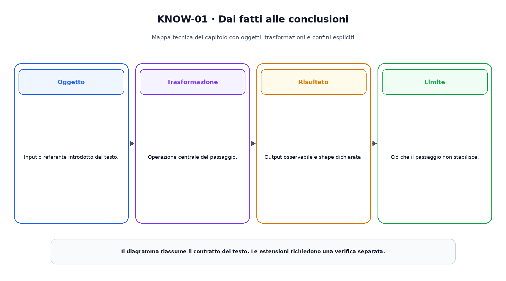
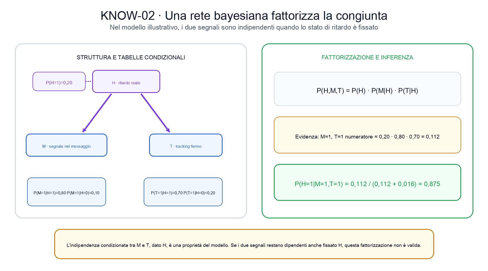

<!--
chapter_id: CH-P03-KNOWLEDGE-LOGIC
part_id: P03
order_key: 110
title: Conoscenza, logica e modelli probabilistici
maturity: CORE
status: testo e codice completi, visuali in revisione
version: 0.1.0-draft1
opened: 2026-07-31
last_web_research: 2026-07-31
last_source_check: 2026-07-31
environment: Python 3.13.5, standard library, CPU
deferred: SAT, SMT, description logic avanzate, default logic, probabilistic programming, causal inference, knowledge graph embedding e inferenza approssimata avanzata
-->

# Capitolo 11. Conoscenza, logica e modelli probabilistici

Un sistema riceve la frase «Il pacco non è arrivato». Il testo è un dato osservato, ma da solo non stabilisce che cosa sia vero sul mondo. Potrebbe indicare una consegna realmente in ritardo, un tracking non aggiornato, un errore nell'indirizzo oppure una richiesta inviata prima della data prevista.

Nei capitoli precedenti abbiamo rappresentato l'incertezza con probabilità e abbiamo cercato piani in uno spazio di stati. Ora affrontiamo una domanda diversa: **come dichiariamo ciò che il sistema sa, come ricaviamo conseguenze da quella conoscenza e come rappresentiamo ciò che rimane incerto?**

La risposta non è un unico formalismo. Una regola logica può esprimere che, se il tracking è fermo e la data prevista è passata, il caso deve entrare in un certo workflow. Una rete bayesiana può invece esprimere quanto due segnali rendano plausibile un ritardo reale. La prima costruisce conseguenze sotto ipotesi discrete; la seconda distribuisce probabilità tra alternative. Entrambe richiedono una semantica precisa.

## Da un testo a fatti dichiarati

Consideriamo l'ordine `order_42`. Il sistema dispone di tre osservazioni:

```text
message_mentions_missing_delivery(order_42)
tracking_stalled(order_42)
delivery_date_passed(order_42)
```

Queste righe sono **fatti nel linguaggio del sistema**. Non sono il mondo stesso. La prima dice che un componente ha classificato il messaggio in un certo modo; la seconda e la terza dicono che i dati disponibili soddisfano due condizioni operative. La correttezza di ciascun fatto dipende dalla procedura che lo ha prodotto.

Possiamo aggiungere regole:

```text
tracking_stalled(?order)
AND delivery_date_passed(?order)
-> possible_delay(?order)
```

```text
message_mentions_missing_delivery(?order)
AND possible_delay(?order)
-> needs_review(?order)
```

La variabile `?order` permette di applicare la stessa struttura a ordini differenti. Quando troviamo un valore che rende vere tutte le premesse, sostituiamo la variabile anche nella conclusione.

Prima di eseguire le regole dobbiamo però chiarire che cosa significa affermare, interpretare e derivare una frase.

## Sintassi, interpretazione e conseguenza

La **sintassi** stabilisce quali sequenze di simboli sono formule ben formate. La **semantica** stabilisce come quei simboli vengono interpretati e in quali situazioni le formule risultano vere.

Prendiamo la proposizione

$$
S \land D \rightarrow R.
$$

La formula dice che, se `S` e `D` sono veri, allora `R` deve essere vero. Per usarla dobbiamo assegnare un significato ai simboli, per esempio:

```text
S = tracking fermo
D = data prevista superata
R = possibile ritardo
```

Una **interpretazione** assegna valori e relazioni ai simboli. Se una interpretazione rende vere tutte le formule di una base di conoscenza, è un **modello** di quella base.

Scriviamo

$$
KB \models \alpha
$$

quando ogni modello che soddisfa la base di conoscenza `KB` soddisfa anche la formula `α`. Questo rapporto si chiama **conseguenza logica** o entailment [Enderton, 2001]. Non dipende da un particolare algoritmo di ricerca delle prove. È definito rispetto a tutti i modelli ammessi dalla semantica.

Una procedura concreta può invece produrre una derivazione, che indichiamo spesso con

$$
KB \vdash \alpha.
$$

I due simboli non sono sinonimi. Una procedura è **sound**, o corretta, se non dimostra conclusioni che non sono conseguenze semantiche. È **complete**, o completa, rispetto a un linguaggio e a una semantica, se può dimostrare ogni conseguenza prevista dal suo contratto. Queste proprietà richiedono sempre un perimetro. Non ha senso dire che un sistema è semplicemente completo senza specificare rispetto a quale linguaggio, quali formule e quale procedura.

## Dalle proposizioni agli oggetti del dominio

La logica proposizionale tratta ogni proposizione come un blocco indivisibile:

```text
tracking_stalled
message_mentions_missing_delivery
needs_review
```

Questo può bastare per un singolo ordine, ma non permette di esprimere direttamente che la stessa relazione vale per molti oggetti.

La logica del primo ordine introduce **predicati**, **variabili**, **funzioni** e **quantificatori**. Possiamo scrivere:

$$
\forall x\;\bigl(TrackingStalled(x) \land DatePassed(x)\bigr)
\rightarrow PossibleDelay(x).
$$

La formula separa la struttura della regola dall'identità dell'ordine. Il simbolo `x` varia nel dominio scelto. `TrackingStalled` è un predicato unario che, in una interpretazione, corrisponde a un insieme di oggetti per cui la proprietà vale.

I quantificatori hanno un ruolo preciso:

- $\forall x$ richiede che la formula valga per ogni oggetto del dominio;
- $\exists x$ richiede che valga per almeno un oggetto.

La scelta del dominio conta. Se il dominio contiene ordini, persone e magazzini, i predicati devono essere usati in modo coerente con i tipi o con i vincoli dichiarati. Una formula sintatticamente valida può descrivere una relazione priva di senso nel dominio applicativo.

## Regole positive e clausole di Horn

Una clausola di Horn contiene al massimo un letterale positivo [Horn, 1951]. Una **clausola definita** ne contiene esattamente uno e può essere letta come una regola:

$$
A_1 \land A_2 \land \dots \land A_k \rightarrow B.
$$

Le formule del nostro esempio hanno questa forma. La conclusione `B` è positiva; le premesse devono essere soddisfatte dalla stessa sostituzione delle variabili.

Kowalski mostrò come leggere parte della logica dei predicati come linguaggio di programmazione dichiarativo: la relazione descritta dalle clausole è separata, almeno concettualmente, dalla strategia con cui il sistema cerca una prova [Kowalski, 1974]. Van Emden e Kowalski collegarono poi le clausole definite a una semantica basata su modelli e fixpoint [van Emden e Kowalski, 1976].

Nel nostro caso useremo il **forward chaining**. Partiamo dai fatti noti, cerchiamo una regola le cui premesse siano soddisfatte, aggiungiamo la conclusione e ripetiamo finché nessuna regola produce un nuovo fatto.

La prima regola usa:

```text
tracking_stalled(order_42)
delivery_date_passed(order_42)
```

per derivare:

```text
possible_delay(order_42)
```

La seconda usa il fatto appena derivato insieme al segnale nel messaggio:

```text
message_mentions_missing_delivery(order_42)
possible_delay(order_42)
```

per derivare:

```text
needs_review(order_42)
```

Infine:

```text
needs_review(order_42)
-> eligible_for_delay_workflow(order_42)
```

Il nuovo insieme di fatti è un **fixpoint** perché una ulteriore applicazione delle stesse regole non aggiunge nulla.



La figura separa i fatti iniziali da quelli derivati. Le frecce numerate rappresentano iterazioni del calcolo, non eventi temporali nel mondo. Il motore non sta causando il ritardo; sta rendendo esplicite conseguenze del modello dichiarato.

### Forward e backward chaining

Il forward chaining è guidato dai dati disponibili. Può essere adatto quando arrivano fatti nuovi e vogliamo materializzare tutte le conseguenze di un insieme di regole positive.

Il backward chaining parte invece da una query, per esempio:

```text
eligible_for_delay_workflow(order_42)?
```

e cerca regole che potrebbero concluderla. Le loro premesse diventano nuovi sotto-obiettivi. Prolog usa una strategia di ricerca top-down collegata a questa idea, insieme a unificazione e backtracking, ma il comportamento operativo completo dipende dall'ordine delle clausole, dalla strategia di selezione e dalla gestione della negazione.

Forward e backward chaining possono rispondere alla stessa query nel frammento appropriato, ma non hanno lo stesso costo né lo stesso ordine di esplorazione.

## Monotonicità, negazione e conoscenza incompleta

Nel sistema positivo del capitolo, aggiungere un fatto non ritira conclusioni già derivate. Questa proprietà è una forma di **monotonicità**. Anche la conseguenza nella logica classica è monotona: se

$$
KB \models \alpha,
$$

allora, aggiungendo altre formule compatibili,

$$
KB \cup \Delta \models \alpha.
$$

Molte applicazioni reali usano però conclusioni provvisorie. Possiamo decidere, per esempio, che un ordine sia trattato come non consegnato finché non compare una prova del contrario. Quando arriva un nuovo evento di consegna, la conclusione precedente deve essere ritirata. Questo è ragionamento **non monotono**.

La differenza emerge quando un fatto manca. Nel nostro insieme non compare:

```text
delivered(order_42)
```

Da questa assenza non segue automaticamente:

```text
not_delivered(order_42)
```

Potrebbe mancare il dato, oppure il sistema potrebbe non avere ancora interrogato la sorgente corretta.

Con una **open-world assumption**, una informazione non dichiarata può essere vera oppure falsa. L'OWL 2 Primer sottolinea proprio questa differenza rispetto a molti database: se un fatto non è presente in una ontologia, può semplicemente essere sconosciuto [W3C OWL 2 Primer, 2012].

Con una **closed-world assumption**, il sistema tratta in un perimetro definito ciò che non può essere provato come falso. Questa scelta è comune in database e programmi logici, ma non è una legge universale. Dipende dal dominio, dalla completezza attesa dei dati e dalla semantica della negazione.

SPARQL offre `NOT EXISTS` per verificare che un graph pattern non trovi corrispondenze nel dataset interrogato. Il risultato descrive l'assenza di un match in quel dataset e in quella query; non dimostra che la relazione sia falsa in ogni modello possibile [W3C SPARQL 1.1, 2013].

## Triple, grafi della conoscenza e ontologie

Il Resource Description Framework, RDF, rappresenta informazione mediante triple:

```text
soggetto  predicato  oggetto
```

Un esempio potrebbe essere:

```text
order_42  hasTrackingState  stalled
```

Secondo RDF 1.1, un grafo RDF è un insieme di triple. Il soggetto può essere una IRI o un blank node; il predicato è una IRI; l'oggetto può essere una IRI, un blank node o un literal [W3C RDF 1.1 Concepts, 2014].

La struttura a grafo aiuta a integrare dati provenienti da sorgenti diverse e a seguire relazioni tra entità. Non stabilisce però da sola:

- quali relazioni siano consentite;
- quali classi siano disgiunte;
- quali proprietà siano transitive;
- se due nomi indichino la stessa entità;
- quali conseguenze debbano essere materializzate;
- se un fatto mancante debba essere considerato falso.

Il termine **knowledge graph** viene usato per sistemi diversi, che possono adottare RDF oppure altri modelli a grafo, con o senza schema, ontologia, regole o rappresentazioni apprese. Per questo nel libro lo useremo come categoria ampia, non come sinonimo di una singola tecnologia [Hogan et al., 2021].

OWL 2 aggiunge un linguaggio per descrivere classi, proprietà, individui e assiomi con significato formalmente definito [W3C OWL 2 Overview, 2012]. Possiamo dichiarare, per esempio, che `DelayedShipment` è una sottoclasse di `ShipmentIssue`, oppure che due classi sono disgiunte. Un reasoner può quindi verificare consistenza o rendere esplicite conseguenze implicite.

Una ontologia non rende automaticamente corretti i dati. Se assegniamo all'ordine una classe sbagliata, il sistema può derivare conclusioni formalmente coerenti con un input falso. La qualità della rappresentazione e quella delle osservazioni restano problemi distinti.

## Quando vero e falso non bastano

Le regole precedenti sono deterministiche: se le premesse sono presenti, la conclusione viene aggiunta. Ma il segnale nel messaggio e il tracking fermo non dimostrano con certezza un ritardo reale.

Introduciamo tre variabili binarie:

```text
H = esiste un ritardo reale
M = il messaggio contiene il segnale di mancata consegna
T = il tracking è fermo
```

Usiamo probabilità illustrative:

$$
P(H=1)=0{,}20,
$$

$$
P(M=1\mid H=1)=0{,}80, \qquad
P(M=1\mid H=0)=0{,}10,
$$

$$
P(T=1\mid H=1)=0{,}70, \qquad
P(T=1\mid H=0)=0{,}20.
$$

Questi numeri non provengono da un servizio reale. Servono a rendere controllabile il calcolo.

## Reti bayesiane e fattorizzazione

Una **rete bayesiana** associa una distribuzione di probabilità a un grafo diretto aciclico. Ogni variabile possiede una distribuzione condizionata rispetto ai propri genitori. La distribuzione congiunta fattorizza come prodotto dei termini locali [Pearl, 1985; Pearl, 1988].

Nel nostro grafo:

```text
H -> M
H -> T
```

`H` è genitore di entrambi i segnali. La fattorizzazione è:

$$
P(H,M,T)
=
P(H)P(M\mid H)P(T\mid H).
$$

Questa formula include una assunzione importante: una volta fissato `H`, il modello tratta `M` e `T` come indipendenti. Scriviamo in parole:

> conoscendo lo stato di ritardo, osservare il messaggio non aggiunge informazione sul tracking oltre a quella già fornita da `H`, e viceversa.

L'assunzione può essere sbagliata. Il messaggio potrebbe citare proprio il dato mostrato dal tracking, oppure entrambi i segnali potrebbero dipendere da una causa non rappresentata. La struttura del grafo è parte del modello e deve essere valutata.

Per l'evidenza `M=1` e `T=1`, il numeratore del posterior è:

$$
P(H=1,M=1,T=1)
=
0{,}20\cdot0{,}80\cdot0{,}70
=
0{,}112.
$$

Per `H=0`:

$$
P(H=0,M=1,T=1)
=
0{,}80\cdot0{,}10\cdot0{,}20
=
0{,}016.
$$

Normalizzando:

$$
P(H=1\mid M=1,T=1)
=
\frac{0{,}112}{0{,}112+0{,}016}
=
0{,}875.
$$



La figura mantiene separate la struttura del grafo, le tabelle condizionali e l'inferenza con evidenza. Il valore `0,875` è corretto rispetto alle probabilità e all'indipendenza condizionata dichiarate; non è una verità generale sui ritardi.

### Gli archi non sono automaticamente cause

Un arco in una rete bayesiana contribuisce alla fattorizzazione e alle indipendenze del modello. Non riceve automaticamente una interpretazione causale. Per parlare di interventi dobbiamo aggiungere ipotesi causali, distinguere osservazione e azione e controllare la struttura con conoscenza del dominio [Pearl, 1988; Koller e Friedman, 2009].

La rete del capitolo può essere letta causalmente soltanto perché abbiamo dichiarato l'interpretazione `ritardo -> segnali`. La distribuzione congiunta, da sola, può spesso ammettere fattorizzazioni osservazionalmente equivalenti.

## Inferenza esatta e costo della struttura

Con tre variabili binarie possiamo enumerare gli otto assegnamenti possibili. Lo snippet calcola la probabilità di ciascuna riga e verifica che la somma sia uno.

Su reti grandi, enumerare tutte le configurazioni diventa impraticabile. Algoritmi come variable elimination sfruttano la fattorizzazione, eliminando variabili e combinando fattori intermedi. Il costo dipende dall'ordine di eliminazione e dalla struttura del grafo; può crescere esponenzialmente con la larghezza dei fattori intermedi [Koller e Friedman, 2009; Darwiche, 2009].

Un grafo sparso non garantisce da solo inferenza economica. Alcune strutture sparse producono comunque fattori intermedi grandi. Per questo la rappresentazione grafica è anche un contratto computazionale.

## Markov network e factor graph

Una rete bayesiana è diretta e usa distribuzioni condizionate. Una **Markov network** usa un grafo non diretto e fattori, o potenziali, associati a clique o insiemi locali:

$$
P(x)
=
\frac{1}{Z}\prod_k \psi_k(x_k),
$$

con costante di normalizzazione `Z`.

Il grafo non diretto descrive separazioni e dipendenze senza imporre un ordine generativo orientato. Questo può essere naturale quando le relazioni sono simmetriche o quando il modello nasce come prodotto di vincoli locali.

Un **factor graph** rappresenta direttamente una fattorizzazione mediante un grafo bipartito:

- nodi variabile;
- nodi fattore;
- archi tra un fattore e le variabili da cui dipende.

Kschischang, Frey e Loeliger mostrano come il sum-product algorithm operi su questa struttura, calcolando margini mediante messaggi locali [Kschischang et al., 2001]. Su un albero, il calcolo può essere esatto. Su un grafo con cicli, il message passing iterativo può essere utile, ma non possiede una garanzia universale di convergenza o esattezza.

Bayesian network, Markov network e factor graph possono rappresentare distribuzioni collegate, ma non sono la stessa notazione. Il factor graph rende espliciti i fattori; la rete bayesiana rende esplicita una fattorizzazione condizionale diretta; la Markov network rende esplicite relazioni non dirette.

## Regole e probabilità nello stesso sistema

Nel sistema della spedizione possiamo usare entrambi i livelli.

La rete bayesiana produce:

```text
posterior_delay(order_42) = 0,875
```

Una regola operativa può poi confrontare il valore con una soglia:

```text
posterior_delay(?order) >= 0,80
AND delivery_date_passed(?order)
-> needs_review(?order)
```

Questa combinazione richiede scelte esplicite:

- che cosa significa il valore probabilistico;
- da quali dati è stato stimato;
- quale soglia viene usata;
- quali costi degli errori motivano la soglia;
- come vengono aggiornate probabilità e regole;
- che cosa accade quando le fonti sono incoerenti.

La regola non trasforma il posterior in un fatto sul mondo. Trasforma una stima in una decisione secondo una policy. La qualità della decisione dipende sia dal modello probabilistico sia dalla policy.

Esistono linguaggi che uniscono logica e probabilità in modo più profondo, ma i loro significati differiscono. Non basta aggiungere un numero a una regola per ottenere una semantica probabilistica coerente.

## Uno snippet con due forme di inferenza

Il file [`code/snip_knowledge_001_rules_bayes.py`](code/snip_knowledge_001_rules_bayes.py) contiene due componenti separate.

La prima esegue forward chaining:

```python
derived = forward_chain(FACTS, RULES)
```

Il risultato include:

```text
possible_delay(order_42)
needs_review(order_42)
eligible_for_delay_workflow(order_42)
```

Il test verifica inoltre che l'assenza di `delivered(order_42)` non crei né il fatto positivo né la sua negazione.

La seconda componente fattorizza la congiunta:

```python
return probability_delay * probability_message * probability_tracking
```

ed esegue la normalizzazione:

```python
posterior_delay(True, True)
```

Il run registrato produce:

```text
joint_total: 1,000000
posterior_delay_given_message_and_tracking: 0,875000
posterior_delay_given_no_signals: 0,020408
```

I sette test controllano derivazioni, idempotenza del fixpoint, assenza di negazione implicita, normalizzazione della congiunta, posterior e fattorizzazione condizionale.

Il codice è deliberatamente piccolo. Non implementa un theorem prover del primo ordine, un reasoner OWL o una libreria generale per graphical model.

## Riepilogo

Rappresentare conoscenza significa scegliere un linguaggio, una interpretazione e regole di inferenza. Una formula non riceve significato soltanto dalla sua forma grafica. L'entailment descrive ciò che è vero in tutti i modelli della base di conoscenza; una procedura di prova deve essere valutata rispetto a quel contratto.

Le clausole definite permettono di scrivere regole positive. Nel caso finito del capitolo, il forward chaining applica le regole fino a un fixpoint monotono. L'assenza di un fatto non diventa automaticamente negazione. Open-world, closed-world e negation-as-failure sono scelte semantiche differenti.

RDF rappresenta grafi di triple; OWL aggiunge assiomi e semantica ontologica; SPARQL interroga graph pattern. Un knowledge graph può usare queste tecnologie, ma il termine copre sistemi più ampi e non identifica da solo una semantica.

Le reti bayesiane rappresentano una distribuzione con un grafo diretto aciclico e distribuzioni locali. La fattorizzazione rende visibili alcune indipendenze condizionate e può ridurre il costo dell'inferenza. Gli archi non diventano cause senza ipotesi aggiuntive.

Logica e probabilità non sono concorrenti universali. Le regole esprimono conseguenze sotto assunzioni dichiarate; le distribuzioni rappresentano incertezza tra alternative. Un sistema che le combina deve rendere esplicito il punto in cui una stima probabilistica diventa una decisione.

### Verifica della comprensione

1. Qual è la differenza tra sintassi e semantica?
2. Distingui `KB |= α` da `KB ⊢ α`.
3. Che cosa rende una clausola una clausola di Horn?
4. Perché il forward chaining del capitolo raggiunge un fixpoint?
5. Perché l'assenza di `delivered(order_42)` non implica `not_delivered(order_42)`?
6. Qual è la differenza tra open-world e closed-world assumption?
7. Che cosa rappresenta una tripla RDF?
8. Perché una ontologia non garantisce la correttezza dei dati?
9. Ricostruisci la fattorizzazione `P(H,M,T)` della rete del capitolo.
10. Quale assunzione permette di moltiplicare `P(M|H)` e `P(T|H)`?
11. Perché un arco bayesiano non prova automaticamente una relazione causale?
12. Distingui Bayesian network, Markov network e factor graph.

### Esercizi

1. Aggiungi un secondo ordine e verifica che le sostituzioni delle variabili non mescolino fatti di ordini diversi.
2. Aggiungi una regola ciclica che non produce fatti nuovi e verifica che il motore termini comunque sul dominio finito.
3. Introduci esplicitamente `delivered(order_42)` e progetta una regola che rilevi una inconsistenza applicativa, senza confonderla con la semantica completa della logica classica.
4. Rappresenta in triple RDF l'ordine, il tracking e la data prevista.
5. Scrivi una query SPARQL che trovi ordini con tracking fermo e data prevista nota.
6. Cambia `P(T=1|H=0)` da `0,20` a `0,50` e ricalcola il posterior.
7. Aggiungi una quarta variabile `A = address_issue` e proponi due strutture di grafo differenti. Elenca le indipendenze che ciascuna struttura assume.
8. Costruisci la tabella congiunta completa delle tre variabili e verifica le marginali.
9. Disegna il factor graph corrispondente a `P(H)P(M|H)P(T|H)`.
10. Progetta una policy che usa il posterior, il costo del falso negativo e il costo del falso positivo per decidere una soglia.

## Fonti e materiali verificabili

Le definizioni logiche seguono Enderton e Russell e Norvig. Horn, Kowalski e van Emden e Kowalski sostengono il percorso sulle clausole definite e sul fixpoint. RDF, OWL e SPARQL sono attribuiti alle Recommendations W3C. Le reti bayesiane seguono Pearl, Koller e Friedman e Darwiche; i factor graph seguono Kschischang, Frey e Loeliger.

Le schede complete e i limiti d'uso sono in [`FONTI_PRIMARIE.md`](FONTI_PRIMARIE.md). I claim sono in [`CLAIMS.md`](CLAIMS.md). Codice, test, output e ambiente sono raccolti nella cartella [`code/`](code/).
