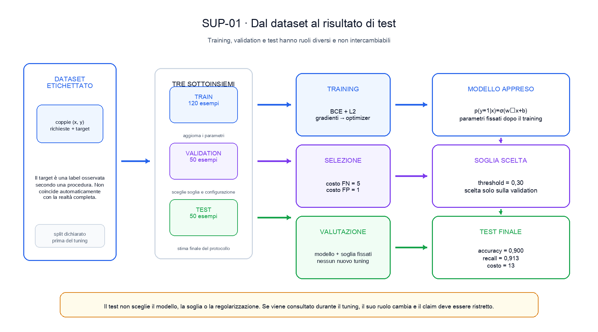
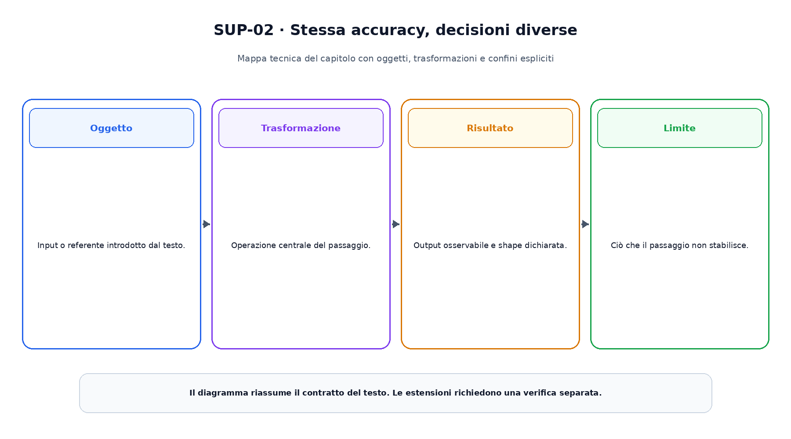

<!--
chapter_id: CH-P03-SUPERVISED
part_id: P03
order_key: 120
title: Apprendimento supervisionato
maturity: CORE
status: testo, codice e visuali completi; revisione autoriale aperta
version: 0.2.0-rc1
opened: 2026-07-31
last_web_research: 2026-07-31
last_source_check: 2026-07-31
environment: Python 3.13.5, PyTorch 2.10.0+cpu
deferred: apprendimento auto-supervisionato, calibration avanzata, conformal prediction, causal inference, online learning e distributed training
-->

# Capitolo 12. Apprendimento supervisionato

Nel capitolo precedente abbiamo rappresentato conoscenza e incertezza con fatti, regole e distribuzioni. Quei componenti erano specificati direttamente: qualcuno dichiarava i predicati, scriveva le regole o assegnava le probabilità locali. Molti problemi, però, non si lasciano descrivere bene con un insieme completo di istruzioni scritte a mano.

Riprendiamo la richiesta «Il pacco non è arrivato». Supponiamo di avere molte richieste passate e, per ciascuna, una label che indica se il caso richiedeva un intervento urgente. Vogliamo usare questi esempi per costruire una funzione che riceva una nuova richiesta e produca uno score. La funzione non deve ricordare soltanto gli esempi di training. Deve comportarsi in modo utile anche su casi che non ha visto.

Questo è il problema centrale dell'**apprendimento supervisionato**: apprendere una relazione da coppie input-target e valutare quanto il comportamento ottenuto si trasferisca oltre il campione usato per aggiornare i parametri.

I capitoli precedenti hanno già preparato gli strumenti necessari. L'algebra lineare descrive i dati e i parametri; il calcolo differenziale produce i gradienti; la probabilità distingue campione e popolazione; la teoria dell'informazione fornisce loss come la cross-entropy; il calcolo numerico ricorda che tutte queste operazioni vengono eseguite con precisione finita. Ora li riuniamo in un unico protocollo di apprendimento.

## Dalle osservazioni alle coppie input-target

Un dataset supervisionato contiene esempi della forma

$$
(x_n,y_n),
$$

dove $x_n$ è l'input e $y_n$ è il target associato. Nel nostro caso, `x` può contenere segnali numerici estratti dalla richiesta e dai dati di tracking, mentre `y` vale `1` per un caso urgente e `0` per un caso non urgente.

Il target non coincide automaticamente con la realtà completa. È un valore osservato secondo una procedura. Può derivare dalla decisione di un operatore, dall'esito successivo del ticket, da una regola aziendale o da una annotazione manuale. Se la procedura è incoerente o misura un concetto diverso da quello che ci interessa, il modello può apprendere fedelmente la label e restare inadatto al compito reale.

Questa distinzione impedisce una scorciatoia frequente. Il dataset non consegna al modello la verità in forma pura. Consegna input e target prodotti da un processo che deve essere documentato, controllato e mantenuto nel tempo.

Nel codice del capitolo useremo due feature illustrative:

```text
segnale di ritardo osservabile
segnale linguistico di urgenza
```

Gli esempi appartengono inoltre a due slice:

```text
tracking disponibile
tracking mancante
```

La slice non entra nel modello come una terza feature. Serve a controllare se gli errori si distribuiscono nello stesso modo quando il tracking è assente. Il dataset è sintetico e non descrive un servizio reale.

### Classificazione e regressione

Nella **classificazione**, il target appartiene a un insieme discreto. Possiamo distinguere richieste urgenti e non urgenti, oppure scegliere tra più categorie come consegna, pagamento e modifica dell'ordine.

Nella **regressione**, il target è una quantità numerica, per esempio il tempo stimato prima della risoluzione del ticket. Il nome non implica che l'output sia sempre una retta. Indica una famiglia di problemi in cui il modello produce una quantità continua o strutturata come valore numerico.

La stessa applicazione può contenere entrambi i compiti. Un modello può classificare il tipo di richiesta e un secondo modello può stimare il tempo necessario per gestirla. Le loss, le metriche e gli errori rilevanti non sono identici.

## Predittore, loss e rischio empirico

Indichiamo con

$$
f_\theta(x)
$$

il predittore parametrizzato da $\theta$. Il training cerca parametri che riducano una loss sugli esempi disponibili.

Per un dataset di $N$ coppie, il **rischio empirico** medio è

$$
\hat R(\theta)
=
\frac{1}{N}
\sum_{n=1}^{N}
\ell\bigl(f_\theta(x_n),y_n\bigr).
$$

La loss stabilisce quali differenze tra output e target diventano costose. Nel caso binario useremo la binary cross-entropy applicata ai logits. Nel caso della regressione potremmo usare, sotto ipotesi differenti, errore quadratico, errore assoluto o una likelihood esplicita.

Minimizzare il rischio empirico non è l'obiettivo finale. È il problema computabile sul campione. La quantità che vorremmo controllare è la loss attesa sui casi futuri pertinenti all'uso del sistema:

$$
R(\theta)
=
\mathbb{E}_{(X,Y)\sim P_{\mathrm{uso}}}
\left[
\ell\bigl(f_\theta(X),Y\bigr)
\right].
$$

La distribuzione $P_{\mathrm{uso}}$ non è nota direttamente e può cambiare. Il test set ne fornisce una rappresentazione limitata, costruita secondo il protocollo scelto. Per questo un errore basso sul training non dimostra da solo una buona generalizzazione.

### Una baseline prima del modello complesso

Nel dataset sintetico del capitolo la classe urgente è minoritaria nel training. Una baseline semplice predice quindi sempre la classe non urgente. Sul test ottiene accuratezza `0,540`, perché 27 casi su 50 sono negativi. Non riconosce però nessuno dei 23 positivi e riceve un costo pesato pari a `115` quando un falso negativo costa `5` e un falso positivo costa `1`.

La baseline rende visibile il problema che il modello deve superare. Un'accuratezza maggiore della casualità non basta. Il confronto pertinente dipende dalla distribuzione delle classi e dal costo degli errori.

## Una logistic regression come caso base

Per la classificazione binaria usiamo una logistic regression. Il modello calcola un logit

$$
z=w^Tx+b
$$

e lo trasforma in probabilità con la sigmoide:

$$
p_\theta(y=1\mid x)
=
\sigma(z)
=
\frac{1}{1+e^{-z}}.
$$

Con soglia $0{,}50$, la superficie su cui $z=0$ è la frontiera decisionale. Per una soglia generica $\tau$, la frontiera resta lineare ma si sposta secondo $w^Tx+b=\log(\tau/(1-\tau))$. Cambiare soglia non cambia i parametri $w$ e $b$; cambia il punto in cui lo score viene convertito in una classe.

La regressione logistica collega variabili esplicative e probabilità di un esito binario attraverso il logit. Il lavoro di Cox del 1958 costituisce uno dei riferimenti storici per l'analisi di sequenze binarie [Cox, 1958]. Nel deep learning, lo stesso contratto appare come un layer lineare seguito da una loss numericamente stabile.

PyTorch offre `BCEWithLogitsLoss`, che combina la forma logistica e la binary cross-entropy evitando di calcolare separatamente una sigmoide e poi il logaritmo [PyTorch 2.13, `BCEWithLogitsLoss`]. Nel codice scriviamo:

```python
logits = model(features).squeeze(-1)
data_loss = F.binary_cross_entropy_with_logits(logits, targets)
```

Aggiungiamo una penalità L2 sui pesi:

$$
J(\theta)
=
\hat R(\theta)
+
\lambda\lVert w\rVert_2^2.
$$

Il termine regolarizzante non modifica le label. Modifica la funzione obiettivo, rendendo costosi pesi molto grandi. La forza `λ` è un iperparametro e deve essere scelta senza usare il test set.

Nel run registrato, l'obiettivo regolarizzato passa da `0,778276` a `0,313711`. Questo mostra che l'optimizer ha ridotto la funzione dichiarata sul training sintetico. Non dimostra da solo che il modello sia il migliore possibile o che generalizzi a un servizio reale.

## Train, validation e test formano un protocollo

Il dataset viene diviso in tre parti con ruoli distinti.

Il **training set** aggiorna i parametri. Il modello vede direttamente questi esempi nel ciclo di ottimizzazione.

Il **validation set** confronta configurazioni che non appartengono ai parametri appresi nello stesso ciclo, per esempio regolarizzazione, numero di step, architettura o soglia di decisione.

Il **test set** viene usato dopo la selezione, con modello e procedura fissati, per stimare il risultato del protocollo dichiarato.



La figura mostra due flussi che devono incontrarsi senza confondersi. Il training produce i parametri del modello. La validation applica quel modello e sceglie una soglia sulla base di un costo dichiarato. Solo dopo il test riceve il modello e la soglia fissati.

Nel caso eseguito, un falso negativo costa `5` e un falso positivo costa `1`. Sulla validation, la soglia `0,30` produce il costo più basso tra 17 candidate da `0,10` a `0,90`. La scelta usa soltanto output e target della validation.

Consultare ripetutamente il test e modificare la soglia in risposta ai risultati trasforma gradualmente il test in un altro validation set. Il file può continuare a chiamarsi `test`, ma l'indipendenza che sosteneva il claim è stata ridotta.

### Split casuale, temporale e per gruppo

Una divisione casuale è appropriata soltanto quando rappresenta il modo in cui i casi futuri arriveranno e quando gli esempi possono essere trattati come unità sufficientemente indipendenti.

Se più messaggi appartengono allo stesso ordine o allo stesso cliente, separarli casualmente può collocare informazioni quasi duplicate in training e test. Se il sistema verrà usato nel futuro, uno split temporale può essere più informativo. Se deve generalizzare a nuovi clienti, conviene separare interi gruppi.

La percentuale `80/10/10` non è una regola universale. Il principio è impedire che la fase di sviluppo usi informazione che non sarebbe disponibile al momento della previsione reale.

## La soglia appartiene alla decisione

La logistic regression produce uno score continuo tra zero e uno. Per ottenere una classe dobbiamo scegliere una soglia:

$$
\hat y
=
\mathbb{1}\left[p_\theta(y=1\mid x)\geq\tau\right].
$$

La soglia `0,50` non è obbligatoria. È una convenzione naturale quando i costi sono simmetrici e le probabilità sono interpretate nel modo atteso, ma un sistema può avere priorità differenti.

Nel run del capitolo, la soglia scelta sulla validation è `0,30`. Sul test produce:

```text
accuracy = 0,900
precision = 0,875
recall = 0,913
falsi positivi = 3
falsi negativi = 2
costo pesato = 13
```

Con la soglia `0,50`, l'accuratezza resta `0,900`, ma la distribuzione degli errori cambia:

```text
precision = 0,950
recall = 0,826
falsi positivi = 1
falsi negativi = 4
costo pesato = 21
```



I due sistemi classificano correttamente 45 esempi su 50. La soglia più bassa accetta due falsi positivi aggiuntivi e recupera due positivi che la soglia `0,50` perde. Quando un falso negativo costa cinque volte un falso positivo, la prima decisione ha costo inferiore.

Questo esempio separa tre oggetti:

- il modello e i suoi parametri;
- lo score prodotto dal modello;
- la policy che converte lo score in una azione.

Cambiare soglia non riaddestra il modello e non rende automaticamente calibrate le probabilità. Modifica la decisione rispetto a un criterio.

### Precision, recall e distribuzione delle classi

Per la classe positiva:

$$
\operatorname{precision}
=
\frac{TP}{TP+FP},
$$

$$
\operatorname{recall}
=
\frac{TP}{TP+FN}.
$$

La precision risponde alla domanda: tra i casi dichiarati positivi, quanti lo erano secondo le label? Il recall chiede: tra i positivi osservati, quanti sono stati riconosciuti?

Quando la classe positiva è rara, una accuracy elevata può convivere con un recall nullo. Davis e Goadrich mostrano inoltre che ROC e precision-recall rappresentano lo stesso ranking da prospettive collegate, ma che in dataset molto sbilanciati la curva precision-recall rende più visibile il comportamento sulla classe positiva [Davis e Goadrich, 2006].

Nessuna metrica sceglie da sola la policy. Servono target, costi, prevalenza, vincoli e azioni successive.

## Generalizzazione, overfitting e variabilità

Un modello **overfit** quando il comportamento ottenuto si adatta al campione di training in un modo che non si trasferisce adeguatamente ai casi di interesse. Il fenomeno non è definito soltanto dal numero di parametri. Dipende dalla relazione tra capacità del modello, dati, rumore, procedura di training, regolarizzazione e distribuzione di valutazione.

Il training error può continuare a diminuire mentre la loss sulla validation smette di migliorare o peggiora. Questo è un segnale utile, ma non una prova universale della causa. La validation stessa contiene variabilità e può essere adattata indirettamente attraverso molte decisioni ripetute.

### Bias, varianza e rumore

Nel caso della regressione con errore quadratico, la decomposizione bias-varianza separa, sotto condizioni precise, tre contributi:

- errore sistematico del predittore medio;
- variabilità tra modelli appresi da campioni diversi;
- rumore non eliminabile rispetto al modello dei dati.

Geman, Bienenstock e Doursat collegano questa prospettiva alle reti neurali e ai metodi non parametrici [Geman et al., 1992]. La formula quadratica non va trasferita senza modifiche a ogni loss di classificazione. L'idea operativa resta utile: un metodo può sbagliare perché è troppo rigido, perché reagisce troppo al campione o perché i target contengono variabilità che le feature non permettono di spiegare.

### Regolarizzazione ed early stopping

La regolarizzazione introduce preferenze o vincoli che non derivano soltanto dalla loss sui dati. La penalità L2 favorisce pesi più piccoli rispetto a una soluzione con lo stesso errore empirico. La scelta di `λ` resta però parte del protocollo.

L'**early stopping** interrompe il training in base a un segnale di validation. Può funzionare come forma di regolarizzazione, ma richiede una regola dichiarata: metrica osservata, frequenza di controllo, pazienza, checkpoint conservato e comportamento in caso di oscillazioni. Prechelt mostra che criteri diversi producono compromessi tra tempo di training e generalizzazione [Prechelt, 1998].

Guardare continuamente la validation e cambiare la procedura a mano può overfittare anche quella partizione. Quando le decisioni diventano numerose, servono nuovi dati, nested validation o una valutazione finale realmente separata.

## Modelli diversi, stesso contratto di valutazione

La logistic regression è un caso base, non una soluzione universale.

Un **albero di decisione** suddivide lo spazio attraverso regole apprese sui valori delle feature. È capace di rappresentare interazioni non lineari, ma un singolo albero può essere sensibile a variazioni del campione.

Una **support-vector machine** costruisce una superficie decisionale cercando un margine secondo l'obiettivo e il kernel scelti. Cortes e Vapnik hanno esteso il metodo al caso non separabile attraverso variabili di slack e una penalizzazione degli errori [Cortes e Vapnik, 1995].

Una **random forest** combina molti alberi costruiti con casualità nei campioni o nelle feature. Breiman collega il comportamento della foresta alla forza dei singoli alberi e alla loro correlazione [Breiman, 2001].

Il **gradient boosting** costruisce una espansione additiva per stadi, collegando ogni nuovo componente alla discesa rispetto a una funzione obiettivo nello spazio delle funzioni [Friedman, 2001].

Queste famiglie differiscono per rappresentazione, ottimizzazione, capacità, costo e possibilità di ispezione. Devono però essere confrontate con lo stesso rigore:

- split coerenti;
- preprocessing appreso soltanto sul training;
- tuning sulla validation;
- test finale separato;
- metriche e slice pertinenti;
- budget e risorse dichiarati.

Cambiare contemporaneamente dati, feature, modello e criterio di selezione non permette di attribuire il miglioramento a una sola componente.

## Dati sbilanciati, pesi e slice

Quando una classe è rara, possiamo intervenire in punti diversi del sistema.

Un **class weight** modifica la loss. In `BCEWithLogitsLoss`, `pos_weight` aumenta il contributo dei target positivi secondo il contratto documentato [PyTorch 2.13, `BCEWithLogitsLoss`].

Il **resampling** modifica quali esempi compaiono e con quale frequenza durante il training.

La **soglia** modifica la conversione dello score in una decisione.

Questi interventi non sono equivalenti. Il peso cambia il problema di ottimizzazione; il resampling cambia la distribuzione osservata dal training; la soglia agisce dopo il modello. Possono produrre effetti simili su una metrica e comportamenti diversi su probabilità, ranking e generalizzazione.

Nel test sintetico, la soglia `0,30` produce accuracy simile nelle due slice, ma il costo non è distribuito allo stesso modo:

```text
tracking disponibile:
34 casi, recall 1,000, costo 3

tracking mancante:
16 casi, recall 0,778, costo 10
```

La media complessiva non mostra che due falsi negativi su tre si concentrano nella slice con tracking mancante. Il campione contiene soltanto 16 casi nella slice, quindi la stima resta incerta. La lettura corretta combina valore, denominatore e rilevanza operativa.

### Shift tra training e uso reale

Il modello apprende rispetto ai dati osservati e all'obiettivo dichiarato. Se cambiano linguaggio degli utenti, strumenti di tracking, politiche aziendali o prevalenza dei casi urgenti, la relazione tra input, target e costo può cambiare.

Un buon test storico non garantisce prestazioni future. Il ciclo di vita del Capitolo 3 richiede monitoraggio, raccolta di nuove label e criteri di aggiornamento. La valutazione critica del Capitolo 4 richiede di restringere il claim alle condizioni realmente misurate.

## Uno snippet che separa apprendimento e decisione

Il file [`code/snip_sup_001_logistic_threshold.py`](code/snip_sup_001_logistic_threshold.py) costruisce tre split indipendenti, addestra un layer lineare e seleziona la soglia soltanto sulla validation.

Il nucleo del training è:

```python
for _ in range(steps):
    optimizer.zero_grad()
    loss = objective(model, train, l2_strength)
    loss.backward()
    optimizer.step()
```

La soglia viene scelta in una funzione separata:

```python
threshold, validation_metrics = select_threshold(
    validation_probabilities,
    validation.targets,
)
```

Soltanto dopo il test viene valutato:

```python
test_metrics = binary_metrics(
    test_probabilities,
    test.targets,
    threshold,
)
```

Gli otto test automatici controllano shape, riduzione dell'obiettivo, validità delle probabilità, separazione della selezione dal test, costo sulla validation, confronto con soglia predefinita e baseline, ricostruzione delle slice e comportamento della baseline maggioritaria.

Il risultato numerico è un esempio eseguito, non un benchmark. Il vantaggio della soglia `0,30` dipende dal dataset sintetico e dai costi `5:1` dichiarati.

## Riepilogo

L'apprendimento supervisionato usa coppie input-target per scegliere i parametri di un predittore. La label è un artefatto osservato e deve essere distinta dal concetto reale che il sistema vuole trattare.

Il training riduce una funzione obiettivo sul campione. La generalizzazione riguarda invece casi non usati per aggiornare o selezionare il modello. Train, validation e test hanno quindi ruoli differenti. La validation sceglie configurazioni e soglie; il test sostiene il claim finale del protocollo.

Un modello produce score. Una soglia e una policy trasformano gli score in decisioni. Due soglie possono avere la stessa accuracy e distribuire in modo diverso falsi positivi, falsi negativi e costi. Le metriche vanno lette insieme a prevalenza, slice e conseguenze degli errori.

Regolarizzazione, early stopping, alberi, margini ed ensemble modificano il modo in cui il predittore viene costruito, ma non eliminano la necessità di dati pertinenti e valutazione separata. Un risultato supervisionato resta valido entro il processo che ha prodotto input, target, split e metriche.

Il capitolo successivo rimuoverà proprio l'elemento che qui guida l'apprendimento: una label esterna per ogni esempio. Vedremo come costruire segnali da dati non etichettati e come distinguere apprendimento non supervisionato e auto-supervisionato.

### Verifica della comprensione

1. Perché il target osservato non coincide automaticamente con la realtà completa?
2. Distingui classificazione e regressione con un esempio per ciascuna.
3. Qual è la differenza tra rischio empirico e rischio atteso?
4. Perché una baseline maggioritaria può avere accuracy discreta e recall nullo?
5. Quale ruolo distingue training, validation e test?
6. Perché cambiare soglia non equivale a riaddestrare il modello?
7. Come possono due soglie avere la stessa accuracy e costi differenti?
8. Perché l'overfitting non dipende soltanto dal numero di parametri?
9. Distingui class weight, resampling e soglia.
10. Quale informazione aggiunge una analisi per slice?

### Esercizi

1. Cambia il costo del falso negativo da `5` a `2` e osserva quale soglia viene scelta sulla validation.
2. Aggiungi la slice `linguaggio_indiretto` e calcola le metriche separate.
3. Rimuovi la penalità L2 e confronta obiettivo, pesi e metriche senza generalizzare dal singolo run.
4. Scegli la soglia che massimizza F1 sulla validation e confrontala con quella che minimizza il costo.
5. Sostituisci la logistic regression con una rete a un hidden layer, mantenendo invariati split e protocollo.
6. Costruisci uno split scorretto in cui copie quasi identiche dello stesso ordine compaiono nel training e nel test.
7. Aggiungi `pos_weight` alla loss e confronta l'effetto con una modifica della soglia.
8. Progetta un protocollo temporale per un sistema che dovrà lavorare su richieste del mese successivo.
9. Scrivi il claim più forte sostenuto dal test sintetico e un claim che il test non può sostenere.

## Fonti e materiali verificabili

Le fonti portanti comprendono Cox per la regressione binaria, Cortes e Vapnik per le support-vector network, Geman e colleghi per il bias-varianza, Prechelt per l'early stopping, Breiman per random forest, Friedman per gradient boosting e Davis e Goadrich per il rapporto tra ROC e precision-recall. Le definizioni e il metodo generale sono ricontrollati su *Deep Learning*, *The Elements of Statistical Learning* e *Pattern Recognition and Machine Learning*.

I contratti di `BCEWithLogitsLoss`, `CrossEntropyLoss`, `Linear` e degli optimizer sono verificati sulla documentazione ufficiale PyTorch stable. Le schede complete e i limiti d'uso sono in [`FONTI_PRIMARIE.md`](FONTI_PRIMARIE.md). Claim, codice, test, output e ambiente sono raccolti in [`CLAIMS.md`](CLAIMS.md) e nella cartella [`code/`](code/).
