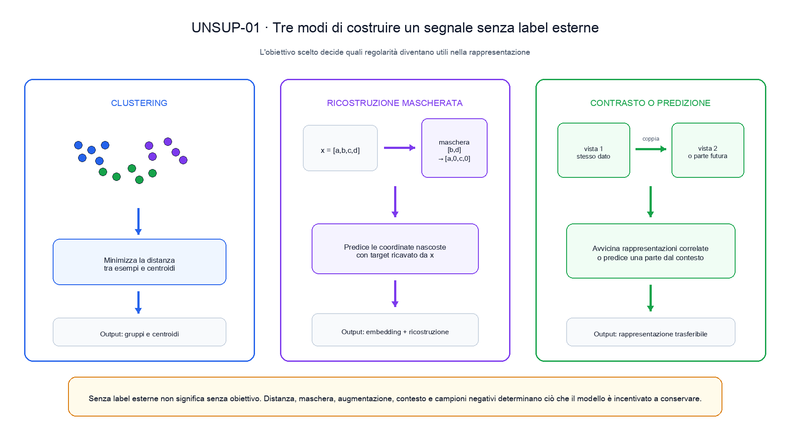
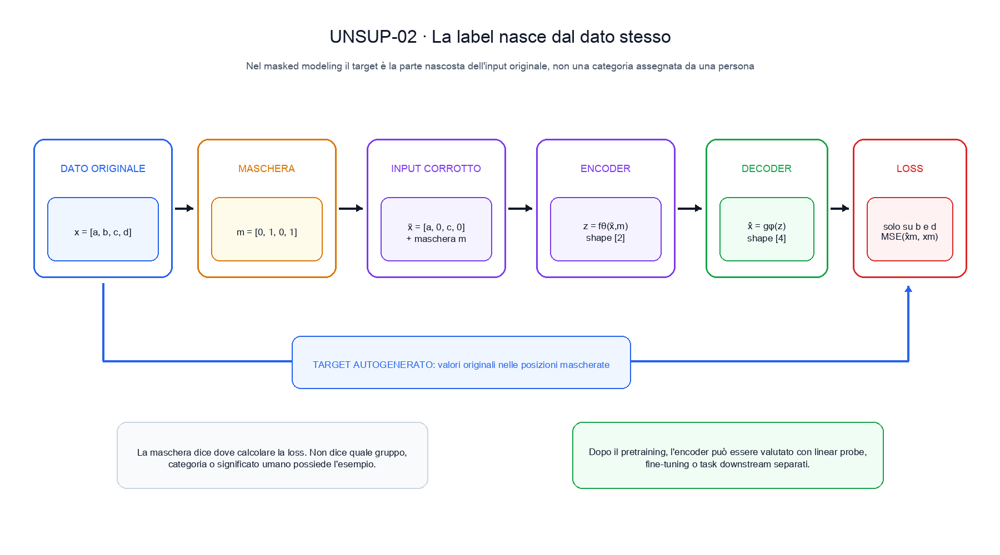

<!--
chapter_id: CH-P03-UNSUPERVISED-SELF
part_id: P03
order_key: 130
title: Apprendimento non supervisionato e auto-supervisionato
maturity: CORE
status: testo, codice e visuali completi; revisione autoriale aperta
version: 0.2.0-rc1
opened: 2026-07-31
last_web_research: 2026-07-31
last_source_check: 2026-07-31
environment: Python 3.13.5, PyTorch 2.10.0+cpu
deferred: modelli generativi completi, contrastive learning avanzato, distillazione senza label, clustering su larga scala, multimodal pretraining e continual learning
-->

# Capitolo 13. Apprendimento non supervisionato e auto-supervisionato

Nel capitolo precedente ogni esempio arrivava con un target esterno. La richiesta «Il pacco non è arrivato» poteva essere accompagnata da una label come `urgente` oppure `non urgente`, e quella label guidava direttamente la loss. Molti dati disponibili in un sistema reale, però, non hanno questa forma. Possiamo possedere milioni di messaggi, immagini, eventi o documenti senza un'annotazione affidabile per ciascuno.

Rimuovere le label non rimuove il problema di apprendimento. Rimuove soltanto un tipo di segnale. Dobbiamo ancora scegliere quali relazioni rendere costose, quali trasformazioni considerare equivalenti e quale parte del dato chiedere al modello di prevedere.

In questo capitolo useremo una convenzione esplicita. Chiameremo **apprendimento non supervisionato** l'insieme ampio dei metodi che apprendono struttura senza usare, durante quel training, una label esterna per il compito finale. Chiameremo **auto-supervisionato** il caso in cui input e target vengono costruiti automaticamente dal dato stesso, per esempio nascondendo una parte dell'input oppure creando due viste correlate. Questa terminologia è comune nella letteratura moderna, ma i confini non sono sempre identici tra autori. Per questo dichiareremo ogni volta il segnale effettivamente usato.

Il filo conduttore resta il sistema di assistenza. Rappresentiamo ogni richiesta con quattro numeri illustrativi. Invece di fornire la categoria corretta, chiederemo prima di individuare gruppi geometrici e poi di ricostruire coordinate nascoste. Il codice non usa i gruppi segreti del generatore per addestrare i due metodi. Le label nascoste servono soltanto a costruire un dataset sintetico controllabile.

## Senza label non significa senza obiettivo

Un algoritmo non scopre una struttura neutrale e inevitabile. K-means privilegia gruppi compatti rispetto alla distanza euclidea. Un autoencoder privilegia informazioni sufficienti a ricostruire l'input. Un metodo contrastivo privilegia le proprietà condivise tra viste dichiarate correlate e separa esempi usati come confronto. Un obiettivo mascherato privilegia ciò che permette di prevedere le parti nascoste dal contesto visibile.

Queste scelte introducono un **bias induttivo**, cioè una preferenza incorporata nel modello, nell'obiettivo, nei dati o nelle trasformazioni. Il bias non è necessariamente un errore. Senza qualche preferenza, molti problemi ammetterebbero troppe soluzioni ugualmente compatibili con i dati osservati.

La figura riunisce tre famiglie senza presentarle come una classifica.



Nel primo pannello il segnale deriva dalla distanza dai centroidi. Nel secondo deriva dalla ricostruzione di coordinate nascoste. Nel terzo deriva da una relazione tra due viste o tra contesto e parte futura. In tutti i casi esiste una funzione obiettivo. Ciò che manca è una categoria assegnata esternamente a ogni esempio per il compito finale.

Questa distinzione evita due affermazioni scorrette. Un metodo senza label non è privo di supervisione in senso operativo, perché maschere, augmentazioni e coppie positive definiscono comunque un compito. Allo stesso tempo, un target costruito dal dato non equivale a una label semantica: sapere quale token è stato nascosto non ci dice automaticamente quale intento umano esprima la frase.

## Cercare gruppi con k-means

Supponiamo di avere $N$ vettori $x_i\in\mathbb{R}^d$ e di volerli dividere in $K$ gruppi. K-means associa ogni esempio a un centroide e minimizza la somma delle distanze quadratiche:

$$
J
=
\sum_{i=1}^{N}
\left\lVert x_i-\mu_{c_i}\right\rVert_2^2,
$$

dove $c_i$ indica il gruppo assegnato all'esempio $i$ e $\mu_k$ è il centroide del gruppo $k$.

Nel caso base, l'algoritmo alterna due operazioni.

Prima assegna ogni punto al centroide più vicino:

$$
c_i
=
\arg\min_k
\lVert x_i-\mu_k\rVert_2^2.
$$

Poi ricalcola ciascun centroide come media dei punti assegnati:

$$
\mu_k
=
\frac{1}{|C_k|}
\sum_{i\in C_k}x_i.
$$

Ogni passaggio non aumenta l'obiettivo rispetto all'altro blocco fissato, ma il risultato dipende dall'inizializzazione e può essere un minimo locale. Il metodo richiede inoltre di scegliere $K$ e assume che la distanza usata rappresenti una relazione pertinente. MacQueen presentò nel 1967 una famiglia di procedure sequenziali per classificare osservazioni multivariate; la forma oggi comunemente chiamata k-means viene studiata anche attraverso varianti batch e differenti inizializzazioni [MacQueen, 1967].

Nel nostro dataset sintetico, il generatore crea tre gruppi di 40 esempi nel training. L'algoritmo non riceve questi identificatori. Parte da tre punti scelti attraverso una inizializzazione geometrica e riduce l'obiettivo:

```text
203,144502 -> 60,284823
```

Il risultato contiene tre cluster non vuoti, ciascuno con 40 esempi. Questo allineamento con i gruppi del generatore è una proprietà del caso costruito. Non dimostra che k-means trovi categorie semantiche in un dataset reale.

### La geometria viene prima del nome del gruppo

Il numero assegnato a un cluster non possiede un significato stabile. Una seconda esecuzione può scambiare `cluster 0` e `cluster 2` senza cambiare la partizione. Anche quando un gruppo corrisponde bene a una categoria umana, il collegamento deve essere valutato separatamente.

La distanza euclidea è sensibile alla scala delle feature. Se una coordinata varia tra `0` e `1000` e un'altra tra `0` e `1`, la prima può dominare l'obiettivo. Standardizzazione, normalizzazione o una metrica diversa cambiano quindi il problema, non soltanto la velocità del codice.

K-means tende inoltre a descrivere bene gruppi compatti rispetto alla metrica scelta. Strutture allungate, densità differenti, rumore e cluster non convessi possono richiedere altri metodi. Il capitolo non costruisce una tassonomia completa del clustering. Stabilisce il principio più importante: il gruppo ottenuto dipende dalla rappresentazione e dall'obiettivo.

## Ridurre la dimensione e apprendere una rappresentazione

Il Capitolo 5 ha introdotto la singular value decomposition e le approssimazioni a rango ridotto. La principal component analysis può usare quella struttura per trovare un sottospazio lineare che conserva la massima varianza secondo il criterio adottato. È un esempio di apprendimento senza label in cui la rappresentazione viene scelta attraverso un obiettivo geometrico.

Un **autoencoder** sostituisce la proiezione lineare con due funzioni apprese:

$$
z=f_\theta(x),
$$

$$
\hat x=g_\phi(z).
$$

L'encoder produce una rappresentazione $z$; il decoder ricostruisce l'input. Una loss comune è

$$
\mathcal{L}_{\mathrm{rec}}
=
\frac{1}{N}
\sum_{i=1}^{N}
\lVert g_\phi(f_\theta(x_i))-x_i\rVert_2^2.
$$

Hinton e Salakhutdinov mostrarono nel 2006 come reti neurali profonde potessero apprendere codifiche a bassa dimensione per ricostruire dati ad alta dimensione [Hinton e Salakhutdinov, 2006]. La ricostruzione, però, non garantisce che ogni coordinata latente corrisponda a un concetto interpretabile o utile per qualunque compito successivo.

Se encoder e decoder possiedono capacità sufficiente, il modello può imparare una trasformazione vicina all'identità. Un bottleneck, rumore, sparsità o altri vincoli rendono il compito meno triviale. I denoising autoencoder, per esempio, ricevono una versione corrotta del dato e devono ricostruire quella originale [Vincent et al., 2008]. L'obiettivo incoraggia quindi l'uso di regolarità che permettono di correggere la corruzione scelta.

La corruzione resta una decisione progettuale. Nascondere parole, aggiungere rumore gaussiano, eliminare patch o modificare colori costruisce compiti differenti. Il modello non può imparare invarianti che l'obiettivo non rende utili o osservabili.

## Auto-supervisione attraverso una parte nascosta

Nel masked modeling il target viene ricavato dall'input originale. Consideriamo

$$
x=[a,b,c,d]
$$

e una maschera

$$
m=[0,1,0,1].
$$

Le posizioni `b` e `d` vengono nascoste. Il modello riceve i valori visibili e l'informazione su quali coordinate mancano:

$$
\tilde x=[a,0,c,0].
$$

Encoder e decoder producono una ricostruzione $\hat x$. La loss viene calcolata soltanto sulle coordinate mascherate:

$$
\mathcal{L}_{\mathrm{mask}}
=
\frac{1}{|M|}
\sum_{j\in M}
(\hat x_j-x_j)^2.
$$



La linea blu della figura collega il dato originale alla loss. Il target non arriva da un annotatore: è la parte nascosta dell'input stesso. La maschera indica dove valutare l'errore, ma non assegna al dato una categoria umana.

BERT costruisce una parte del proprio segnale di pretraining mascherando token e chiedendo al modello di predirli dal contesto bidirezionale [Devlin et al., 2019]. I masked autoencoder per la visione nascondono patch e ricostruiscono i pixel mancanti con una architettura encoder-decoder asimmetrica [He et al., 2022]. I due lavori condividono il principio generale, ma differiscono per rappresentazione, architettura, corruzione e target.

Nel nostro snippet, una piccola rete riceve quattro valori corrotti e la maschera binaria. L'encoder produce un embedding a due dimensioni. La loss sulle coordinate nascoste passa da

```text
2,218895
```

a

```text
0,359401
```

sul training. Sul test sintetico fissato, la loss è `0,391415`, mentre una baseline che riempie ogni coordinata con la media del training ottiene `1,900604`.

Il confronto dimostra soltanto che, nel caso costruito, la rete sfrutta relazioni tra coordinate meglio della baseline dichiarata. Non prova che l'embedding sia semanticamente utile. Per stabilirlo serve una valutazione downstream separata.

## Prevedere il futuro o distinguere coppie correlate

La ricostruzione non è l'unico modo per costruire un target dal dato.

Contrastive Predictive Coding comprime osservazioni in uno spazio latente, riassume il contesto e usa una loss contrastiva per distinguere il vero futuro da campioni negativi [van den Oord et al., 2018]. Invece di ricostruire ogni dettaglio dell'osservazione futura, il modello deve assegnare un punteggio maggiore alla coppia compatibile con il contesto.

Una forma semplificata di loss contrastiva per un esempio $i$ è

$$
\mathcal{L}_i
=
-\log
\frac{
\exp(\operatorname{sim}(z_i,z_i^+)/\tau)
}{
\sum_{a\in A(i)}
\exp(\operatorname{sim}(z_i,z_a)/\tau)
},
$$

dove $z_i^+$ è una rappresentazione considerata positiva per $i$, $A(i)$ contiene la positiva e le alternative usate nel denominatore, `sim` è una misura di similarità e $\tau$ controlla la scala dei logits.

La formula non decide da sola che cosa sia una coppia positiva. In SimCLR due viste augmentate della stessa immagine formano una coppia positiva. Gli autori mostrano che la composizione delle augmentazioni è centrale per il compito contrastivo [Chen et al., 2020]. Se una trasformazione elimina una proprietà che serve al task successivo, il modello può imparare a ignorarla proprio perché il training la tratta come irrilevante.

Anche i campioni negativi e la temperatura cambiano l'obiettivo. Definire come negative due osservazioni semanticamente simili può introdurre conflitti. Usare batch più grandi modifica il numero e la distribuzione delle alternative. Queste scelte appartengono al meccanismo, non a dettagli neutri dell'implementazione.

### Evitare rappresentazioni collassate

Una rappresentazione **collassata** assegna output identici o quasi identici a molti input. In un compito di ricostruzione, un decoder incapace di distinguere gli esempi riceve in genere una loss elevata. In un metodo contrastivo, il denominatore e le negative contrastano la soluzione costante. Altre famiglie evitano il collasso attraverso asimmetrie, stop-gradient, normalizzazioni, predittori o distribuzioni di target.

Non esiste quindi un solo rimedio universale. Ogni metodo deve spiegare quale parte dell'obiettivo impedisce una soluzione priva di informazione e sotto quali condizioni.

## Clustering e pseudo-label nel training neurale

Clustering e reti neurali possono essere combinati. DeepCluster alterna il clustering delle feature prodotte da una rete e l'uso delle assegnazioni ottenute come target per aggiornare i pesi [Caron et al., 2018]. Le assegnazioni vengono spesso chiamate **pseudo-label** perché non provengono da un'annotazione umana, ma entrano in un passo supervisionato interno.

Il ciclo crea una dipendenza reciproca:

```text
rappresentazioni
-> clustering
-> pseudo-label
-> update della rete
-> nuove rappresentazioni
```

La procedura può migliorare le feature, ma può anche rafforzare partizioni iniziali poco utili o produrre cluster sbilanciati. Le tecniche pratiche usate per evitare soluzioni degeneri appartengono alla ricetta specifica e non sono deducibili dalla sola parola `clustering`.

Questo esempio chiarisce perché i confini terminologici non bastano. Un algoritmo può alternare un passo non supervisionato e un passo che usa target generati automaticamente. La descrizione più informativa dichiara l'intero ciclo.

## Pretraining, linear probe e fine-tuning

L'auto-supervisione viene spesso usata per il **pretraining**. L'encoder apprende una rappresentazione su dati senza label del task finale; in seguito quella rappresentazione viene valutata o adattata con un insieme etichettato più piccolo.

Tre protocolli rispondono a domande diverse.

Nel **linear probe**, l'encoder viene congelato e si addestra soltanto un classificatore lineare sopra le rappresentazioni. Il risultato misura quanto il target downstream sia accessibile linearmente, non l'intera capacità del modello.

Nel **fine-tuning**, anche i parametri dell'encoder vengono aggiornati. Il risultato misura la qualità della inizializzazione insieme alla procedura di adattamento.

Nel confronto **from scratch**, la stessa architettura viene addestrata senza il pretraining considerato. Per attribuire un vantaggio al pretraining, dati etichettati, budget, augmentation e tuning devono essere comparabili.

BERT usa pretraining su testo senza label di task e fine-tuning con un livello di output aggiuntivo per compiti successivi [Devlin et al., 2019]. SimCLR valuta rappresentazioni attraverso linear evaluation e fine-tuning [Chen et al., 2020]. I masked autoencoder vengono valutati con fine-tuning e transfer su task di visione [He et al., 2022]. Questi protocolli non sono intercambiabili e i numeri dei paper non devono essere confrontati senza controllare dati, architetture e setup.

### Le label possono comparire nella valutazione

Dire che un encoder è stato addestrato senza label non significa che nessuna label venga mai usata nel progetto. Le label possono comparire dopo, per misurare clustering, linear separability o prestazione downstream. Devono però restare fuori dall'ottimizzazione che viene chiamata non supervisionata o auto-supervisionata.

Anche la scelta di iperparametri può introdurre supervisione indiretta. Se selezioniamo l'augmentazione migliore osservando continuamente l'accuracy su un benchmark etichettato, il processo complessivo usa informazione del task finale, anche se la loss di pretraining non la contiene.

## Uno snippet con due obiettivi differenti

Il file [`code/snip_unsup_001_structure_and_masking.py`](code/snip_unsup_001_structure_and_masking.py) applica due metodi allo stesso dataset sintetico.

K-means usa soltanto le feature:

```python
squared_distances = torch.cdist(features, centroids).square()
assignments = squared_distances.argmin(dim=1)
```

La ricostruzione mascherata costruisce il target dall'input originale:

```python
corrupted = features.masked_fill(mask, 0.0)
reconstruction, embedding = model(corrupted, mask)
loss = F.mse_loss(reconstruction[mask], features[mask])
```

Il modello riceve anche la maschera, perché uno zero può essere un valore legittimo e non deve essere usato come unico indicatore della corruzione. Durante il training, la maschera cambia a ogni step; il test usa una maschera fissata per rendere riproducibile il confronto.

I nove test controllano:

- shape dei dati;
- obiettivo k-means non crescente;
- cluster non vuoti;
- centroidi uguali alla media dei membri assegnati;
- almeno una coordinata mascherata per esempio;
- riduzione della loss di ricostruzione;
- risultato migliore della baseline media nel caso fissato;
- shape `[60,2]` dell'embedding di test;
- determinismo del run registrato.

La label nascosta del generatore non viene usata da k-means, dall'autoencoder o dalla loss. Non viene inoltre usata per scegliere il numero di step o il modello. Il codice è costruito per mostrare il contratto, non per proporre una ricetta di produzione.

## Che cosa può andare storto

### La struttura trovata può non essere quella utile

Un clustering può separare messaggi per lunghezza invece che per intento. Un autoencoder può dedicare capacità a dettagli frequenti ma irrilevanti. Un obiettivo contrastivo può rendere invarianti proprietà necessarie al task successivo.

L'ottimizzazione riuscita dimostra che il modello ha ridotto l'obiettivo dichiarato. Non dimostra che l'obiettivo corrisponda al problema applicativo.

### Shortcut e trasformazioni scorrette

Un compito auto-supervisionato può essere risolto attraverso una scorciatoia. Se la corruzione introduce un bordo artificiale, il modello può riconoscere il bordo invece di usare il contesto. Se due viste positive condividono un artefatto del preprocessing, la rappresentazione può concentrarsi su quello.

Le trasformazioni devono quindi essere controllate rispetto alla modalità e al task downstream. `Augmentazione forte` non è una specifica sufficiente.

### Benchmark e tuning

Un modello può essere chiamato self-supervised e ricevere comunque molto tuning basato su benchmark etichettati. Per leggere correttamente il risultato servono il numero di tentativi, i dati usati per la selezione e il protocollo finale.

### Dati e privacy

L'assenza di label non elimina problemi di qualità, privacy, licenza o rappresentatività. I dati grezzi possono contenere informazioni sensibili e duplicati. Il pretraining può conservare regolarità indesiderate o memorizzare esempi. Questi rischi verranno approfonditi nelle parti dedicate ai dati e alla sicurezza.

## Riepilogo

Nell'apprendimento supervisionato il target arriva da una procedura esterna al dato. Nell'apprendimento non supervisionato e auto-supervisionato il segnale viene invece costruito attraverso geometria, ricostruzione, predizione, trasformazioni o relazioni tra esempi.

K-means minimizza la distanza quadratica dai centroidi e produce una partizione dipendente dalla rappresentazione, dalla metrica, da $K$ e dalla inizializzazione. Un autoencoder comprime e ricostruisce; mascherare o corrompere l'input rende il compito meno vicino a una semplice identità. I metodi contrastivi e predittivi costruiscono coppie e alternative, mentre il masked modeling usa come target parti nascoste del dato originale.

Nessuno di questi obiettivi garantisce una rappresentazione semanticamente utile. Linear probe, fine-tuning, task downstream e controlli per slice servono a misurare ciò che la rappresentazione rende disponibile. Le label possono quindi comparire nella valutazione pur restando assenti dal pretraining dichiarato.

Il capitolo successivo cambia nuovamente il tipo di segnale. Un agente non osserva soltanto un dataset statico: sceglie azioni, modifica lo stato che vedrà dopo e riceve reward ritardati. Questo richiede un modello di decisione sequenziale e introduce il reinforcement learning.

### Verifica della comprensione

1. Perché `senza label` non significa `senza obiettivo`?
2. Quali scelte definiscono la geometria usata da k-means?
3. Perché il numero di un cluster non è una categoria semantica stabile?
4. Qual è la differenza tra autoencoder ordinario e denoising autoencoder?
5. Da dove proviene il target nel masked modeling?
6. Che cosa definisce una coppia positiva in un metodo contrastivo?
7. Perché una augmentazione può eliminare informazione utile?
8. Distingui linear probe e fine-tuning.
9. In quale punto possono entrare label downstream senza rendere supervisionata la loss di pretraining?
10. Quali claim non sono sostenuti dalla riduzione della reconstruction loss nello snippet?

### Esercizi

1. Cambia la scala della prima feature e osserva come cambia k-means.
2. Esegui k-means con differenti centroidi iniziali e confronta l'obiettivo finale.
3. Aumenta il numero di cluster a quattro e descrivi quale nuova decisione hai introdotto.
4. Riduci l'embedding del masked autoencoder a una sola dimensione e confronta train e test loss.
5. Calcola la loss di ricostruzione anche sulle coordinate visibili e spiega come cambia il compito.
6. Sostituisci la baseline media con una baseline che usa il centroide più vicino senza usare label.
7. Progetta due augmentazioni positive per messaggi testuali e indica quale informazione potrebbero cancellare.
8. Scrivi un protocollo di linear probe che mantenga congelato l'encoder.
9. Costruisci un esempio di target auto-generato che permetta una scorciatoia indesiderata.
10. Elenca le informazioni etichettate che possono entrare nel tuning complessivo pur non comparendo nella loss auto-supervisionata.

## Fonti e materiali verificabili

Le fonti portanti comprendono MacQueen per k-means, Hinton e Salakhutdinov e Vincent et al. per autoencoder e denoising, van den Oord et al. per Contrastive Predictive Coding, Devlin et al. per masked language modeling, Caron et al. per DeepCluster, Chen et al. per SimCLR e He et al. per masked autoencoder visuali. I contratti di `MSELoss`, `Linear` e `cdist` sono controllati sulla documentazione ufficiale PyTorch stable.

Le schede complete e i limiti d'uso sono in [`FONTI_PRIMARIE.md`](FONTI_PRIMARIE.md). Claim, codice, test, output e ambiente sono raccolti in [`CLAIMS.md`](CLAIMS.md) e nella cartella [`code/`](code/).
