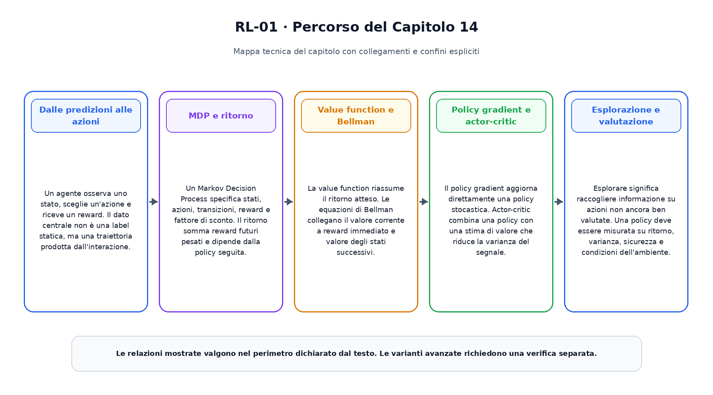
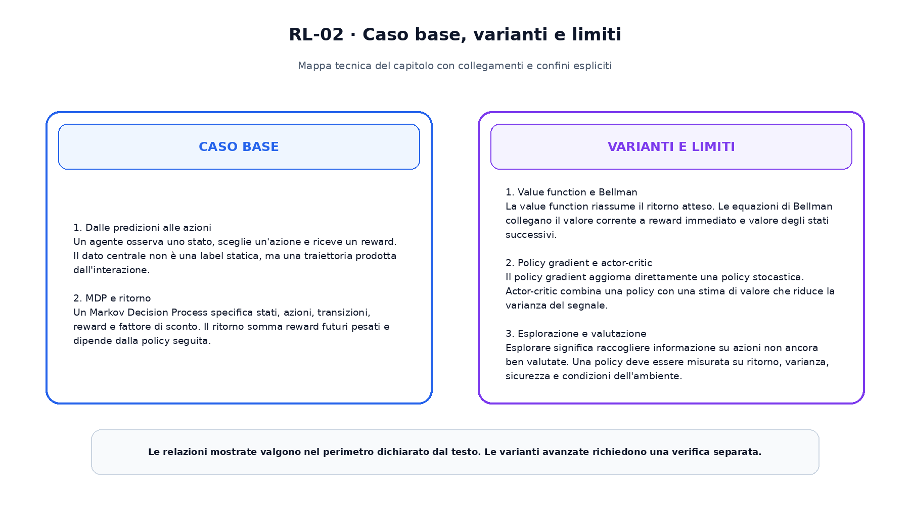

<!--
chapter_id: CH-P03-RL
part_id: P03
order_key: 140
title: Reinforcement learning
maturity: CORE
status: completo, validato e congelato
version: 1.0.0
last_source_check: 2026-08-01
-->

# Capitolo 14. Reinforcement learning

Il capitolo precedente ha costruito il prerequisito immediato necessario. Ora applichiamo lo stesso oggetto continuo, la richiesta «Il pacco non è arrivato», a una nuova capacità. L'obiettivo è capire il meccanismo in modo operativo, senza attribuire al modello proprietà che non sono state misurate.

## Dalle predizioni alle azioni

Un agente osserva uno stato, sceglie un'azione e riceve un reward. Il dato centrale non è una label statica, ma una traiettoria prodotta dall'interazione.

Questo passaggio usa l'oggetto continuo del libro e rende esplicito quale quantità viene trasformata, quale risultato viene ottenuto e quale limite resta aperto. L'esempio numerico e lo snippet permettono di controllare il contratto senza trasformarlo in una descrizione di un sistema reale.

## MDP e ritorno

Un Markov Decision Process specifica stati, azioni, transizioni, reward e fattore di sconto. Il ritorno somma reward futuri pesati e dipende dalla policy seguita.

Questo passaggio usa l'oggetto continuo del libro e rende esplicito quale quantità viene trasformata, quale risultato viene ottenuto e quale limite resta aperto. L'esempio numerico e lo snippet permettono di controllare il contratto senza trasformarlo in una descrizione di un sistema reale.

## Value function e Bellman

La value function riassume il ritorno atteso. Le equazioni di Bellman collegano il valore corrente a reward immediato e valore degli stati successivi.

Questo passaggio usa l'oggetto continuo del libro e rende esplicito quale quantità viene trasformata, quale risultato viene ottenuto e quale limite resta aperto. L'esempio numerico e lo snippet permettono di controllare il contratto senza trasformarlo in una descrizione di un sistema reale.

## Policy gradient e actor-critic

Il policy gradient aggiorna direttamente una policy stocastica. Actor-critic combina una policy con una stima di valore che riduce la varianza del segnale.

Questo passaggio usa l'oggetto continuo del libro e rende esplicito quale quantità viene trasformata, quale risultato viene ottenuto e quale limite resta aperto. L'esempio numerico e lo snippet permettono di controllare il contratto senza trasformarlo in una descrizione di un sistema reale.

## Esplorazione e valutazione

Esplorare significa raccogliere informazione su azioni non ancora ben valutate. Una policy deve essere misurata su ritorno, varianza, sicurezza e condizioni dell'ambiente.

Questo passaggio usa l'oggetto continuo del libro e rende esplicito quale quantità viene trasformata, quale risultato viene ottenuto e quale limite resta aperto. L'esempio numerico e lo snippet permettono di controllare il contratto senza trasformarlo in una descrizione di un sistema reale.

La prima figura ordina i passaggi e mostra il risultato consegnato alla fase successiva.

La seconda figura separa il contratto minimo dalle estensioni.

## Snippet verificabile

Il file [`code/snip_14_contract.py`](code/snip_14_contract.py) applica una normalizzazione stabile e combina stati con shape dichiarate. Lo snippet è intenzionalmente piccolo: verifica il tipo di ragionamento numerico usato nel capitolo, non riproduce un modello di produzione.

## Riepilogo

Il capitolo ha costruito reinforcement learning partendo dai prerequisiti disponibili. Il caso base, le varianti e i limiti sono mantenuti separati. Il risultato viene consegnato al capitolo successivo, che aggiunge una sola nuova dimensione del sistema.

### Verifica della comprensione

1. Ricostruisci l'ordine dei passaggi senza consultare la figura.
2. Indica quale oggetto viene aggiornato e quale resta invariato.
3. Spiega un limite del caso base.
4. Collega lo snippet alla sezione pertinente.
5. Proponi una variazione controllata e prevedine l'effetto.

## Fonti e materiali verificabili

Fonti, claim, codice, test e audit sono disponibili nei file del capitolo.
