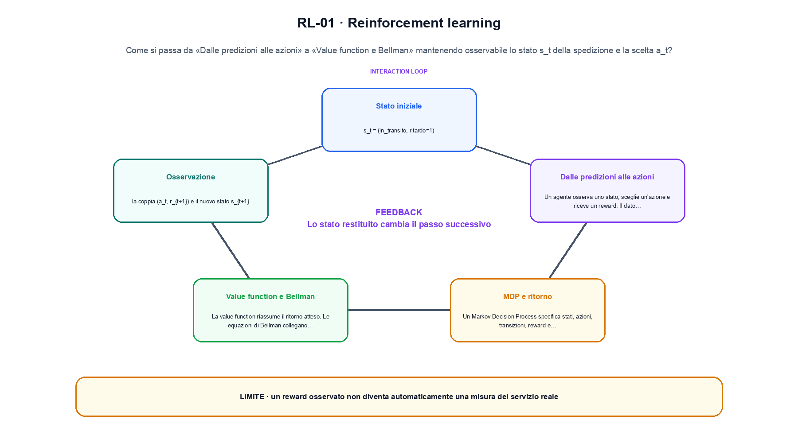
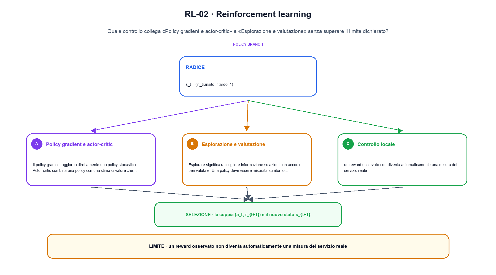

<!--
chapter_id: CH-P03-RL
part_id: P03
order_key: 140
title: Reinforcement learning
maturity: CORE
status: revisione editoriale v2, approvazione autoriale aperta
version: 0.5.0-draft3
last_source_check: 4 agosto 2026
environment: Python 3.13.12, CPU
code_policy: reference
deferred: benchmark applicativi non eseguiti e approvazione autoriale delle visuali
-->

# Capitolo 14. Reinforcement learning

La domanda guida di questa lezione è come collegare «Dalle predizioni alle azioni» e «Esplorazione e valutazione» senza perdere il contratto tecnico di reinforcement learning. L'oggetto osservato è lo stato s_t della spedizione e la scelta a_t. Il contratto locale è: input, s_t = (in_transito, ritardo=1); operazione, la policy assegna probabilità alle azioni e l'ambiente restituisce r_{t+1}; output, la coppia (a_t, r_{t+1}) e il nuovo stato s_{t+1}. Il caso guida è questo: Un caso minimo con input s_t = (in_transito, ritardo=1) e output «la coppia (a_t, r_{t+1}) e il nuovo stato s_{t+1}». Il confine da mantenere esplicito è: un reward osservato non diventa automaticamente una misura del servizio reale.

## Dalle predizioni alle azioni

Un agente osserva uno stato, sceglie un'azione e riceve un reward. Il dato centrale non è una label statica, ma una traiettoria prodotta dall'interazione. [SRC-14-001]

Il ritorno scontato collega reward e decisioni future.

**Caso da seguire.** Un caso minimo con input s_t = (in_transito, ritardo=1) e output «la coppia (a_t, r_{t+1}) e il nuovo stato s_{t+1}».

**Controllo.** Scrivi il risultato atteso prima del calcolo, modifica una sola quantità e localizza il primo passaggio che cambia. Il vincolo da conservare è: Il dato centrale non è una label statica, ma una traiettoria prodotta dall'interazione.


## MDP e ritorno

Un Markov Decision Process specifica stati, azioni, transizioni, reward e fattore di sconto. Il ritorno somma reward futuri pesati e dipende dalla policy seguita. [SRC-14-002]

**Caso da seguire.** Un ritorno calcolato da reward immediato 1, gamma 0,9 e valore futuro 0,5, mantenendo separati stato e azione.

**Controllo.** Ricalcola il caso a mano e con lo snippet. Se i risultati divergono, confronta prima i valori intermedi e soltanto dopo l'output finale.


La relazione centrale può essere scritta come:

$$
G_t = R_{t+1} + \gamma G_{t+1}
$$

Il ritorno scontato collega reward e decisioni future. [SRC-14-001]




La prima figura segue il percorso da «Dalle predizioni alle azioni» a «Value function e Bellman».


## Value function e Bellman

La value function riassume il ritorno atteso. Le equazioni di Bellman collegano il valore corrente a reward immediato e valore degli stati successivi. [SRC-14-003]

**Caso da seguire.** Una traiettoria di due passi in cui reward immediato e valore futuro restano separati.

**Controllo.** Aggiungi un valore limite e verifica separatamente forma, valore e ipotesi. Una shape valida non dimostra da sola «Value function e Bellman».


## Policy gradient e actor-critic

Il policy gradient aggiorna direttamente una policy stocastica. Actor-critic combina una policy con una stima di valore che riduce la varianza del segnale. [SRC-14-004]

**Caso da seguire.** Per «Policy gradient e actor-critic» si mantiene l'input del capitolo e si isola questa condizione: Il policy gradient aggiorna direttamente una policy stocastica.

**Controllo.** Mantieni fisso l'input e sostituisci soltanto il meccanismo discusso nella sezione. Il confronto deve attribuire la differenza a quel passaggio, non al setup.


## Esempio Python eseguito

Il frammento seguente è lo stesso conservato nel repository. Usa valori piccoli perché l'obiettivo è osservare il meccanismo, non simulare una scala che non abbiamo eseguito.

```python
def contract():
    gamma = 0.9
    reward = 1.0
    next_value = 0.5
    target = reward + gamma * next_value
    return {"target": round(target, 6), "invariant": "reward and discounted next value are explicit"}
```

Esecuzione con `python snip_14_contract.py`:

```text
{"invariant": "reward and discounted next value are explicit", "target": 1.45}
```

Il test associato è [`code/test_14_contract.py`](code/test_14_contract.py); l'output versionato è [`code/outputs/SNIP-14-001.txt`](code/outputs/SNIP-14-001.txt).


## Esplorazione e valutazione

Esplorare significa raccogliere informazione su azioni non ancora ben valutate. Una policy deve essere misurata su ritorno, varianza, sicurezza e condizioni dell'ambiente. [SRC-14-001]

**Caso da seguire.** Due azioni disponibili con ritorni osservati diversi e una misura separata della varianza.

**Controllo.** Costruisci un controesempio che rispetti il tipo di dato ma violi l'ipotesi centrale. Il test deve rendere riconoscibile perché «Esplorazione e valutazione» non si applica.




La seconda figura mette a confronto «Policy gradient e actor-critic» e il limite discusso in «Esplorazione e valutazione».


## Come si collegano i passaggi

- **Da «Dalle predizioni alle azioni» a «MDP e ritorno».** Un agente osserva uno stato, sceglie un'azione e riceve un reward. Un Markov Decision Process specifica stati, azioni, transizioni, reward e fattore di sconto. Il primo passaggio definisce che cosa entra nel calcolo; il secondo stabilisce la regola che produce il valore osservabile. [SRC-14-001; SRC-14-002]

- **Da «MDP e ritorno» a «Value function e Bellman».** Un Markov Decision Process specifica stati, azioni, transizioni, reward e fattore di sconto. La value function riassume il ritorno atteso. La regola generale viene poi letta dentro il componente: questa separazione permette di localizzare un errore prima di attribuirlo all'intero modello. [SRC-14-002; SRC-14-003]

- **Da «Value function e Bellman» a «Policy gradient e actor-critic».** La value function riassume il ritorno atteso. Il policy gradient aggiorna direttamente una policy stocastica. Dopo avere reso visibile il componente, il percorso introduce la variante o l'ottimizzazione senza cambiare di nascosto il caso di partenza. [SRC-14-003; SRC-14-004]

- **Da «Policy gradient e actor-critic» a «Esplorazione e valutazione».** Il policy gradient aggiorna direttamente una policy stocastica. Esplorare significa raccogliere informazione su azioni non ancora ben valutate. L'ultimo passaggio sposta l'attenzione dal funzionamento locale alla misura: correttezza del calcolo e qualità applicativa restano domande distinte. [SRC-14-004; SRC-14-001]

La catena completa produce la coppia (a_t, r_{t+1}) e il nuovo stato s_{t+1} a partire da s_t = (in_transito, ritardo=1). Ogni collegamento conserva un oggetto osservabile diverso; per questo il risultato non può essere esteso oltre il limite dichiarato: un reward osservato non diventa automaticamente una misura del servizio reale.


## Esercizi sul meccanismo

1. Ricostruisci «Dalle predizioni alle azioni» con un esempio diverso da quello mostrato e indica l'output atteso prima del calcolo.
2. Nel passaggio «MDP e ritorno», cambia una sola ipotesi e spiega quale risultato non è più confrontabile.
3. Collega «Value function e Bellman» a una riga dello snippet oppure motiva perché la prova deve essere documentale.
4. Progetta un caso limite per «Policy gradient e actor-critic» che produca una failure riconoscibile.
5. Per «Esplorazione e valutazione», separa una conclusione sostenuta dal caso locale da una che richiederebbe nuovi dati o un benchmark.


## Che cosa deve restare chiaro

La lezione parte da «s_t = (in_transito, ritardo=1)» e arriva fino a «la coppia (a_t, r_{t+1}) e il nuovo stato s_{t+1}». Il limite da conservare è questo: un reward osservato non diventa automaticamente una misura del servizio reale. Definizioni e risultati citati sono rintracciabili in [`FONTI_PRIMARIE.md`](FONTI_PRIMARIE.md); la mappa dei claim è in [`CLAIMS.md`](CLAIMS.md).
