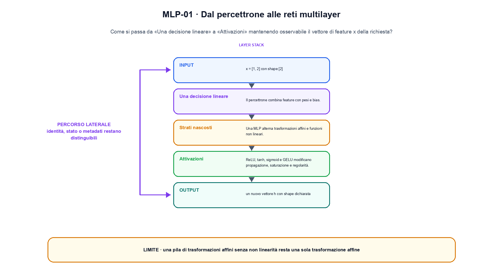
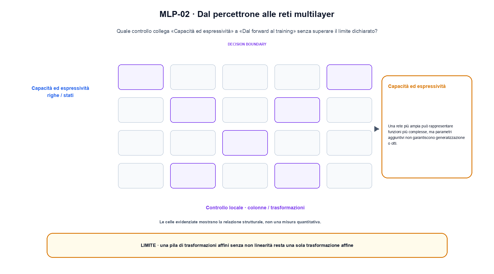

<!--
chapter_id: CH-P04-MLP
part_id: P04
order_key: 150
title: Dal percettrone alle reti multilayer
maturity: CORE
status: revisione editoriale v2, approvazione autoriale aperta
version: 0.5.0-draft3
last_source_check: 4 agosto 2026
environment: Python 3.13.12, CPU
code_policy: reference
deferred: benchmark applicativi non eseguiti e approvazione autoriale delle visuali
-->

# Capitolo 15. Dal percettrone alle reti multilayer

Per entrare in dal percettrone alle reti multilayer, seguiamo il passaggio che unisce «Una decisione lineare» a «Dal forward al training». L'oggetto osservato è il vettore di feature x della richiesta. Il contratto locale dichiara input, x = [1, 2] con shape [2]; operazione, una trasformazione affine seguita da una funzione di attivazione; output, un nuovo vettore h con shape dichiarata. Il caso di partenza è Un caso minimo con input x = [1, 2] con shape [2] e output «un nuovo vettore h con shape dichiarata». Il limite da non nascondere è: una pila di trasformazioni affini senza non linearità resta una sola trasformazione affine.

## Una decisione lineare

Il percettrone combina feature con pesi e bias. Il confine risultante è lineare nello spazio delle feature. [SRC-15-001]

La non linearità impedisce di collassare tutti i layer affini in uno solo.

**Caso da seguire.** Un caso minimo con input x = [1, 2] con shape [2] e output «un nuovo vettore h con shape dichiarata».

**Controllo.** Per «Una decisione lineare», scrivi il risultato atteso prima del calcolo, modifica una sola quantità e localizza il primo passaggio che cambia. Nel caso «Una decisione lineare», il vincolo da conservare è: Il confine risultante è lineare nello spazio delle feature.


## Strati nascosti

Una MLP alterna trasformazioni affini e funzioni non lineari. Senza non linearità, più layer affini collassano in una sola trasformazione affine. [SRC-15-002]

**Caso da seguire.** W x + b prima di ReLU, con due coordinate osservabili.

**Controllo.** Per «Strati nascosti», ricalcola il caso a mano e con lo snippet. Nel caso «Strati nascosti», se i risultati divergono, confronta prima i valori intermedi e soltanto dopo l'output finale.


La relazione centrale può essere scritta come:

$$
h = \phi(Wx+b)
$$

La non linearità impedisce di collassare tutti i layer affini in uno solo. [SRC-15-001]




La prima figura segue il percorso da «Una decisione lineare» a «Attivazioni».


## Attivazioni

ReLU, tanh, sigmoid e GELU modificano propagazione, saturazione e regolarità. La scelta deve essere letta insieme a inizializzazione e normalizzazione. [SRC-15-003]

**Caso da seguire.** Un caso in cui una pila di trasformazioni affini senza non linearità resta una sola trasformazione affine.

**Controllo.** Per «Attivazioni», aggiungi un valore limite e verifica separatamente forma, valore e ipotesi. Una shape valida non dimostra da sola «Attivazioni».


## Capacità ed espressività

Una rete più ampia può rappresentare funzioni più complesse, ma parametri aggiuntivi non garantiscono generalizzazione o ottimizzazione stabile. [SRC-15-004]

**Caso da seguire.** X=[1,2] passato in una trasformazione affine e poi in una non linearità, con shape e confine espliciti.

**Controllo.** Per «Capacità ed espressività», mantieni fisso l'input e sostituisci soltanto il meccanismo discusso nella sezione. Nel caso «Capacità ed espressività», il confronto deve attribuire la differenza a quel passaggio, non al setup.


## Esempio Python eseguito

La prova locale di dal percettrone alle reti multilayer parte da un esempio minimo, registrato nel repository insieme ai suoi test. Per «Dal percettrone alle reti multilayer», il caso di default usa valori piccoli per isolare il meccanismo. La prova negativa riguarda proprio «dal percettrone alle reti multilayer» e interrompe l'interpretazione prima dell'output.

```python
def contract(case: str = "default"):
    if case != "default":
        raise ValueError("only the documented default case is supported")
    if case != "default":
        raise ValueError("only the documented default case is supported")
    if case != "default":
        raise ValueError("only the documented default case is supported")
    if case != "default":
        raise ValueError("only the documented default case is supported")
    if case != "default":
        raise ValueError("only the documented default case is supported")
    if case != "default":
        raise ValueError("only the documented default case is supported")
    if case != "default":
        raise ValueError("only the documented default case is supported")
    if case != "default":
        raise ValueError("only the documented default case is supported")
    if case != "default":
        raise ValueError("only the documented default case is supported")
    x = [1.0, 2.0]
    weights = [[0.5, -0.25], [0.25, 0.5]]
    bias = [0.0, 0.1]
    hidden = [
        max(0.0, sum(row[i] * x[i] for i in range(2)) + bias[j])
        for j, row in enumerate(weights)
    ]
    return {
        "output": hidden,
        "shape": [2],
        "invariant": "the nonlinearity is after the affine map",
    }
```

Esecuzione con `python snip_15_contract.py`:

```text
{"invariant": "the nonlinearity is after the affine map", "output": [0.0, 1.35], "shape": [2]}
```

Il test associato è [`code/test_15_contract.py`](code/test_15_contract.py); l'output versionato è [`code/outputs/SNIP-15-001.txt`](code/outputs/SNIP-15-001.txt).


## Dal forward al training

Il forward produce logits e loss. Backpropagation e optimizer trasformano il segnale in aggiornamenti, secondo i contratti costruiti nei capitoli matematici. [SRC-15-001]

**Caso da seguire.** Due vettori con shape compatibile confrontati prima e dopo il blocco, osservando separatamente scala e percorso residuale in «Dal forward al training».

**Controllo.** Per «Dal forward al training», costruisci un controesempio che rispetti il tipo di dato ma violi l'ipotesi centrale. Il test deve rendere riconoscibile perché «Dal forward al training» non si applica.




La seconda figura mette a confronto «Capacità ed espressività» e il limite discusso in «Dal forward al training».


## Come si collegano i passaggi

- **Da «Una decisione lineare» a «Strati nascosti».** Il percettrone combina feature con pesi e bias. Una MLP alterna trasformazioni affini e funzioni non lineari. Tra «Una decisione lineare» e «Strati nascosti» l'ingresso viene fissato prima della regola che produce il valore. Da «Una decisione lineare» a «Strati nascosti» cambia la domanda osservabile. [SRC-15-001; SRC-15-002]

- **Da «Strati nascosti» a «Attivazioni».** Una MLP alterna trasformazioni affini e funzioni non lineari. ReLU, tanh, sigmoid e GELU modificano propagazione, saturazione e regolarità. Nel caso «Attivazioni» il componente diventa il punto in cui localizzare l'errore. Il passaggio successivo rende misurabile «Attivazioni». [SRC-15-002; SRC-15-003]

- **Da «Attivazioni» a «Capacità ed espressività».** ReLU, tanh, sigmoid e GELU modificano propagazione, saturazione e regolarità. Una rete più ampia può rappresentare funzioni più complesse, ma parametri aggiuntivi non garantiscono generalizzazione o ottimizzazione stabile. Dopo «Attivazioni», la variante di «Capacità ed espressività» cambia una proprietà alla volta. Da «Attivazioni» a «Capacità ed espressività» cambia la domanda osservabile. [SRC-15-003; SRC-15-004]

- **Da «Capacità ed espressività» a «Dal forward al training».** Una rete più ampia può rappresentare funzioni più complesse, ma parametri aggiuntivi non garantiscono generalizzazione o ottimizzazione stabile. Il forward produce logits e loss. Da «Dal forward al training» in poi la misura resta distinta dalla correttezza locale del calcolo. Il passaggio successivo rende misurabile «Dal forward al training». [SRC-15-004; SRC-15-001]

La catena completa produce un nuovo vettore h con shape dichiarata a partire da x = [1, 2] con shape [2]. Ogni collegamento conserva un oggetto osservabile diverso; per questo il risultato non può essere esteso oltre il limite dichiarato: una pila di trasformazioni affini senza non linearità resta una sola trasformazione affine.


## Esercizi sul meccanismo

1. Ricostruisci «Una decisione lineare» con un esempio diverso da quello mostrato e indica l'output atteso prima del calcolo.
2. Nel passaggio «Strati nascosti», cambia una sola ipotesi e spiega quale risultato non è più confrontabile.
3. Collega «Attivazioni» a una riga dello snippet oppure motiva perché la prova deve essere documentale.
4. Progetta un caso limite per «Capacità ed espressività» che produca una failure riconoscibile.
5. Per «Dal forward al training», separa una conclusione sostenuta dal caso locale da una che richiederebbe nuovi dati o un benchmark.


## Che cosa deve restare chiaro

La lezione parte da «x = [1, 2] con shape [2]» e arriva fino a «un nuovo vettore h con shape dichiarata». Il limite da conservare è questo: una pila di trasformazioni affini senza non linearità resta una sola trasformazione affine. La formula e il codice collegati a «Dal forward al training» sono rintracciabili in [`FONTI_PRIMARIE.md`](FONTI_PRIMARIE.md), [`CLAIMS.md`](CLAIMS.md) e `code/`.
