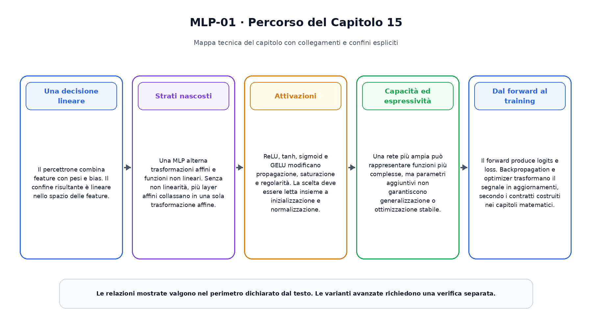
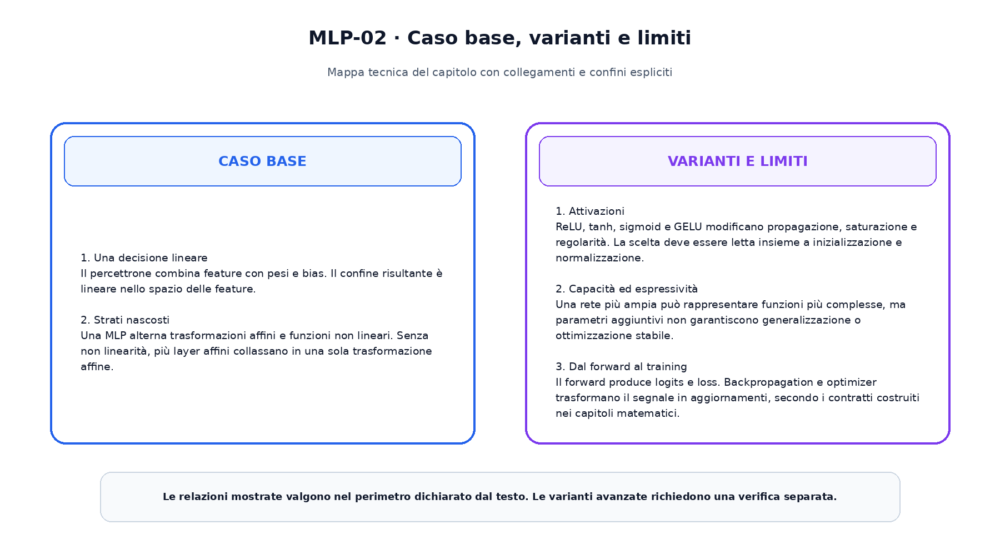

<!--
chapter_id: CH-P04-MLP
part_id: P04
order_key: 150
title: Dal percettrone alle reti multilayer
maturity: CORE
status: completo, validato e congelato
version: 1.0.0
last_source_check: 2026-08-01
-->

# Capitolo 15. Dal percettrone alle reti multilayer

Il capitolo precedente ha costruito il prerequisito immediato necessario. Ora applichiamo lo stesso oggetto continuo, la richiesta «Il pacco non è arrivato», a una nuova capacità. L'obiettivo è capire il meccanismo in modo operativo, senza attribuire al modello proprietà che non sono state misurate.

## Una decisione lineare

Il percettrone combina feature con pesi e bias. Il confine risultante è lineare nello spazio delle feature.

Questo passaggio usa l'oggetto continuo del libro e rende esplicito quale quantità viene trasformata, quale risultato viene ottenuto e quale limite resta aperto. L'esempio numerico e lo snippet permettono di controllare il contratto senza trasformarlo in una descrizione di un sistema reale.

## Strati nascosti

Una MLP alterna trasformazioni affini e funzioni non lineari. Senza non linearità, più layer affini collassano in una sola trasformazione affine.

Questo passaggio usa l'oggetto continuo del libro e rende esplicito quale quantità viene trasformata, quale risultato viene ottenuto e quale limite resta aperto. L'esempio numerico e lo snippet permettono di controllare il contratto senza trasformarlo in una descrizione di un sistema reale.

## Attivazioni

ReLU, tanh, sigmoid e GELU modificano propagazione, saturazione e regolarità. La scelta deve essere letta insieme a inizializzazione e normalizzazione.

Questo passaggio usa l'oggetto continuo del libro e rende esplicito quale quantità viene trasformata, quale risultato viene ottenuto e quale limite resta aperto. L'esempio numerico e lo snippet permettono di controllare il contratto senza trasformarlo in una descrizione di un sistema reale.

## Capacità ed espressività

Una rete più ampia può rappresentare funzioni più complesse, ma parametri aggiuntivi non garantiscono generalizzazione o ottimizzazione stabile.

Questo passaggio usa l'oggetto continuo del libro e rende esplicito quale quantità viene trasformata, quale risultato viene ottenuto e quale limite resta aperto. L'esempio numerico e lo snippet permettono di controllare il contratto senza trasformarlo in una descrizione di un sistema reale.

## Dal forward al training

Il forward produce logits e loss. Backpropagation e optimizer trasformano il segnale in aggiornamenti, secondo i contratti costruiti nei capitoli matematici.

Questo passaggio usa l'oggetto continuo del libro e rende esplicito quale quantità viene trasformata, quale risultato viene ottenuto e quale limite resta aperto. L'esempio numerico e lo snippet permettono di controllare il contratto senza trasformarlo in una descrizione di un sistema reale.

La prima figura ordina i passaggi e mostra il risultato consegnato alla fase successiva.

La seconda figura separa il contratto minimo dalle estensioni.

## Snippet verificabile

Il file [`code/snip_15_contract.py`](code/snip_15_contract.py) applica una normalizzazione stabile e combina stati con shape dichiarate. Lo snippet è intenzionalmente piccolo: verifica il tipo di ragionamento numerico usato nel capitolo, non riproduce un modello di produzione.

## Riepilogo

Il capitolo ha costruito dal percettrone alle reti multilayer partendo dai prerequisiti disponibili. Il caso base, le varianti e i limiti sono mantenuti separati. Il risultato viene consegnato al capitolo successivo, che aggiunge una sola nuova dimensione del sistema.

### Verifica della comprensione

1. Ricostruisci l'ordine dei passaggi senza consultare la figura.
2. Indica quale oggetto viene aggiornato e quale resta invariato.
3. Spiega un limite del caso base.
4. Collega lo snippet alla sezione pertinente.
5. Proponi una variazione controllata e prevedine l'effetto.

## Fonti e materiali verificabili

Fonti, claim, codice, test e audit sono disponibili nei file del capitolo.
