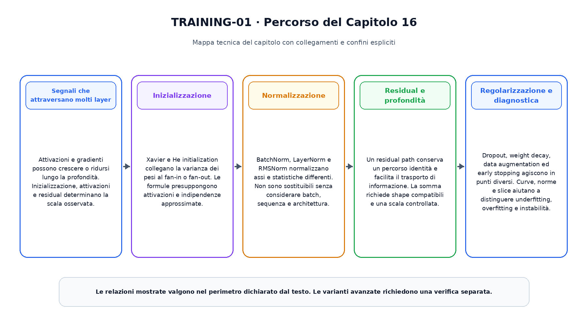
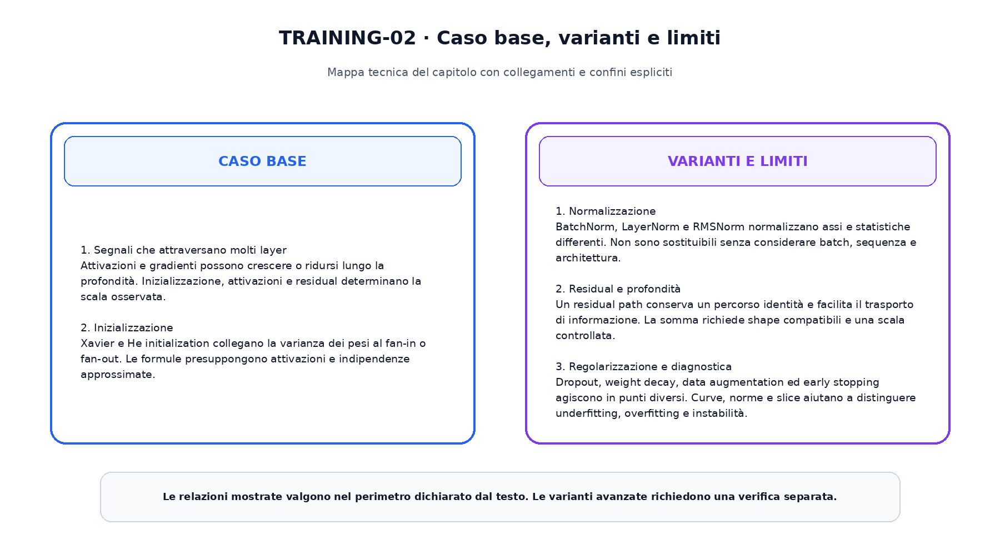

<!--
chapter_id: CH-P04-DEEP-TRAINING
part_id: P04
order_key: 160
title: Addestrare reti profonde
maturity: CORE
status: completo, validato e congelato
version: 1.0.0
last_source_check: 2026-08-01
-->

# Capitolo 16. Addestrare reti profonde

Il capitolo precedente ha costruito il prerequisito immediato necessario. Ora applichiamo lo stesso oggetto continuo, la richiesta «Il pacco non è arrivato», a una nuova capacità. L'obiettivo è capire il meccanismo in modo operativo, senza attribuire al modello proprietà che non sono state misurate.

## Segnali che attraversano molti layer

Attivazioni e gradienti possono crescere o ridursi lungo la profondità. Inizializzazione, attivazioni e residual determinano la scala osservata.

Questo passaggio usa l'oggetto continuo del libro e rende esplicito quale quantità viene trasformata, quale risultato viene ottenuto e quale limite resta aperto. L'esempio numerico e lo snippet permettono di controllare il contratto senza trasformarlo in una descrizione di un sistema reale.

## Inizializzazione

Xavier e He initialization collegano la varianza dei pesi al fan-in o fan-out. Le formule presuppongono attivazioni e indipendenze approssimate.

Questo passaggio usa l'oggetto continuo del libro e rende esplicito quale quantità viene trasformata, quale risultato viene ottenuto e quale limite resta aperto. L'esempio numerico e lo snippet permettono di controllare il contratto senza trasformarlo in una descrizione di un sistema reale.

## Normalizzazione

BatchNorm, LayerNorm e RMSNorm normalizzano assi e statistiche differenti. Non sono sostituibili senza considerare batch, sequenza e architettura.

Questo passaggio usa l'oggetto continuo del libro e rende esplicito quale quantità viene trasformata, quale risultato viene ottenuto e quale limite resta aperto. L'esempio numerico e lo snippet permettono di controllare il contratto senza trasformarlo in una descrizione di un sistema reale.

## Residual e profondità

Un residual path conserva un percorso identità e facilita il trasporto di informazione. La somma richiede shape compatibili e una scala controllata.

Questo passaggio usa l'oggetto continuo del libro e rende esplicito quale quantità viene trasformata, quale risultato viene ottenuto e quale limite resta aperto. L'esempio numerico e lo snippet permettono di controllare il contratto senza trasformarlo in una descrizione di un sistema reale.

## Regolarizzazione e diagnostica

Dropout, weight decay, data augmentation ed early stopping agiscono in punti diversi. Curve, norme e slice aiutano a distinguere underfitting, overfitting e instabilità.

Questo passaggio usa l'oggetto continuo del libro e rende esplicito quale quantità viene trasformata, quale risultato viene ottenuto e quale limite resta aperto. L'esempio numerico e lo snippet permettono di controllare il contratto senza trasformarlo in una descrizione di un sistema reale.

La prima figura ordina i passaggi e mostra il risultato consegnato alla fase successiva.

La seconda figura separa il contratto minimo dalle estensioni.

## Snippet verificabile

Il file [`code/snip_16_contract.py`](code/snip_16_contract.py) applica una normalizzazione stabile e combina stati con shape dichiarate. Lo snippet è intenzionalmente piccolo: verifica il tipo di ragionamento numerico usato nel capitolo, non riproduce un modello di produzione.

## Riepilogo

Il capitolo ha costruito addestrare reti profonde partendo dai prerequisiti disponibili. Il caso base, le varianti e i limiti sono mantenuti separati. Il risultato viene consegnato al capitolo successivo, che aggiunge una sola nuova dimensione del sistema.

### Verifica della comprensione

1. Ricostruisci l'ordine dei passaggi senza consultare la figura.
2. Indica quale oggetto viene aggiornato e quale resta invariato.
3. Spiega un limite del caso base.
4. Collega lo snippet alla sezione pertinente.
5. Proponi una variazione controllata e prevedine l'effetto.

## Fonti e materiali verificabili

Fonti, claim, codice, test e audit sono disponibili nei file del capitolo.
