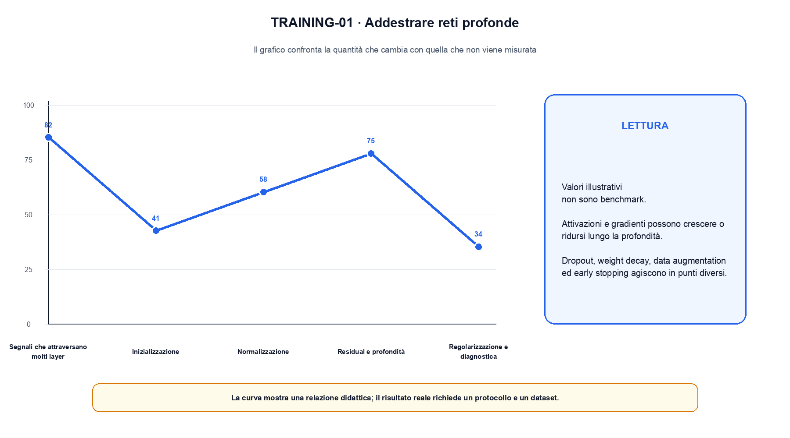
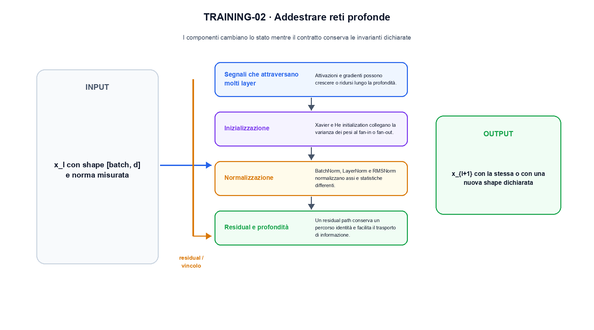

<!--
chapter_id: CH-P04-DEEP-TRAINING
part_id: P04
order_key: 160
title: Addestrare reti profonde
maturity: CORE
status: candidatura completa in revisione autoriale
version: 0.4.0-draft2
last_source_check: 3 agosto 2026
environment: Python 3.13.12, CPU
deferred: benchmark applicativi, varianti non necessarie al contratto centrale e approvazione autoriale
-->

# Capitolo 16. Addestrare reti profonde

Finora abbiamo potuto descrivere il segnale che attraversa una rete profonda. La richiesta «Il pacco non è arrivato» resta lo scenario condiviso: nel Capitolo 16 prendiamo l'input «x_l con shape [batch, d] e norma misurata» e lo seguiamo fino all'output «x_{l+1} con la stessa o con una nuova shape dichiarata», dichiarando prima il contratto e poi il limite.

## Segnali che attraversano molti layer

Attivazioni e gradienti possono crescere o ridursi lungo la profondità. Inizializzazione, attivazioni e residual determinano la scala osservata. [SRC-16-001]

Il caso minimo di «Segnali che attraversano molti layer» si presenta così: due vettori con shape compatibile confrontati prima e dopo il blocco, osservando separatamente scala e percorso residuale in «Segnali che attraversano molti layer». Non lo usiamo come decorazione: serve a rendere osservabile la frase «Attivazioni e gradienti possono crescere o ridursi lungo la profondità».

Per ricostruire «Segnali che attraversano molti layer» annotiamo l'input «x_l con shape [batch, d] e norma misurata», poi l'operazione «un blocco, una normalizzazione o un percorso residuale», infine l'output «x_{l+1} con la stessa o con una nuova shape dichiarata». Questa sequenza impedisce di scambiare una forma compatibile per il comportamento descritto dalla fonte. Il controllo parte da «Attivazioni e gradienti possono crescere o ridursi lungo la profondità».

Il passaggio da seguire in «Segnali che attraversano molti layer» è quello descritto dalla frase «Attivazioni e gradienti possono crescere o ridursi lungo la profondità»: l'esempio rende osservabile la trasformazione, mentre il contratto del capitolo ne delimita l'interpretazione. Per «Segnali che attraversano molti layer» il controllo cambia una sola premessa della frase «Attivazioni e gradienti possono crescere o ridursi lungo la profondità» e conserva input, output e criterio di successo, così la differenza resta attribuibile. La verifica resta ancorata a «Attivazioni e gradienti possono crescere o ridursi lungo la profondità». [SRC-16-001]

Il punto didattico di «Segnali che attraversano molti layer» è separare ciò che la fonte afferma da ciò che il piccolo caso illustra. L'output «x_{l+1} con la stessa o con una nuova shape dichiarata» mostra il contratto locale, ma non sostituisce una misura sul sistema completo.

Il controllo minimo di «Segnali che attraversano molti layer» confronta il caso dichiarato con una variazione che rompe la sua ipotesi. Se la failure non è distinguibile dall'esito valido, manca un'osservazione nel contratto del collegamento tra blocchi. Da «Segnali che attraversano molti layer» portiamo l'output «x_{l+1} con la stessa o con una nuova shape dichiarata»; non portiamo invece una conclusione oltre il caso locale.

## Inizializzazione

Xavier e He initialization collegano la varianza dei pesi al fan-in o fan-out. Le formule presuppongono attivazioni e indipendenze approssimate. [SRC-16-002]

Prima del nome tecnico fissiamo la situazione: consideriamo x + F(x) con due vettori di dimensione 2. Da qui possiamo leggere la conseguenza dichiarata da «Xavier e He initialization collegano la varianza dei pesi al fan-in o fan-out».

Nel contratto locale, l'input «x_l con shape [batch, d] e norma misurata» entra, l'operazione «un blocco, una normalizzazione o un percorso residuale» modifica il percorso e l'output «x_{l+1} con la stessa o con una nuova shape dichiarata» è ciò che osserviamo. Qui cambia soprattutto il passaggio «Inizializzazione»; resta da controllare che una somma residuale richiede shape compatibili e non prova da sola stabilità del training. La domanda locale è «Xavier e He initialization collegano la varianza dei pesi al fan-in o fan-out».

Il punto operativo è la scala del segnale: inizializzazione, normalizzazione, residual e regolarizzazione intervengono in momenti diversi e non sono sostituti intercambiabili. Shape compatibili e curve osservate servono a controllare il percorso reale. Per «Inizializzazione» il controllo cambia una sola premessa della frase «Xavier e He initialization collegano la varianza dei pesi al fan-in o fan-out» e conserva input, output e criterio di successo, così la differenza resta attribuibile. La verifica resta ancorata a «Xavier e He initialization collegano la varianza dei pesi al fan-in o fan-out». [SRC-16-002]

La lettura va fatta in ordine: prima il caso, poi la trasformazione, quindi la conseguenza. Le formule presuppongono attivazioni e indipendenze approssimate. Il piccolo risultato resta un'illustrazione di «Xavier e He initialization collegano la varianza dei pesi al fan-in o fan-out», non una promessa generale.

La prova di «Inizializzazione» conserva input, operazione e output; poi esplicita quale parte di «Xavier e He initialization collegano la varianza dei pesi al fan-in o fan-out» non è stata misurata. Così il test separa l'evidenza dall'inferenza. Il passaggio successivo, «Normalizzazione», potrà cambiare una sola condizione, dichiarando il nuovo setup prima di interpretare il risultato.

## Normalizzazione

BatchNorm, LayerNorm e RMSNorm normalizzano assi e statistiche differenti. Non sono sostituibili senza considerare batch, sequenza e architettura. [SRC-16-003]

Per capire «Normalizzazione» partiamo da questo caso: due vettori con shape compatibile confrontati prima e dopo il blocco, osservando separatamente scala e percorso residuale in «Normalizzazione». Il caso rende osservabile il punto centrale: «BatchNorm, LayerNorm e RMSNorm normalizzano assi e statistiche differenti».

La sezione usa l'input «x_l con shape [batch, d] e norma misurata» come punto di partenza e l'output «x_{l+1} con la stessa o con una nuova shape dichiarata» come traccia d'uscita. La trasformazione concreta è «un blocco, una normalizzazione o un percorso residuale»; il caso non è completo se non dichiariamo anche che una somma residuale richiede shape compatibili e non prova da sola stabilità del training. La condizione da isolare è «BatchNorm, LayerNorm e RMSNorm normalizzano assi e statistiche differenti».

Il punto operativo è la scala del segnale: inizializzazione, normalizzazione, residual e regolarizzazione intervengono in momenti diversi e non sono sostituti intercambiabili. Shape compatibili e curve osservate servono a controllare il percorso reale. Per «Normalizzazione» il controllo cambia una sola premessa della frase «BatchNorm, LayerNorm e RMSNorm normalizzano assi e statistiche differenti» e conserva input, output e criterio di successo, così la differenza resta attribuibile. La verifica resta ancorata a «BatchNorm, LayerNorm e RMSNorm normalizzano assi e statistiche differenti». [SRC-16-003]

Se cambiamo una premessa, dobbiamo riaprire l'interpretazione. Per «Normalizzazione» conserviamo l'osservazione collegata a «BatchNorm, LayerNorm e RMSNorm normalizzano assi e statistiche differenti» e lasciamo esplicitamente fuori ciò che non è stato misurato.

Per verificare «Normalizzazione» cambiamo una sola condizione vicina alla frase «BatchNorm, LayerNorm e RMSNorm normalizzano assi e statistiche differenti», teniamo fermo il resto e registriamo l'output «x_{l+1} con la stessa o con una nuova shape dichiarata». Il caso negativo deve rendere riconoscibile la failure, non soltanto produrre un numero diverso. La sezione successiva, «Residual e profondità», riceve l'output «x_{l+1} con la stessa o con una nuova shape dichiarata» come base, ma dovrà formulare e verificare la propria distinzione.

La figura TRAINING-01 usa la famiglia chart. Il grafico confronta la quantità che cambia con quella che non viene misurata.

## Residual e profondità

Un residual path conserva un percorso identità e facilita il trasporto di informazione. La somma richiede shape compatibili e una scala controllata. [SRC-16-004]

Il caso minimo di «Residual e profondità» si presenta così: due vettori con shape compatibile confrontati prima e dopo il blocco, osservando separatamente scala e percorso residuale in «Residual e profondità». Non lo usiamo come decorazione: serve a rendere osservabile la frase «Un residual path conserva un percorso identità e facilita il trasporto di informazione».

Per ricostruire «Residual e profondità» annotiamo l'input «x_l con shape [batch, d] e norma misurata», poi l'operazione «un blocco, una normalizzazione o un percorso residuale», infine l'output «x_{l+1} con la stessa o con una nuova shape dichiarata». Questa sequenza impedisce di scambiare una forma compatibile per il comportamento descritto dalla fonte. Il controllo parte da «Un residual path conserva un percorso identità e facilita il trasporto di informazione».

Il punto operativo è la scala del segnale: inizializzazione, normalizzazione, residual e regolarizzazione intervengono in momenti diversi e non sono sostituti intercambiabili. Shape compatibili e curve osservate servono a controllare il percorso reale. Per «Residual e profondità» il controllo cambia una sola premessa della frase «Un residual path conserva un percorso identità e facilita il trasporto di informazione» e conserva input, output e criterio di successo, così la differenza resta attribuibile. La verifica resta ancorata a «Un residual path conserva un percorso identità e facilita il trasporto di informazione». [SRC-16-004]

Il punto didattico di «Residual e profondità» è separare ciò che la fonte afferma da ciò che il piccolo caso illustra. L'output «x_{l+1} con la stessa o con una nuova shape dichiarata» mostra il contratto locale, ma non sostituisce una misura sul sistema completo.

Il controllo minimo di «Residual e profondità» confronta il caso dichiarato con una variazione che rompe la sua ipotesi. Se la failure non è distinguibile dall'esito valido, manca un'osservazione nel contratto del collegamento tra blocchi. Da «Residual e profondità» portiamo l'output «x_{l+1} con la stessa o con una nuova shape dichiarata»; non portiamo invece una conclusione oltre il caso locale.

## Regolarizzazione e diagnostica

Dropout, weight decay, data augmentation ed early stopping agiscono in punti diversi. Curve, norme e slice aiutano a distinguere underfitting, overfitting e instabilità. [SRC-16-001]

Prima del nome tecnico fissiamo la situazione: consideriamo un residual `x + F(x)` richiede shape compatibili. Se `F(x)` ha scala molto maggiore di `x`, la somma resta valida formalmente ma può destabilizzare il percorso. Da qui possiamo leggere la conseguenza dichiarata da «Dropout, weight decay, data augmentation ed early stopping agiscono in punti diversi».

Nel contratto locale, l'input «x_l con shape [batch, d] e norma misurata» entra, l'operazione «un blocco, una normalizzazione o un percorso residuale» modifica il percorso e l'output «x_{l+1} con la stessa o con una nuova shape dichiarata» è ciò che osserviamo. Qui cambia soprattutto il passaggio «Regolarizzazione e diagnostica»; resta da controllare che una somma residuale richiede shape compatibili e non prova da sola stabilità del training. La domanda locale è «Dropout, weight decay, data augmentation ed early stopping agiscono in punti diversi».

Il punto operativo è la scala del segnale: inizializzazione, normalizzazione, residual e regolarizzazione intervengono in momenti diversi e non sono sostituti intercambiabili. Shape compatibili e curve osservate servono a controllare il percorso reale. Per «Regolarizzazione e diagnostica» il controllo cambia una sola premessa della frase «Dropout, weight decay, data augmentation ed early stopping agiscono in punti diversi» e conserva input, output e criterio di successo, così la differenza resta attribuibile. La verifica resta ancorata a «Dropout, weight decay, data augmentation ed early stopping agiscono in punti diversi». [SRC-16-001]

La lettura va fatta in ordine: prima il caso, poi la trasformazione, quindi la conseguenza. Curve, norme e slice aiutano a distinguere underfitting, overfitting e instabilità. Il piccolo risultato resta un'illustrazione di «Dropout, weight decay, data augmentation ed early stopping agiscono in punti diversi», non una promessa generale.

La prova di «Regolarizzazione e diagnostica» conserva input, operazione e output; poi esplicita quale parte di «Dropout, weight decay, data augmentation ed early stopping agiscono in punti diversi» non è stata misurata. Così il test separa l'evidenza dall'inferenza. Il caso finale consegna l'output «x_{l+1} con la stessa o con una nuova shape dichiarata» come evidenza locale e conserva la trasformazione che la rete applica al segnale come domanda aperta.

## Il caso minimo e la sua variante: Segnali che attraversano molti layer

Il caso intero parte dall'input «x_l con shape [batch, d] e norma misurata», applica l'operazione «un blocco, una normalizzazione o un percorso residuale» e osserva l'output «x_{l+1} con la stessa o con una nuova shape dichiarata». Un esempio controllato: x + F(x) con due vettori di dimensione 2. La formula locale è:

$$
x_{l+1}=x_l+F(x_l)
$$

Il residual path conserva un percorso identità da controllare. [SRC-16-001]

La figura TRAINING-02 cambia composizione rispetto alla prima. I componenti cambiano lo stato mentre il contratto conserva le invarianti dichiarate.

## Che cosa osserva lo snippet: Inizializzazione

Nel run Python rendiamo osservabile la frase «Attivazioni e gradienti possono crescere o ridursi lungo la profondità» con valori piccoli e leggibili. Il test associato verifica determinismo, output e rifiuto di una condizione incoerente; il file di output `code/outputs/SNIP-16-001.txt` documenta il caso senza pretendere una misura generale.

## Che cosa non dimostra: Regolarizzazione e diagnostica

Il meccanismo di «Addestrare reti profonde» non garantisce da solo che il sistema funzioni fuori dal caso guida. Una somma residuale richiede shape compatibili e non prova da sola stabilità del training. Il limite osservato riguarda la frase «Attivazioni e gradienti possono crescere o ridursi lungo la profondità»; per trasferire il concetto occorre riaprire la verifica quando cambiano dati, scala o ambiente.

## La mappa delle condizioni: Addestrare reti profonde

Il percorso ha tenuto insieme il segnale che attraversa una rete profonda, l'operazione «un blocco, una normalizzazione o un percorso residuale» e l'output «x_{l+1} con la stessa o con una nuova shape dichiarata». Le sezioni «Segnali che attraversano molti layer», «Inizializzazione», «Regolarizzazione e diagnostica» mostrano come il protocollo osservato delimiti ciò che il capitolo può sostenere. L'invariante da portare avanti è: una somma residuale richiede shape compatibili e non prova da sola stabilità del training. Il Capitolo 17, Convolutional network e apprendimento geometrico, può partire da questo output e dichiarare la propria domanda.

### Cinque domande di controllo: Segnali che attraversano molti layer

1. Ricostruisci l'oggetto continuo a partire da «Segnali che attraversano molti layer» e indica quale parte della frase «Attivazioni e gradienti possono crescere o ridursi lungo la profondità» entra nel caso.
2. Spiega quale trasformazione collega «Segnali che attraversano molti layer» a «Regolarizzazione e diagnostica» e quale output osserviamo nel passaggio.
3. Usa lo snippet per controllare l'invariante del contratto: una somma residuale richiede shape compatibili e non prova da sola stabilità del training.
4. Separa una definizione sostenuta da una fonte, un esempio illustrativo e un risultato locale del caso guida.
5. Indica quale parte della frase «Dropout, weight decay, data augmentation ed early stopping agiscono in punti diversi» richiederebbe una misura nuova prima di essere estesa oltre il caso osservato.

### Esercizi per cambiare una condizione: Regolarizzazione e diagnostica

1. Ricostruisci input e output di «Segnali che attraversano molti layer» usando un esempio di tre righe.
2. Modifica una sola variabile in «Inizializzazione» e anticipa l'invariante che dovrebbe restare.
3. Metti «Normalizzazione» a confronto con il caso base e descrivi il failure mode più vicino.
4. Scrivi un test minimo per rendere osservabile il confine di «Residual e profondità».
5. Formula per «Regolarizzazione e diagnostica» una domanda che separi meccanismo e qualità del sistema.

## Fonti e risultati locali: Addestrare reti profonde

Per «Addestrare reti profonde», le fonti portanti, i limiti dei claim e la data di consultazione sono raccolti in `FONTI_PRIMARIE.md`; la ricerca riguarda soprattutto il collegamento tra blocchi. `CLAIMS.md` separa definizioni e risultati locali; codice, ambiente, test e output sono nella cartella `code/`, con attenzione al collegamento tra blocchi.
