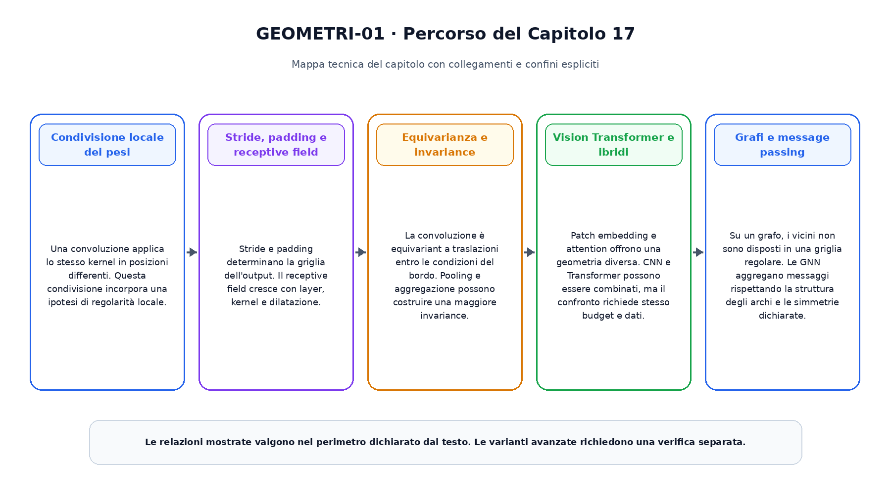
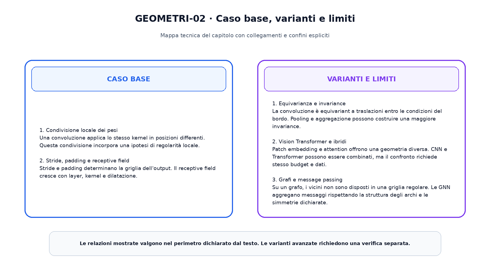

<!--
chapter_id: CH-P04-CNN-GEOMETRIC
part_id: P04
order_key: 170
title: Convolutional network e apprendimento geometrico
maturity: CORE
status: completo, validato e congelato
version: 1.0.0
last_source_check: 2026-08-01
-->

# Capitolo 17. Convolutional network e apprendimento geometrico

Il capitolo precedente ha costruito il prerequisito immediato necessario. Ora applichiamo lo stesso oggetto continuo, la richiesta «Il pacco non è arrivato», a una nuova capacità. L'obiettivo è capire il meccanismo in modo operativo, senza attribuire al modello proprietà che non sono state misurate.

## Condivisione locale dei pesi

Una convoluzione applica lo stesso kernel in posizioni differenti. Questa condivisione incorpora una ipotesi di regolarità locale.

Questo passaggio usa l'oggetto continuo del libro e rende esplicito quale quantità viene trasformata, quale risultato viene ottenuto e quale limite resta aperto. L'esempio numerico e lo snippet permettono di controllare il contratto senza trasformarlo in una descrizione di un sistema reale.

## Stride, padding e receptive field

Stride e padding determinano la griglia dell'output. Il receptive field cresce con layer, kernel e dilatazione.

Questo passaggio usa l'oggetto continuo del libro e rende esplicito quale quantità viene trasformata, quale risultato viene ottenuto e quale limite resta aperto. L'esempio numerico e lo snippet permettono di controllare il contratto senza trasformarlo in una descrizione di un sistema reale.

## Equivarianza e invariance

La convoluzione è equivariant a traslazioni entro le condizioni del bordo. Pooling e aggregazione possono costruire una maggiore invariance.

Questo passaggio usa l'oggetto continuo del libro e rende esplicito quale quantità viene trasformata, quale risultato viene ottenuto e quale limite resta aperto. L'esempio numerico e lo snippet permettono di controllare il contratto senza trasformarlo in una descrizione di un sistema reale.

## Vision Transformer e ibridi

Patch embedding e attention offrono una geometria diversa. CNN e Transformer possono essere combinati, ma il confronto richiede stesso budget e dati.

Questo passaggio usa l'oggetto continuo del libro e rende esplicito quale quantità viene trasformata, quale risultato viene ottenuto e quale limite resta aperto. L'esempio numerico e lo snippet permettono di controllare il contratto senza trasformarlo in una descrizione di un sistema reale.

## Grafi e message passing

Su un grafo, i vicini non sono disposti in una griglia regolare. Le GNN aggregano messaggi rispettando la struttura degli archi e le simmetrie dichiarate.

Questo passaggio usa l'oggetto continuo del libro e rende esplicito quale quantità viene trasformata, quale risultato viene ottenuto e quale limite resta aperto. L'esempio numerico e lo snippet permettono di controllare il contratto senza trasformarlo in una descrizione di un sistema reale.

La prima figura ordina i passaggi e mostra il risultato consegnato alla fase successiva.

La seconda figura separa il contratto minimo dalle estensioni.

## Snippet verificabile

Il file [`code/snip_17_contract.py`](code/snip_17_contract.py) applica una normalizzazione stabile e combina stati con shape dichiarate. Lo snippet è intenzionalmente piccolo: verifica il tipo di ragionamento numerico usato nel capitolo, non riproduce un modello di produzione.

## Riepilogo

Il capitolo ha costruito convolutional network e apprendimento geometrico partendo dai prerequisiti disponibili. Il caso base, le varianti e i limiti sono mantenuti separati. Il risultato viene consegnato al capitolo successivo, che aggiunge una sola nuova dimensione del sistema.

### Verifica della comprensione

1. Ricostruisci l'ordine dei passaggi senza consultare la figura.
2. Indica quale oggetto viene aggiornato e quale resta invariato.
3. Spiega un limite del caso base.
4. Collega lo snippet alla sezione pertinente.
5. Proponi una variazione controllata e prevedine l'effetto.

## Fonti e materiali verificabili

Fonti, claim, codice, test e audit sono disponibili nei file del capitolo.
