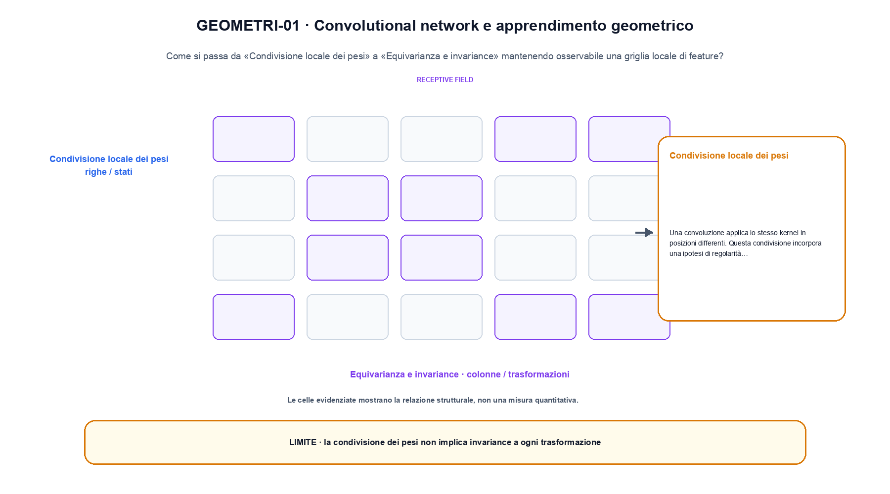
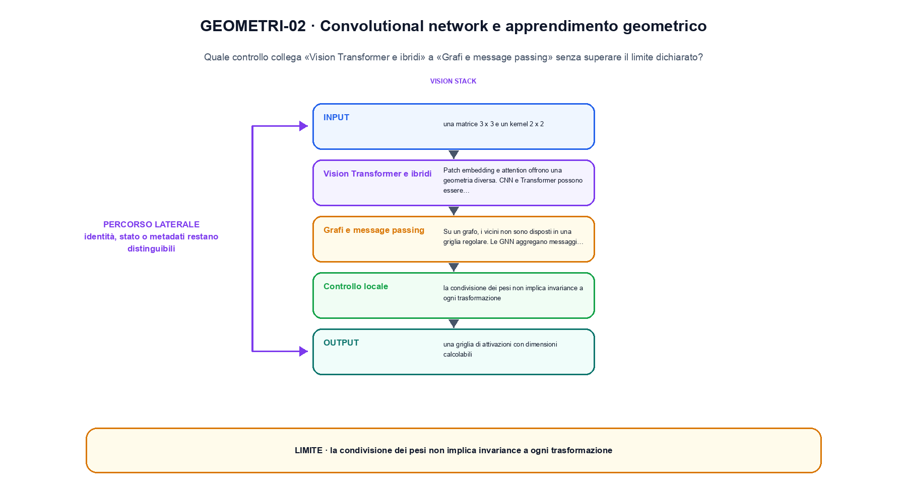

<!--
chapter_id: CH-P04-CNN-GEOMETRIC
part_id: P04
order_key: 170
title: Convolutional network e apprendimento geometrico
maturity: CORE
status: revisione editoriale v2, approvazione autoriale aperta
version: 0.5.0-draft3
last_source_check: 4 agosto 2026
environment: Python 3.13.12, CPU
code_policy: reference
deferred: benchmark applicativi non eseguiti e approvazione autoriale delle visuali
-->

# Capitolo 17. Convolutional network e apprendimento geometrico

La domanda guida di questa lezione è come collegare «Condivisione locale dei pesi» e «Grafi e message passing» senza perdere il contratto tecnico di convolutional network e apprendimento geometrico. L'oggetto osservato è una griglia locale di feature. Il contratto locale è: input, una matrice 3 x 3 e un kernel 2 x 2; operazione, lo stesso kernel scorre posizioni definite da stride e padding; output, una griglia di attivazioni con dimensioni calcolabili. Il caso guida è questo: Una griglia 3x3 e un kernel 2x2 in cui una sola posizione dell'output viene calcolata a mano. Il confine da mantenere esplicito è: la condivisione dei pesi non implica invariance a ogni trasformazione.

## Condivisione locale dei pesi

Una convoluzione applica lo stesso kernel in posizioni differenti. Questa condivisione incorpora una ipotesi di regolarità locale. [SRC-17-001]

Lo stesso kernel viene riutilizzato nelle posizioni della griglia.

**Caso da seguire.** Una griglia 3x3 e un kernel 2x2 in cui una sola posizione dell'output viene calcolata a mano.

**Controllo.** Scrivi il risultato atteso prima del calcolo, modifica una sola quantità e localizza il primo passaggio che cambia. Il vincolo da conservare è: Questa condivisione incorpora una ipotesi di regolarità locale.


## Stride, padding e receptive field

Stride e padding determinano la griglia dell'output. Il receptive field cresce con layer, kernel e dilatazione. [SRC-17-002]

**Caso da seguire.** Per «Stride, padding e receptive field» si mantiene l'input del capitolo e si isola questa condizione: Stride e padding determinano la griglia dell'output.

**Controllo.** Ricalcola il caso a mano e con lo snippet. Se i risultati divergono, confronta prima i valori intermedi e soltanto dopo l'output finale.


La relazione centrale può essere scritta come:

$$
y[i,j]=\sum_{u,v}K[u,v]x[i+u,j+v]
$$

Lo stesso kernel viene riutilizzato nelle posizioni della griglia. [SRC-17-001]




La prima figura segue il percorso da «Condivisione locale dei pesi» a «Equivarianza e invariance».


## Equivarianza e invariance

La convoluzione è equivariant a traslazioni entro le condizioni del bordo. Pooling e aggregazione possono costruire una maggiore invariance. [SRC-17-003]

**Caso da seguire.** Un caso in cui la condivisione dei pesi non implica invariance a ogni trasformazione.

**Controllo.** Aggiungi un valore limite e verifica separatamente forma, valore e ipotesi. Una shape valida non dimostra da sola «Equivarianza e invariance».


## Vision Transformer e ibridi

Patch embedding e attention offrono una geometria diversa. CNN e Transformer possono essere combinati, ma il confronto richiede stesso budget e dati. [SRC-17-004]

**Caso da seguire.** Per «Vision Transformer e ibridi» si mantiene l'input del capitolo e si isola questa condizione: Patch embedding e attention offrono una geometria diversa.

**Controllo.** Mantieni fisso l'input e sostituisci soltanto il meccanismo discusso nella sezione. Il confronto deve attribuire la differenza a quel passaggio, non al setup.


## Esempio Python eseguito

Il frammento seguente è lo stesso conservato nel repository. Usa valori piccoli perché l'obiettivo è osservare il meccanismo, non simulare una scala che non abbiamo eseguito.

```python
def contract():
    image = [[1.0, 2.0, 0.0], [0.0, 1.0, 2.0], [2.0, 0.0, 1.0]]
    kernel = [[1.0, 0.0], [0.0, -1.0]]
    output = [[sum(image[i + u][j + v] * kernel[u][v] for u in range(2) for v in range(2)) for j in range(2)] for i in range(2)]
    return {"output": output, "shape": [2, 2], "invariant": "the same kernel is reused at every position"}
```

Esecuzione con `python snip_17_contract.py`:

```text
{"invariant": "the same kernel is reused at every position", "output": [[0.0, 0.0], [0.0, 0.0]], "shape": [2, 2]}
```

Il test associato è [`code/test_17_contract.py`](code/test_17_contract.py); l'output versionato è [`code/outputs/SNIP-17-001.txt`](code/outputs/SNIP-17-001.txt).


## Grafi e message passing

Su un grafo, i vicini non sono disposti in una griglia regolare. Le GNN aggregano messaggi rispettando la struttura degli archi e le simmetrie dichiarate. [SRC-17-001]

**Caso da seguire.** Per «Grafi e message passing» si mantiene l'input del capitolo e si isola questa condizione: Su un grafo, i vicini non sono disposti in una griglia regolare.

**Controllo.** Costruisci un controesempio che rispetti il tipo di dato ma violi l'ipotesi centrale. Il test deve rendere riconoscibile perché «Grafi e message passing» non si applica.




La seconda figura mette a confronto «Vision Transformer e ibridi» e il limite discusso in «Grafi e message passing».


## Come si collegano i passaggi

- **Da «Condivisione locale dei pesi» a «Stride, padding e receptive field».** Una convoluzione applica lo stesso kernel in posizioni differenti. Stride e padding determinano la griglia dell'output. Il primo passaggio definisce che cosa entra nel calcolo; il secondo stabilisce la regola che produce il valore osservabile. [SRC-17-001; SRC-17-002]

- **Da «Stride, padding e receptive field» a «Equivarianza e invariance».** Stride e padding determinano la griglia dell'output. La convoluzione è equivariant a traslazioni entro le condizioni del bordo. La regola generale viene poi letta dentro il componente: questa separazione permette di localizzare un errore prima di attribuirlo all'intero modello. [SRC-17-002; SRC-17-003]

- **Da «Equivarianza e invariance» a «Vision Transformer e ibridi».** La convoluzione è equivariant a traslazioni entro le condizioni del bordo. Patch embedding e attention offrono una geometria diversa. Dopo avere reso visibile il componente, il percorso introduce la variante o l'ottimizzazione senza cambiare di nascosto il caso di partenza. [SRC-17-003; SRC-17-004]

- **Da «Vision Transformer e ibridi» a «Grafi e message passing».** Patch embedding e attention offrono una geometria diversa. Su un grafo, i vicini non sono disposti in una griglia regolare. L'ultimo passaggio sposta l'attenzione dal funzionamento locale alla misura: correttezza del calcolo e qualità applicativa restano domande distinte. [SRC-17-004; SRC-17-001]

La catena completa produce una griglia di attivazioni con dimensioni calcolabili a partire da una matrice 3 x 3 e un kernel 2 x 2. Ogni collegamento conserva un oggetto osservabile diverso; per questo il risultato non può essere esteso oltre il limite dichiarato: la condivisione dei pesi non implica invariance a ogni trasformazione.


## Esercizi sul meccanismo

1. Ricostruisci «Condivisione locale dei pesi» con un esempio diverso da quello mostrato e indica l'output atteso prima del calcolo.
2. Nel passaggio «Stride, padding e receptive field», cambia una sola ipotesi e spiega quale risultato non è più confrontabile.
3. Collega «Equivarianza e invariance» a una riga dello snippet oppure motiva perché la prova deve essere documentale.
4. Progetta un caso limite per «Vision Transformer e ibridi» che produca una failure riconoscibile.
5. Per «Grafi e message passing», separa una conclusione sostenuta dal caso locale da una che richiederebbe nuovi dati o un benchmark.


## Che cosa deve restare chiaro

La lezione parte da «una matrice 3 x 3 e un kernel 2 x 2» e arriva fino a «una griglia di attivazioni con dimensioni calcolabili». Il limite da conservare è questo: la condivisione dei pesi non implica invariance a ogni trasformazione. Definizioni e risultati citati sono rintracciabili in [`FONTI_PRIMARIE.md`](FONTI_PRIMARIE.md); la mappa dei claim è in [`CLAIMS.md`](CLAIMS.md).
