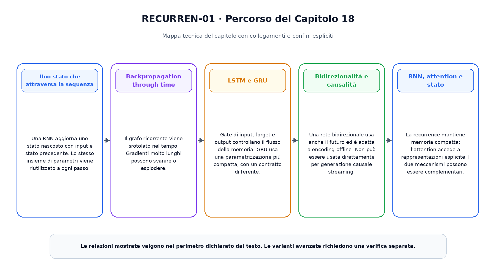
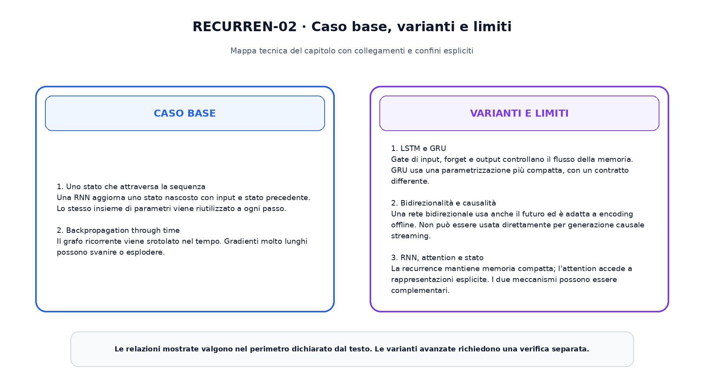

<!--
chapter_id: CH-P04-RECURRENT
part_id: P04
order_key: 180
title: Reti ricorrenti e modelli sequenziali
maturity: CORE
status: completo, validato e congelato
version: 1.0.0
last_source_check: 2026-08-01
-->

# Capitolo 18. Reti ricorrenti e modelli sequenziali

Il capitolo precedente ha costruito il prerequisito immediato necessario. Ora applichiamo lo stesso oggetto continuo, la richiesta «Il pacco non è arrivato», a una nuova capacità. L'obiettivo è capire il meccanismo in modo operativo, senza attribuire al modello proprietà che non sono state misurate.

## Uno stato che attraversa la sequenza

Una RNN aggiorna uno stato nascosto con input e stato precedente. Lo stesso insieme di parametri viene riutilizzato a ogni passo.

Questo passaggio usa l'oggetto continuo del libro e rende esplicito quale quantità viene trasformata, quale risultato viene ottenuto e quale limite resta aperto. L'esempio numerico e lo snippet permettono di controllare il contratto senza trasformarlo in una descrizione di un sistema reale.

## Backpropagation through time

Il grafo ricorrente viene srotolato nel tempo. Gradienti molto lunghi possono svanire o esplodere.

Questo passaggio usa l'oggetto continuo del libro e rende esplicito quale quantità viene trasformata, quale risultato viene ottenuto e quale limite resta aperto. L'esempio numerico e lo snippet permettono di controllare il contratto senza trasformarlo in una descrizione di un sistema reale.

## LSTM e GRU

Gate di input, forget e output controllano il flusso della memoria. GRU usa una parametrizzazione più compatta, con un contratto differente.

Questo passaggio usa l'oggetto continuo del libro e rende esplicito quale quantità viene trasformata, quale risultato viene ottenuto e quale limite resta aperto. L'esempio numerico e lo snippet permettono di controllare il contratto senza trasformarlo in una descrizione di un sistema reale.

## Bidirezionalità e causalità

Una rete bidirezionale usa anche il futuro ed è adatta a encoding offline. Non può essere usata direttamente per generazione causale streaming.

Questo passaggio usa l'oggetto continuo del libro e rende esplicito quale quantità viene trasformata, quale risultato viene ottenuto e quale limite resta aperto. L'esempio numerico e lo snippet permettono di controllare il contratto senza trasformarlo in una descrizione di un sistema reale.

## RNN, attention e stato

La recurrence mantiene memoria compatta; l'attention accede a rappresentazioni esplicite. I due meccanismi possono essere complementari.

Questo passaggio usa l'oggetto continuo del libro e rende esplicito quale quantità viene trasformata, quale risultato viene ottenuto e quale limite resta aperto. L'esempio numerico e lo snippet permettono di controllare il contratto senza trasformarlo in una descrizione di un sistema reale.

La prima figura ordina i passaggi e mostra il risultato consegnato alla fase successiva.

La seconda figura separa il contratto minimo dalle estensioni.

## Snippet verificabile

Il file [`code/snip_18_contract.py`](code/snip_18_contract.py) applica una normalizzazione stabile e combina stati con shape dichiarate. Lo snippet è intenzionalmente piccolo: verifica il tipo di ragionamento numerico usato nel capitolo, non riproduce un modello di produzione.

## Riepilogo

Il capitolo ha costruito reti ricorrenti e modelli sequenziali partendo dai prerequisiti disponibili. Il caso base, le varianti e i limiti sono mantenuti separati. Il risultato viene consegnato al capitolo successivo, che aggiunge una sola nuova dimensione del sistema.

### Verifica della comprensione

1. Ricostruisci l'ordine dei passaggi senza consultare la figura.
2. Indica quale oggetto viene aggiornato e quale resta invariato.
3. Spiega un limite del caso base.
4. Collega lo snippet alla sezione pertinente.
5. Proponi una variazione controllata e prevedine l'effetto.

## Fonti e materiali verificabili

Fonti, claim, codice, test e audit sono disponibili nei file del capitolo.
