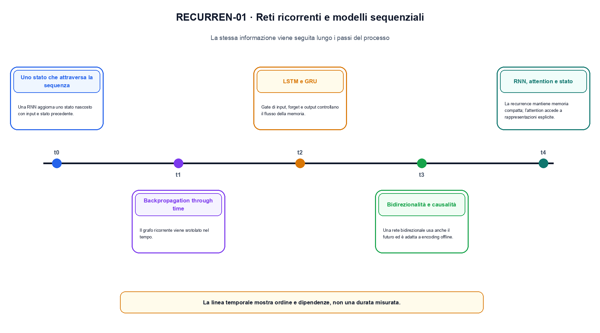
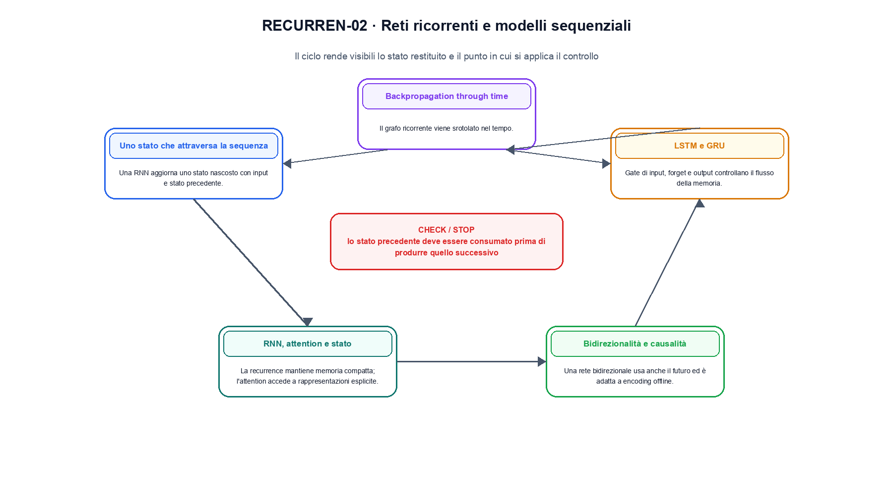

<!--
chapter_id: CH-P04-RECURRENT
part_id: P04
order_key: 180
title: Reti ricorrenti e modelli sequenziali
maturity: CORE
status: candidatura completa in revisione autoriale
version: 0.4.0-draft2
last_source_check: 3 agosto 2026
environment: Python 3.13.12, CPU
deferred: benchmark applicativi, varianti non necessarie al contratto centrale e approvazione autoriale
-->

# Capitolo 18. Reti ricorrenti e modelli sequenziali

La richiesta «Il pacco non è arrivato» resta il caso guida. In questo capitolo la usiamo per distinguere uno stato nascosto che attraversa una sequenza, trasformazione e risultato, senza nascondere i dettagli tecnici.

## Uno stato che attraversa la sequenza

Una RNN aggiorna uno stato nascosto con input e stato precedente. Lo stesso insieme di parametri viene riutilizzato a ogni passo. [SRC-18-001]

Per capire «Uno stato che attraversa la sequenza» partiamo da questo caso: tre passi in cui lo stato precedente viene consumato prima di produrre il successivo. Il caso rende osservabile il punto centrale: «Una RNN aggiorna uno stato nascosto con input e stato precedente».

Nel contratto locale, l'input «x_1, x_2, x_3 e h_0 = 0» entra, l'operazione «ogni passo combina input corrente e stato precedente con gli stessi pesi» modifica il percorso e l'output «h_t e, se richiesto, una predizione per il passo» è ciò che osserviamo. Qui cambia soprattutto il passaggio «Uno stato che attraversa la sequenza»; resta da controllare che lo stato precedente deve essere consumato prima di produrre quello successivo. La domanda locale è «Una RNN aggiorna uno stato nascosto con input e stato precedente».

Il passaggio da seguire in «Uno stato che attraversa la sequenza» è quello descritto dalla frase «Una RNN aggiorna uno stato nascosto con input e stato precedente»: l'esempio rende osservabile la trasformazione, mentre il contratto del capitolo ne delimita l'interpretazione. Per «Uno stato che attraversa la sequenza» il controllo cambia una sola premessa della frase «Una RNN aggiorna uno stato nascosto con input e stato precedente» e conserva input, output e criterio di successo, così la differenza resta attribuibile. La verifica resta ancorata a «Una RNN aggiorna uno stato nascosto con input e stato precedente». [SRC-18-001]

La lettura va fatta in ordine: prima il caso, poi la trasformazione, quindi la conseguenza. Lo stesso insieme di parametri viene riutilizzato a ogni passo. Il piccolo risultato resta un'illustrazione di «Una RNN aggiorna uno stato nascosto con input e stato precedente», non una promessa generale.

Per verificare «Uno stato che attraversa la sequenza» cambiamo una sola condizione vicina alla frase «Una RNN aggiorna uno stato nascosto con input e stato precedente», teniamo fermo il resto e registriamo l'output «h_t e, se richiesto, una predizione per il passo». Il caso negativo deve rendere riconoscibile la failure, non soltanto produrre un numero diverso. La sezione successiva, «Backpropagation through time», riceve l'output «h_t e, se richiesto, una predizione per il passo» come base, ma dovrà formulare e verificare la propria distinzione.

## Backpropagation through time

Il grafo ricorrente viene srotolato nel tempo. Gradienti molto lunghi possono svanire o esplodere. [SRC-18-002]

Il caso minimo di «Backpropagation through time» si presenta così: tre aggiornamenti tanh con coefficienti fissi e forma scalare. Non lo usiamo come decorazione: serve a rendere osservabile la frase «Il grafo ricorrente viene srotolato nel tempo».

La sezione usa l'input «x_1, x_2, x_3 e h_0 = 0» come punto di partenza e l'output «h_t e, se richiesto, una predizione per il passo» come traccia d'uscita. La trasformazione concreta è «ogni passo combina input corrente e stato precedente con gli stessi pesi»; il caso non è completo se non dichiariamo anche che lo stato precedente deve essere consumato prima di produrre quello successivo. La condizione da isolare è «Il grafo ricorrente viene srotolato nel tempo».

Una rete ricorrente riusa lo stato e gli stessi parametri a ogni passo. Srotolare il calcolo rende visibile il percorso dei gradienti; gate e direzione della sequenza cambiano quali informazioni possono sopravvivere. Per «Backpropagation through time» il controllo cambia una sola premessa della frase «Il grafo ricorrente viene srotolato nel tempo» e conserva input, output e criterio di successo, così la differenza resta attribuibile. La verifica resta ancorata a «Il grafo ricorrente viene srotolato nel tempo». [SRC-18-002]

Se cambiamo una premessa, dobbiamo riaprire l'interpretazione. Per «Backpropagation through time» conserviamo l'osservazione collegata a «Il grafo ricorrente viene srotolato nel tempo» e lasciamo esplicitamente fuori ciò che non è stato misurato.

Il controllo minimo di «Backpropagation through time» confronta il caso dichiarato con una variazione che rompe la sua ipotesi. Se la failure non è distinguibile dall'esito valido, manca un'osservazione nel contratto del collegamento tra blocchi. Da «Backpropagation through time» portiamo l'output «h_t e, se richiesto, una predizione per il passo»; non portiamo invece una conclusione oltre il caso locale.

La figura RECURREN-01 usa la famiglia timeline. La stessa informazione viene seguita lungo i passi del processo.

## LSTM e GRU

Gate di input, forget e output controllano il flusso della memoria. GRU usa una parametrizzazione più compatta, con un contratto differente. [SRC-18-003]

Prima del nome tecnico fissiamo la situazione: consideriamo tre passi in cui lo stato precedente viene consumato prima di produrre il successivo. Da qui possiamo leggere la conseguenza dichiarata da «Gate di input, forget e output controllano il flusso della memoria».

Per ricostruire «LSTM e GRU» annotiamo l'input «x_1, x_2, x_3 e h_0 = 0», poi l'operazione «ogni passo combina input corrente e stato precedente con gli stessi pesi», infine l'output «h_t e, se richiesto, una predizione per il passo». Questa sequenza impedisce di scambiare una forma compatibile per il comportamento descritto dalla fonte. Il controllo parte da «Gate di input, forget e output controllano il flusso della memoria».

Una rete ricorrente riusa lo stato e gli stessi parametri a ogni passo. Srotolare il calcolo rende visibile il percorso dei gradienti; gate e direzione della sequenza cambiano quali informazioni possono sopravvivere. Per «LSTM e GRU» il controllo cambia una sola premessa della frase «Gate di input, forget e output controllano il flusso della memoria» e conserva input, output e criterio di successo, così la differenza resta attribuibile. La verifica resta ancorata a «Gate di input, forget e output controllano il flusso della memoria». [SRC-18-003]

Il punto didattico di «LSTM e GRU» è separare ciò che la fonte afferma da ciò che il piccolo caso illustra. L'output «h_t e, se richiesto, una predizione per il passo» mostra il contratto locale, ma non sostituisce una misura sul sistema completo.

La prova di «LSTM e GRU» conserva input, operazione e output; poi esplicita quale parte di «Gate di input, forget e output controllano il flusso della memoria» non è stata misurata. Così il test separa l'evidenza dall'inferenza. Il passaggio successivo, «Bidirezionalità e causalità», potrà cambiare una sola condizione, dichiarando il nuovo setup prima di interpretare il risultato.

## Bidirezionalità e causalità

Una rete bidirezionale usa anche il futuro ed è adatta a encoding offline. Non può essere usata direttamente per generazione causale streaming. [SRC-18-004]

Per capire «Bidirezionalità e causalità» partiamo da questo caso: una matrice di visibilità in cui la posizione futura resta esclusa anche se la shape dei tensori è compatibile. Il caso rende osservabile il punto centrale: «Una rete bidirezionale usa anche il futuro ed è adatta a encoding offline».

Nel contratto locale, l'input «x_1, x_2, x_3 e h_0 = 0» entra, l'operazione «ogni passo combina input corrente e stato precedente con gli stessi pesi» modifica il percorso e l'output «h_t e, se richiesto, una predizione per il passo» è ciò che osserviamo. Qui cambia soprattutto il passaggio «Bidirezionalità e causalità»; resta da controllare che lo stato precedente deve essere consumato prima di produrre quello successivo. La domanda locale è «Una rete bidirezionale usa anche il futuro ed è adatta a encoding offline».

Una rete ricorrente riusa lo stato e gli stessi parametri a ogni passo. Srotolare il calcolo rende visibile il percorso dei gradienti; gate e direzione della sequenza cambiano quali informazioni possono sopravvivere. Per «Bidirezionalità e causalità» il controllo cambia una sola premessa della frase «Una rete bidirezionale usa anche il futuro ed è adatta a encoding offline» e conserva input, output e criterio di successo, così la differenza resta attribuibile. La verifica resta ancorata a «Una rete bidirezionale usa anche il futuro ed è adatta a encoding offline». [SRC-18-004]

La lettura va fatta in ordine: prima il caso, poi la trasformazione, quindi la conseguenza. Non può essere usata direttamente per generazione causale streaming. Il piccolo risultato resta un'illustrazione di «Una rete bidirezionale usa anche il futuro ed è adatta a encoding offline», non una promessa generale.

Per verificare «Bidirezionalità e causalità» cambiamo una sola condizione vicina alla frase «Una rete bidirezionale usa anche il futuro ed è adatta a encoding offline», teniamo fermo il resto e registriamo l'output «h_t e, se richiesto, una predizione per il passo». Il caso negativo deve rendere riconoscibile la failure, non soltanto produrre un numero diverso. La sezione successiva, «RNN, attention e stato», riceve l'output «h_t e, se richiesto, una predizione per il passo» come base, ma dovrà formulare e verificare la propria distinzione.

## RNN, attention e stato

La recurrence mantiene memoria compatta; l'attention accede a rappresentazioni esplicite. I due meccanismi possono essere complementari. [SRC-18-001]

Il caso minimo di «RNN, attention e stato» si presenta così: tre passi in cui lo stato precedente viene consumato prima di produrre il successivo. Non lo usiamo come decorazione: serve a rendere osservabile la frase «La recurrence mantiene memoria compatta; l'attention accede a rappresentazioni esplicite».

La sezione usa l'input «x_1, x_2, x_3 e h_0 = 0» come punto di partenza e l'output «h_t e, se richiesto, una predizione per il passo» come traccia d'uscita. La trasformazione concreta è «ogni passo combina input corrente e stato precedente con gli stessi pesi»; il caso non è completo se non dichiariamo anche che lo stato precedente deve essere consumato prima di produrre quello successivo. La condizione da isolare è «La recurrence mantiene memoria compatta; l'attention accede a rappresentazioni esplicite».

Una rete ricorrente riusa lo stato e gli stessi parametri a ogni passo. Srotolare il calcolo rende visibile il percorso dei gradienti; gate e direzione della sequenza cambiano quali informazioni possono sopravvivere. La variabile da isolare è il pattern di visibilità o di riuso: la stessa shape può corrispondere a dipendenze e costi diversi. La verifica resta ancorata a «La recurrence mantiene memoria compatta; l'attention accede a rappresentazioni esplicite». [SRC-18-001]

Se cambiamo una premessa, dobbiamo riaprire l'interpretazione. Per «RNN, attention e stato» conserviamo l'osservazione collegata a «La recurrence mantiene memoria compatta; l'attention accede a rappresentazioni esplicite» e lasciamo esplicitamente fuori ciò che non è stato misurato.

Il controllo minimo di «RNN, attention e stato» confronta il caso dichiarato con una variazione che rompe la sua ipotesi. Se la failure non è distinguibile dall'esito valido, manca un'osservazione nel contratto del collegamento tra blocchi. La conclusione resta ancorata al protocollo osservato, non al nome della tecnica.

## La definizione messa alla prova: Uno stato che attraversa la sequenza

Il caso intero parte dall'input «x_1, x_2, x_3 e h_0 = 0», applica l'operazione «ogni passo combina input corrente e stato precedente con gli stessi pesi» e osserva l'output «h_t e, se richiesto, una predizione per il passo». Un esempio controllato: tre aggiornamenti tanh con coefficienti fissi e forma scalare. La formula locale è:

$$
h_t=\phi(W_xx_t+W_hh_{t-1}+b)
$$

Lo stato corrente dipende dall'input e dallo stato precedente. [SRC-18-001]

La figura RECURREN-02 cambia composizione rispetto alla prima. Il ciclo rende visibili lo stato restituito e il punto in cui si applica il controllo.

## Un esperimento piccolo ma leggibile: Backpropagation through time

Nel run Python rendiamo osservabile la frase «Una RNN aggiorna uno stato nascosto con input e stato precedente» con valori piccoli e leggibili. Il test associato verifica determinismo, output e rifiuto di una condizione incoerente; il file di output `code/outputs/SNIP-18-001.txt` documenta il caso senza pretendere una misura generale.

## Il confine del caso guida: RNN, attention e stato

Il meccanismo di «Reti ricorrenti e modelli sequenziali» non garantisce da solo che il sistema funzioni fuori dal caso guida. Lo stato precedente deve essere consumato prima di produrre quello successivo. Il limite osservato riguarda la frase «Una RNN aggiorna uno stato nascosto con input e stato precedente»; per trasferire il concetto occorre riaprire la verifica quando cambiano dati, scala o ambiente.

## Il contratto che rimane: Reti ricorrenti e modelli sequenziali

Il percorso ha tenuto insieme uno stato nascosto che attraversa una sequenza, l'operazione «ogni passo combina input corrente e stato precedente con gli stessi pesi» e l'output «h_t e, se richiesto, una predizione per il passo». Le sezioni «Uno stato che attraversa la sequenza», «Backpropagation through time», «RNN, attention e stato» mostrano come il protocollo osservato delimiti ciò che il capitolo può sostenere. L'invariante da portare avanti è: lo stato precedente deve essere consumato prima di produrre quello successivo. Il Capitolo 19, Representation learning, può partire da questo output e dichiarare la propria domanda.

### Controllo finale della lezione: Uno stato che attraversa la sequenza

1. Ricostruisci l'oggetto continuo a partire da «Uno stato che attraversa la sequenza» e indica quale parte della frase «Una RNN aggiorna uno stato nascosto con input e stato precedente» entra nel caso.
2. Spiega quale trasformazione collega «Uno stato che attraversa la sequenza» a «RNN, attention e stato» e quale output osserviamo nel passaggio.
3. Usa lo snippet per controllare l'invariante del contratto: lo stato precedente deve essere consumato prima di produrre quello successivo.
4. Separa una definizione sostenuta da una fonte, un esempio illustrativo e un risultato locale del caso guida.
5. Indica quale parte della frase «La recurrence mantiene memoria compatta; l'attention accede a rappresentazioni esplicite» richiederebbe una misura nuova prima di essere estesa oltre il caso osservato.

### Prove da rifare e modificare: RNN, attention e stato

1. Racconta «Uno stato che attraversa la sequenza» come una trasformazione: che cosa entra e che cosa esce?
2. Confronta due esecuzioni di «Backpropagation through time» mantenendo il resto del setup invariato.
3. Per «LSTM e GRU», separa l'esempio locale dal limite che impedisce di generalizzarlo.
4. Progetta una prova per «Bidirezionalità e causalità» che renda visibile il suo confine.
5. Scrivi una metrica o una domanda per valutare «RNN, attention e stato» senza confondere livelli diversi.

## Riferimenti e prove riproducibili: Reti ricorrenti e modelli sequenziali

Per «Reti ricorrenti e modelli sequenziali», le fonti portanti, i limiti dei claim e la data di consultazione sono raccolti in `FONTI_PRIMARIE.md`; la ricerca riguarda soprattutto il collegamento tra blocchi. `CLAIMS.md` separa definizioni e risultati locali; codice, ambiente, test e output sono nella cartella `code/`, con attenzione al collegamento tra blocchi.
