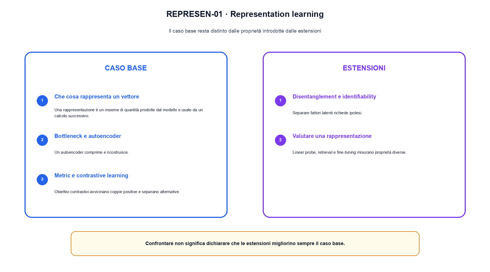
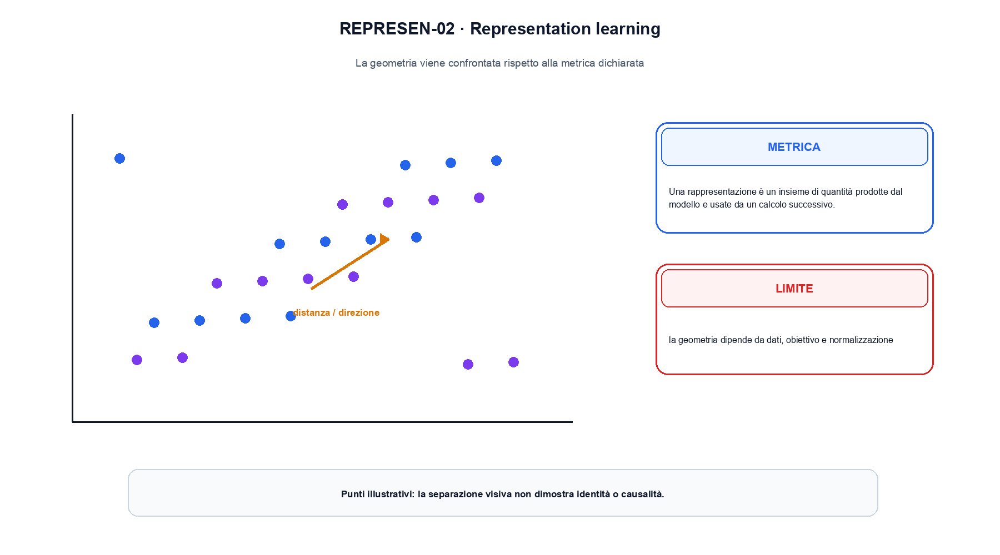

<!--
chapter_id: CH-P04-REPRESENTATION
part_id: P04
order_key: 190
title: Representation learning
maturity: CORE
status: candidatura completa in revisione autoriale
version: 0.4.0-draft2
last_source_check: 3 agosto 2026
environment: Python 3.13.12, CPU
deferred: benchmark applicativi, varianti non necessarie al contratto centrale e approvazione autoriale
-->

# Capitolo 19. Representation learning

Una frase plausibile non basta a spiegare representation learning. L'oggetto è un vettore prodotto per un compito successivo; riprendiamo la richiesta «Il pacco non è arrivato» come contesto comune, partiamo da un input piccolo, rendiamo visibile l'operazione e fissiamo che cosa non possiamo concludere.

## Che cosa rappresenta un vettore

Una rappresentazione è un insieme di quantità prodotte dal modello e usate da un calcolo successivo. Il significato dipende da obiettivo e dati. [SRC-19-001]

Il caso minimo di «Che cosa rappresenta un vettore» si presenta così: un caso minimo con input u = [1, 2, 0] e v = [2, 1, 0] e output «un vettore, una similarità o una predizione downstream». Non lo usiamo come decorazione: serve a rendere osservabile la frase «Una rappresentazione è un insieme di quantità prodotte dal modello e usate da un calcolo successivo».

Per ricostruire «Che cosa rappresenta un vettore» annotiamo l'input «u = [1, 2, 0] e v = [2, 1, 0]», poi l'operazione «una proiezione, una ricostruzione o una metrica tra rappresentazioni», infine l'output «un vettore, una similarità o una predizione downstream». Questa sequenza impedisce di scambiare una forma compatibile per il comportamento descritto dalla fonte. Il controllo parte da «Una rappresentazione è un insieme di quantità prodotte dal modello e usate da un calcolo successivo».

Una rappresentazione non ha significato isolato: è una quantità prodotta per un uso successivo. Obiettivo, dati, augmentazioni e metrica determinano quali relazioni vengono rese facili da leggere. Per «Che cosa rappresenta un vettore» il controllo cambia una sola premessa della frase «Una rappresentazione è un insieme di quantità prodotte dal modello e usate da un calcolo successivo» e conserva input, output e criterio di successo, così la differenza resta attribuibile. La verifica resta ancorata a «Una rappresentazione è un insieme di quantità prodotte dal modello e usate da un calcolo successivo». [SRC-19-001]

Il punto didattico di «Che cosa rappresenta un vettore» è separare ciò che la fonte afferma da ciò che il piccolo caso illustra. L'output «un vettore, una similarità o una predizione downstream» mostra il contratto locale, ma non sostituisce una misura sul sistema completo.

Il controllo minimo di «Che cosa rappresenta un vettore» confronta il caso dichiarato con una variazione che rompe la sua ipotesi. Se la failure non è distinguibile dall'esito valido, manca un'osservazione nel contratto del collegamento tra blocchi. Da «Che cosa rappresenta un vettore» portiamo l'output «un vettore, una similarità o una predizione downstream»; non portiamo invece una conclusione oltre il caso locale.

## Bottleneck e autoencoder

Un autoencoder comprime e ricostruisce. Un bottleneck limita la capacità, ma non garantisce che le coordinate corrispondano a fattori interpretabili. [SRC-19-002]

Prima del nome tecnico fissiamo la situazione: consideriamo similarità coseno calcolata dopo la normalizzazione delle norme. Da qui possiamo leggere la conseguenza dichiarata da «Un autoencoder comprime e ricostruisce».

Nel contratto locale, l'input «u = [1, 2, 0] e v = [2, 1, 0]» entra, l'operazione «una proiezione, una ricostruzione o una metrica tra rappresentazioni» modifica il percorso e l'output «un vettore, una similarità o una predizione downstream» è ciò che osserviamo. Qui cambia soprattutto il passaggio «Bottleneck e autoencoder»; resta da controllare che la geometria dipende da dati, obiettivo e normalizzazione. La domanda locale è «Un autoencoder comprime e ricostruisce».

Una rappresentazione non ha significato isolato: è una quantità prodotta per un uso successivo. Obiettivo, dati, augmentazioni e metrica determinano quali relazioni vengono rese facili da leggere. Per «Bottleneck e autoencoder» il controllo cambia una sola premessa della frase «Un autoencoder comprime e ricostruisce» e conserva input, output e criterio di successo, così la differenza resta attribuibile. La verifica resta ancorata a «Un autoencoder comprime e ricostruisce». [SRC-19-002]

La lettura va fatta in ordine: prima il caso, poi la trasformazione, quindi la conseguenza. Un bottleneck limita la capacità, ma non garantisce che le coordinate corrispondano a fattori interpretabili. Il piccolo risultato resta un'illustrazione di «Un autoencoder comprime e ricostruisce», non una promessa generale.

La prova di «Bottleneck e autoencoder» conserva input, operazione e output; poi esplicita quale parte di «Un autoencoder comprime e ricostruisce» non è stata misurata. Così il test separa l'evidenza dall'inferenza. Il passaggio successivo, «Metric e contrastive learning», potrà cambiare una sola condizione, dichiarando il nuovo setup prima di interpretare il risultato.

## Metric e contrastive learning

Obiettivi contrastivi avvicinano coppie positive e separano alternative. La definizione delle coppie e delle augmentazioni stabilisce le invarianti apprese. [SRC-19-003]

Per capire «Metric e contrastive learning» partiamo da questo caso: quattro casi con protocollo, una failure e una slice conservati insieme al valore aggregato. Il caso rende osservabile il punto centrale: «Obiettivi contrastivi avvicinano coppie positive e separano alternative».

La sezione usa l'input «u = [1, 2, 0] e v = [2, 1, 0]» come punto di partenza e l'output «un vettore, una similarità o una predizione downstream» come traccia d'uscita. La trasformazione concreta è «una proiezione, una ricostruzione o una metrica tra rappresentazioni»; il caso non è completo se non dichiariamo anche che la geometria dipende da dati, obiettivo e normalizzazione. La condizione da isolare è «Obiettivi contrastivi avvicinano coppie positive e separano alternative».

Una rappresentazione non ha significato isolato: è una quantità prodotta per un uso successivo. Obiettivo, dati, augmentazioni e metrica determinano quali relazioni vengono rese facili da leggere. La misura va letta insieme a popolazione, slice e failure: cambiare il report senza cambiare il protocollo non crea nuova evidenza. La verifica resta ancorata a «Obiettivi contrastivi avvicinano coppie positive e separano alternative». [SRC-19-003]

Se cambiamo una premessa, dobbiamo riaprire l'interpretazione. Per «Metric e contrastive learning» conserviamo l'osservazione collegata a «Obiettivi contrastivi avvicinano coppie positive e separano alternative» e lasciamo esplicitamente fuori ciò che non è stato misurato.

Per verificare «Metric e contrastive learning» cambiamo una sola condizione vicina alla frase «Obiettivi contrastivi avvicinano coppie positive e separano alternative», teniamo fermo il resto e registriamo l'output «un vettore, una similarità o una predizione downstream». Il caso negativo deve rendere riconoscibile la failure, non soltanto produrre un numero diverso. La sezione successiva, «Disentanglement e identifiability», riceve l'output «un vettore, una similarità o una predizione downstream» come base, ma dovrà formulare e verificare la propria distinzione.

La figura REPRESEN-01 usa la famiglia compare. Il caso base resta distinto dalle proprietà introdotte dalle estensioni.

## Disentanglement e identifiability

Separare fattori latenti richiede ipotesi. Senza supervision o bias aggiuntivi, molte rappresentazioni equivalenti possono spiegare gli stessi dati. [SRC-19-004]

Il caso minimo di «Disentanglement e identifiability» si presenta così: due vettori con prodotto scalare positivo possono avere similarità diversa dopo normalizzazione. La metrica va scelta insieme al compito. Non lo usiamo come decorazione: serve a rendere osservabile la frase «Separare fattori latenti richiede ipotesi».

Per ricostruire «Disentanglement e identifiability» annotiamo l'input «u = [1, 2, 0] e v = [2, 1, 0]», poi l'operazione «una proiezione, una ricostruzione o una metrica tra rappresentazioni», infine l'output «un vettore, una similarità o una predizione downstream». Questa sequenza impedisce di scambiare una forma compatibile per il comportamento descritto dalla fonte. Il controllo parte da «Separare fattori latenti richiede ipotesi».

Una rappresentazione non ha significato isolato: è una quantità prodotta per un uso successivo. Obiettivo, dati, augmentazioni e metrica determinano quali relazioni vengono rese facili da leggere. Per «Disentanglement e identifiability» il controllo cambia una sola premessa della frase «Separare fattori latenti richiede ipotesi» e conserva input, output e criterio di successo, così la differenza resta attribuibile. La verifica resta ancorata a «Separare fattori latenti richiede ipotesi». [SRC-19-004]

Il punto didattico di «Disentanglement e identifiability» è separare ciò che la fonte afferma da ciò che il piccolo caso illustra. L'output «un vettore, una similarità o una predizione downstream» mostra il contratto locale, ma non sostituisce una misura sul sistema completo.

Il controllo minimo di «Disentanglement e identifiability» confronta il caso dichiarato con una variazione che rompe la sua ipotesi. Se la failure non è distinguibile dall'esito valido, manca un'osservazione nel contratto del collegamento tra blocchi. Da «Disentanglement e identifiability» portiamo l'output «un vettore, una similarità o una predizione downstream»; non portiamo invece una conclusione oltre il caso locale.

## Valutare una rappresentazione

Linear probe, retrieval e fine-tuning misurano proprietà diverse. Una buona metrica downstream non dimostra interpretabilità globale. [SRC-19-001]

Prima del nome tecnico fissiamo la situazione: consideriamo due vettori con prodotto scalare positivo possono avere similarità diversa dopo normalizzazione. La metrica va scelta insieme al compito. Da qui possiamo leggere la conseguenza dichiarata da «Linear probe, retrieval e fine-tuning misurano proprietà diverse».

Nel contratto locale, l'input «u = [1, 2, 0] e v = [2, 1, 0]» entra, l'operazione «una proiezione, una ricostruzione o una metrica tra rappresentazioni» modifica il percorso e l'output «un vettore, una similarità o una predizione downstream» è ciò che osserviamo. Qui cambia soprattutto il passaggio «Valutare una rappresentazione»; resta da controllare che la geometria dipende da dati, obiettivo e normalizzazione. La domanda locale è «Linear probe, retrieval e fine-tuning misurano proprietà diverse».

Una rappresentazione non ha significato isolato: è una quantità prodotta per un uso successivo. Obiettivo, dati, augmentazioni e metrica determinano quali relazioni vengono rese facili da leggere. Per «Valutare una rappresentazione» il controllo cambia una sola premessa della frase «Linear probe, retrieval e fine-tuning misurano proprietà diverse» e conserva input, output e criterio di successo, così la differenza resta attribuibile. La verifica resta ancorata a «Linear probe, retrieval e fine-tuning misurano proprietà diverse». [SRC-19-001]

La lettura va fatta in ordine: prima il caso, poi la trasformazione, quindi la conseguenza. Una buona metrica downstream non dimostra interpretabilità globale. Il piccolo risultato resta un'illustrazione di «Linear probe, retrieval e fine-tuning misurano proprietà diverse», non una promessa generale.

La prova di «Valutare una rappresentazione» conserva input, operazione e output; poi esplicita quale parte di «Linear probe, retrieval e fine-tuning misurano proprietà diverse» non è stata misurata. Così il test separa l'evidenza dall'inferenza. Il caso finale consegna l'output «un vettore, una similarità o una predizione downstream» come evidenza locale e conserva la trasformazione che la rete applica al segnale come domanda aperta.

## La definizione messa alla prova: Che cosa rappresenta un vettore

Il caso intero parte dall'input «u = [1, 2, 0] e v = [2, 1, 0]», applica l'operazione «una proiezione, una ricostruzione o una metrica tra rappresentazioni» e osserva l'output «un vettore, una similarità o una predizione downstream». Un esempio controllato: similarità coseno calcolata dopo la normalizzazione delle norme. La formula locale è:

$$
s(u,v)=u\cdot v/(||u||_2||v||_2)
$$

La similarità coseno confronta direzioni dopo una scelta di normalizzazione. [SRC-19-001]

La figura REPRESEN-02 cambia composizione rispetto alla prima. La geometria viene confrontata rispetto alla metrica dichiarata.

## Un esperimento piccolo ma leggibile: Bottleneck e autoencoder

Lo snippet locale mette in esecuzione questo caso: similarità coseno calcolata dopo la normalizzazione delle norme. Il test associato controlla determinismo, output e invariante e rifiuta una shape o condizione incoerente; il risultato è conservato in `code/outputs/SNIP-19-001.txt`, come evidenza locale e non come benchmark di produzione.

## Il confine del caso guida: Valutare una rappresentazione

Il caso di «Representation learning» non certifica un servizio completo. La geometria dipende da dati, obiettivo e normalizzazione. La domanda successiva è se «Linear probe, retrieval e fine-tuning misurano proprietà diverse» regga quando cambiano dati, scala, hardware o criteri di decisione.

## Il contratto che rimane: Representation learning

Il filo della lezione va dall'input «u = [1, 2, 0] e v = [2, 1, 0]» all'output «un vettore, una similarità o una predizione downstream». Nei passaggi «Che cosa rappresenta un vettore», «Bottleneck e autoencoder», «Valutare una rappresentazione» abbiamo usato esempi e controlli negativi per rendere il contratto controllabile e delimitare la conclusione. L'invariante da portare avanti è: la geometria dipende da dati, obiettivo e normalizzazione. Il Capitolo 20, Fondamenti della modellazione generativa, può partire da questo output e dichiarare la propria domanda.

### Controllo finale della lezione: Che cosa rappresenta un vettore

1. Ricostruisci l'oggetto continuo a partire da «Che cosa rappresenta un vettore» e indica quale parte della frase «Una rappresentazione è un insieme di quantità prodotte dal modello e usate da un calcolo successivo» entra nel caso.
2. Spiega quale trasformazione collega «Che cosa rappresenta un vettore» a «Valutare una rappresentazione» e quale output osserviamo nel passaggio.
3. Usa lo snippet per controllare l'invariante del contratto: la geometria dipende da dati, obiettivo e normalizzazione.
4. Separa una definizione sostenuta da una fonte, un esempio illustrativo e un risultato locale del caso guida.
5. Indica quale parte della frase «Linear probe, retrieval e fine-tuning misurano proprietà diverse» richiederebbe una misura nuova prima di essere estesa oltre il caso osservato.

### Prove da rifare e modificare: Valutare una rappresentazione

1. Racconta «Che cosa rappresenta un vettore» come una trasformazione: che cosa entra e che cosa esce?
2. Confronta due esecuzioni di «Bottleneck e autoencoder» mantenendo il resto del setup invariato.
3. Per «Metric e contrastive learning», separa l'esempio locale dal limite che impedisce di generalizzarlo.
4. Progetta una prova per «Disentanglement e identifiability» che renda visibile il suo confine.
5. Scrivi una metrica o una domanda per valutare «Valutare una rappresentazione» senza confondere livelli diversi.

## Riferimenti e prove riproducibili: Representation learning

Per ricontrollare «Representation learning», partire da `FONTI_PRIMARIE.md` e poi dal codice: la domanda aperta è come trasferire la trasformazione che la rete applica al segnale oltre il caso locale, con la data di consultazione dichiarata. `CLAIMS.md` separa definizioni e risultati locali; codice, ambiente, test e output sono nella cartella `code/`, con attenzione al collegamento tra blocchi.
