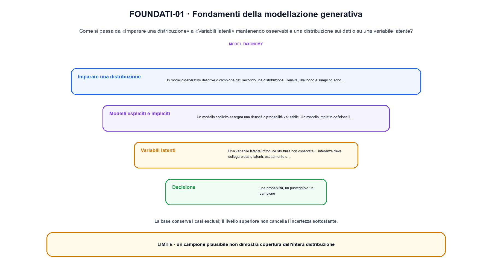
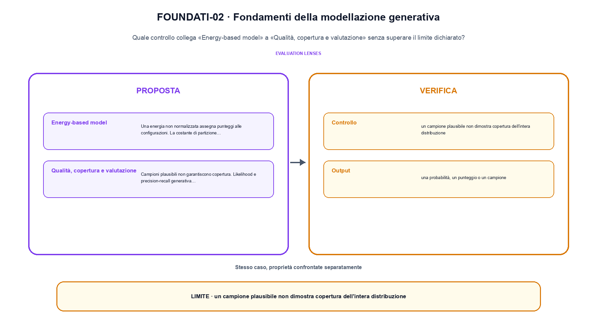

<!--
chapter_id: CH-P05-GENERATIVE-FOUNDATIONS
part_id: P05
order_key: 200
title: Fondamenti della modellazione generativa
maturity: CORE
status: revisione editoriale v2, approvazione autoriale aperta
version: 0.5.0-draft3
last_source_check: 4 agosto 2026
environment: Python 3.13.12, CPU
code_policy: exception
code_exception: Il capitolo confronta famiglie generative a livello concettuale; le implementazioni verificabili sono distribuite nei capitoli 21-25.
deferred: benchmark applicativi non eseguiti e approvazione autoriale delle visuali
-->

# Capitolo 20. Fondamenti della modellazione generativa

La domanda guida di questa lezione è come collegare «Imparare una distribuzione» e «Qualità, copertura e valutazione» senza perdere il contratto tecnico di fondamenti della modellazione generativa. L'oggetto osservato è una distribuzione sui dati o su una variabile latente. Il contratto locale è: input, un dato x, un rumore epsilon o una variabile z; operazione, valutazione di likelihood, trasformazione o campionamento; output, una probabilità, un punteggio o un campione. Il caso guida è questo: Un caso minimo con input un dato x, un rumore epsilon o una variabile z e output «una probabilità, un punteggio o un campione». Il confine da mantenere esplicito è: un campione plausibile non dimostra copertura dell'intera distribuzione.

## Imparare una distribuzione

Un modello generativo descrive o campiona dati secondo una distribuzione. Densità, likelihood e sampling sono contratti distinti. [SRC-20-001]

La variabile latente collega un prior a una distribuzione osservabile.

**Caso da seguire.** Un caso minimo con input un dato x, un rumore epsilon o una variabile z e output «una probabilità, un punteggio o un campione».

**Controllo.** Classifica lo stesso caso lungo un solo asse alla volta e annota quale proprietà non è stata misurata.

## Modelli espliciti e impliciti

Un modello esplicito assegna una densità o probabilità valutabile. Un modello implicito definisce il campionamento senza una likelihood semplice. [SRC-20-002]

**Caso da seguire.** Tre probabilità che sommano a 1 prima della selezione.

**Controllo.** Cambia la proprietà che distingue «Modelli espliciti e impliciti» dalle categorie vicine. Se la classificazione non cambia, la distinzione va formulata meglio.

## Variabili latenti

Una variabile latente introduce struttura non osservata. L'inferenza deve collegare dati e latenti, esattamente o mediante approssimazione. [SRC-20-003]

**Caso da seguire.** Tre probabilità che sommano a 1 prima del campionamento, distinguendo plausibilità del campione e copertura.

**Controllo.** Confronta un caso positivo e uno di confine usando la medesima definizione; non trasformare l'esempio in una graduatoria generale.

La prima figura segue il percorso da «Imparare una distribuzione» a «Variabili latenti».

## Energy-based model

Una energia non normalizzata assegna punteggi alle configurazioni. La costante di partizione rende difficile la likelihood in molti casi. [SRC-20-004]

**Caso da seguire.** Per una variabile Bernoulli, la likelihood valuta la probabilità del dato osservato; un campione plausibile non dimostra che la distribuzione sia coperta.

**Controllo.** Indica quale osservazione smentirebbe l'assegnazione del caso a «Energy-based model» e quale invece sarebbe irrilevante.

## Qualità, copertura e valutazione

Campioni plausibili non garantiscono copertura. Likelihood e precision-recall generativa rispondono a domande diverse e richiedono protocolli dichiarati. [SRC-20-001; SRC-20-005]

**Caso da seguire.** Per «Qualità, copertura e valutazione» si mantiene l'input del capitolo e si isola questa condizione: Campioni plausibili non garantiscono copertura.

**Controllo.** Limita la conclusione alla proprietà dichiarata: Likelihood e precision-recall generativa rispondono a domande diverse e richiedono protocolli dichiarati. Le dimensioni non osservate restano aperte.

La seconda figura mette a confronto «Energy-based model» e il limite discusso in «Qualità, copertura e valutazione».

## Perché non forziamo un esempio Python

Il capitolo confronta famiglie generative a livello concettuale; le implementazioni verificabili sono distribuite nei capitoli 21-25. La verifica resta comunque obbligatoria attraverso fonti primarie, data di consultazione, claim delimitati e confronto tra casi.

## Come si collegano i passaggi

- **Da «Imparare una distribuzione» a «Modelli espliciti e impliciti».** Un modello generativo descrive o campiona dati secondo una distribuzione. Un modello esplicito assegna una densità o probabilità valutabile. La definizione iniziale stabilisce l'asse del confronto; la categoria successiva aggiunge una proprietà senza creare una classifica implicita. [SRC-20-001; SRC-20-002]

- **Da «Modelli espliciti e impliciti» a «Variabili latenti».** Un modello esplicito assegna una densità o probabilità valutabile. Una variabile latente introduce struttura non osservata. Il terzo passaggio verifica se le categorie restano distinguibili sullo stesso caso e impedisce che termini vicini diventino sinonimi. [SRC-20-002; SRC-20-003]

- **Da «Variabili latenti» a «Energy-based model».** Una variabile latente introduce struttura non osservata. Una energia non normalizzata assegna punteggi alle configurazioni. La quarta sezione introduce il punto in cui l'asse scelto smette di bastare e richiede una nuova osservazione. [SRC-20-003; SRC-20-004]

- **Da «Energy-based model» a «Qualità, copertura e valutazione».** Una energia non normalizzata assegna punteggi alle configurazioni. Campioni plausibili non garantiscono copertura. La sezione finale riunisce le dimensioni della valutazione, ma conserva i limiti di ciascuna invece di fonderle in un unico punteggio. [SRC-20-004; SRC-20-001; SRC-20-005]

La catena completa produce una probabilità, un punteggio o un campione a partire da un dato x, un rumore epsilon o una variabile z. Ogni collegamento conserva un oggetto osservabile diverso; per questo il risultato non può essere esteso oltre il limite dichiarato: un campione plausibile non dimostra copertura dell'intera distribuzione.

## Domande per distinguere le categorie

1. Ricostruisci «Imparare una distribuzione» con un esempio diverso da quello mostrato e indica l'output atteso prima del calcolo.
2. Nel passaggio «Modelli espliciti e impliciti», cambia una sola ipotesi e spiega quale risultato non è più confrontabile.
3. Collega «Variabili latenti» a una riga dello snippet oppure motiva perché la prova deve essere documentale.
4. Progetta un caso limite per «Energy-based model» che produca una failure riconoscibile.
5. Per «Qualità, copertura e valutazione», separa una conclusione sostenuta dal caso locale da una che richiederebbe nuovi dati o un benchmark.

## Una mappa, non una graduatoria

La lezione parte da «un dato x, un rumore epsilon o una variabile z» e arriva fino a «una probabilità, un punteggio o un campione». Il limite da conservare è questo: un campione plausibile non dimostra copertura dell'intera distribuzione. Definizioni e risultati citati sono rintracciabili in [`FONTI_PRIMARIE.md`](FONTI_PRIMARIE.md); la mappa dei claim è in [`CLAIMS.md`](CLAIMS.md).
