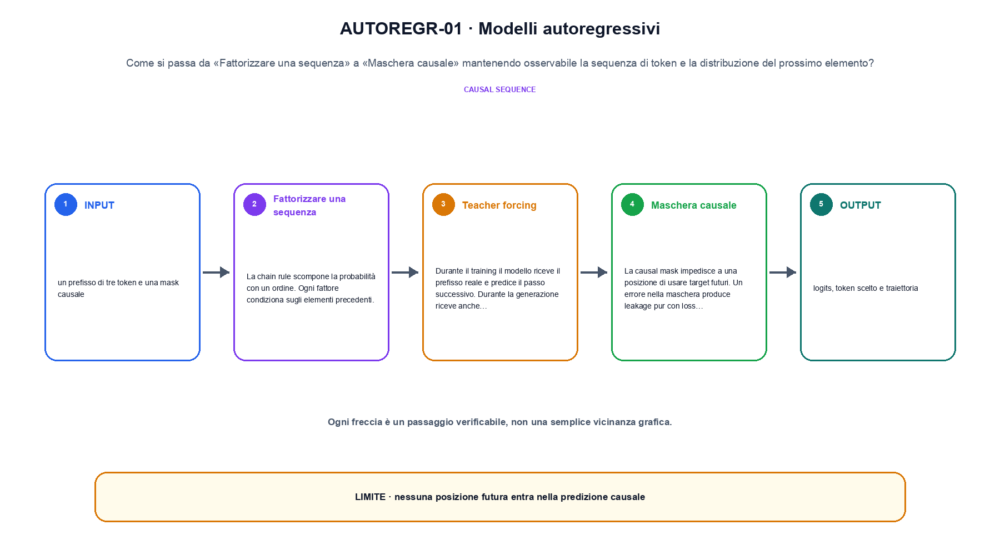
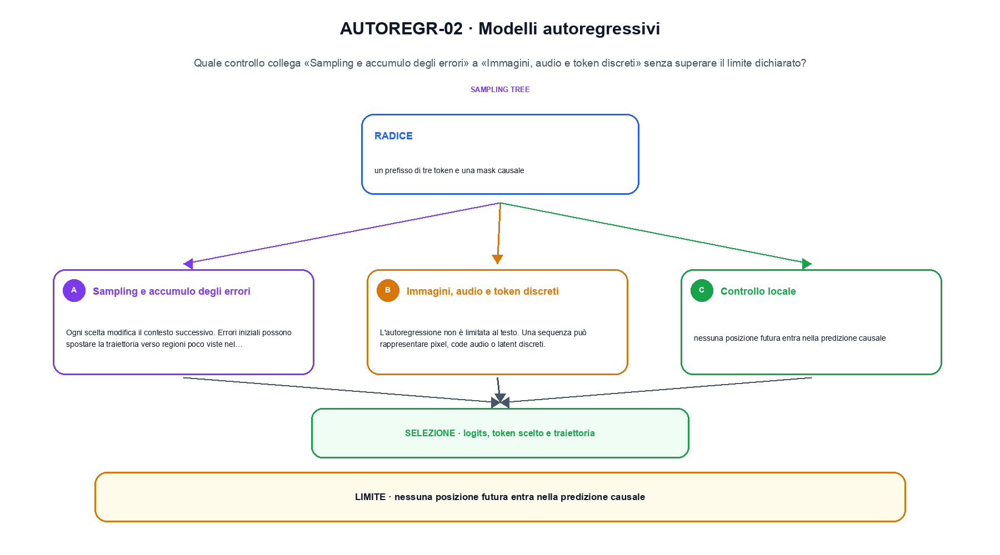

<!--
chapter_id: CH-P05-AUTOREGRESSIVE
part_id: P05
order_key: 210
title: Modelli autoregressivi
maturity: CORE
status: revisione editoriale v2, approvazione autoriale aperta
version: 0.5.0-draft3
last_source_check: 4 agosto 2026
environment: Python 3.13.12, CPU
code_policy: reference
deferred: benchmark applicativi non eseguiti e approvazione autoriale delle visuali
-->

# Capitolo 21. Modelli autoregressivi

La domanda guida di questa lezione è come collegare «Fattorizzare una sequenza» e «Immagini, audio e token discreti» senza perdere il contratto tecnico di modelli autoregressivi. L'oggetto osservato è la sequenza di token e la distribuzione del prossimo elemento. Il contratto locale è: input, un prefisso di tre token e una mask causale; operazione, fattorizzazione, teacher forcing e decoding; output, logits, token scelto e traiettoria. Il caso guida è questo: Tre passi in cui lo stato precedente viene consumato prima di produrre il successivo. Il confine da mantenere esplicito è: nessuna posizione futura entra nella predizione causale.

## Fattorizzare una sequenza

La chain rule scompone la probabilità con un ordine. Ogni fattore condiziona sugli elementi precedenti. [SRC-21-001]

La chain rule rende l'autoregressione una sequenza di predizioni condizionate.

**Caso da seguire.** Tre passi in cui lo stato precedente viene consumato prima di produrre il successivo.

**Controllo.** Scrivi il risultato atteso prima del calcolo, modifica una sola quantità e localizza il primo passaggio che cambia. Il vincolo da conservare è: Ogni fattore condiziona sugli elementi precedenti.


## Teacher forcing

Durante il training il modello riceve il prefisso reale e predice il passo successivo. Durante la generazione riceve anche i propri output. [SRC-21-002]

**Caso da seguire.** Un prefisso corretto confrontato con lo stesso prefisso dopo che il modello ha prodotto il token precedente.

**Controllo.** Ricalcola il caso a mano e con lo snippet. Se i risultati divergono, confronta prima i valori intermedi e soltanto dopo l'output finale.


La relazione centrale può essere scritta come:

$$
p(x_{1:T})=\prod_t p(x_t|x_{<t})
$$

La chain rule rende l'autoregressione una sequenza di predizioni condizionate. [SRC-21-001]




La prima figura segue il percorso da «Fattorizzare una sequenza» a «Maschera causale».


## Maschera causale

La causal mask impedisce a una posizione di usare target futuri. Un errore nella maschera produce leakage pur con loss numericamente valida. [SRC-21-003]

**Caso da seguire.** Una matrice di visibilità in cui la posizione futura resta esclusa anche se la shape dei tensori è compatibile.

**Controllo.** Aggiungi un valore limite e verifica separatamente forma, valore e ipotesi. Una shape valida non dimostra da sola «Maschera causale».


## Sampling e accumulo degli errori

Ogni scelta modifica il contesto successivo. Errori iniziali possono spostare la traiettoria verso regioni poco viste nel training. [SRC-21-004]

**Caso da seguire.** Per «Sampling e accumulo degli errori» si mantiene l'input del capitolo e si isola questa condizione: Ogni scelta modifica il contesto successivo.

**Controllo.** Mantieni fisso l'input e sostituisci soltanto il meccanismo discusso nella sezione. Il confronto deve attribuire la differenza a quel passaggio, non al setup.


## Esempio Python eseguito

Il frammento seguente è lo stesso conservato nel repository. Usa valori piccoli perché l'obiettivo è osservare il meccanismo, non simulare una scala che non abbiamo eseguito.

```python
def contract():
    logits = [[2.0, 1.0, 0.0], [4.0, 3.0, 2.0]]
    causal = [[True, False, False], [True, True, False]]
    visible = [[row[j] for j in range(len(row)) if causal[i][j]] for i, row in enumerate(logits)]
    return {"visible_lengths": [len(row) for row in visible], "invariant": "a causal position cannot read a future token"}
```

Esecuzione con `python snip_21_contract.py`:

```text
{"invariant": "a causal position cannot read a future token", "visible_lengths": [1, 2]}
```

Il test associato è [`code/test_21_contract.py`](code/test_21_contract.py); l'output versionato è [`code/outputs/SNIP-21-001.txt`](code/outputs/SNIP-21-001.txt).


## Immagini, audio e token discreti

L'autoregressione non è limitata al testo. Una sequenza può rappresentare pixel, code audio o latent discreti. [SRC-21-001]

**Caso da seguire.** Un prefisso corto con ID, lunghezza, posizione e output del token successivo dichiarati.

**Controllo.** Costruisci un controesempio che rispetti il tipo di dato ma violi l'ipotesi centrale. Il test deve rendere riconoscibile perché «Immagini, audio e token discreti» non si applica.




La seconda figura mette a confronto «Sampling e accumulo degli errori» e il limite discusso in «Immagini, audio e token discreti».


## Come si collegano i passaggi

- **Da «Fattorizzare una sequenza» a «Teacher forcing».** La chain rule scompone la probabilità con un ordine. Durante il training il modello riceve il prefisso reale e predice il passo successivo. Il primo passaggio definisce che cosa entra nel calcolo; il secondo stabilisce la regola che produce il valore osservabile. [SRC-21-001; SRC-21-002]

- **Da «Teacher forcing» a «Maschera causale».** Durante il training il modello riceve il prefisso reale e predice il passo successivo. La causal mask impedisce a una posizione di usare target futuri. La regola generale viene poi letta dentro il componente: questa separazione permette di localizzare un errore prima di attribuirlo all'intero modello. [SRC-21-002; SRC-21-003]

- **Da «Maschera causale» a «Sampling e accumulo degli errori».** La causal mask impedisce a una posizione di usare target futuri. Ogni scelta modifica il contesto successivo. Dopo avere reso visibile il componente, il percorso introduce la variante o l'ottimizzazione senza cambiare di nascosto il caso di partenza. [SRC-21-003; SRC-21-004]

- **Da «Sampling e accumulo degli errori» a «Immagini, audio e token discreti».** Ogni scelta modifica il contesto successivo. L'autoregressione non è limitata al testo. L'ultimo passaggio sposta l'attenzione dal funzionamento locale alla misura: correttezza del calcolo e qualità applicativa restano domande distinte. [SRC-21-004; SRC-21-001]

La catena completa produce logits, token scelto e traiettoria a partire da un prefisso di tre token e una mask causale. Ogni collegamento conserva un oggetto osservabile diverso; per questo il risultato non può essere esteso oltre il limite dichiarato: nessuna posizione futura entra nella predizione causale.


## Esercizi sul meccanismo

1. Ricostruisci «Fattorizzare una sequenza» con un esempio diverso da quello mostrato e indica l'output atteso prima del calcolo.
2. Nel passaggio «Teacher forcing», cambia una sola ipotesi e spiega quale risultato non è più confrontabile.
3. Collega «Maschera causale» a una riga dello snippet oppure motiva perché la prova deve essere documentale.
4. Progetta un caso limite per «Sampling e accumulo degli errori» che produca una failure riconoscibile.
5. Per «Immagini, audio e token discreti», separa una conclusione sostenuta dal caso locale da una che richiederebbe nuovi dati o un benchmark.


## Che cosa deve restare chiaro

La lezione parte da «un prefisso di tre token e una mask causale» e arriva fino a «logits, token scelto e traiettoria». Il limite da conservare è questo: nessuna posizione futura entra nella predizione causale. Definizioni e risultati citati sono rintracciabili in [`FONTI_PRIMARIE.md`](FONTI_PRIMARIE.md); la mappa dei claim è in [`CLAIMS.md`](CLAIMS.md).
